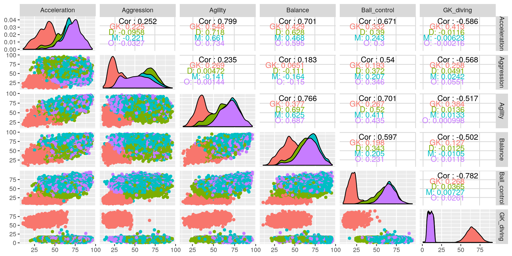
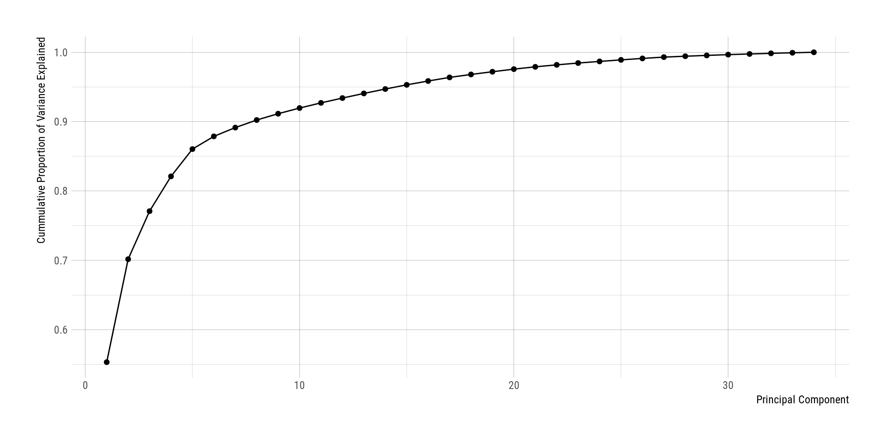
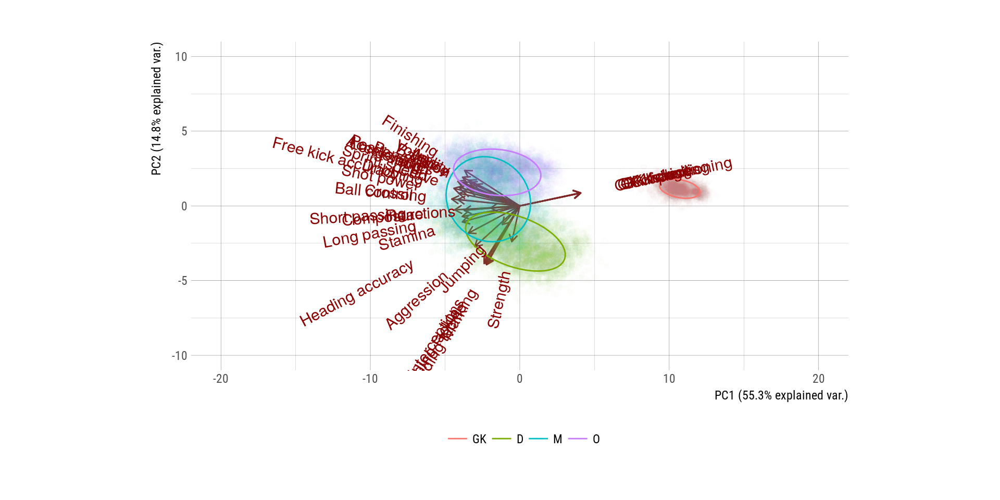
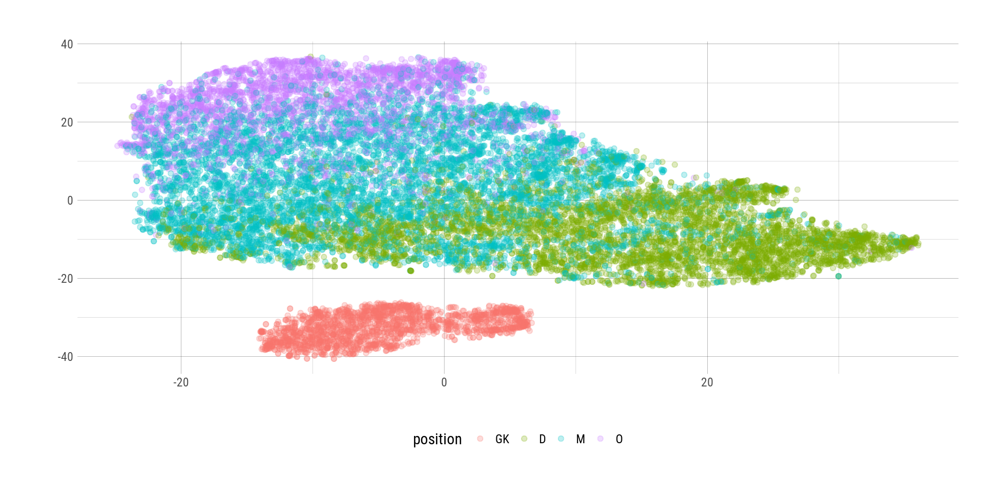
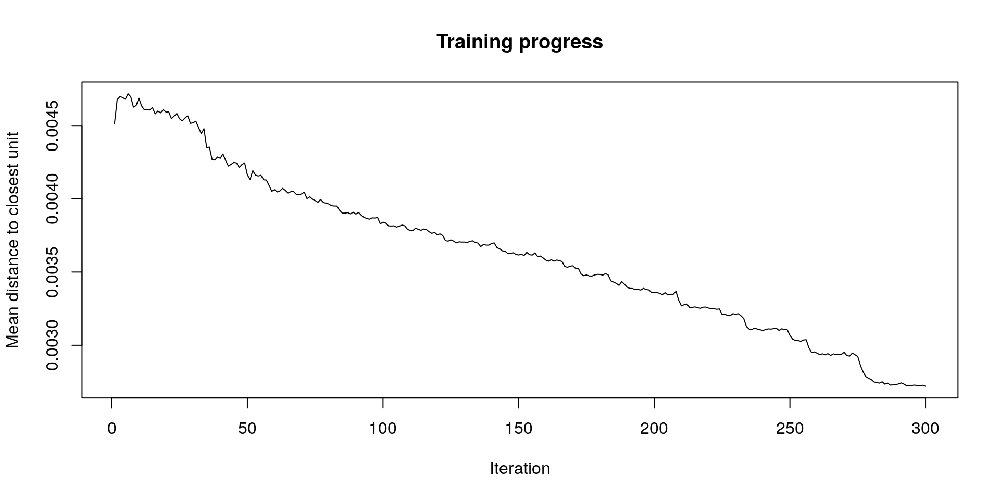
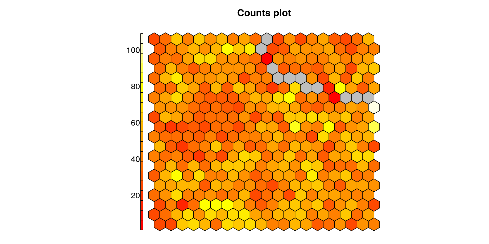
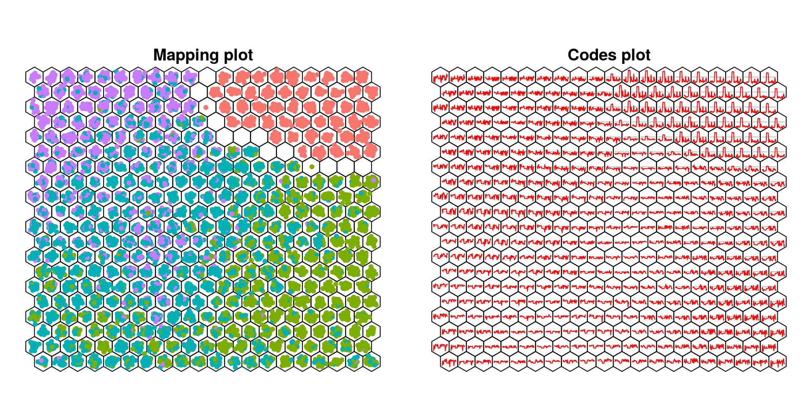

In this post, I will introduce three different methods for

*This post was semi automatically converted from blogdown to Quarto and may contain errors. The original can be found in the [archive](http://archive.schochastics.net/post/dimensionality-reduction-methods/).*

[dimensionality
reduction](https://en.wikipedia.org/wiki/Dimensionality_reduction) of
large datasets.

``` r
#used packages
library(tidyverse)  # for data wrangling
library(stringr)    # for string manipulations
library(ggbiplot)   # pca biplot with ggplot
library(Rtsne)      # implements the t-SNE algorithm
library(kohonen)    # implements self organizing maps
library(hrbrthemes) # nice themes for ggplot
library(GGally)     # to produce scatterplot matrices
```

# Data

The data we use comes from
[Kaggle](https://www.kaggle.com/thec03u5/fifa-18-demo-player-dataset)
and contains around 18,000 players of the game [FIFA
18](https://en.wikipedia.org/wiki/FIFA_18) with 75 features per player.

``` r
glimpse(fifa_tbl)
```

``` hljs
## Observations: 17,981
## Variables: 75
## $ X1                    <int> 0, 1, 2, 3, 4, 5, 6, 7, 8, 9, 10, 11, 12...
## $ Name                  <chr> "Cristiano Ronaldo", "L. Messi", "Neymar...
## $ Age                   <int> 32, 30, 25, 30, 31, 28, 26, 26, 27, 29, ...
## $ Photo                 <chr> "https://cdn.sofifa.org/48/18/players/20...
## $ Nationality           <chr> "Portugal", "Argentina", "Brazil", "Urug...
## $ Flag                  <chr> "https://cdn.sofifa.org/flags/38.png", "...
## $ Overall               <int> 94, 93, 92, 92, 92, 91, 90, 90, 90, 90, ...
## $ Potential             <int> 94, 93, 94, 92, 92, 91, 92, 91, 90, 90, ...
## $ Club                  <chr> "Real Madrid CF", "FC Barcelona", "Paris...
## $ `Club Logo`           <chr> "https://cdn.sofifa.org/24/18/teams/243....
## $ Value                 <chr> "€95.5M", "€105M", "€123M", "€97M", "€61...
## $ Wage                  <chr> "€565K", "€565K", "€280K", "€510K", "€23...
## $ Special               <int> 2228, 2154, 2100, 2291, 1493, 2143, 1458...
## $ Acceleration          <int> 89, 92, 94, 88, 58, 79, 57, 93, 60, 78, ...
## $ Aggression            <int> 63, 48, 56, 78, 29, 80, 38, 54, 60, 50, ...
## $ Agility               <int> 89, 90, 96, 86, 52, 78, 60, 93, 71, 75, ...
## $ Balance               <int> 63, 95, 82, 60, 35, 80, 43, 91, 69, 69, ...
## $ `Ball control`        <int> 93, 95, 95, 91, 48, 89, 42, 92, 89, 85, ...
## $ Composure             <int> 95, 96, 92, 83, 70, 87, 64, 87, 85, 86, ...
## $ Crossing              <int> 85, 77, 75, 77, 15, 62, 17, 80, 85, 68, ...
## $ Curve                 <int> 81, 89, 81, 86, 14, 77, 21, 82, 85, 74, ...
## $ Dribbling             <int> 91, 97, 96, 86, 30, 85, 18, 93, 79, 84, ...
## $ Finishing             <int> 94, 95, 89, 94, 13, 91, 13, 83, 76, 91, ...
## $ `Free kick accuracy`  <int> 76, 90, 84, 84, 11, 84, 19, 79, 84, 62, ...
## $ `GK diving`           <int> 7, 6, 9, 27, 91, 15, 90, 11, 10, 5, 11, ...
## $ `GK handling`         <int> 11, 11, 9, 25, 90, 6, 85, 12, 11, 12, 8,...
## $ `GK kicking`          <int> 15, 15, 15, 31, 95, 12, 87, 6, 13, 7, 9,...
## $ `GK positioning`      <int> 14, 14, 15, 33, 91, 8, 86, 8, 7, 5, 7, 1...
## $ `GK reflexes`         <int> 11, 8, 11, 37, 89, 10, 90, 8, 10, 10, 11...
## $ `Heading accuracy`    <int> 88, 71, 62, 77, 25, 85, 21, 57, 54, 86, ...
## $ Interceptions         <int> 29, 22, 36, 41, 30, 39, 30, 41, 85, 20, ...
## $ Jumping               <int> 95, 68, 61, 69, 78, 84, 67, 59, 32, 79, ...
## $ `Long passing`        <int> 77, 87, 75, 64, 59, 65, 51, 81, 93, 59, ...
## $ `Long shots`          <int> 92, 88, 77, 86, 16, 83, 12, 82, 90, 82, ...
## $ Marking               <int> 22, 13, 21, 30, 10, 25, 13, 25, 63, 12, ...
## $ Penalties             <int> 85, 74, 81, 85, 47, 81, 40, 86, 73, 70, ...
## $ Positioning           <int> 95, 93, 90, 92, 12, 91, 12, 85, 79, 92, ...
## $ Reactions             <int> 96, 95, 88, 93, 85, 91, 88, 85, 86, 88, ...
## $ `Short passing`       <int> 83, 88, 81, 83, 55, 83, 50, 86, 90, 75, ...
## $ `Shot power`          <int> 94, 85, 80, 87, 25, 88, 31, 79, 87, 88, ...
## $ `Sliding tackle`      <int> 23, 26, 33, 38, 11, 19, 13, 22, 69, 18, ...
## $ `Sprint speed`        <int> 91, 87, 90, 77, 61, 83, 58, 87, 52, 80, ...
## $ Stamina               <int> 92, 73, 78, 89, 44, 79, 40, 79, 77, 72, ...
## $ `Standing tackle`     <int> 31, 28, 24, 45, 10, 42, 21, 27, 82, 22, ...
## $ Strength              <int> 80, 59, 53, 80, 83, 84, 64, 65, 74, 85, ...
## $ Vision                <int> 85, 90, 80, 84, 70, 78, 68, 86, 88, 70, ...
## $ Volleys               <int> 88, 85, 83, 88, 11, 87, 13, 79, 82, 88, ...
## $ CAM                   <dbl> 89, 92, 88, 87, NA, 84, NA, 88, 83, 81, ...
## $ CB                    <dbl> 53, 45, 46, 58, NA, 57, NA, 47, 72, 46, ...
## $ CDM                   <dbl> 62, 59, 59, 65, NA, 62, NA, 61, 82, 52, ...
## $ CF                    <dbl> 91, 92, 88, 88, NA, 87, NA, 87, 81, 84, ...
## $ CM                    <dbl> 82, 84, 79, 80, NA, 78, NA, 81, 87, 71, ...
## $ ID                    <int> 20801, 158023, 190871, 176580, 167495, 1...
## $ LAM                   <dbl> 89, 92, 88, 87, NA, 84, NA, 88, 83, 81, ...
## $ LB                    <dbl> 61, 57, 59, 64, NA, 58, NA, 59, 76, 51, ...
## $ LCB                   <dbl> 53, 45, 46, 58, NA, 57, NA, 47, 72, 46, ...
## $ LCM                   <dbl> 82, 84, 79, 80, NA, 78, NA, 81, 87, 71, ...
## $ LDM                   <dbl> 62, 59, 59, 65, NA, 62, NA, 61, 82, 52, ...
## $ LF                    <dbl> 91, 92, 88, 88, NA, 87, NA, 87, 81, 84, ...
## $ LM                    <dbl> 89, 90, 87, 85, NA, 82, NA, 87, 81, 79, ...
## $ LS                    <dbl> 92, 88, 84, 88, NA, 88, NA, 82, 77, 87, ...
## $ LW                    <dbl> 91, 91, 89, 87, NA, 84, NA, 88, 80, 82, ...
## $ LWB                   <dbl> 66, 62, 64, 68, NA, 61, NA, 64, 78, 55, ...
## $ `Preferred Positions` <chr> "ST LW", "RW", "LW", "ST", "GK", "ST", "...
## $ RAM                   <dbl> 89, 92, 88, 87, NA, 84, NA, 88, 83, 81, ...
## $ RB                    <dbl> 61, 57, 59, 64, NA, 58, NA, 59, 76, 51, ...
## $ RCB                   <dbl> 53, 45, 46, 58, NA, 57, NA, 47, 72, 46, ...
## $ RCM                   <dbl> 82, 84, 79, 80, NA, 78, NA, 81, 87, 71, ...
## $ RDM                   <dbl> 62, 59, 59, 65, NA, 62, NA, 61, 82, 52, ...
## $ RF                    <dbl> 91, 92, 88, 88, NA, 87, NA, 87, 81, 84, ...
## $ RM                    <dbl> 89, 90, 87, 85, NA, 82, NA, 87, 81, 79, ...
## $ RS                    <dbl> 92, 88, 84, 88, NA, 88, NA, 82, 77, 87, ...
## $ RW                    <dbl> 91, 91, 89, 87, NA, 84, NA, 88, 80, 82, ...
## $ RWB                   <dbl> 66, 62, 64, 68, NA, 61, NA, 64, 78, 55, ...
## $ ST                    <dbl> 92, 88, 84, 88, NA, 88, NA, 82, 77, 87, ...
```

In this post, we are only interested in the attributes and the preferred
position of the players.

``` r
fifa_tbl <- fifa_tbl %>% 
  select(Acceleration:Volleys,`Preferred Positions`)

head(fifa_tbl$`Preferred Positions`)
```

``` hljs
## [1] "ST LW" "RW"    "LW"    "ST"    "GK"    "ST"
```

Notice that the `Preferred Positions` column may contain several
positions. We will simply split those entries and use the first given
one. Additionally, we create a column indicating if the position is in
defense, midfield or offense. Goalkeepers are treated separately.

``` r
fifa_tbl <- fifa_tbl %>% 
  mutate(position = word(`Preferred Positions`,1)) %>% 
  mutate(position = factor(position,
                           levels = c("GK","CB","RB","LB","RWB","LWB","CDM",
                                      "CM","RM","LM","CAM",
                                      "CF","RW","LW","ST")))

defense  <- c("CB","RB","LB","RWB","LWB")
midfield <- c("CDM","CM","RM","LM","CAM")
offense  <- c("CF","RW","LW","ST")
    
fifa_tbl <- fifa_tbl %>% 
  mutate(position2 = ifelse(position %in% defense,"D",
                     ifelse(position %in% midfield,"M",
                     ifelse(position %in% offense,"O","GK")))) %>% 
  mutate(position2 = factor(position2,levels = c("GK","D","M","O"))) %>% 
  select(-`Preferred Positions`)
```

# Why reducing the dimension?

There are many good reasons for reducing the dimension of data sets with
a large amount of features. For example, to get rid of correlated
variables or speeding up computations. In this post, we focus on the
application in data exploration. Any data analytic task (should) start
with “getting a feeling for the data”.

Among the first things to do is to look at scatterplots of pairs of
features. Below you see the scatterplots for six features using the
`ggpairs()` function of the `GGally` package.

``` r
##ggpair doesn't understand whitespace in column names
names(fifa_tbl) <- str_replace_all(names(fifa_tbl)," ","_")

fifa_tbl %>% 
  select(Acceleration:Volleys,position2) %>% 
  ggpairs(columns = c(1:5,12),aes(col=position2))
```



``` r
names(fifa_tbl) <- str_replace_all(names(fifa_tbl),"_"," ")
```

These few scatterplots already reveal that goalkeepers have rather
different skills than other players. This certainly does not come by
surprise. There also seem to be some patterns for defenders/midfielders
and strikers, but to get a better picture, we should be looking at all
scatterplots. However, our complete data set has 34 features, meaning
that we would be forced to explore
34⋅33/2=56134 ⋅ 33/2 = 56134 ⋅ 33/2 = 561 scatterplots. Ain’t nobody got
time for that!

That’s where dimension reduction techniques come into play. The ultimate
goal is to to reduce our high dimensional data to 2 dimensions without
(much) loss of information. In this way, we can explore the entire data
set with only one scatterplot.

# Principal Component Analysis

If you know a bit of statistics and you are asked for dimension
reduction methods, I bet your immediate answer is “PCA!”. It is one of
the oldest and certainly most commonly used method to reduce high
dimensional data sets. There are many excellent introductory posts for
PCA using R
([1](https://poissonisfish.wordpress.com/2017/01/23/principal-component-analysis-in-r/),
[2](https://tgmstat.wordpress.com/2013/11/21/introduction-to-principal-component-analysis-pca/),
[3](https://tgmstat.wordpress.com/2013/11/28/computing-and-visualizing-pca-in-r/),
[4](https://www.analyticsvidhya.com/blog/2016/03/practical-guide-principal-component-analysis-python/)),
so I will not spend much time on the fundamentals.

Very briefly, principal components are linear combination of the
original variables which capture the variance in the data set. The first
principal component captures the highest amount of variability. The
larger this variability is, the more information is contained in it. In
geometric terms, it describes a line which is closest to the data and
thus minimizes the sum of squared distance between all data points and
the line. The second principal component capture the remaining
variability in a similar way. The more of the total variability is
captured by these two components, the more information does the
scatterplot of these vectors contain.

We use the `prcomp()` function from the `stats` package for our PCA.

``` r
fifa_pca <- fifa_tbl %>% 
  select(Acceleration:Volleys) %>%
  prcomp(center=TRUE,scale.=TRUE)
```

Note that usually scaling your variables is very important to not
overemphasize features with large values. In our case, it would actually
not be necessary since all attributes lie in the interval \[0,100\].

Besides the components, the function returns the standard deviation
captured by each component. We can thus compute the variances and check
how much information is captured by each component.

``` r
tibble(sd = fifa_pca$sdev, 
       pc = 1:length(sd)) %>% 
  mutate(cumvar = cumsum((sd^2)/sum(sd^2))) %>% 
  ggplot(aes(pc,cumvar))+geom_line()+geom_point()+
  labs(x="Principal Component",y="Cummulative Proportion of Variance Explained")+
  theme_ipsum_rc()
```



Roughly 70% of the variance is explained by the first two components. To
explain 90% of the variance, we have to go up to the 8th component.

To visualize the result of the PCA, we use the `ggbiplot()` function
from the `ggbiplot` package. As the name suggests, it creates a biplot
in ggplot style.

``` r
ggbiplot(fifa_pca, obs.scale = 1, var.scale = 1, alpha = 0.01,
         groups = fifa_tbl$position2, varname.size = 4, varname.adjust = 2,
         ellipse = TRUE, circle = FALSE) +
  scale_color_discrete(name = '') +
  scale_x_continuous(limits = c(-20,20))+
  scale_y_continuous(limits = c(-10,10))+
  theme_ipsum_rc()+
  theme(legend.direction = 'horizontal', legend.position = 'bottom')
```



Since we have a lot of features, this unfortunately results in some
overplotting. However, general patterns are still visible. The first
component clearly distinguishes goalkeepers from the rest of the
players, which we already expected from examining a few scatterplots.

The second component reveals that the remaining positions are also
separated fairly well. While defenders and offensive players are well
separated, the midfielders lie somewhere in between. Just as on the
pitch!

# t-SNE

t-SNE stands for [t-distributed stochastic neighbor
embedding](https://en.wikipedia.org/wiki/T-distributed_stochastic_neighbor_embedding)
and was introduced in 2008. A comprehensive introduction to the method
can be found in
[this](https://www.analyticsvidhya.com/blog/2017/01/t-sne-implementation-r-python/)
or [this](https://distill.pub/2016/misread-tsne/) post.

Non-technically, the algorithm is in fact quite simple. t-SNE is a
non-linear dimensionality reduction algorithm that seeks to finds
patterns in the data by identifying clusters based on similarity of data
points. Note that this does not make it a clustering algorithm! It still
is “only” a dimensionality reduction algorithm. Nontheless, the results
can be quite impressive and in many cases are superior to a PCA. Check
[this](http://colah.github.io/posts/2014-10-Visualizing-MNIST/) post on
recognizing hand drawn digits or
[this](http://jkunst.com/r/pokemon-visualize-em-all/) post if you are
into Pokemon.

The t-SNE algorithm is implemented in the package `Rtsne`. To run it,
several hyper parameters have to be set. The two most important ones are
*perplexity* and *max_iter*. While the latter should be
self-explanatory, the second is not. Perplexity roughly indicates how to
balance local and global aspects of the data. The parameter is an
estimate for the number of close neighbors for each point. The original
authors state, that “The performance of SNE is fairly robust to changes
in the perplexity, and typical values are between 5 and 50.” But other
[sources](https://distill.pub/2016/misread-tsne/) say that the output
can be heavily influenced by the choice of the perplexity parameter. We
here choose a perplexity of 50 and 1000 iterations.

``` r
set.seed(12)

fifa_tsne <- fifa_tbl %>%
  select(Acceleration:Volleys) %>%
Rtsne(perplexity = 50, max_iter = 1000, check_duplicates = FALSE)
```

``` r
tibble(x = fifa_tsne$Y[,1],
       y = fifa_tsne$Y[,2],
       position = fifa_tbl$position2) %>%
  ggplot(aes(x,y)) + geom_point(aes(col = position), alpha = 0.25) +
  theme_ipsum_rc()+
  theme(legend.position = "bottom")+
  labs(x="",y="")
```



The plot again shows that goalkeepers are easily distinguished from
other players. Also, the other positions are some what clustered
together.

Overall we can observe that, for our data set, the t-SNE algorithm does
not significantly extend the results we have already obtained from the
PCA.

## Pros and Cons

As said before, there are some amazing examples for the effectiveness of
the t-SNE algorithm. However, several things have to be kept in mind to
not glorify the algorithm to much.

The algorithm is rather complex. While a PCA can be done in under a
second even for very large data sets, the t-SNE algorithm will take
considerably longer. For the FIFA 18 player data, the algorithm took
several minutes to run. PCA is deterministic, meaning that each run on
the same data gives the same results. t-SNE is not. Sometimes, different
runs with the same hyper parameters may produce different results. The
algorithm is so good, that it may even find patterns in random noise,
which, of course, is not really desirable. It is therefore advisable to
run the algorithm several times with different sets of hyper-parameter
before deciding if a pattern exists in the data.

A big drawback is the interpretation of the result. While we may end up
with well separated groups of players, we do not now what features are
the most decisive.

# Self-Organizing Maps

A [self-organizing
map](https://en.wikipedia.org/wiki/Self-organizing_map) (SOM) is an
artificial neural network that is trained using unsupervised learning.
Since neural networks are super popular right now, it is only natural to
look at one that it is used for dimensionality reduction.

A SOM is made up of multiple “nodes”, where each node vector has the
following properties.

-   A fixed position on the SOM grid.
-   A weight vector of the same dimension as the input space.
-   Associated data points. Each data point is mapped to a node on the
    map grid.

The key feature of SOMs is that the topological features of the input
data are preserved on the map. In our case, players with similar
attributes are placed close together on the grid. Some more in depth
posts to SOMs can be found
[here](https://www.shanelynn.ie/self-organising-maps-for-customer-segmentation-using-r/)
and [here](https://clarkdatalabs.github.io/soms/SOM_NBA).

We use the `som()` function from the `kohonen` package to produce a SOM
for the FIFA 18 player data. We choose a 20x20 hexagonal grid and 300
iteration steps.

``` r
fifa_som <- fifa_tbl %>% 
  select(Acceleration:Volleys) %>%
  scale() %>%
  som(grid = somgrid(20, 20, "hexagonal"), rlen = 300)
```

The package comes with a variety of visualization options for the
resulting SOM. First, we can check if the training process was
“successful”.

``` r
plot(fifa_som, type="changes")
```



Ideally, we reach a plateau at one point. If the curve is still
decreasing, it might be advisable to increase the *rlen* parameter.

We can also visualize, how many players are contained in each grid node.

``` r
plot(fifa_som, type="count", shape = "straight")
```



If you notice that the counts are very imbalanced, you might want to
consider increasing your grid size.

Finally we plot the distribution of players over the grid nodes and the
weight vectors associated with each grid node.

``` r
par(mfrow=c(1,2))
plot(fifa_som, type="mapping", pch=20,
     col = c("#F8766D","#7CAE00","#00B0B5","#C77CFF")[as.integer(fifa_tbl$position2)],
     shape = "straight")
plot(fifa_som, type="codes",shape="straight")
```



Again, we notice a clear cut between goalkeepers and other players. Also
the other positions are fairly well separated.

## Pros and Cons

I must admit that I don’t know too much about SOMs yet. But so far they
seem pretty neat. I don’t realy see any major drawback, except that they
may also require a bit more computation time than a simple PCA, but they
seem much faster than t-SNE. The results are also easier to interpret
than the ones from t-SNE, since we get a weight vector for each grid
node.

# Summary

Exploring your data is a very important first step for any kind of data
analytic task. Dimensionally reduction methods can help by producing 2
dimensional representations, which, in best case, display meaningful
patterns in the higher dimensional data.

For the FIFA 18 player data, we learned that it is possible to
distinguish positions of players by player attributes. This knowledge
will be used in a later post to predict player positions.

