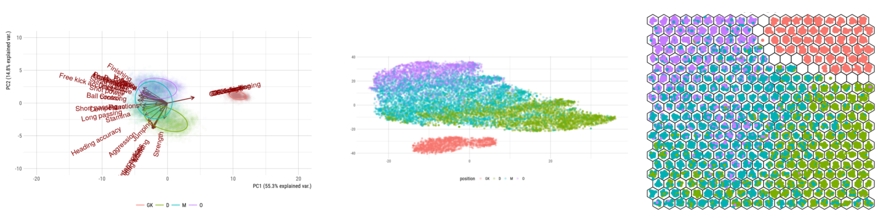
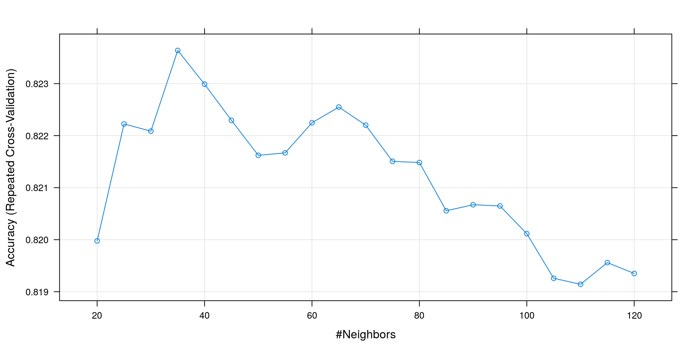
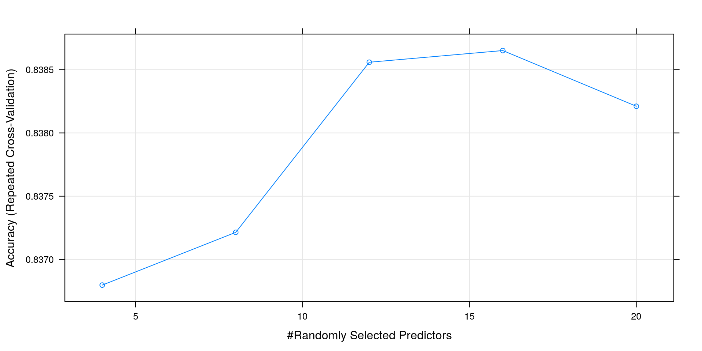
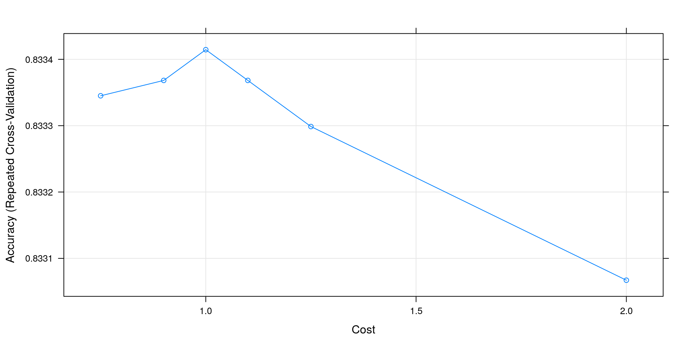
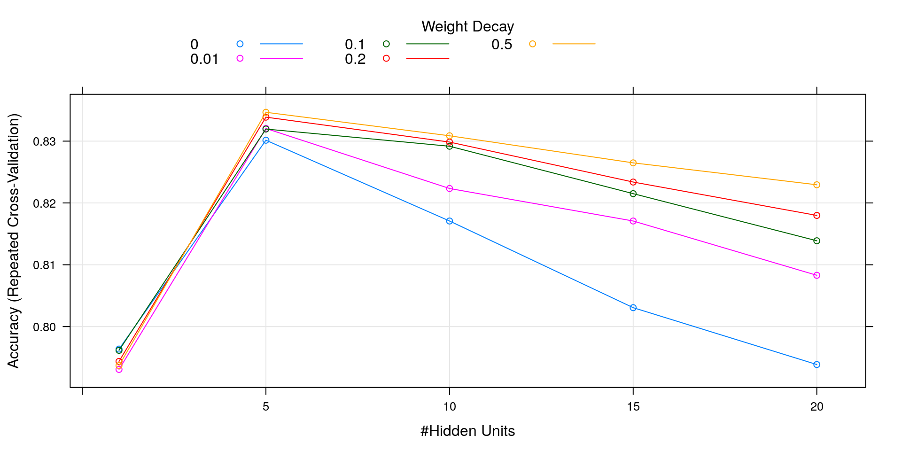

*This post was semi automatically converted from blogdown to Quarto and may contain errors. The original can be found in the [archive](http://archive.schochastics.net/post/predicting-player-positions/).*

In this post, I will use the results of the exploratory analysis from
the [previous
post](http://blog.schochastics.net/post/dimensionality-reduction-methods/)
and try to predict the position of players in FIFA 18 using different
machine learning algorithms.

As a quick reminder, these were the figures we obtained using PCA, t-SNE
and a self organizing map. 

``` r
#used packages
library(tidyverse)  # for data wrangling
library(hrbrthemes) # nice themes for ggplot
library(caret) # ML algorithms
```

# Data

The data we use comes from
[Kaggle](https://www.kaggle.com/thec03u5/fifa-18-demo-player-dataset)
and contains around 18,000 players of the game [FIFA
18](https://en.wikipedia.org/wiki/FIFA_18) with 75 features per player.
Check the [previous
post](http://blog.schochastics.net/post/dimensionality-reduction-methods/).
for the data preparation steps.

After the preprocessing, the data has the following structure.

``` r
glimpse(fifa_tbl)
```

``` hljs
## Observations: 17,981
## Variables: 36
## $ Acceleration         <int> 89, 92, 94, 88, 58, 79, 57, 93, 60, 78, 7...
## $ Aggression           <int> 63, 48, 56, 78, 29, 80, 38, 54, 60, 50, 8...
## $ Agility              <int> 89, 90, 96, 86, 52, 78, 60, 93, 71, 75, 7...
## $ Balance              <int> 63, 95, 82, 60, 35, 80, 43, 91, 69, 69, 6...
## $ `Ball control`       <int> 93, 95, 95, 91, 48, 89, 42, 92, 89, 85, 8...
## $ Composure            <int> 95, 96, 92, 83, 70, 87, 64, 87, 85, 86, 8...
## $ Crossing             <int> 85, 77, 75, 77, 15, 62, 17, 80, 85, 68, 6...
## $ Curve                <int> 81, 89, 81, 86, 14, 77, 21, 82, 85, 74, 7...
## $ Dribbling            <int> 91, 97, 96, 86, 30, 85, 18, 93, 79, 84, 6...
## $ Finishing            <int> 94, 95, 89, 94, 13, 91, 13, 83, 76, 91, 6...
## $ `Free kick accuracy` <int> 76, 90, 84, 84, 11, 84, 19, 79, 84, 62, 6...
## $ `GK diving`          <int> 7, 6, 9, 27, 91, 15, 90, 11, 10, 5, 11, 1...
## $ `GK handling`        <int> 11, 11, 9, 25, 90, 6, 85, 12, 11, 12, 8, ...
## $ `GK kicking`         <int> 15, 15, 15, 31, 95, 12, 87, 6, 13, 7, 9, ...
## $ `GK positioning`     <int> 14, 14, 15, 33, 91, 8, 86, 8, 7, 5, 7, 10...
## $ `GK reflexes`        <int> 11, 8, 11, 37, 89, 10, 90, 8, 10, 10, 11,...
## $ `Heading accuracy`   <int> 88, 71, 62, 77, 25, 85, 21, 57, 54, 86, 9...
## $ Interceptions        <int> 29, 22, 36, 41, 30, 39, 30, 41, 85, 20, 8...
## $ Jumping              <int> 95, 68, 61, 69, 78, 84, 67, 59, 32, 79, 9...
## $ `Long passing`       <int> 77, 87, 75, 64, 59, 65, 51, 81, 93, 59, 7...
## $ `Long shots`         <int> 92, 88, 77, 86, 16, 83, 12, 82, 90, 82, 5...
## $ Marking              <int> 22, 13, 21, 30, 10, 25, 13, 25, 63, 12, 8...
## $ Penalties            <int> 85, 74, 81, 85, 47, 81, 40, 86, 73, 70, 6...
## $ Positioning          <int> 95, 93, 90, 92, 12, 91, 12, 85, 79, 92, 5...
## $ Reactions            <int> 96, 95, 88, 93, 85, 91, 88, 85, 86, 88, 8...
## $ `Short passing`      <int> 83, 88, 81, 83, 55, 83, 50, 86, 90, 75, 7...
## $ `Shot power`         <int> 94, 85, 80, 87, 25, 88, 31, 79, 87, 88, 7...
## $ `Sliding tackle`     <int> 23, 26, 33, 38, 11, 19, 13, 22, 69, 18, 9...
## $ `Sprint speed`       <int> 91, 87, 90, 77, 61, 83, 58, 87, 52, 80, 7...
## $ Stamina              <int> 92, 73, 78, 89, 44, 79, 40, 79, 77, 72, 8...
## $ `Standing tackle`    <int> 31, 28, 24, 45, 10, 42, 21, 27, 82, 22, 8...
## $ Strength             <int> 80, 59, 53, 80, 83, 84, 64, 65, 74, 85, 8...
## $ Vision               <int> 85, 90, 80, 84, 70, 78, 68, 86, 88, 70, 6...
## $ Volleys              <int> 88, 85, 83, 88, 11, 87, 13, 79, 82, 88, 6...
## $ position             <fctr> ST, RW, LW, ST, GK, ST, GK, LW, CDM, ST,...
## $ position2            <fctr> O, O, O, O, GK, O, GK, O, M, O, D, M, GK...
```

# Machine Learning in R and the Caret Package

If you have looked into machine learning in R or own a copy of
[this](https://www.packtpub.com/big-data-and-business-intelligence/machine-learning-r-second-edition)
book, you may have noticed that there are a gazillion packages for it.
This can be quite overwhelming as a start, also given that most packages
use different syntax and data structures. Fortunately, there is the
comprehensive `caret` package that brings together many of these
packages in a standardized way. At the time of writing this post, the
package contained 238(!!!) implementations of machine learning
algorithms. Knowing this package is thus enough to solve almost any
supervised problem. It comes with a uniform interface to several machine
learning algorithms and standardizes tasks such as

-   Data splitting
-   Data pre-processing
-   Feature selection
-   Variable importance estimation

There is an extensive
[manual](https://topepo.github.io/caret/index.html) for it and I can
only recommend to take a look at it. I also found this
[introduction](https://www.analyticsvidhya.com/blog/2016/12/practical-guide-to-implement-machine-learning-with-caret-package-in-r-with-practice-problem/)
quite helpful.

# Creating Training and Test Sets

Once the data is prepared for an analysis, you **should** split it into
a training and test
[set](https://en.wikipedia.org/wiki/Training,_test,_and_validation_sets).
As far as I understand, there is no golden standard on the ratio. I have
seen 70/30, 75/25 and 90/10 as training/test split. I will go with the
*Machine Learning with R* book and take an 80/20 split. You may also
want to consider
[this](https://stackoverflow.com/questions/13610074/is-there-a-rule-of-thumb-for-how-to-divide-a-dataset-into-training-and-validatio)
stackoverflow question.

Splitting the data can be done with the `createDataPartition()`
function. The function tries to balance out the class distribution so
that they are similar in both the training and test set. The parameter
*p* controls the split ratio.

``` r
set.seed(6185)

train_sample <- createDataPartition(fifa_tbl$position2,p = 0.8,list = FALSE)
train_data   <- fifa_tbl[train_sample,] %>% select(-position) 
test_data    <- fifa_tbl[-train_sample,] %>% select(-position) 
```

|              |      |      |      |      |
|:-------------|:-----|:-----|:-----|:-----|
| position     | GK   | D    | M    | O    |
| training set | 0.11 | 0.30 | 0.40 | 0.19 |
| test set     | 0.11 | 0.3  | 0.4  | 0.19 |

Notice how evenly the data is split.

# Training a Model

So now we are good to go for some machine learning mastery. As I
mentioned before, the caret package implements more than 200 methods
making it hard to choose the “right” one. I settled for four rather
common methods listed below, together with some helpful links.

-   K-Nearest Neighbors
    ([Wiki](https://en.wikipedia.org/wiki/K-nearest_neighbors_algorithm),
    [1](http://dataaspirant.com/2017/01/09/knn-implementation-r-using-caret-package/),
    [2](https://rpubs.com/njvijay/16444))
-   Random Forest ([Wiki](https://en.wikipedia.org/wiki/Random_forest),
    [1](https://machinelearningmastery.com/tune-machine-learning-algorithms-in-r/))
-   Support Vector Machine
    ([Wiki](https://en.wikipedia.org/wiki/Support_vector_machine),
    [1](http://dataaspirant.com/2017/01/19/support-vector-machine-classifier-implementation-r-caret-package/),
    [2](http://blog.revolutionanalytics.com/2015/10/the-5th-tribe-support-vector-machines-and-caret.html))
-   Neural Network
    ([Wiki](https://en.wikipedia.org/wiki/Artificial_neural_network),
    [1](http://www.di.fc.ul.pt/~jpn/r/neuralnets/neuralnets.html))

I will not spend any time on the details of these algorithms, since
others did a much greater job in introducing them.

Before any of these algorithms is trained, we have to set some basic
control parameters for the training step. This is done with the function
`trainControl()`. There are many different arguments that can be set,
where the following are the most important for our task[¹](#fn1).

-   *method* defines the resampling method during training. We here use
    a repeated k-fold [cross
    validation](https://en.wikipedia.org/wiki/Cross-validation_(statistics)).
-   *number* sets the “k” in k-fold. We will use the standard 10 here.
-   *repeats* defines how often the cross validation should be repeated
    (3 times).

The `train()` function is used to train all our models. Most of its
arguments are self-explanatory, the once that are not are listed below.

-   *preProcess* is used to scale and center the data.
-   *tuneGrid* defines a grid of hyperparameters to be used in the
    training. At the end of the cross-validation, the best set of
    hyperparameters is chosen for the final model.[²](#fn2)

After the training, we can check the performance on the training set
with the function `predict()`. The resulting performance can then be
viewed with the function `confusionMatrix()`.

## K-Nearest Neighbors

The only hyperparameter of this model is *k*, the number of considered
neighbors.

``` r
train_control <- trainControl(method = "repeatedcv", number = 10, repeats = 3)
grid_knn <- expand.grid(.k=seq(20,120,5))
fifa_knn <- train(position2~., data=train_data, method = "knn",
                   trControl = train_control,preProcess = c("center","scale"),
                   tuneGrid = grid_knn)
```

The summary of the training is given below.

``` r
fifa_knn
```

``` hljs
## k-Nearest Neighbors 
## 
## 14387 samples
##    34 predictor
##     4 classes: 'GK', 'D', 'M', 'O' 
## 
## Pre-processing: centered (33), scaled (33) 
## Resampling: Cross-Validated (10 fold, repeated 3 times) 
## Summary of sample sizes: 12948, 12947, 12948, 12949, 12948, 12949, ... 
## Resampling results across tuning parameters:
## 
##   k    Accuracy   Kappa    
##    20  0.8199772  0.7415707
##    25  0.8222250  0.7447378
##    30  0.8220862  0.7443668
##    35  0.8236380  0.7465378
##    40  0.8229891  0.7455043
##    45  0.8222942  0.7444655
##    50  0.8216221  0.7434531
##    55  0.8216686  0.7434513
##    60  0.8222477  0.7442770
##    65  0.8225490  0.7446787
##    70  0.8222019  0.7441699
##    75  0.8215065  0.7430829
##    80  0.8214832  0.7430529
##    85  0.8205563  0.7416563
##    90  0.8206723  0.7418073
##    95  0.8206489  0.7417507
##   100  0.8201158  0.7409817
##   105  0.8192590  0.7397423
##   110  0.8191429  0.7395715
##   115  0.8195599  0.7401216
##   120  0.8193513  0.7398058
## 
## Accuracy was used to select the optimal model using  the largest value.
## The final value used for the model was k = 35.
```

The highest accuracy is achieved for k=35, which can also be seen by
plotting the result.

``` r
plot(fifa_knn)
```



``` r
fifa_knn_predict <- predict(fifa_knn,newdata = test_data)
confusionMatrix(fifa_knn_predict,test_data$position2)
```

``` hljs
## Confusion Matrix and Statistics
## 
##           Reference
## Prediction   GK    D    M    O
##         GK  405    0    0    0
##         D     0  920  152    7
##         M     0  167 1168  207
##         O     0    1  114  453
## 
## Overall Statistics
##                                           
##                Accuracy : 0.8197          
##                  95% CI : (0.8067, 0.8321)
##     No Information Rate : 0.399           
##     P-Value [Acc > NIR] : < 2.2e-16       
##                                           
##                   Kappa : 0.7409          
##  Mcnemar's Test P-Value : NA              
## 
## Statistics by Class:
## 
##                      Class: GK Class: D Class: M Class: O
## Sensitivity             1.0000   0.8456   0.8145   0.6792
## Specificity             1.0000   0.9366   0.8269   0.9607
## Pos Pred Value          1.0000   0.8526   0.7575   0.7975
## Neg Pred Value          1.0000   0.9332   0.8704   0.9293
## Prevalence              0.1127   0.3027   0.3990   0.1856
## Detection Rate          0.1127   0.2560   0.3250   0.1260
## Detection Prevalence    0.1127   0.3002   0.4290   0.1580
## Balanced Accuracy       1.0000   0.8911   0.8207   0.8199
```

## Random Forest

For the random forest, we have to decide on how many features should be
used for each split in the decision try. A rule of thumb is to used the
square root of the number of features. After some trial-and-error, I
settled with 4, 8, 12, 16 and 20.

``` r
train_control <- trainControl(method = "repeatedcv",number = 10, repeats = 3)
grid_rf <- expand.grid(.mtry=c(4,8,12,16,20))
fifa_rf <- train(position2~., data=train_data, method = "rf",
                 trControl = train_control,preProcess = c("center","scale"),
                 tuneGrid = grid_rf)
```

``` r
fifa_rf
```

``` hljs
## Random Forest 
## 
## 14387 samples
##    34 predictor
##     4 classes: 'GK', 'D', 'M', 'O' 
## 
## Pre-processing: centered (33), scaled (33) 
## Resampling: Cross-Validated (10 fold, repeated 3 times) 
## Summary of sample sizes: 12949, 12948, 12949, 12949, 12948, 12947, ... 
## Resampling results across tuning parameters:
## 
##   mtry  Accuracy   Kappa    
##    4    0.8367979  0.7664186
##    8    0.8372147  0.7671352
##   12    0.8385584  0.7691039
##   16    0.8386507  0.7692242
##   20    0.8382106  0.7686364
## 
## Accuracy was used to select the optimal model using  the largest value.
## The final value used for the model was mtry = 16.
```

``` r
plot(fifa_rf)
```



``` r
fifa_rf_predict <- predict(fifa_rf,newdata = test_data)
confusionMatrix(fifa_rf_predict,test_data$position2)
```

``` hljs
## Confusion Matrix and Statistics
## 
##           Reference
## Prediction   GK    D    M    O
##         GK  405    0    0    0
##         D     0  957  162    7
##         M     0  129 1149  186
##         O     0    2  123  474
## 
## Overall Statistics
##                                           
##                Accuracy : 0.8306          
##                  95% CI : (0.8179, 0.8427)
##     No Information Rate : 0.399           
##     P-Value [Acc > NIR] : < 2.2e-16       
##                                           
##                   Kappa : 0.7576          
##  Mcnemar's Test P-Value : NA              
## 
## Statistics by Class:
## 
##                      Class: GK Class: D Class: M Class: O
## Sensitivity             1.0000   0.8796   0.8013   0.7106
## Specificity             1.0000   0.9326   0.8542   0.9573
## Pos Pred Value          1.0000   0.8499   0.7848   0.7913
## Neg Pred Value          1.0000   0.9469   0.8662   0.9356
## Prevalence              0.1127   0.3027   0.3990   0.1856
## Detection Rate          0.1127   0.2663   0.3197   0.1319
## Detection Prevalence    0.1127   0.3133   0.4073   0.1667
## Balanced Accuracy       1.0000   0.9061   0.8277   0.8340
```

## Support Vector Machines

We use a linear SVM here. If you are interested in non-linear ones, you
should familiarize yourself with the [Kernel
trick](https://en.wikipedia.org/wiki/Kernel_method). The hyperparameter
to be set is a cost value, which determines the margin around the
separating hyperplanes (the bigger the value, the smaller the margin).

``` r
train_control <- trainControl(method = "repeatedcv", number = 10, repeats = 3)
grid_svm <- expand.grid(.cost=c(0.75, 0.9, 1, 1.1, 1.25,2))
fifa_svm_linear <- train(position2 ~., data = train_data, method = "svmLinear2",
                    trControl=train_control,
                    preProcess = c("center", "scale"),
                    tuneGrid = grid_svm)
```

``` r
fifa_svm_linear  
```

``` hljs
## Support Vector Machines with Linear Kernel 
## 
## 14387 samples
##    34 predictor
##     4 classes: 'GK', 'D', 'M', 'O' 
## 
## Pre-processing: centered (33), scaled (33) 
## Resampling: Cross-Validated (10 fold, repeated 3 times) 
## Summary of sample sizes: 12949, 12949, 12949, 12949, 12947, 12949, ... 
## Resampling results across tuning parameters:
## 
##   cost  Accuracy   Kappa    
##   0.75  0.8333450  0.7614291
##   0.90  0.8333682  0.7614680
##   1.00  0.8334145  0.7615323
##   1.10  0.8333682  0.7614632
##   1.25  0.8332987  0.7613696
##   2.00  0.8330671  0.7610370
## 
## Accuracy was used to select the optimal model using  the largest value.
## The final value used for the model was cost = 1.
```

``` r
plot(fifa_svm_linear)  
```



``` r
fifa_svm_linear_predict <- predict(fifa_svm_linear,newdata = test_data)
confusionMatrix(fifa_svm_linear_predict,test_data$position2) 
```

``` hljs
## Confusion Matrix and Statistics
## 
##           Reference
## Prediction   GK    D    M    O
##         GK  405    0    0    0
##         D     0  945  153    8
##         M     0  140 1164  194
##         O     0    3  117  465
## 
## Overall Statistics
##                                           
##                Accuracy : 0.8289          
##                  95% CI : (0.8162, 0.8411)
##     No Information Rate : 0.399           
##     P-Value [Acc > NIR] : < 2.2e-16       
##                                           
##                   Kappa : 0.7547          
##  Mcnemar's Test P-Value : NA              
## 
## Statistics by Class:
## 
##                      Class: GK Class: D Class: M Class: O
## Sensitivity             1.0000   0.8686   0.8117   0.6972
## Specificity             1.0000   0.9358   0.8454   0.9590
## Pos Pred Value          1.0000   0.8544   0.7770   0.7949
## Neg Pred Value          1.0000   0.9425   0.8712   0.9329
## Prevalence              0.1127   0.3027   0.3990   0.1856
## Detection Rate          0.1127   0.2629   0.3239   0.1294
## Detection Prevalence    0.1127   0.3077   0.4168   0.1628
## Balanced Accuracy       1.0000   0.9022   0.8285   0.8281
```

## Neural Network

To train a neural network, we need to decide on the number of hidden
nodes. The more you choose, the more complex the model (but not
necessarily better!).

``` r
train_control <- trainControl(method = "repeatedcv",number = 10, repeats = 3)
grid_nnet <- expand.grid(.decay=c(0.2,0.5,0.7),.size=c(1,5,10,15))
fifa_nnet <- train(position2~., data=train_data, method = "nnet",
                    trControl = train_control, preProcess = c("center","scale"),
                    tuneGrid = grid_nnet, maxit = 500, abstol=1e-2)
```

``` r
fifa_nnet
```

``` hljs
## Neural Network 
## 
## 14387 samples
##    34 predictor
##     4 classes: 'GK', 'D', 'M', 'O' 
## 
## Pre-processing: centered (33), scaled (33) 
## Resampling: Cross-Validated (10 fold, repeated 3 times) 
## Summary of sample sizes: 12948, 12949, 12948, 12949, 12948, 12948, ... 
## Resampling results across tuning parameters:
## 
##   decay  size  Accuracy   Kappa    
##   0.00    1    0.7963667  0.7100156
##   0.00    5    0.8301466  0.7570811
##   0.00   10    0.8170800  0.7387677
##   0.00   15    0.8030628  0.7187341
##   0.00   20    0.7938647  0.7063276
##   0.01    1    0.7930771  0.7049725
##   0.01    5    0.8320470  0.7598107
##   0.01   10    0.8223396  0.7462697
##   0.01   15    0.8170799  0.7387687
##   0.01   20    0.8082991  0.7262713
##   0.10    1    0.7961579  0.7102102
##   0.10    5    0.8319543  0.7596776
##   0.10   10    0.8291743  0.7559585
##   0.10   15    0.8215055  0.7451117
##   0.10   20    0.8138834  0.7342370
##   0.20    1    0.7943741  0.7078687
##   0.20    5    0.8338773  0.7624642
##   0.20   10    0.8298462  0.7568273
##   0.20   15    0.8233824  0.7476862
##   0.20   20    0.8179835  0.7400740
##   0.50    1    0.7937018  0.7067714
##   0.50    5    0.8346653  0.7634174
##   0.50   10    0.8308658  0.7582532
##   0.50   15    0.8264866  0.7521366
##   0.50   20    0.8229418  0.7471506
## 
## Accuracy was used to select the optimal model using  the largest value.
## The final values used for the model were size = 5 and decay = 0.5.
```

``` r
plot(fifa_nnet)
```



``` r
fifa_nnet_predict <- predict(fifa_nnet,newdata = test_data)
confusionMatrix(fifa_nnet_predict,test_data$position2)
```

``` hljs
## Confusion Matrix and Statistics
## 
##           Reference
## Prediction   GK    D    M    O
##         GK  405    0    0    0
##         D     0  967  162    9
##         M     0  119 1144  190
##         O     0    2  128  468
## 
## Overall Statistics
##                                           
##                Accuracy : 0.8303          
##                  95% CI : (0.8176, 0.8424)
##     No Information Rate : 0.399           
##     P-Value [Acc > NIR] : < 2.2e-16       
##                                           
##                   Kappa : 0.7573          
##  Mcnemar's Test P-Value : NA              
## 
## Statistics by Class:
## 
##                      Class: GK Class: D Class: M Class: O
## Sensitivity             1.0000   0.8888   0.7978   0.7016
## Specificity             1.0000   0.9318   0.8569   0.9556
## Pos Pred Value          1.0000   0.8497   0.7873   0.7826
## Neg Pred Value          1.0000   0.9507   0.8645   0.9336
## Prevalence              0.1127   0.3027   0.3990   0.1856
## Detection Rate          0.1127   0.2691   0.3183   0.1302
## Detection Prevalence    0.1127   0.3166   0.4043   0.1664
## Balanced Accuracy       1.0000   0.9103   0.8274   0.8286
```

# Summary

``` r
#best training performances
train_performance <- t(rbind(knn = apply(fifa_knn$results[,2:3],2,max),
                             rf  = apply(fifa_rf$results[,2:3],2,max),
                             svm = apply(fifa_svm_linear$results[,2:3],2,max),
                             nnet= apply(fifa_nnet$results[,3:4],2,max))) 
predicted <-  tibble(knn = fifa_knn_predict,
                     rf  = fifa_rf_predict,
                     svm = fifa_svm_linear_predict,
                     nnet= fifa_nnet_predict)
 
#test performance
test_performance <- apply(predicted, 2, postResample, obs = test_data$position2) 
```

Best training performances

|          |    knn |     rf |    svm |   nnet |
|----------|-------:|-------:|-------:|-------:|
| Accuracy | 0.8236 | 0.8387 | 0.8334 | 0.8348 |
| Kappa    | 0.7465 | 0.7692 | 0.7615 | 0.7637 |

Best test performances

|          |    knn |     rf |    svm |   nnet |
|----------|-------:|-------:|-------:|-------:|
| Accuracy | 0.8197 | 0.8306 | 0.8289 | 0.8303 |
| Kappa    | 0.7409 | 0.7576 | 0.7547 | 0.7573 |

The random forest predicted the correct position of players with the
highest accuracy. But really only by a tiny margin. If this would be
some kind of competition, this would make a difference. But since we did
this “just for fun”, even the knn results are acceptable.

Overall, all models did a very good job in predicting positions. If you
take a closer look at the confusion matrices, you will notice that
goalkeepers were always 100% correctly classified. This comes with no
real surprise, given that their skills are rather distinct from other
players. Also, the dimension reduction in the
[last](http://blog.schochastics.net/post/dimensionality-reduction-methods/)
post was a dead giveaway that it will be easy to separate them from the
rest.

# Addendum

This post should not be taken as a serious introduction to the caret
package. I have left out many tuning possibilities or hyperparameter for
each model. I tried to link as much as possible to other sources that do
a way better job in describing the functionality of the package.

------------------------------------------------------------------------

1.  You may notice that I set the same trainingControl in each code
    chunk. This is certainly not necessary. I just realized to late that
    I did that and I did not want to re-train all the models (which took
    an awful long time).[↩](#fnref1)

2.  You can also use *tuneLength* and let the function decide on the
    hyperparameters to use.[↩](#fnref2)

