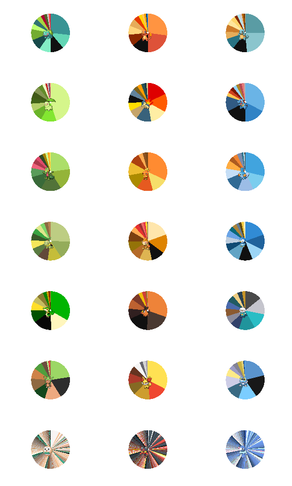
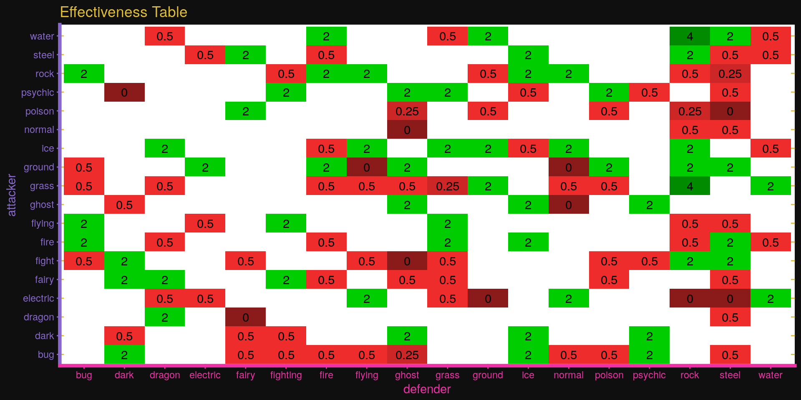

*This post was semi automatically converted from blogdown to Quarto and may contain errors. The original can be found in the [archive](http://archive.schochastics.net/post/a-wild-r-package-appears/).*

I have to comute quite long every day and I always try to keep occupied
with little projects. One of my first projects was to increase my
knowledge on how to create R packages. The result of it is `Rokemon`, a
Pokemon/Game Boy inspired package. In this post, I will briefly
introduce some functionalities of the package and illustrate how
incredible useful it can be. A similar introduction can also be found on
[github](https://github.com/schochastics/Rokemon).

The package is only available via github so far.

``` r
#install.packages(devtools)
devtools::install_github("schochastics/Rokemon")
```

``` r
#used packages
library(Rokemon)
library(tidyverse)  # for data wrangling
```

The Package comes with a dataset on 801 pokemon with a rich set of
attributes.

``` r
data(pokemon)
glimpse(pokemon)
```

``` hljs
## Observations: 801
## Variables: 41
## $ pokedex_number    <int> 1, 2, 3, 4, 5, 6, 7, 8, 9, 10, 11, 12, 13, 1...
## $ name              <chr> "Bulbasaur", "Ivysaur", "Venusaur", "Charman...
## $ japanese_name     <chr> "Fushigidaneフシギダネ", "Fushigisouフシギソウ", "Fush...
## $ type1             <chr> "grass", "grass", "grass", "fire", "fire", "...
## $ type2             <chr> "poison", "poison", "poison", NA, NA, "flyin...
## $ classfication     <chr> "Seed Pokémon", "Seed Pokémon", "Seed Pokémo...
## $ height_m          <dbl> 0.7, 1.0, 2.0, 0.6, 1.1, 1.7, 0.5, 1.0, 1.6,...
## $ weight_kg         <dbl> 6.9, 13.0, 100.0, 8.5, 19.0, 90.5, 9.0, 22.5...
## $ generation        <int> 1, 1, 1, 1, 1, 1, 1, 1, 1, 1, 1, 1, 1, 1, 1,...
## $ is_legendary      <int> 0, 0, 0, 0, 0, 0, 0, 0, 0, 0, 0, 0, 0, 0, 0,...
## $ attack            <int> 49, 62, 100, 52, 64, 104, 48, 63, 103, 30, 2...
## $ defense           <int> 49, 63, 123, 43, 58, 78, 65, 80, 120, 35, 55...
## $ hp                <int> 45, 60, 80, 39, 58, 78, 44, 59, 79, 45, 50, ...
## $ speed             <int> 45, 60, 80, 65, 80, 100, 43, 58, 78, 45, 30,...
## $ sp_attack         <int> 65, 80, 122, 60, 80, 159, 50, 65, 135, 20, 2...
## $ sp_defense        <int> 65, 80, 120, 50, 65, 115, 64, 80, 115, 20, 2...
## $ base_total        <int> 318, 405, 625, 309, 405, 634, 314, 405, 630,...
## $ abilities         <list> [<"Overgrow", "Chlorophyll">, <"Overgrow", ...
## $ capture_rate      <int> 45, 45, 45, 45, 45, 45, 45, 45, 45, 255, 120...
## $ experience_growth <int> 1059860, 1059860, 1059860, 1059860, 1059860,...
## $ percentage_male   <dbl> 88.1, 88.1, 88.1, 88.1, 88.1, 88.1, 88.1, 88...
## $ base_happiness    <int> 70, 70, 70, 70, 70, 70, 70, 70, 70, 70, 70, ...
## $ base_egg_steps    <int> 5120, 5120, 5120, 5120, 5120, 5120, 5120, 51...
## $ against_bug       <dbl> 1.00, 1.00, 1.00, 0.50, 0.50, 0.25, 1.00, 1....
## $ against_dark      <dbl> 1, 1, 1, 1, 1, 1, 1, 1, 1, 1, 1, 1, 1, 1, 1,...
## $ against_dragon    <dbl> 1, 1, 1, 1, 1, 1, 1, 1, 1, 1, 1, 1, 1, 1, 1,...
## $ against_electric  <dbl> 0.5, 0.5, 0.5, 1.0, 1.0, 2.0, 2.0, 2.0, 2.0,...
## $ against_fairy     <dbl> 0.5, 0.5, 0.5, 0.5, 0.5, 0.5, 1.0, 1.0, 1.0,...
## $ against_fight     <dbl> 0.50, 0.50, 0.50, 1.00, 1.00, 0.50, 1.00, 1....
## $ against_fire      <dbl> 2.0, 2.0, 2.0, 0.5, 0.5, 0.5, 0.5, 0.5, 0.5,...
## $ against_flying    <dbl> 2.0, 2.0, 2.0, 1.0, 1.0, 1.0, 1.0, 1.0, 1.0,...
## $ against_ghost     <dbl> 1, 1, 1, 1, 1, 1, 1, 1, 1, 1, 1, 1, 1, 1, 1,...
## $ against_grass     <dbl> 0.25, 0.25, 0.25, 0.50, 0.50, 0.25, 2.00, 2....
## $ against_ground    <dbl> 1.0, 1.0, 1.0, 2.0, 2.0, 0.0, 1.0, 1.0, 1.0,...
## $ against_ice       <dbl> 2.0, 2.0, 2.0, 0.5, 0.5, 1.0, 0.5, 0.5, 0.5,...
## $ against_normal    <dbl> 1, 1, 1, 1, 1, 1, 1, 1, 1, 1, 1, 1, 1, 1, 1,...
## $ against_poison    <dbl> 1.0, 1.0, 1.0, 1.0, 1.0, 1.0, 1.0, 1.0, 1.0,...
## $ against_psychic   <dbl> 2, 2, 2, 1, 1, 1, 1, 1, 1, 1, 1, 1, 2, 2, 2,...
## $ against_rock      <dbl> 1, 1, 1, 2, 2, 4, 1, 1, 1, 2, 2, 4, 2, 2, 2,...
## $ against_steel     <dbl> 1.0, 1.0, 1.0, 0.5, 0.5, 0.5, 0.5, 0.5, 0.5,...
## $ against_water     <dbl> 0.5, 0.5, 0.5, 2.0, 2.0, 2.0, 0.5, 0.5, 0.5,...
```

The data comes from [Kaggle](https://www.kaggle.com/rounakbanik/pokemon)
and was originally scraped from [serebii.net](http://serebii.net/).

# ggplot2 themes

The package includes three main themes for ggplot.

## Theme Rocket

*(See what I did there…)*

``` r
ggplot(pokemon,aes(attack,defense))+
  geom_point(col = "grey")+
  theme_rocket()+
  labs(x = "Jessy",y = "James",
       title = "Theme Rocket",
       subtitle = "blast off at the speed of light!",
       caption = "meowth that's right")
```


## Gamyboy theme

If you want to get nostalgic.

``` r
ggplot(pokemon,aes(attack,defense))+
  geom_point(shape = 15,col = "#006400",size=2)+
  theme_gameboy()+
  labs(title = "Classic Gameboy Theme")
```


If you want to get nostalgic, but not too much, use the Gameboy Advanced
theme.

``` r
ggplot(pokemon,aes(attack,defense))+
  geom_point(shape = 15,col = "#27408B",size=2)+
  theme_gba()+
  labs(title = "Gameboy Advanced Theme")
```


# Pokemon color pie charts

The color distribution of Pokemon visualized with pie charts have been
done before. [This
code](https://gist.github.com/need12648430/4d681c9d1b18745ce159), for
example was posted on
[reddit](https://www.reddit.com/r/pokemon/comments/2ey1pw/last_night_i_wrote_a_processing_script_that/ck45c21/)
a while ago.

The `Rokemon` package implements a similar Algorithm zu dissect the
colors of Pokemon. To make it work, you first need to download all
Pokemon sprites. For instance from
[github](https://github.com/PokeAPI/sprites).

``` r
#basic usage
poke_pie(path_to_sprites,pokemon_name)
```

Let’s look what all time favorite Pikachu looks like.

``` r
poke_pie(sprites_path,"pikachu")
```

 Adorable, isn’t it?

Another thing we can do is to compare the starter Pokemon of all 7
generations.

``` r
starters <- c("Bulbasaur", "Charmander", "Squirtle",
              "Chikorita",  "Cyndaquil", "Totodile",
              "Treecko", "Torchic", "Mudkip",
              "Turtwig", "Chimchar", "Piplup",
              "Snivy", "Tepig", "Oshawott",
              "Chespin", "Fennekin", "Froakie",
              "Rowlet", "Litten",   "Popplio")

pies <- list()
k <- 0
for(mon in starters){
  k <- k + 1
  mon_pie <- poke_pie(sprites_path,mon)
  pies[[k]] <- mon_pie
}

gridExtra::grid.arrange(grobs = pies,ncol=3)
```



It is very interesting how similar in color the first 6 gens are and how
the colors seem to explode in gen 7.

# Some Use Cases

With the included dataset you can do all kinds of shenanigans. What
about a Pokemon type effectiveness chart? Of course with a Pokemon
related theme.

``` r
pokemon %>%
  distinct(type1,.keep_all=TRUE) %>%
  select(defender = type1,against_bug:against_water) %>%
  gather(attacker,effect,against_bug:against_water) %>%
  mutate(attacker = str_replace_all(attacker,"against_",""))  %>%
  ggplot(aes(y=attacker,x=defender,fill=factor(effect)))+
  geom_tile()+
  geom_text(aes(label=ifelse(effect!=1,effect,"")))+
  scale_fill_manual(values=c("#8B1A1A", "#CD2626", "#EE2C2C",
                             "#FFFFFF", "#00CD00", "#008B00"))+
  theme_rocket(legend.position="none")+
  labs(title="Effectiveness Table")
```



Or why not look at the mean stats of Pokemon types, plotted with the
Gameboy theme? Of course with a fitting color theme!

``` r
pokemon %>%
  group_by(type1) %>% 
  summarise_at(vars(attack:speed),mean) %>% 
  gather(stat,value,attack:speed) %>% 
  ggplot(aes(x=type1,y=value,fill=type1))+
  geom_col()+
  scale_fill_poketype(name="")+
  facet_wrap(~stat)+
  theme_gameboy()+
  guides(fill = guide_legend(ncol = 9))+
  theme(axis.text.x = element_blank(),
        axis.ticks.x= element_blank())+
  labs(x="",y="")
```


The package includes some more functions and color palettes. To use
them, checkout the [README](https://github.com/schochastics/Rokemon) of
the github repo.

