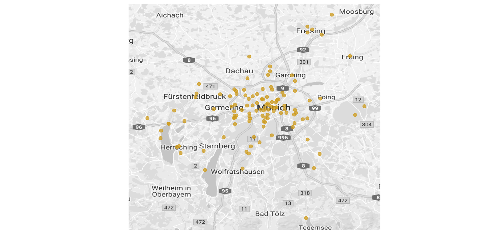
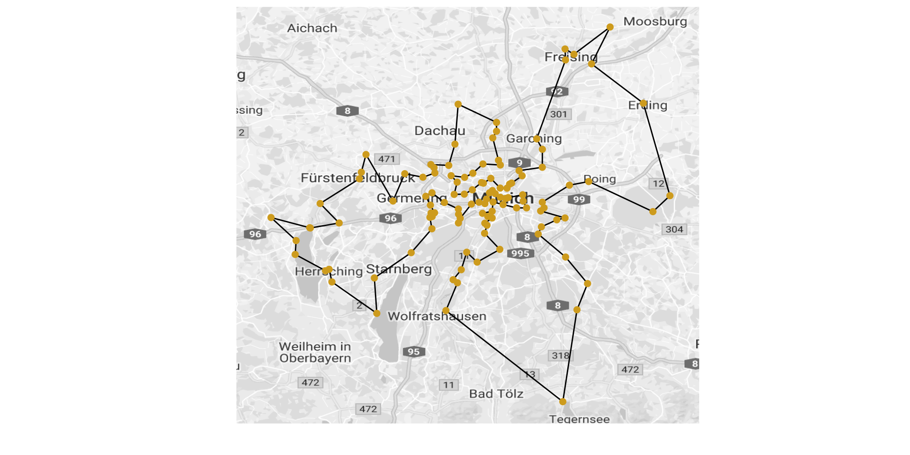
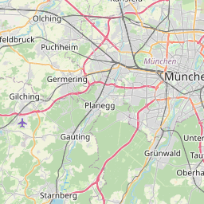

*This post was semi automatically converted from blogdown to Quarto and may contain errors. The original can be found in the [archive](http://archive.schochastics.net/post/traveling-beerdrinker-problem/).*

Whenever I participate in a Science Slam, I try to work in an analysis
of something typical for the respective city. My next gig will be in
Munich, so there are two natural options: beer or football. In the end I
choose both, but here I will focus on the former.

``` r
#used packages
library(tidyverse)  # for data wrangling
library(TSP) #solving Traveling Salesman problems
library(ggmap) #maps in ggplot2
library(leaflet) #interactive maps
```

# Data

Munich is, among other things of course, famous for its
[beergardens](https://en.wikipedia.org/wiki/Beer_garden). If you are not
German enough to know what a beergarden is, well, it is simply an
outdoor area in which beer and some local food are served. The concept
in fact originated in Munich, where you can find an enormous amount of
them. I found [this
page](http://www.xn--biergrtenmnchen-4kb72b.de/Hauptseite), which lists
114 in and around Munich! I scraped their list and added
Longitude/Latitude as well as the brewery that provides the beer. You
can find the data as a csv file on
[github](https://gist.github.com/schochastics/39a81a1f0159a38070efdd845d4b212b).

``` r
# df_beer <- read_csv("beergarden.csv")
glimpse(df_beer)
```

``` hljs
## Observations: 114
## Variables: 4
## $ Name      <chr> "Augustiner-Keller", "Aujäger", "Alte Villa", "Alter...
## $ Biermarke <chr> "Augustiner", "Hacker Pschorr", "Kaltenberger", "Aug...
## $ Long      <dbl> 11.55122, 11.44961, 11.09812, 11.41751, 11.20066, 11...
## $ Lat       <dbl> 48.14374, 47.91929, 48.02635, 48.09848, 48.08622, 48...
```

We can plot the location of the beergardens using the `ggmap` package.

``` r
### Get a map with Marienplatz as center 
map <- get_map(location = c(11.5773133,48.1382570), zoom = 9,
               maptype = "roadmap",source="google",color="bw")

ggmap(map)+
  geom_point(data=df_beer,aes(x=Long,y=Lat),size=2,alpha=0.75,col="goldenrod3")+
  scale_x_continuous(limits=c(11.01,11.99))+
  scale_y_continuous(limits=c(47.740,48.46))+
  theme(legend.position="bottom",
        text=element_text(size=16),
    aspect.ratio = .9,
    axis.ticks = element_blank(),
    axis.text = element_blank())+
  labs(x="",y="")
```



In the next section, I briefly explain what we are going to do with the
data. If you are already familiar with the traveling salesman problem,
which in our case becomes the traveling beerdrinker problem, you can
safely skip that part.

# Traveling Salesman Problem

What we are going to look at now is the so called [Traveling salesman
problem](https://en.wikipedia.org/wiki/Travelling_salesman_problem). The
problem statement is as follows:  
*“Given a list of cities and the distances between each pair of cities,
what is the shortest possible route that visits each city and returns to
the origin city?”*  
The problem was formulated in 1930 and is one of the most studied
problems in optimization, used as a benchmark for many optimization
methods. Solving this problem, however, is hard. In fact, it is [NP
hard](https://en.wikipedia.org/wiki/NP-hardness). But in spite of
computational difficulties,  
a large number of heuristics and exact algorithms exists to solve the
problem. Instances with tens of thousands of cities can be solved
exactly and even problems with millions of cities can be approximated
well.  
The method was also used by Randal Olson to create a round trip of [US
National
Parks](http://www.randalolson.com/2016/07/30/the-optimal-u-s-national-parks-centennial-road-trip/).

# Solving the Traveling Beerdrinker Problem

To solve the traveling beerdrinker problem, we first need the distances
between the beergardens. You can use the euclidean distances if you are
a flat earther, but if you do not believe in wacky ideas, you may want
to use the `distGeo()` function from the `geosphere` package[¹](#fn1).

``` r
n <- nrow(df_beer)
beer_dist <- matrix(0,n,n)
for(i in 1:n){
  for(j in 1:n){
    beer_dist[i,j] <- geosphere::distGeo(c(df_beer$Long[i],df_beer$Lat[i]),
                                         c(df_beer$Long[j],df_beer$Lat[j]))
  }
}
```

With the distances at hand, we can now solve the problem with the `TSP`
package. In order to use the best possible algorithm, you need to
download *concorde* and *linkern* executables for your OS from
[here](http://www.math.uwaterloo.ca/tsp/concorde/downloads/downloads.htm).
Use `concorde_path()` to let R know where the executables are located.

You can also simply use the default method since our problem is rather
small.

``` r
beer_tsp <- TSP(beer_dist,labels=df_beer$name)
beer_route <- solve_TSP(beer_tsp,method="concorde")
#default:
#beer_route <- solve_TSP(beer_tsp,control=list(repetitions=100,two_opt=TRUE))
```

The function `tour_length()` tells us, how long the tour is. Our
beergarden tour for instance is 437.21 km long (For my American friends:
That should be around 271.67 miles). Let’s put it on a map.

``` r
#turn tour into integer sequence for plotting 
beer_route <- as.integer(beer_route)
beer_route <- c(beer_route,beer_route[1])

ggmap(map)+
  geom_path(data=df_beer[beer_route,],aes(x=Long,y=Lat))+
  geom_point(data=df_beer,aes(x=Long,y=Lat),size=2,col="goldenrod3")+
  scale_x_continuous(limits=c(11.01,11.99))+
  scale_y_continuous(limits=c(47.740,48.46))+
  theme(legend.position="bottom",
        text=element_text(size=16),
        aspect.ratio = 0.9,
        axis.ticks = element_blank(),
        axis.text = element_blank())+
  labs(x="",y="")
```



If you fancy interactive maps, you can use the `leaflet` package.

``` r
m1 <- df_beer %>% 
  mutate(popup_text=paste(sep = "<br/>", paste0("<b>", Name, "</b>"), Biermarke)) %>%
leaflet() %>% 
  addTiles()  %>%  
  setView(11.5773133,48.1382570, zoom = 10) %>% 
  addPolylines(data=df_beer[beer_route,],lat=~Lat,lng=~Long) %>% 
  addCircleMarkers(lng=~Long,
             lat=~Lat,
             popup = ~popup_text,
             radius=4,
             color = "black",
             stroke=FALSE,
             fillOpacity = 0.7)
m1
```



![](data:image/svg+xml;base64,PHN2ZyBjbGFzcz0ibGVhZmxldC16b29tLWFuaW1hdGVkIiBzdHlsZT0idHJhbnNmb3JtOiB0cmFuc2xhdGUzZCgtMTNweCwgLTEwcHgsIDBweCk7IiB3aWR0aD0iNjc0IiBoZWlnaHQ9IjUwMCIgdmlld2JveD0iLTEzIC0xMCA2NzQgNTAwIj48Zz48cGF0aCBzdHJva2UtbGluZWpvaW49InJvdW5kIiBzdHJva2UtbGluZWNhcD0icm91bmQiIHN0cm9rZT0iIzAzRiIgc3Ryb2tlLW9wYWNpdHk9IjAuNSIgc3Ryb2tlLXdpZHRoPSI1IiBmaWxsPSJub25lIiBjbGFzcz0ibGVhZmxldC1jbGlja2FibGUiIGQ9Ik0zMDQgMjM0TDMwOSAyMzBMMzIzIDI0NEwzMzIgMjQ2TDMzNiAyNDRMMzYxIDIzOUwzNjIgMjUyTDM2NyAyNjZMMzUwIDI2NkwzMTAgMjU0TDMwOSAyNzNMMjkyIDI3N0wzMDEgMjg0TDMwOSAyODdMMjk2IDI5OEwzMDAgMzAyTDI5NiAzMThMMzIyIDM1MkwyODMgMzc4TDI2NiAzNThMMjU2IDM5NEwyNDMgNDE1TDI1MCA0MjFMMjMwIDQ3OUwyNDEuNTgyMDEwNTgyMDEwNTggNDkwTTQ1MS4zNjY0OTIxNDY1OTY4NCA0OTBMNDUzIDQ3N0w0NzEgNDIzTDQzNCAzNjhMMzg3IDMyMEwzOTIgMzA1TDQxOSAyOTBMNDMzIDI4N0wzOTEgMjcyTDM5NyAyNjZMMzk0IDI1NEw0NDAgMjE5TDQ3MyAyMTFMNTgyIDI3NEw2MTEgMjQxTDU2NiA0OUw1MDIuNjgyOTI2ODI5MjY4MyAtMTBNNDIzLjY4MDk4MTU5NTA5MiAtMTBMMzg0IDEyMkwzOTQgMTQ0TDM5NCAxODFMMzU1IDE4OEwzNjAgMTk5TDMzOCAyMTZMMzM0IDIyNUwzMjMgMjI1TDMwNyAyMDRMMjk0IDIxNEwyOTEgMjEzTDI3NSAyMjhMMjYyIDIzN0wyNDQgMjM4TDI0OSAyMTJMMjM5IDE5OUwyNjIgMjAyTDI3NiAxOTRMMjkzIDE3NUwzMjMgMTc3TDMxMCAxMjBMMzE2IDEwN0wzMTYgODhMMjUxIDUxTDI0NiAxMzNMMjM1IDE3OEwyMDUgMTc2TDIxMCAxODJMMjEyIDE5M0wxOTEgMjAyTDE2MCAxOTVMMTQwIDI1MUw5NSAxNTVMODMgMjA1TDE3IDI1N0w0OSAyOTdMMCAzMDdMLTEzIDMwMy4xODE4MTgxODE4MTgyTS0xMyAzNzAuNUwyNiAzOTZMMzIgMzkzTDM3IDQxOUwxMTMgNDg1TDEwOSA0MTFMMTcxIDM1OUwyMDcgMzA5TDIwMyAyODVMMjA3IDI4NEwyMDUgMjc2TDIxMSAyNzZMMTk2IDI0MkwyMDcgMjM0TDIyOCAyNTVMMjUxIDI2OEwyNTIgMjk3TDI1NSAyODdMMjc0IDI1OEwyODYgMjU0TDI5NyAyNTdMMzA0IDIzNCI+PC9wYXRoPjwvZz48Zz48cGF0aCBmaWxsLXJ1bGU9ImV2ZW5vZGQiIHN0cm9rZT0ibm9uZSIgZmlsbD0iYmxhY2siIGZpbGwtb3BhY2l0eT0iMC43IiBkPSJNMzA0LDIzMEE0LDQsMCwxLDEsMzAzLjksMjMwIHoiIGNsYXNzPSJsZWFmbGV0LWNsaWNrYWJsZSI+PC9wYXRoPjwvZz48Zz48cGF0aCBmaWxsLXJ1bGU9ImV2ZW5vZGQiIHN0cm9rZT0ibm9uZSIgZmlsbD0iYmxhY2siIGZpbGwtb3BhY2l0eT0iMC43IiBkPSJNMjMwLDQ3NUE0LDQsMCwxLDEsMjI5LjksNDc1IHoiIGNsYXNzPSJsZWFmbGV0LWNsaWNrYWJsZSI+PC9wYXRoPjwvZz48Zz48cGF0aCBmaWxsLXJ1bGU9ImV2ZW5vZGQiIHN0cm9rZT0ibm9uZSIgZmlsbD0iYmxhY2siIGZpbGwtb3BhY2l0eT0iMC43IiBkPSJNMCAwIiBjbGFzcz0ibGVhZmxldC1jbGlja2FibGUiPjwvcGF0aD48L2c+PGc+PHBhdGggZmlsbC1ydWxlPSJldmVub2RkIiBzdHJva2U9Im5vbmUiIGZpbGw9ImJsYWNrIiBmaWxsLW9wYWNpdHk9IjAuNyIgZD0iTTIwNywyODBBNCw0LDAsMSwxLDIwNi45LDI4MCB6IiBjbGFzcz0ibGVhZmxldC1jbGlja2FibGUiPjwvcGF0aD48L2c+PGc+PHBhdGggZmlsbC1ydWxlPSJldmVub2RkIiBzdHJva2U9Im5vbmUiIGZpbGw9ImJsYWNrIiBmaWxsLW9wYWNpdHk9IjAuNyIgZD0iTTQ5LDI5M0E0LDQsMCwxLDEsNDguOSwyOTMgeiIgY2xhc3M9ImxlYWZsZXQtY2xpY2thYmxlIj48L3BhdGg+PC9nPjxnPjxwYXRoIGZpbGwtcnVsZT0iZXZlbm9kZCIgc3Ryb2tlPSJub25lIiBmaWxsPSJibGFjayIgZmlsbC1vcGFjaXR5PSIwLjciIGQ9Ik0yNzYsMTkwQTQsNCwwLDEsMSwyNzUuOSwxOTAgeiIgY2xhc3M9ImxlYWZsZXQtY2xpY2thYmxlIj48L3BhdGg+PC9nPjxnPjxwYXRoIGZpbGwtcnVsZT0iZXZlbm9kZCIgc3Ryb2tlPSJub25lIiBmaWxsPSJibGFjayIgZmlsbC1vcGFjaXR5PSIwLjciIGQ9Ik0zNTAsMjYyQTQsNCwwLDEsMSwzNDkuOSwyNjIgeiIgY2xhc3M9ImxlYWZsZXQtY2xpY2thYmxlIj48L3BhdGg+PC9nPjxnPjxwYXRoIGZpbGwtcnVsZT0iZXZlbm9kZCIgc3Ryb2tlPSJub25lIiBmaWxsPSJibGFjayIgZmlsbC1vcGFjaXR5PSIwLjciIGQ9Ik0zODcsMzE2QTQsNCwwLDEsMSwzODYuOSwzMTYgeiIgY2xhc3M9ImxlYWZsZXQtY2xpY2thYmxlIj48L3BhdGg+PC9nPjxnPjxwYXRoIGZpbGwtcnVsZT0iZXZlbm9kZCIgc3Ryb2tlPSJub25lIiBmaWxsPSJibGFjayIgZmlsbC1vcGFjaXR5PSIwLjciIGQ9Ik0zMTYsMTAzQTQsNCwwLDEsMSwzMTUuOSwxMDMgeiIgY2xhc3M9ImxlYWZsZXQtY2xpY2thYmxlIj48L3BhdGg+PC9nPjxnPjxwYXRoIGZpbGwtcnVsZT0iZXZlbm9kZCIgc3Ryb2tlPSJub25lIiBmaWxsPSJibGFjayIgZmlsbC1vcGFjaXR5PSIwLjciIGQ9Ik0zODQsMTE4QTQsNCwwLDEsMSwzODMuOSwxMTggeiIgY2xhc3M9ImxlYWZsZXQtY2xpY2thYmxlIj48L3BhdGg+PC9nPjxnPjxwYXRoIGZpbGwtcnVsZT0iZXZlbm9kZCIgc3Ryb2tlPSJub25lIiBmaWxsPSJibGFjayIgZmlsbC1vcGFjaXR5PSIwLjciIGQ9Ik0zOTQsMTQwQTQsNCwwLDEsMSwzOTMuOSwxNDAgeiIgY2xhc3M9ImxlYWZsZXQtY2xpY2thYmxlIj48L3BhdGg+PC9nPjxnPjxwYXRoIGZpbGwtcnVsZT0iZXZlbm9kZCIgc3Ryb2tlPSJub25lIiBmaWxsPSJibGFjayIgZmlsbC1vcGFjaXR5PSIwLjciIGQ9Ik0zMDEsMjgwQTQsNCwwLDEsMSwzMDAuOSwyODAgeiIgY2xhc3M9ImxlYWZsZXQtY2xpY2thYmxlIj48L3BhdGg+PC9nPjxnPjxwYXRoIGZpbGwtcnVsZT0iZXZlbm9kZCIgc3Ryb2tlPSJub25lIiBmaWxsPSJibGFjayIgZmlsbC1vcGFjaXR5PSIwLjciIGQ9Ik04NywxODhBNCw0LDAsMSwxLDg2LjksMTg4IHoiIGNsYXNzPSJsZWFmbGV0LWNsaWNrYWJsZSI+PC9wYXRoPjwvZz48Zz48cGF0aCBmaWxsLXJ1bGU9ImV2ZW5vZGQiIHN0cm9rZT0ibm9uZSIgZmlsbD0iYmxhY2siIGZpbGwtb3BhY2l0eT0iMC43IiBkPSJNMjUwLDQxN0E0LDQsMCwxLDEsMjQ5LjksNDE3IHoiIGNsYXNzPSJsZWFmbGV0LWNsaWNrYWJsZSI+PC9wYXRoPjwvZz48Zz48cGF0aCBmaWxsLXJ1bGU9ImV2ZW5vZGQiIHN0cm9rZT0ibm9uZSIgZmlsbD0iYmxhY2siIGZpbGwtb3BhY2l0eT0iMC43IiBkPSJNMjEwLDE3OEE0LDQsMCwxLDEsMjA5LjksMTc4IHoiIGNsYXNzPSJsZWFmbGV0LWNsaWNrYWJsZSI+PC9wYXRoPjwvZz48Zz48cGF0aCBmaWxsLXJ1bGU9ImV2ZW5vZGQiIHN0cm9rZT0ibm9uZSIgZmlsbD0iYmxhY2siIGZpbGwtb3BhY2l0eT0iMC43IiBkPSJNMCAwIiBjbGFzcz0ibGVhZmxldC1jbGlja2FibGUiPjwvcGF0aD48L2c+PGc+PHBhdGggZmlsbC1ydWxlPSJldmVub2RkIiBzdHJva2U9Im5vbmUiIGZpbGw9ImJsYWNrIiBmaWxsLW9wYWNpdHk9IjAuNyIgZD0iTTE2MCwxOTFBNCw0LDAsMSwxLDE1OS45LDE5MSB6IiBjbGFzcz0ibGVhZmxldC1jbGlja2FibGUiPjwvcGF0aD48L2c+PGc+PHBhdGggZmlsbC1ydWxlPSJldmVub2RkIiBzdHJva2U9Im5vbmUiIGZpbGw9ImJsYWNrIiBmaWxsLW9wYWNpdHk9IjAuNyIgZD0iTTMzNCwyMjFBNCw0LDAsMSwxLDMzMy45LDIyMSB6IiBjbGFzcz0ibGVhZmxldC1jbGlja2FibGUiPjwvcGF0aD48L2c+PGc+PHBhdGggZmlsbC1ydWxlPSJldmVub2RkIiBzdHJva2U9Im5vbmUiIGZpbGw9ImJsYWNrIiBmaWxsLW9wYWNpdHk9IjAuNyIgZD0iTTI5NCwyMTBBNCw0LDAsMSwxLDI5My45LDIxMCB6IiBjbGFzcz0ibGVhZmxldC1jbGlja2FibGUiPjwvcGF0aD48L2c+PGc+PHBhdGggZmlsbC1ydWxlPSJldmVub2RkIiBzdHJva2U9Im5vbmUiIGZpbGw9ImJsYWNrIiBmaWxsLW9wYWNpdHk9IjAuNyIgZD0iTTE3LDI1M0E0LDQsMCwxLDEsMTYuOSwyNTMgeiIgY2xhc3M9ImxlYWZsZXQtY2xpY2thYmxlIj48L3BhdGg+PC9nPjxnPjxwYXRoIGZpbGwtcnVsZT0iZXZlbm9kZCIgc3Ryb2tlPSJub25lIiBmaWxsPSJibGFjayIgZmlsbC1vcGFjaXR5PSIwLjciIGQ9Ik0zMjAsMTYzQTQsNCwwLDEsMSwzMTkuOSwxNjMgeiIgY2xhc3M9ImxlYWZsZXQtY2xpY2thYmxlIj48L3BhdGg+PC9nPjxnPjxwYXRoIGZpbGwtcnVsZT0iZXZlbm9kZCIgc3Ryb2tlPSJub25lIiBmaWxsPSJibGFjayIgZmlsbC1vcGFjaXR5PSIwLjciIGQ9Ik0yNTUsMjgzQTQsNCwwLDEsMSwyNTQuOSwyODMgeiIgY2xhc3M9ImxlYWZsZXQtY2xpY2thYmxlIj48L3BhdGg+PC9nPjxnPjxwYXRoIGZpbGwtcnVsZT0iZXZlbm9kZCIgc3Ryb2tlPSJub25lIiBmaWxsPSJibGFjayIgZmlsbC1vcGFjaXR5PSIwLjciIGQ9Ik0wIDAiIGNsYXNzPSJsZWFmbGV0LWNsaWNrYWJsZSI+PC9wYXRoPjwvZz48Zz48cGF0aCBmaWxsLXJ1bGU9ImV2ZW5vZGQiIHN0cm9rZT0ibm9uZSIgZmlsbD0iYmxhY2siIGZpbGwtb3BhY2l0eT0iMC43IiBkPSJNMjUxLDI2NEE0LDQsMCwxLDEsMjUwLjksMjY0IHoiIGNsYXNzPSJsZWFmbGV0LWNsaWNrYWJsZSI+PC9wYXRoPjwvZz48Zz48cGF0aCBmaWxsLXJ1bGU9ImV2ZW5vZGQiIHN0cm9rZT0ibm9uZSIgZmlsbD0iYmxhY2siIGZpbGwtb3BhY2l0eT0iMC43IiBkPSJNMjYyLDE5OEE0LDQsMCwxLDEsMjYxLjksMTk4IHoiIGNsYXNzPSJsZWFmbGV0LWNsaWNrYWJsZSI+PC9wYXRoPjwvZz48Zz48cGF0aCBmaWxsLXJ1bGU9ImV2ZW5vZGQiIHN0cm9rZT0ibm9uZSIgZmlsbD0iYmxhY2siIGZpbGwtb3BhY2l0eT0iMC43IiBkPSJNLTEsMzAzQTQsNCwwLDEsMSwtMS4xLDMwMyB6IiBjbGFzcz0ibGVhZmxldC1jbGlja2FibGUiPjwvcGF0aD48L2c+PGc+PHBhdGggZmlsbC1ydWxlPSJldmVub2RkIiBzdHJva2U9Im5vbmUiIGZpbGw9ImJsYWNrIiBmaWxsLW9wYWNpdHk9IjAuNyIgZD0iTTIwNywzMDVBNCw0LDAsMSwxLDIwNi45LDMwNSB6IiBjbGFzcz0ibGVhZmxldC1jbGlja2FibGUiPjwvcGF0aD48L2c+PGc+PHBhdGggZmlsbC1ydWxlPSJldmVub2RkIiBzdHJva2U9Im5vbmUiIGZpbGw9ImJsYWNrIiBmaWxsLW9wYWNpdHk9IjAuNyIgZD0iTTU4MiwyNzBBNCw0LDAsMSwxLDU4MS45LDI3MCB6IiBjbGFzcz0ibGVhZmxldC1jbGlja2FibGUiPjwvcGF0aD48L2c+PGc+PHBhdGggZmlsbC1ydWxlPSJldmVub2RkIiBzdHJva2U9Im5vbmUiIGZpbGw9ImJsYWNrIiBmaWxsLW9wYWNpdHk9IjAuNyIgZD0iTTM5MSwyNjhBNCw0LDAsMSwxLDM5MC45LDI2OCB6IiBjbGFzcz0ibGVhZmxldC1jbGlja2FibGUiPjwvcGF0aD48L2c+PGc+PHBhdGggZmlsbC1ydWxlPSJldmVub2RkIiBzdHJva2U9Im5vbmUiIGZpbGw9ImJsYWNrIiBmaWxsLW9wYWNpdHk9IjAuNyIgZD0iTTE5NiwyMzhBNCw0LDAsMSwxLDE5NS45LDIzOCB6IiBjbGFzcz0ibGVhZmxldC1jbGlja2FibGUiPjwvcGF0aD48L2c+PGc+PHBhdGggZmlsbC1ydWxlPSJldmVub2RkIiBzdHJva2U9Im5vbmUiIGZpbGw9ImJsYWNrIiBmaWxsLW9wYWNpdHk9IjAuNyIgZD0iTTgzLDIwMUE0LDQsMCwxLDEsODIuOSwyMDEgeiIgY2xhc3M9ImxlYWZsZXQtY2xpY2thYmxlIj48L3BhdGg+PC9nPjxnPjxwYXRoIGZpbGwtcnVsZT0iZXZlbm9kZCIgc3Ryb2tlPSJub25lIiBmaWxsPSJibGFjayIgZmlsbC1vcGFjaXR5PSIwLjciIGQ9Ik00MzQsMzY0QTQsNCwwLDEsMSw0MzMuOSwzNjQgeiIgY2xhc3M9ImxlYWZsZXQtY2xpY2thYmxlIj48L3BhdGg+PC9nPjxnPjxwYXRoIGZpbGwtcnVsZT0iZXZlbm9kZCIgc3Ryb2tlPSJub25lIiBmaWxsPSJibGFjayIgZmlsbC1vcGFjaXR5PSIwLjciIGQ9Ik0zOTQsMTc3QTQsNCwwLDEsMSwzOTMuOSwxNzcgeiIgY2xhc3M9ImxlYWZsZXQtY2xpY2thYmxlIj48L3BhdGg+PC9nPjxnPjxwYXRoIGZpbGwtcnVsZT0iZXZlbm9kZCIgc3Ryb2tlPSJub25lIiBmaWxsPSJibGFjayIgZmlsbC1vcGFjaXR5PSIwLjciIGQ9Ik0yNTYsMzkwQTQsNCwwLDEsMSwyNTUuOSwzOTAgeiIgY2xhc3M9ImxlYWZsZXQtY2xpY2thYmxlIj48L3BhdGg+PC9nPjxnPjxwYXRoIGZpbGwtcnVsZT0iZXZlbm9kZCIgc3Ryb2tlPSJub25lIiBmaWxsPSJibGFjayIgZmlsbC1vcGFjaXR5PSIwLjciIGQ9Ik00NzMsMjA3QTQsNCwwLDEsMSw0NzIuOSwyMDcgeiIgY2xhc3M9ImxlYWZsZXQtY2xpY2thYmxlIj48L3BhdGg+PC9nPjxnPjxwYXRoIGZpbGwtcnVsZT0iZXZlbm9kZCIgc3Ryb2tlPSJub25lIiBmaWxsPSJibGFjayIgZmlsbC1vcGFjaXR5PSIwLjciIGQ9Ik00NDAsMjE1QTQsNCwwLDEsMSw0MzkuOSwyMTUgeiIgY2xhc3M9ImxlYWZsZXQtY2xpY2thYmxlIj48L3BhdGg+PC9nPjxnPjxwYXRoIGZpbGwtcnVsZT0iZXZlbm9kZCIgc3Ryb2tlPSJub25lIiBmaWxsPSJibGFjayIgZmlsbC1vcGFjaXR5PSIwLjciIGQ9Ik0yODMsMzc0QTQsNCwwLDEsMSwyODIuOSwzNzQgeiIgY2xhc3M9ImxlYWZsZXQtY2xpY2thYmxlIj48L3BhdGg+PC9nPjxnPjxwYXRoIGZpbGwtcnVsZT0iZXZlbm9kZCIgc3Ryb2tlPSJub25lIiBmaWxsPSJibGFjayIgZmlsbC1vcGFjaXR5PSIwLjciIGQ9Ik0wIDAiIGNsYXNzPSJsZWFmbGV0LWNsaWNrYWJsZSI+PC9wYXRoPjwvZz48Zz48cGF0aCBmaWxsLXJ1bGU9ImV2ZW5vZGQiIHN0cm9rZT0ibm9uZSIgZmlsbD0iYmxhY2siIGZpbGwtb3BhY2l0eT0iMC43IiBkPSJNNDMzLDI4M0E0LDQsMCwxLDEsNDMyLjksMjgzIHoiIGNsYXNzPSJsZWFmbGV0LWNsaWNrYWJsZSI+PC9wYXRoPjwvZz48Zz48cGF0aCBmaWxsLXJ1bGU9ImV2ZW5vZGQiIHN0cm9rZT0ibm9uZSIgZmlsbD0iYmxhY2siIGZpbGwtb3BhY2l0eT0iMC43IiBkPSJNMzAwLDI5OEE0LDQsMCwxLDEsMjk5LjksMjk4IHoiIGNsYXNzPSJsZWFmbGV0LWNsaWNrYWJsZSI+PC9wYXRoPjwvZz48Zz48cGF0aCBmaWxsLXJ1bGU9ImV2ZW5vZGQiIHN0cm9rZT0ibm9uZSIgZmlsbD0iYmxhY2siIGZpbGwtb3BhY2l0eT0iMC43IiBkPSJNMzA5LDI4M0E0LDQsMCwxLDEsMzA4LjksMjgzIHoiIGNsYXNzPSJsZWFmbGV0LWNsaWNrYWJsZSI+PC9wYXRoPjwvZz48Zz48cGF0aCBmaWxsLXJ1bGU9ImV2ZW5vZGQiIHN0cm9rZT0ibm9uZSIgZmlsbD0iYmxhY2siIGZpbGwtb3BhY2l0eT0iMC43IiBkPSJNMjA1LDI3MkE0LDQsMCwxLDEsMjA0LjksMjcyIHoiIGNsYXNzPSJsZWFmbGV0LWNsaWNrYWJsZSI+PC9wYXRoPjwvZz48Zz48cGF0aCBmaWxsLXJ1bGU9ImV2ZW5vZGQiIHN0cm9rZT0ibm9uZSIgZmlsbD0iYmxhY2siIGZpbGwtb3BhY2l0eT0iMC43IiBkPSJNMjk2LDI5NEE0LDQsMCwxLDEsMjk1LjksMjk0IHoiIGNsYXNzPSJsZWFmbGV0LWNsaWNrYWJsZSI+PC9wYXRoPjwvZz48Zz48cGF0aCBmaWxsLXJ1bGU9ImV2ZW5vZGQiIHN0cm9rZT0ibm9uZSIgZmlsbD0iYmxhY2siIGZpbGwtb3BhY2l0eT0iMC43IiBkPSJNMzQyLDIxMEE0LDQsMCwxLDEsMzQxLjksMjEwIHoiIGNsYXNzPSJsZWFmbGV0LWNsaWNrYWJsZSI+PC9wYXRoPjwvZz48Zz48cGF0aCBmaWxsLXJ1bGU9ImV2ZW5vZGQiIHN0cm9rZT0ibm9uZSIgZmlsbD0iYmxhY2siIGZpbGwtb3BhY2l0eT0iMC43IiBkPSJNMjc1LDIyNEE0LDQsMCwxLDEsMjc0LjksMjI0IHoiIGNsYXNzPSJsZWFmbGV0LWNsaWNrYWJsZSI+PC9wYXRoPjwvZz48Zz48cGF0aCBmaWxsLXJ1bGU9ImV2ZW5vZGQiIHN0cm9rZT0ibm9uZSIgZmlsbD0iYmxhY2siIGZpbGwtb3BhY2l0eT0iMC43IiBkPSJNMzM2LDI0MEE0LDQsMCwxLDEsMzM1LjksMjQwIHoiIGNsYXNzPSJsZWFmbGV0LWNsaWNrYWJsZSI+PC9wYXRoPjwvZz48Zz48cGF0aCBmaWxsLXJ1bGU9ImV2ZW5vZGQiIHN0cm9rZT0ibm9uZSIgZmlsbD0iYmxhY2siIGZpbGwtb3BhY2l0eT0iMC43IiBkPSJNMCAwIiBjbGFzcz0ibGVhZmxldC1jbGlja2FibGUiPjwvcGF0aD48L2c+PGc+PHBhdGggZmlsbC1ydWxlPSJldmVub2RkIiBzdHJva2U9Im5vbmUiIGZpbGw9ImJsYWNrIiBmaWxsLW9wYWNpdHk9IjAuNyIgZD0iTTYxMSwyMzdBNCw0LDAsMSwxLDYxMC45LDIzNyB6IiBjbGFzcz0ibGVhZmxldC1jbGlja2FibGUiPjwvcGF0aD48L2c+PGc+PHBhdGggZmlsbC1ydWxlPSJldmVub2RkIiBzdHJva2U9Im5vbmUiIGZpbGw9ImJsYWNrIiBmaWxsLW9wYWNpdHk9IjAuNyIgZD0iTTI4NiwyNTBBNCw0LDAsMSwxLDI4NS45LDI1MCB6IiBjbGFzcz0ibGVhZmxldC1jbGlja2FibGUiPjwvcGF0aD48L2c+PGc+PHBhdGggZmlsbC1ydWxlPSJldmVub2RkIiBzdHJva2U9Im5vbmUiIGZpbGw9ImJsYWNrIiBmaWxsLW9wYWNpdHk9IjAuNyIgZD0iTTIzOSwxOTVBNCw0LDAsMSwxLDIzOC45LDE5NSB6IiBjbGFzcz0ibGVhZmxldC1jbGlja2FibGUiPjwvcGF0aD48L2c+PGc+PHBhdGggZmlsbC1ydWxlPSJldmVub2RkIiBzdHJva2U9Im5vbmUiIGZpbGw9ImJsYWNrIiBmaWxsLW9wYWNpdHk9IjAuNyIgZD0iTTI0Myw0MTFBNCw0LDAsMSwxLDI0Mi45LDQxMSB6IiBjbGFzcz0ibGVhZmxldC1jbGlja2FibGUiPjwvcGF0aD48L2c+PGc+PHBhdGggZmlsbC1ydWxlPSJldmVub2RkIiBzdHJva2U9Im5vbmUiIGZpbGw9ImJsYWNrIiBmaWxsLW9wYWNpdHk9IjAuNyIgZD0iTTM3LDQxNUE0LDQsMCwxLDEsMzYuOSw0MTUgeiIgY2xhc3M9ImxlYWZsZXQtY2xpY2thYmxlIj48L3BhdGg+PC9nPjxnPjxwYXRoIGZpbGwtcnVsZT0iZXZlbm9kZCIgc3Ryb2tlPSJub25lIiBmaWxsPSJibGFjayIgZmlsbC1vcGFjaXR5PSIwLjciIGQ9Ik0yMDMsMjgxQTQsNCwwLDEsMSwyMDIuOSwyODEgeiIgY2xhc3M9ImxlYWZsZXQtY2xpY2thYmxlIj48L3BhdGg+PC9nPjxnPjxwYXRoIGZpbGwtcnVsZT0iZXZlbm9kZCIgc3Ryb2tlPSJub25lIiBmaWxsPSJibGFjayIgZmlsbC1vcGFjaXR5PSIwLjciIGQ9Ik0zMjIsMzQ4QTQsNCwwLDEsMSwzMjEuOSwzNDggeiIgY2xhc3M9ImxlYWZsZXQtY2xpY2thYmxlIj48L3BhdGg+PC9nPjxnPjxwYXRoIGZpbGwtcnVsZT0iZXZlbm9kZCIgc3Ryb2tlPSJub25lIiBmaWxsPSJibGFjayIgZmlsbC1vcGFjaXR5PSIwLjciIGQ9Ik0yNjIsMjMzQTQsNCwwLDEsMSwyNjEuOSwyMzMgeiIgY2xhc3M9ImxlYWZsZXQtY2xpY2thYmxlIj48L3BhdGg+PC9nPjxnPjxwYXRoIGZpbGwtcnVsZT0iZXZlbm9kZCIgc3Ryb2tlPSJub25lIiBmaWxsPSJibGFjayIgZmlsbC1vcGFjaXR5PSIwLjciIGQ9Ik0zMTYsODRBNCw0LDAsMSwxLDMxNS45LDg0IHoiIGNsYXNzPSJsZWFmbGV0LWNsaWNrYWJsZSI+PC9wYXRoPjwvZz48Zz48cGF0aCBmaWxsLXJ1bGU9ImV2ZW5vZGQiIHN0cm9rZT0ibm9uZSIgZmlsbD0iYmxhY2siIGZpbGwtb3BhY2l0eT0iMC43IiBkPSJNMjEyLDE4OUE0LDQsMCwxLDEsMjExLjksMTg5IHoiIGNsYXNzPSJsZWFmbGV0LWNsaWNrYWJsZSI+PC9wYXRoPjwvZz48Zz48cGF0aCBmaWxsLXJ1bGU9ImV2ZW5vZGQiIHN0cm9rZT0ibm9uZSIgZmlsbD0iYmxhY2siIGZpbGwtb3BhY2l0eT0iMC43IiBkPSJNMjA1LDE3MkE0LDQsMCwxLDEsMjA0LjksMTcyIHoiIGNsYXNzPSJsZWFmbGV0LWNsaWNrYWJsZSI+PC9wYXRoPjwvZz48Zz48cGF0aCBmaWxsLXJ1bGU9ImV2ZW5vZGQiIHN0cm9rZT0ibm9uZSIgZmlsbD0iYmxhY2siIGZpbGwtb3BhY2l0eT0iMC43IiBkPSJNMzkyLDMwMUE0LDQsMCwxLDEsMzkxLjksMzAxIHoiIGNsYXNzPSJsZWFmbGV0LWNsaWNrYWJsZSI+PC9wYXRoPjwvZz48Zz48cGF0aCBmaWxsLXJ1bGU9ImV2ZW5vZGQiIHN0cm9rZT0ibm9uZSIgZmlsbD0iYmxhY2siIGZpbGwtb3BhY2l0eT0iMC43IiBkPSJNNDcxLDQxOUE0LDQsMCwxLDEsNDcwLjksNDE5IHoiIGNsYXNzPSJsZWFmbGV0LWNsaWNrYWJsZSI+PC9wYXRoPjwvZz48Zz48cGF0aCBmaWxsLXJ1bGU9ImV2ZW5vZGQiIHN0cm9rZT0ibm9uZSIgZmlsbD0iYmxhY2siIGZpbGwtb3BhY2l0eT0iMC43IiBkPSJNMzk3LDI2MkE0LDQsMCwxLDEsMzk2LjksMjYyIHoiIGNsYXNzPSJsZWFmbGV0LWNsaWNrYWJsZSI+PC9wYXRoPjwvZz48Zz48cGF0aCBmaWxsLXJ1bGU9ImV2ZW5vZGQiIHN0cm9rZT0ibm9uZSIgZmlsbD0iYmxhY2siIGZpbGwtb3BhY2l0eT0iMC43IiBkPSJNMjI4LDI1MUE0LDQsMCwxLDEsMjI3LjksMjUxIHoiIGNsYXNzPSJsZWFmbGV0LWNsaWNrYWJsZSI+PC9wYXRoPjwvZz48Zz48cGF0aCBmaWxsLXJ1bGU9ImV2ZW5vZGQiIHN0cm9rZT0ibm9uZSIgZmlsbD0iYmxhY2siIGZpbGwtb3BhY2l0eT0iMC43IiBkPSJNMzA5LDIyNkE0LDQsMCwxLDEsMzA4LjksMjI2IHoiIGNsYXNzPSJsZWFmbGV0LWNsaWNrYWJsZSI+PC9wYXRoPjwvZz48Zz48cGF0aCBmaWxsLXJ1bGU9ImV2ZW5vZGQiIHN0cm9rZT0ibm9uZSIgZmlsbD0iYmxhY2siIGZpbGwtb3BhY2l0eT0iMC43IiBkPSJNMTA5LDQwN0E0LDQsMCwxLDEsMTA4LjksNDA3IHoiIGNsYXNzPSJsZWFmbGV0LWNsaWNrYWJsZSI+PC9wYXRoPjwvZz48Zz48cGF0aCBmaWxsLXJ1bGU9ImV2ZW5vZGQiIHN0cm9rZT0ibm9uZSIgZmlsbD0iYmxhY2siIGZpbGwtb3BhY2l0eT0iMC43IiBkPSJNMzIzLDIyMUE0LDQsMCwxLDEsMzIyLjksMjIxIHoiIGNsYXNzPSJsZWFmbGV0LWNsaWNrYWJsZSI+PC9wYXRoPjwvZz48Zz48cGF0aCBmaWxsLXJ1bGU9ImV2ZW5vZGQiIHN0cm9rZT0ibm9uZSIgZmlsbD0iYmxhY2siIGZpbGwtb3BhY2l0eT0iMC43IiBkPSJNMjUyLDI5M0E0LDQsMCwxLDEsMjUxLjksMjkzIHoiIGNsYXNzPSJsZWFmbGV0LWNsaWNrYWJsZSI+PC9wYXRoPjwvZz48Zz48cGF0aCBmaWxsLXJ1bGU9ImV2ZW5vZGQiIHN0cm9rZT0ibm9uZSIgZmlsbD0iYmxhY2siIGZpbGwtb3BhY2l0eT0iMC43IiBkPSJNMzY3LDI2MkE0LDQsMCwxLDEsMzY2LjksMjYyIHoiIGNsYXNzPSJsZWFmbGV0LWNsaWNrYWJsZSI+PC9wYXRoPjwvZz48Zz48cGF0aCBmaWxsLXJ1bGU9ImV2ZW5vZGQiIHN0cm9rZT0ibm9uZSIgZmlsbD0iYmxhY2siIGZpbGwtb3BhY2l0eT0iMC43IiBkPSJNMzMyLDI0MkE0LDQsMCwxLDEsMzMxLjksMjQyIHoiIGNsYXNzPSJsZWFmbGV0LWNsaWNrYWJsZSI+PC9wYXRoPjwvZz48Zz48cGF0aCBmaWxsLXJ1bGU9ImV2ZW5vZGQiIHN0cm9rZT0ibm9uZSIgZmlsbD0iYmxhY2siIGZpbGwtb3BhY2l0eT0iMC43IiBkPSJNMjkyLDI3M0E0LDQsMCwxLDEsMjkxLjksMjczIHoiIGNsYXNzPSJsZWFmbGV0LWNsaWNrYWJsZSI+PC9wYXRoPjwvZz48Zz48cGF0aCBmaWxsLXJ1bGU9ImV2ZW5vZGQiIHN0cm9rZT0ibm9uZSIgZmlsbD0iYmxhY2siIGZpbGwtb3BhY2l0eT0iMC43IiBkPSJNMzA3LDIwMEE0LDQsMCwxLDEsMzA2LjksMjAwIHoiIGNsYXNzPSJsZWFmbGV0LWNsaWNrYWJsZSI+PC9wYXRoPjwvZz48Zz48cGF0aCBmaWxsLXJ1bGU9ImV2ZW5vZGQiIHN0cm9rZT0ibm9uZSIgZmlsbD0iYmxhY2siIGZpbGwtb3BhY2l0eT0iMC43IiBkPSJNMzE0LDIzMkE0LDQsMCwxLDEsMzEzLjksMjMyIHoiIGNsYXNzPSJsZWFmbGV0LWNsaWNrYWJsZSI+PC9wYXRoPjwvZz48Zz48cGF0aCBmaWxsLXJ1bGU9ImV2ZW5vZGQiIHN0cm9rZT0ibm9uZSIgZmlsbD0iYmxhY2siIGZpbGwtb3BhY2l0eT0iMC43IiBkPSJNMzEwLDI1MEE0LDQsMCwxLDEsMzA5LjksMjUwIHoiIGNsYXNzPSJsZWFmbGV0LWNsaWNrYWJsZSI+PC9wYXRoPjwvZz48Zz48cGF0aCBmaWxsLXJ1bGU9ImV2ZW5vZGQiIHN0cm9rZT0ibm9uZSIgZmlsbD0iYmxhY2siIGZpbGwtb3BhY2l0eT0iMC43IiBkPSJNMzI3LDI1NUE0LDQsMCwxLDEsMzI2LjksMjU1IHoiIGNsYXNzPSJsZWFmbGV0LWNsaWNrYWJsZSI+PC9wYXRoPjwvZz48Zz48cGF0aCBmaWxsLXJ1bGU9ImV2ZW5vZGQiIHN0cm9rZT0ibm9uZSIgZmlsbD0iYmxhY2siIGZpbGwtb3BhY2l0eT0iMC43IiBkPSJNMjExLDI3MkE0LDQsMCwxLDEsMjEwLjksMjcyIHoiIGNsYXNzPSJsZWFmbGV0LWNsaWNrYWJsZSI+PC9wYXRoPjwvZz48Zz48cGF0aCBmaWxsLXJ1bGU9ImV2ZW5vZGQiIHN0cm9rZT0ibm9uZSIgZmlsbD0iYmxhY2siIGZpbGwtb3BhY2l0eT0iMC43IiBkPSJNMCAwIiBjbGFzcz0ibGVhZmxldC1jbGlja2FibGUiPjwvcGF0aD48L2c+PGc+PHBhdGggZmlsbC1ydWxlPSJldmVub2RkIiBzdHJva2U9Im5vbmUiIGZpbGw9ImJsYWNrIiBmaWxsLW9wYWNpdHk9IjAuNyIgZD0iTTMyLDM4OUE0LDQsMCwxLDEsMzEuOSwzODkgeiIgY2xhc3M9ImxlYWZsZXQtY2xpY2thYmxlIj48L3BhdGg+PC9nPjxnPjxwYXRoIGZpbGwtcnVsZT0iZXZlbm9kZCIgc3Ryb2tlPSJub25lIiBmaWxsPSJibGFjayIgZmlsbC1vcGFjaXR5PSIwLjciIGQ9Ik0yNDQsMjM0QTQsNCwwLDEsMSwyNDMuOSwyMzQgeiIgY2xhc3M9ImxlYWZsZXQtY2xpY2thYmxlIj48L3BhdGg+PC9nPjxnPjxwYXRoIGZpbGwtcnVsZT0iZXZlbm9kZCIgc3Ryb2tlPSJub25lIiBmaWxsPSJibGFjayIgZmlsbC1vcGFjaXR5PSIwLjciIGQ9Ik0yNzQsMjU0QTQsNCwwLDEsMSwyNzMuOSwyNTQgeiIgY2xhc3M9ImxlYWZsZXQtY2xpY2thYmxlIj48L3BhdGg+PC9nPjxnPjxwYXRoIGZpbGwtcnVsZT0iZXZlbm9kZCIgc3Ryb2tlPSJub25lIiBmaWxsPSJibGFjayIgZmlsbC1vcGFjaXR5PSIwLjciIGQ9Ik05NSwxNTFBNCw0LDAsMSwxLDk0LjksMTUxIHoiIGNsYXNzPSJsZWFmbGV0LWNsaWNrYWJsZSI+PC9wYXRoPjwvZz48Zz48cGF0aCBmaWxsLXJ1bGU9ImV2ZW5vZGQiIHN0cm9rZT0ibm9uZSIgZmlsbD0iYmxhY2siIGZpbGwtb3BhY2l0eT0iMC43IiBkPSJNNTY2LDQ1QTQsNCwwLDEsMSw1NjUuOSw0NSB6IiBjbGFzcz0ibGVhZmxldC1jbGlja2FibGUiPjwvcGF0aD48L2c+PGc+PHBhdGggZmlsbC1ydWxlPSJldmVub2RkIiBzdHJva2U9Im5vbmUiIGZpbGw9ImJsYWNrIiBmaWxsLW9wYWNpdHk9IjAuNyIgZD0iTTIzNSwxNzRBNCw0LDAsMSwxLDIzNC45LDE3NCB6IiBjbGFzcz0ibGVhZmxldC1jbGlja2FibGUiPjwvcGF0aD48L2c+PGc+PHBhdGggZmlsbC1ydWxlPSJldmVub2RkIiBzdHJva2U9Im5vbmUiIGZpbGw9ImJsYWNrIiBmaWxsLW9wYWNpdHk9IjAuNyIgZD0iTTAgMCIgY2xhc3M9ImxlYWZsZXQtY2xpY2thYmxlIj48L3BhdGg+PC9nPjxnPjxwYXRoIGZpbGwtcnVsZT0iZXZlbm9kZCIgc3Ryb2tlPSJub25lIiBmaWxsPSJibGFjayIgZmlsbC1vcGFjaXR5PSIwLjciIGQ9Ik0xNzEsMzU1QTQsNCwwLDEsMSwxNzAuOSwzNTUgeiIgY2xhc3M9ImxlYWZsZXQtY2xpY2thYmxlIj48L3BhdGg+PC9nPjxnPjxwYXRoIGZpbGwtcnVsZT0iZXZlbm9kZCIgc3Ryb2tlPSJub25lIiBmaWxsPSJibGFjayIgZmlsbC1vcGFjaXR5PSIwLjciIGQ9Ik0yNTEsNDdBNCw0LDAsMSwxLDI1MC45LDQ3IHoiIGNsYXNzPSJsZWFmbGV0LWNsaWNrYWJsZSI+PC9wYXRoPjwvZz48Zz48cGF0aCBmaWxsLXJ1bGU9ImV2ZW5vZGQiIHN0cm9rZT0ibm9uZSIgZmlsbD0iYmxhY2siIGZpbGwtb3BhY2l0eT0iMC43IiBkPSJNMjkzLDE3MUE0LDQsMCwxLDEsMjkyLjksMTcxIHoiIGNsYXNzPSJsZWFmbGV0LWNsaWNrYWJsZSI+PC9wYXRoPjwvZz48Zz48cGF0aCBmaWxsLXJ1bGU9ImV2ZW5vZGQiIHN0cm9rZT0ibm9uZSIgZmlsbD0iYmxhY2siIGZpbGwtb3BhY2l0eT0iMC43IiBkPSJNMjYsMzkyQTQsNCwwLDEsMSwyNS45LDM5MiB6IiBjbGFzcz0ibGVhZmxldC1jbGlja2FibGUiPjwvcGF0aD48L2c+PGc+PHBhdGggZmlsbC1ydWxlPSJldmVub2RkIiBzdHJva2U9Im5vbmUiIGZpbGw9ImJsYWNrIiBmaWxsLW9wYWNpdHk9IjAuNyIgZD0iTTMxMCwxMTZBNCw0LDAsMSwxLDMwOS45LDExNiB6IiBjbGFzcz0ibGVhZmxldC1jbGlja2FibGUiPjwvcGF0aD48L2c+PGc+PHBhdGggZmlsbC1ydWxlPSJldmVub2RkIiBzdHJva2U9Im5vbmUiIGZpbGw9ImJsYWNrIiBmaWxsLW9wYWNpdHk9IjAuNyIgZD0iTTE0MCwyNDdBNCw0LDAsMSwxLDEzOS45LDI0NyB6IiBjbGFzcz0ibGVhZmxldC1jbGlja2FibGUiPjwvcGF0aD48L2c+PGc+PHBhdGggZmlsbC1ydWxlPSJldmVub2RkIiBzdHJva2U9Im5vbmUiIGZpbGw9ImJsYWNrIiBmaWxsLW9wYWNpdHk9IjAuNyIgZD0iTTI0NiwxMjlBNCw0LDAsMSwxLDI0NS45LDEyOSB6IiBjbGFzcz0ibGVhZmxldC1jbGlja2FibGUiPjwvcGF0aD48L2c+PGc+PHBhdGggZmlsbC1ydWxlPSJldmVub2RkIiBzdHJva2U9Im5vbmUiIGZpbGw9ImJsYWNrIiBmaWxsLW9wYWNpdHk9IjAuNyIgZD0iTTQxOSwyODZBNCw0LDAsMSwxLDQxOC45LDI4NiB6IiBjbGFzcz0ibGVhZmxldC1jbGlja2FibGUiPjwvcGF0aD48L2c+PGc+PHBhdGggZmlsbC1ydWxlPSJldmVub2RkIiBzdHJva2U9Im5vbmUiIGZpbGw9ImJsYWNrIiBmaWxsLW9wYWNpdHk9IjAuNyIgZD0iTTAgMCIgY2xhc3M9ImxlYWZsZXQtY2xpY2thYmxlIj48L3BhdGg+PC9nPjxnPjxwYXRoIGZpbGwtcnVsZT0iZXZlbm9kZCIgc3Ryb2tlPSJub25lIiBmaWxsPSJibGFjayIgZmlsbC1vcGFjaXR5PSIwLjciIGQ9Ik0wLDMwM0E0LDQsMCwxLDEsLTAuMSwzMDMgeiIgY2xhc3M9ImxlYWZsZXQtY2xpY2thYmxlIj48L3BhdGg+PC9nPjxnPjxwYXRoIGZpbGwtcnVsZT0iZXZlbm9kZCIgc3Ryb2tlPSJub25lIiBmaWxsPSJibGFjayIgZmlsbC1vcGFjaXR5PSIwLjciIGQ9Ik0zMzgsMjEyQTQsNCwwLDEsMSwzMzcuOSwyMTIgeiIgY2xhc3M9ImxlYWZsZXQtY2xpY2thYmxlIj48L3BhdGg+PC9nPjxnPjxwYXRoIGZpbGwtcnVsZT0iZXZlbm9kZCIgc3Ryb2tlPSJub25lIiBmaWxsPSJibGFjayIgZmlsbC1vcGFjaXR5PSIwLjciIGQ9Ik0yOTcsMjUzQTQsNCwwLDEsMSwyOTYuOSwyNTMgeiIgY2xhc3M9ImxlYWZsZXQtY2xpY2thYmxlIj48L3BhdGg+PC9nPjxnPjxwYXRoIGZpbGwtcnVsZT0iZXZlbm9kZCIgc3Ryb2tlPSJub25lIiBmaWxsPSJibGFjayIgZmlsbC1vcGFjaXR5PSIwLjciIGQ9Ik0wIDAiIGNsYXNzPSJsZWFmbGV0LWNsaWNrYWJsZSI+PC9wYXRoPjwvZz48Zz48cGF0aCBmaWxsLXJ1bGU9ImV2ZW5vZGQiIHN0cm9rZT0ibm9uZSIgZmlsbD0iYmxhY2siIGZpbGwtb3BhY2l0eT0iMC43IiBkPSJNMjkxLDIwOUE0LDQsMCwxLDEsMjkwLjksMjA5IHoiIGNsYXNzPSJsZWFmbGV0LWNsaWNrYWJsZSI+PC9wYXRoPjwvZz48Zz48cGF0aCBmaWxsLXJ1bGU9ImV2ZW5vZGQiIHN0cm9rZT0ibm9uZSIgZmlsbD0iYmxhY2siIGZpbGwtb3BhY2l0eT0iMC43IiBkPSJNMTEzLDQ4MUE0LDQsMCwxLDEsMTEyLjksNDgxIHoiIGNsYXNzPSJsZWFmbGV0LWNsaWNrYWJsZSI+PC9wYXRoPjwvZz48Zz48cGF0aCBmaWxsLXJ1bGU9ImV2ZW5vZGQiIHN0cm9rZT0ibm9uZSIgZmlsbD0iYmxhY2siIGZpbGwtb3BhY2l0eT0iMC43IiBkPSJNMzk0LDI1MEE0LDQsMCwxLDEsMzkzLjksMjUwIHoiIGNsYXNzPSJsZWFmbGV0LWNsaWNrYWJsZSI+PC9wYXRoPjwvZz48Zz48cGF0aCBmaWxsLXJ1bGU9ImV2ZW5vZGQiIHN0cm9rZT0ibm9uZSIgZmlsbD0iYmxhY2siIGZpbGwtb3BhY2l0eT0iMC43IiBkPSJNMzIzLDI0MEE0LDQsMCwxLDEsMzIyLjksMjQwIHoiIGNsYXNzPSJsZWFmbGV0LWNsaWNrYWJsZSI+PC9wYXRoPjwvZz48Zz48cGF0aCBmaWxsLXJ1bGU9ImV2ZW5vZGQiIHN0cm9rZT0ibm9uZSIgZmlsbD0iYmxhY2siIGZpbGwtb3BhY2l0eT0iMC43IiBkPSJNMjY2LDM1NEE0LDQsMCwxLDEsMjY1LjksMzU0IHoiIGNsYXNzPSJsZWFmbGV0LWNsaWNrYWJsZSI+PC9wYXRoPjwvZz48Zz48cGF0aCBmaWxsLXJ1bGU9ImV2ZW5vZGQiIHN0cm9rZT0ibm9uZSIgZmlsbD0iYmxhY2siIGZpbGwtb3BhY2l0eT0iMC43IiBkPSJNMjUyLDI3NUE0LDQsMCwxLDEsMjUxLjksMjc1IHoiIGNsYXNzPSJsZWFmbGV0LWNsaWNrYWJsZSI+PC9wYXRoPjwvZz48Zz48cGF0aCBmaWxsLXJ1bGU9ImV2ZW5vZGQiIHN0cm9rZT0ibm9uZSIgZmlsbD0iYmxhY2siIGZpbGwtb3BhY2l0eT0iMC43IiBkPSJNMjA0LDI1NkE0LDQsMCwxLDEsMjAzLjksMjU2IHoiIGNsYXNzPSJsZWFmbGV0LWNsaWNrYWJsZSI+PC9wYXRoPjwvZz48Zz48cGF0aCBmaWxsLXJ1bGU9ImV2ZW5vZGQiIHN0cm9rZT0ibm9uZSIgZmlsbD0iYmxhY2siIGZpbGwtb3BhY2l0eT0iMC43IiBkPSJNMTkxLDE5OEE0LDQsMCwxLDEsMTkwLjksMTk4IHoiIGNsYXNzPSJsZWFmbGV0LWNsaWNrYWJsZSI+PC9wYXRoPjwvZz48Zz48cGF0aCBmaWxsLXJ1bGU9ImV2ZW5vZGQiIHN0cm9rZT0ibm9uZSIgZmlsbD0iYmxhY2siIGZpbGwtb3BhY2l0eT0iMC43IiBkPSJNMjk2LDMxNEE0LDQsMCwxLDEsMjk1LjksMzE0IHoiIGNsYXNzPSJsZWFmbGV0LWNsaWNrYWJsZSI+PC9wYXRoPjwvZz48Zz48cGF0aCBmaWxsLXJ1bGU9ImV2ZW5vZGQiIHN0cm9rZT0ibm9uZSIgZmlsbD0iYmxhY2siIGZpbGwtb3BhY2l0eT0iMC43IiBkPSJNMzYyLDI0OEE0LDQsMCwxLDEsMzYxLjksMjQ4IHoiIGNsYXNzPSJsZWFmbGV0LWNsaWNrYWJsZSI+PC9wYXRoPjwvZz48Zz48cGF0aCBmaWxsLXJ1bGU9ImV2ZW5vZGQiIHN0cm9rZT0ibm9uZSIgZmlsbD0iYmxhY2siIGZpbGwtb3BhY2l0eT0iMC43IiBkPSJNMjk5LDI0NEE0LDQsMCwxLDEsMjk4LjksMjQ0IHoiIGNsYXNzPSJsZWFmbGV0LWNsaWNrYWJsZSI+PC9wYXRoPjwvZz48Zz48cGF0aCBmaWxsLXJ1bGU9ImV2ZW5vZGQiIHN0cm9rZT0ibm9uZSIgZmlsbD0iYmxhY2siIGZpbGwtb3BhY2l0eT0iMC43IiBkPSJNMzIzLDE3M0E0LDQsMCwxLDEsMzIyLjksMTczIHoiIGNsYXNzPSJsZWFmbGV0LWNsaWNrYWJsZSI+PC9wYXRoPjwvZz48Zz48cGF0aCBmaWxsLXJ1bGU9ImV2ZW5vZGQiIHN0cm9rZT0ibm9uZSIgZmlsbD0iYmxhY2siIGZpbGwtb3BhY2l0eT0iMC43IiBkPSJNMzYxLDIzNUE0LDQsMCwxLDEsMzYwLjksMjM1IHoiIGNsYXNzPSJsZWFmbGV0LWNsaWNrYWJsZSI+PC9wYXRoPjwvZz48Zz48cGF0aCBmaWxsLXJ1bGU9ImV2ZW5vZGQiIHN0cm9rZT0ibm9uZSIgZmlsbD0iYmxhY2siIGZpbGwtb3BhY2l0eT0iMC43IiBkPSJNMzU1LDE4NEE0LDQsMCwxLDEsMzU0LjksMTg0IHoiIGNsYXNzPSJsZWFmbGV0LWNsaWNrYWJsZSI+PC9wYXRoPjwvZz48Zz48cGF0aCBmaWxsLXJ1bGU9ImV2ZW5vZGQiIHN0cm9rZT0ibm9uZSIgZmlsbD0iYmxhY2siIGZpbGwtb3BhY2l0eT0iMC43IiBkPSJNMjA3LDIzMEE0LDQsMCwxLDEsMjA2LjksMjMwIHoiIGNsYXNzPSJsZWFmbGV0LWNsaWNrYWJsZSI+PC9wYXRoPjwvZz48Zz48cGF0aCBmaWxsLXJ1bGU9ImV2ZW5vZGQiIHN0cm9rZT0ibm9uZSIgZmlsbD0iYmxhY2siIGZpbGwtb3BhY2l0eT0iMC43IiBkPSJNNDUzLDQ3M0E0LDQsMCwxLDEsNDUyLjksNDczIHoiIGNsYXNzPSJsZWFmbGV0LWNsaWNrYWJsZSI+PC9wYXRoPjwvZz48Zz48cGF0aCBmaWxsLXJ1bGU9ImV2ZW5vZGQiIHN0cm9rZT0ibm9uZSIgZmlsbD0iYmxhY2siIGZpbGwtb3BhY2l0eT0iMC43IiBkPSJNMzA5LDI2OUE0LDQsMCwxLDEsMzA4LjksMjY5IHoiIGNsYXNzPSJsZWFmbGV0LWNsaWNrYWJsZSI+PC9wYXRoPjwvZz48Zz48cGF0aCBmaWxsLXJ1bGU9ImV2ZW5vZGQiIHN0cm9rZT0ibm9uZSIgZmlsbD0iYmxhY2siIGZpbGwtb3BhY2l0eT0iMC43IiBkPSJNMjQ5LDIwOEE0LDQsMCwxLDEsMjQ4LjksMjA4IHoiIGNsYXNzPSJsZWFmbGV0LWNsaWNrYWJsZSI+PC9wYXRoPjwvZz48Zz48cGF0aCBmaWxsLXJ1bGU9ImV2ZW5vZGQiIHN0cm9rZT0ibm9uZSIgZmlsbD0iYmxhY2siIGZpbGwtb3BhY2l0eT0iMC43IiBkPSJNMzYwLDE5NUE0LDQsMCwxLDEsMzU5LjksMTk1IHoiIGNsYXNzPSJsZWFmbGV0LWNsaWNrYWJsZSI+PC9wYXRoPjwvZz48L3N2Zz4=)

[+](# "Zoom in")[-](# "Zoom out")

[Leaflet](http://leafletjs.com/ "A JS library for interactive maps") \|
© [OpenStreetMap](http://openstreetmap.org/) contributors,
[CC-BY-SA](http://creativecommons.org/licenses/by-sa/2.0/)

Clicking on a beergarden will give you its name and the brewery that
supplies it.

More than 400km (240 miles) is certainly not something that can be done
on a single day. We reduce the problem now a bit and just look at the
beergardens that are not further than 15km (9.32 miles) away from the
Marienplatz.

``` r
center <- c(11.5773133,48.1382570)
center_dist <- rep(0,n)
for(i in 1:n){
    center_dist[i] <- geosphere::distGeo(c(df_beer$Long[i],df_beer$Lat[i]),
                                         center)
}

#Beergarden less than 15km from Marienplatz
idx <- which(center_dist<=15000)

beer_tsp <- TSP(beer_dist[idx,idx],labels=df_beer$Name[idx])
beer_route_small <- solve_TSP(beer_tsp,method="concorde")
```

This gives us a tour of 77 beergarden with 168.94 km (104.98 miles).
Doable in a day I’d say. Yet, I would not recommend to drink a Weißbier
at every single beergarden. That may well kill you.

The interactive map below shows the route.

``` r
beer_route_small <- as.integer(beer_route_small)
beer_route_small <- c(beer_route_small,beer_route_small[1])

m2 <- df_beer %>% 
  mutate(popup_text=paste(sep = "<br/>", paste0("<b>", Name, "</b>"), Biermarke)) %>%
  leaflet() %>% 
  addTiles()  %>%  
  setView(11.5773133,48.1382570, zoom = 10) %>% 
  addPolylines(data=df_beer[idx[beer_route_small],],lat=~Lat,lng=~Long,col="red") %>% 
  addCircleMarkers(lng=~Long,
             lat=~Lat,
             popup=~popup_text,
             radius=4,
             color = "black",
             stroke=FALSE,
             fillOpacity = 0.7)
m2
```


![](data:image/svg+xml;base64,PHN2ZyBjbGFzcz0ibGVhZmxldC16b29tLWFuaW1hdGVkIiBzdHlsZT0idHJhbnNmb3JtOiB0cmFuc2xhdGUzZCgtMTNweCwgLTEwcHgsIDBweCk7IiB3aWR0aD0iNjc0IiBoZWlnaHQ9IjUwMCIgdmlld2JveD0iLTEzIC0xMCA2NzQgNTAwIj48Zz48cGF0aCBzdHJva2UtbGluZWpvaW49InJvdW5kIiBzdHJva2UtbGluZWNhcD0icm91bmQiIHN0cm9rZT0icmVkIiBzdHJva2Utb3BhY2l0eT0iMC41IiBzdHJva2Utd2lkdGg9IjUiIGZpbGw9Im5vbmUiIGNsYXNzPSJsZWFmbGV0LWNsaWNrYWJsZSIgZD0iTTMwNCAyMzRMMzA5IDIzMEwzMjMgMjI1TDMzNCAyMjVMMzM4IDIxNkwzNjAgMTk5TDM1NSAxODhMMzk0IDE4MUwzOTQgMTQ0TDM4NCAxMjJMMzE2IDEwN0wzMTAgMTIwTDI0NiAxMzNMMjM1IDE3OEwyMTAgMTgyTDIwNSAxNzZMMTkxIDIwMkwyMTIgMTkzTDIzOSAxOTlMMjQ5IDIxMkwyNjIgMjAyTDI3NiAxOTRMMjkzIDE3NUwzMjAgMTY3TDMyMyAxNzdMMzA3IDIwNEwyOTQgMjE0TDI5MSAyMTNMMjc1IDIyOEwyNjIgMjM3TDI0NCAyMzhMMjI4IDI1NUwyMDcgMjM0TDE5NiAyNDJMMjExIDI3NkwyMDUgMjc2TDIwNyAyODRMMjAzIDI4NUwyMDcgMzA5TDI1MiAyOTdMMjU1IDI4N0wyNTIgMjc5TDI1MSAyNjhMMjg2IDI1NEwyOTcgMjU3TDI5OSAyNDhMMzEwIDI1NEwzMDkgMjczTDI5MiAyNzdMMzAxIDI4NEwzMDkgMjg3TDI5NiAyOThMMzAwIDMwMkwyOTYgMzE4TDI2NiAzNThMMjgzIDM3OEwzMjIgMzUyTDM4NyAzMjBMMzkyIDMwNUw0MTkgMjkwTDQzMyAyODdMNDQwIDIxOUwzOTQgMjU0TDM5NyAyNjZMMzkxIDI3MkwzNjcgMjY2TDM1MCAyNjZMMzYyIDI1MkwzNjEgMjM5TDMzNiAyNDRMMzMyIDI0NkwzMjcgMjU5TDMyMyAyNDRMMzE0IDIzNkwzMDQgMjM0Ij48L3BhdGg+PC9nPjxnPjxwYXRoIGZpbGwtcnVsZT0iZXZlbm9kZCIgc3Ryb2tlPSJub25lIiBmaWxsPSJibGFjayIgZmlsbC1vcGFjaXR5PSIwLjciIGQ9Ik0zMDQsMjMwQTQsNCwwLDEsMSwzMDMuOSwyMzAgeiIgY2xhc3M9ImxlYWZsZXQtY2xpY2thYmxlIj48L3BhdGg+PC9nPjxnPjxwYXRoIGZpbGwtcnVsZT0iZXZlbm9kZCIgc3Ryb2tlPSJub25lIiBmaWxsPSJibGFjayIgZmlsbC1vcGFjaXR5PSIwLjciIGQ9Ik0yMzAsNDc1QTQsNCwwLDEsMSwyMjkuOSw0NzUgeiIgY2xhc3M9ImxlYWZsZXQtY2xpY2thYmxlIj48L3BhdGg+PC9nPjxnPjxwYXRoIGZpbGwtcnVsZT0iZXZlbm9kZCIgc3Ryb2tlPSJub25lIiBmaWxsPSJibGFjayIgZmlsbC1vcGFjaXR5PSIwLjciIGQ9Ik0wIDAiIGNsYXNzPSJsZWFmbGV0LWNsaWNrYWJsZSI+PC9wYXRoPjwvZz48Zz48cGF0aCBmaWxsLXJ1bGU9ImV2ZW5vZGQiIHN0cm9rZT0ibm9uZSIgZmlsbD0iYmxhY2siIGZpbGwtb3BhY2l0eT0iMC43IiBkPSJNMjA3LDI4MEE0LDQsMCwxLDEsMjA2LjksMjgwIHoiIGNsYXNzPSJsZWFmbGV0LWNsaWNrYWJsZSI+PC9wYXRoPjwvZz48Zz48cGF0aCBmaWxsLXJ1bGU9ImV2ZW5vZGQiIHN0cm9rZT0ibm9uZSIgZmlsbD0iYmxhY2siIGZpbGwtb3BhY2l0eT0iMC43IiBkPSJNNDksMjkzQTQsNCwwLDEsMSw0OC45LDI5MyB6IiBjbGFzcz0ibGVhZmxldC1jbGlja2FibGUiPjwvcGF0aD48L2c+PGc+PHBhdGggZmlsbC1ydWxlPSJldmVub2RkIiBzdHJva2U9Im5vbmUiIGZpbGw9ImJsYWNrIiBmaWxsLW9wYWNpdHk9IjAuNyIgZD0iTTI3NiwxOTBBNCw0LDAsMSwxLDI3NS45LDE5MCB6IiBjbGFzcz0ibGVhZmxldC1jbGlja2FibGUiPjwvcGF0aD48L2c+PGc+PHBhdGggZmlsbC1ydWxlPSJldmVub2RkIiBzdHJva2U9Im5vbmUiIGZpbGw9ImJsYWNrIiBmaWxsLW9wYWNpdHk9IjAuNyIgZD0iTTM1MCwyNjJBNCw0LDAsMSwxLDM0OS45LDI2MiB6IiBjbGFzcz0ibGVhZmxldC1jbGlja2FibGUiPjwvcGF0aD48L2c+PGc+PHBhdGggZmlsbC1ydWxlPSJldmVub2RkIiBzdHJva2U9Im5vbmUiIGZpbGw9ImJsYWNrIiBmaWxsLW9wYWNpdHk9IjAuNyIgZD0iTTM4NywzMTZBNCw0LDAsMSwxLDM4Ni45LDMxNiB6IiBjbGFzcz0ibGVhZmxldC1jbGlja2FibGUiPjwvcGF0aD48L2c+PGc+PHBhdGggZmlsbC1ydWxlPSJldmVub2RkIiBzdHJva2U9Im5vbmUiIGZpbGw9ImJsYWNrIiBmaWxsLW9wYWNpdHk9IjAuNyIgZD0iTTMxNiwxMDNBNCw0LDAsMSwxLDMxNS45LDEwMyB6IiBjbGFzcz0ibGVhZmxldC1jbGlja2FibGUiPjwvcGF0aD48L2c+PGc+PHBhdGggZmlsbC1ydWxlPSJldmVub2RkIiBzdHJva2U9Im5vbmUiIGZpbGw9ImJsYWNrIiBmaWxsLW9wYWNpdHk9IjAuNyIgZD0iTTM4NCwxMThBNCw0LDAsMSwxLDM4My45LDExOCB6IiBjbGFzcz0ibGVhZmxldC1jbGlja2FibGUiPjwvcGF0aD48L2c+PGc+PHBhdGggZmlsbC1ydWxlPSJldmVub2RkIiBzdHJva2U9Im5vbmUiIGZpbGw9ImJsYWNrIiBmaWxsLW9wYWNpdHk9IjAuNyIgZD0iTTM5NCwxNDBBNCw0LDAsMSwxLDM5My45LDE0MCB6IiBjbGFzcz0ibGVhZmxldC1jbGlja2FibGUiPjwvcGF0aD48L2c+PGc+PHBhdGggZmlsbC1ydWxlPSJldmVub2RkIiBzdHJva2U9Im5vbmUiIGZpbGw9ImJsYWNrIiBmaWxsLW9wYWNpdHk9IjAuNyIgZD0iTTMwMSwyODBBNCw0LDAsMSwxLDMwMC45LDI4MCB6IiBjbGFzcz0ibGVhZmxldC1jbGlja2FibGUiPjwvcGF0aD48L2c+PGc+PHBhdGggZmlsbC1ydWxlPSJldmVub2RkIiBzdHJva2U9Im5vbmUiIGZpbGw9ImJsYWNrIiBmaWxsLW9wYWNpdHk9IjAuNyIgZD0iTTg3LDE4OEE0LDQsMCwxLDEsODYuOSwxODggeiIgY2xhc3M9ImxlYWZsZXQtY2xpY2thYmxlIj48L3BhdGg+PC9nPjxnPjxwYXRoIGZpbGwtcnVsZT0iZXZlbm9kZCIgc3Ryb2tlPSJub25lIiBmaWxsPSJibGFjayIgZmlsbC1vcGFjaXR5PSIwLjciIGQ9Ik0yNTAsNDE3QTQsNCwwLDEsMSwyNDkuOSw0MTcgeiIgY2xhc3M9ImxlYWZsZXQtY2xpY2thYmxlIj48L3BhdGg+PC9nPjxnPjxwYXRoIGZpbGwtcnVsZT0iZXZlbm9kZCIgc3Ryb2tlPSJub25lIiBmaWxsPSJibGFjayIgZmlsbC1vcGFjaXR5PSIwLjciIGQ9Ik0yMTAsMTc4QTQsNCwwLDEsMSwyMDkuOSwxNzggeiIgY2xhc3M9ImxlYWZsZXQtY2xpY2thYmxlIj48L3BhdGg+PC9nPjxnPjxwYXRoIGZpbGwtcnVsZT0iZXZlbm9kZCIgc3Ryb2tlPSJub25lIiBmaWxsPSJibGFjayIgZmlsbC1vcGFjaXR5PSIwLjciIGQ9Ik0wIDAiIGNsYXNzPSJsZWFmbGV0LWNsaWNrYWJsZSI+PC9wYXRoPjwvZz48Zz48cGF0aCBmaWxsLXJ1bGU9ImV2ZW5vZGQiIHN0cm9rZT0ibm9uZSIgZmlsbD0iYmxhY2siIGZpbGwtb3BhY2l0eT0iMC43IiBkPSJNMTYwLDE5MUE0LDQsMCwxLDEsMTU5LjksMTkxIHoiIGNsYXNzPSJsZWFmbGV0LWNsaWNrYWJsZSI+PC9wYXRoPjwvZz48Zz48cGF0aCBmaWxsLXJ1bGU9ImV2ZW5vZGQiIHN0cm9rZT0ibm9uZSIgZmlsbD0iYmxhY2siIGZpbGwtb3BhY2l0eT0iMC43IiBkPSJNMzM0LDIyMUE0LDQsMCwxLDEsMzMzLjksMjIxIHoiIGNsYXNzPSJsZWFmbGV0LWNsaWNrYWJsZSI+PC9wYXRoPjwvZz48Zz48cGF0aCBmaWxsLXJ1bGU9ImV2ZW5vZGQiIHN0cm9rZT0ibm9uZSIgZmlsbD0iYmxhY2siIGZpbGwtb3BhY2l0eT0iMC43IiBkPSJNMjk0LDIxMEE0LDQsMCwxLDEsMjkzLjksMjEwIHoiIGNsYXNzPSJsZWFmbGV0LWNsaWNrYWJsZSI+PC9wYXRoPjwvZz48Zz48cGF0aCBmaWxsLXJ1bGU9ImV2ZW5vZGQiIHN0cm9rZT0ibm9uZSIgZmlsbD0iYmxhY2siIGZpbGwtb3BhY2l0eT0iMC43IiBkPSJNMTcsMjUzQTQsNCwwLDEsMSwxNi45LDI1MyB6IiBjbGFzcz0ibGVhZmxldC1jbGlja2FibGUiPjwvcGF0aD48L2c+PGc+PHBhdGggZmlsbC1ydWxlPSJldmVub2RkIiBzdHJva2U9Im5vbmUiIGZpbGw9ImJsYWNrIiBmaWxsLW9wYWNpdHk9IjAuNyIgZD0iTTMyMCwxNjNBNCw0LDAsMSwxLDMxOS45LDE2MyB6IiBjbGFzcz0ibGVhZmxldC1jbGlja2FibGUiPjwvcGF0aD48L2c+PGc+PHBhdGggZmlsbC1ydWxlPSJldmVub2RkIiBzdHJva2U9Im5vbmUiIGZpbGw9ImJsYWNrIiBmaWxsLW9wYWNpdHk9IjAuNyIgZD0iTTI1NSwyODNBNCw0LDAsMSwxLDI1NC45LDI4MyB6IiBjbGFzcz0ibGVhZmxldC1jbGlja2FibGUiPjwvcGF0aD48L2c+PGc+PHBhdGggZmlsbC1ydWxlPSJldmVub2RkIiBzdHJva2U9Im5vbmUiIGZpbGw9ImJsYWNrIiBmaWxsLW9wYWNpdHk9IjAuNyIgZD0iTTAgMCIgY2xhc3M9ImxlYWZsZXQtY2xpY2thYmxlIj48L3BhdGg+PC9nPjxnPjxwYXRoIGZpbGwtcnVsZT0iZXZlbm9kZCIgc3Ryb2tlPSJub25lIiBmaWxsPSJibGFjayIgZmlsbC1vcGFjaXR5PSIwLjciIGQ9Ik0yNTEsMjY0QTQsNCwwLDEsMSwyNTAuOSwyNjQgeiIgY2xhc3M9ImxlYWZsZXQtY2xpY2thYmxlIj48L3BhdGg+PC9nPjxnPjxwYXRoIGZpbGwtcnVsZT0iZXZlbm9kZCIgc3Ryb2tlPSJub25lIiBmaWxsPSJibGFjayIgZmlsbC1vcGFjaXR5PSIwLjciIGQ9Ik0yNjIsMTk4QTQsNCwwLDEsMSwyNjEuOSwxOTggeiIgY2xhc3M9ImxlYWZsZXQtY2xpY2thYmxlIj48L3BhdGg+PC9nPjxnPjxwYXRoIGZpbGwtcnVsZT0iZXZlbm9kZCIgc3Ryb2tlPSJub25lIiBmaWxsPSJibGFjayIgZmlsbC1vcGFjaXR5PSIwLjciIGQ9Ik0tMSwzMDNBNCw0LDAsMSwxLC0xLjEsMzAzIHoiIGNsYXNzPSJsZWFmbGV0LWNsaWNrYWJsZSI+PC9wYXRoPjwvZz48Zz48cGF0aCBmaWxsLXJ1bGU9ImV2ZW5vZGQiIHN0cm9rZT0ibm9uZSIgZmlsbD0iYmxhY2siIGZpbGwtb3BhY2l0eT0iMC43IiBkPSJNMjA3LDMwNUE0LDQsMCwxLDEsMjA2LjksMzA1IHoiIGNsYXNzPSJsZWFmbGV0LWNsaWNrYWJsZSI+PC9wYXRoPjwvZz48Zz48cGF0aCBmaWxsLXJ1bGU9ImV2ZW5vZGQiIHN0cm9rZT0ibm9uZSIgZmlsbD0iYmxhY2siIGZpbGwtb3BhY2l0eT0iMC43IiBkPSJNNTgyLDI3MEE0LDQsMCwxLDEsNTgxLjksMjcwIHoiIGNsYXNzPSJsZWFmbGV0LWNsaWNrYWJsZSI+PC9wYXRoPjwvZz48Zz48cGF0aCBmaWxsLXJ1bGU9ImV2ZW5vZGQiIHN0cm9rZT0ibm9uZSIgZmlsbD0iYmxhY2siIGZpbGwtb3BhY2l0eT0iMC43IiBkPSJNMzkxLDI2OEE0LDQsMCwxLDEsMzkwLjksMjY4IHoiIGNsYXNzPSJsZWFmbGV0LWNsaWNrYWJsZSI+PC9wYXRoPjwvZz48Zz48cGF0aCBmaWxsLXJ1bGU9ImV2ZW5vZGQiIHN0cm9rZT0ibm9uZSIgZmlsbD0iYmxhY2siIGZpbGwtb3BhY2l0eT0iMC43IiBkPSJNMTk2LDIzOEE0LDQsMCwxLDEsMTk1LjksMjM4IHoiIGNsYXNzPSJsZWFmbGV0LWNsaWNrYWJsZSI+PC9wYXRoPjwvZz48Zz48cGF0aCBmaWxsLXJ1bGU9ImV2ZW5vZGQiIHN0cm9rZT0ibm9uZSIgZmlsbD0iYmxhY2siIGZpbGwtb3BhY2l0eT0iMC43IiBkPSJNODMsMjAxQTQsNCwwLDEsMSw4Mi45LDIwMSB6IiBjbGFzcz0ibGVhZmxldC1jbGlja2FibGUiPjwvcGF0aD48L2c+PGc+PHBhdGggZmlsbC1ydWxlPSJldmVub2RkIiBzdHJva2U9Im5vbmUiIGZpbGw9ImJsYWNrIiBmaWxsLW9wYWNpdHk9IjAuNyIgZD0iTTQzNCwzNjRBNCw0LDAsMSwxLDQzMy45LDM2NCB6IiBjbGFzcz0ibGVhZmxldC1jbGlja2FibGUiPjwvcGF0aD48L2c+PGc+PHBhdGggZmlsbC1ydWxlPSJldmVub2RkIiBzdHJva2U9Im5vbmUiIGZpbGw9ImJsYWNrIiBmaWxsLW9wYWNpdHk9IjAuNyIgZD0iTTM5NCwxNzdBNCw0LDAsMSwxLDM5My45LDE3NyB6IiBjbGFzcz0ibGVhZmxldC1jbGlja2FibGUiPjwvcGF0aD48L2c+PGc+PHBhdGggZmlsbC1ydWxlPSJldmVub2RkIiBzdHJva2U9Im5vbmUiIGZpbGw9ImJsYWNrIiBmaWxsLW9wYWNpdHk9IjAuNyIgZD0iTTI1NiwzOTBBNCw0LDAsMSwxLDI1NS45LDM5MCB6IiBjbGFzcz0ibGVhZmxldC1jbGlja2FibGUiPjwvcGF0aD48L2c+PGc+PHBhdGggZmlsbC1ydWxlPSJldmVub2RkIiBzdHJva2U9Im5vbmUiIGZpbGw9ImJsYWNrIiBmaWxsLW9wYWNpdHk9IjAuNyIgZD0iTTQ3MywyMDdBNCw0LDAsMSwxLDQ3Mi45LDIwNyB6IiBjbGFzcz0ibGVhZmxldC1jbGlja2FibGUiPjwvcGF0aD48L2c+PGc+PHBhdGggZmlsbC1ydWxlPSJldmVub2RkIiBzdHJva2U9Im5vbmUiIGZpbGw9ImJsYWNrIiBmaWxsLW9wYWNpdHk9IjAuNyIgZD0iTTQ0MCwyMTVBNCw0LDAsMSwxLDQzOS45LDIxNSB6IiBjbGFzcz0ibGVhZmxldC1jbGlja2FibGUiPjwvcGF0aD48L2c+PGc+PHBhdGggZmlsbC1ydWxlPSJldmVub2RkIiBzdHJva2U9Im5vbmUiIGZpbGw9ImJsYWNrIiBmaWxsLW9wYWNpdHk9IjAuNyIgZD0iTTI4MywzNzRBNCw0LDAsMSwxLDI4Mi45LDM3NCB6IiBjbGFzcz0ibGVhZmxldC1jbGlja2FibGUiPjwvcGF0aD48L2c+PGc+PHBhdGggZmlsbC1ydWxlPSJldmVub2RkIiBzdHJva2U9Im5vbmUiIGZpbGw9ImJsYWNrIiBmaWxsLW9wYWNpdHk9IjAuNyIgZD0iTTAgMCIgY2xhc3M9ImxlYWZsZXQtY2xpY2thYmxlIj48L3BhdGg+PC9nPjxnPjxwYXRoIGZpbGwtcnVsZT0iZXZlbm9kZCIgc3Ryb2tlPSJub25lIiBmaWxsPSJibGFjayIgZmlsbC1vcGFjaXR5PSIwLjciIGQ9Ik00MzMsMjgzQTQsNCwwLDEsMSw0MzIuOSwyODMgeiIgY2xhc3M9ImxlYWZsZXQtY2xpY2thYmxlIj48L3BhdGg+PC9nPjxnPjxwYXRoIGZpbGwtcnVsZT0iZXZlbm9kZCIgc3Ryb2tlPSJub25lIiBmaWxsPSJibGFjayIgZmlsbC1vcGFjaXR5PSIwLjciIGQ9Ik0zMDAsMjk4QTQsNCwwLDEsMSwyOTkuOSwyOTggeiIgY2xhc3M9ImxlYWZsZXQtY2xpY2thYmxlIj48L3BhdGg+PC9nPjxnPjxwYXRoIGZpbGwtcnVsZT0iZXZlbm9kZCIgc3Ryb2tlPSJub25lIiBmaWxsPSJibGFjayIgZmlsbC1vcGFjaXR5PSIwLjciIGQ9Ik0zMDksMjgzQTQsNCwwLDEsMSwzMDguOSwyODMgeiIgY2xhc3M9ImxlYWZsZXQtY2xpY2thYmxlIj48L3BhdGg+PC9nPjxnPjxwYXRoIGZpbGwtcnVsZT0iZXZlbm9kZCIgc3Ryb2tlPSJub25lIiBmaWxsPSJibGFjayIgZmlsbC1vcGFjaXR5PSIwLjciIGQ9Ik0yMDUsMjcyQTQsNCwwLDEsMSwyMDQuOSwyNzIgeiIgY2xhc3M9ImxlYWZsZXQtY2xpY2thYmxlIj48L3BhdGg+PC9nPjxnPjxwYXRoIGZpbGwtcnVsZT0iZXZlbm9kZCIgc3Ryb2tlPSJub25lIiBmaWxsPSJibGFjayIgZmlsbC1vcGFjaXR5PSIwLjciIGQ9Ik0yOTYsMjk0QTQsNCwwLDEsMSwyOTUuOSwyOTQgeiIgY2xhc3M9ImxlYWZsZXQtY2xpY2thYmxlIj48L3BhdGg+PC9nPjxnPjxwYXRoIGZpbGwtcnVsZT0iZXZlbm9kZCIgc3Ryb2tlPSJub25lIiBmaWxsPSJibGFjayIgZmlsbC1vcGFjaXR5PSIwLjciIGQ9Ik0zNDIsMjEwQTQsNCwwLDEsMSwzNDEuOSwyMTAgeiIgY2xhc3M9ImxlYWZsZXQtY2xpY2thYmxlIj48L3BhdGg+PC9nPjxnPjxwYXRoIGZpbGwtcnVsZT0iZXZlbm9kZCIgc3Ryb2tlPSJub25lIiBmaWxsPSJibGFjayIgZmlsbC1vcGFjaXR5PSIwLjciIGQ9Ik0yNzUsMjI0QTQsNCwwLDEsMSwyNzQuOSwyMjQgeiIgY2xhc3M9ImxlYWZsZXQtY2xpY2thYmxlIj48L3BhdGg+PC9nPjxnPjxwYXRoIGZpbGwtcnVsZT0iZXZlbm9kZCIgc3Ryb2tlPSJub25lIiBmaWxsPSJibGFjayIgZmlsbC1vcGFjaXR5PSIwLjciIGQ9Ik0zMzYsMjQwQTQsNCwwLDEsMSwzMzUuOSwyNDAgeiIgY2xhc3M9ImxlYWZsZXQtY2xpY2thYmxlIj48L3BhdGg+PC9nPjxnPjxwYXRoIGZpbGwtcnVsZT0iZXZlbm9kZCIgc3Ryb2tlPSJub25lIiBmaWxsPSJibGFjayIgZmlsbC1vcGFjaXR5PSIwLjciIGQ9Ik0wIDAiIGNsYXNzPSJsZWFmbGV0LWNsaWNrYWJsZSI+PC9wYXRoPjwvZz48Zz48cGF0aCBmaWxsLXJ1bGU9ImV2ZW5vZGQiIHN0cm9rZT0ibm9uZSIgZmlsbD0iYmxhY2siIGZpbGwtb3BhY2l0eT0iMC43IiBkPSJNNjExLDIzN0E0LDQsMCwxLDEsNjEwLjksMjM3IHoiIGNsYXNzPSJsZWFmbGV0LWNsaWNrYWJsZSI+PC9wYXRoPjwvZz48Zz48cGF0aCBmaWxsLXJ1bGU9ImV2ZW5vZGQiIHN0cm9rZT0ibm9uZSIgZmlsbD0iYmxhY2siIGZpbGwtb3BhY2l0eT0iMC43IiBkPSJNMjg2LDI1MEE0LDQsMCwxLDEsMjg1LjksMjUwIHoiIGNsYXNzPSJsZWFmbGV0LWNsaWNrYWJsZSI+PC9wYXRoPjwvZz48Zz48cGF0aCBmaWxsLXJ1bGU9ImV2ZW5vZGQiIHN0cm9rZT0ibm9uZSIgZmlsbD0iYmxhY2siIGZpbGwtb3BhY2l0eT0iMC43IiBkPSJNMjM5LDE5NUE0LDQsMCwxLDEsMjM4LjksMTk1IHoiIGNsYXNzPSJsZWFmbGV0LWNsaWNrYWJsZSI+PC9wYXRoPjwvZz48Zz48cGF0aCBmaWxsLXJ1bGU9ImV2ZW5vZGQiIHN0cm9rZT0ibm9uZSIgZmlsbD0iYmxhY2siIGZpbGwtb3BhY2l0eT0iMC43IiBkPSJNMjQzLDQxMUE0LDQsMCwxLDEsMjQyLjksNDExIHoiIGNsYXNzPSJsZWFmbGV0LWNsaWNrYWJsZSI+PC9wYXRoPjwvZz48Zz48cGF0aCBmaWxsLXJ1bGU9ImV2ZW5vZGQiIHN0cm9rZT0ibm9uZSIgZmlsbD0iYmxhY2siIGZpbGwtb3BhY2l0eT0iMC43IiBkPSJNMzcsNDE1QTQsNCwwLDEsMSwzNi45LDQxNSB6IiBjbGFzcz0ibGVhZmxldC1jbGlja2FibGUiPjwvcGF0aD48L2c+PGc+PHBhdGggZmlsbC1ydWxlPSJldmVub2RkIiBzdHJva2U9Im5vbmUiIGZpbGw9ImJsYWNrIiBmaWxsLW9wYWNpdHk9IjAuNyIgZD0iTTIwMywyODFBNCw0LDAsMSwxLDIwMi45LDI4MSB6IiBjbGFzcz0ibGVhZmxldC1jbGlja2FibGUiPjwvcGF0aD48L2c+PGc+PHBhdGggZmlsbC1ydWxlPSJldmVub2RkIiBzdHJva2U9Im5vbmUiIGZpbGw9ImJsYWNrIiBmaWxsLW9wYWNpdHk9IjAuNyIgZD0iTTMyMiwzNDhBNCw0LDAsMSwxLDMyMS45LDM0OCB6IiBjbGFzcz0ibGVhZmxldC1jbGlja2FibGUiPjwvcGF0aD48L2c+PGc+PHBhdGggZmlsbC1ydWxlPSJldmVub2RkIiBzdHJva2U9Im5vbmUiIGZpbGw9ImJsYWNrIiBmaWxsLW9wYWNpdHk9IjAuNyIgZD0iTTI2MiwyMzNBNCw0LDAsMSwxLDI2MS45LDIzMyB6IiBjbGFzcz0ibGVhZmxldC1jbGlja2FibGUiPjwvcGF0aD48L2c+PGc+PHBhdGggZmlsbC1ydWxlPSJldmVub2RkIiBzdHJva2U9Im5vbmUiIGZpbGw9ImJsYWNrIiBmaWxsLW9wYWNpdHk9IjAuNyIgZD0iTTMxNiw4NEE0LDQsMCwxLDEsMzE1LjksODQgeiIgY2xhc3M9ImxlYWZsZXQtY2xpY2thYmxlIj48L3BhdGg+PC9nPjxnPjxwYXRoIGZpbGwtcnVsZT0iZXZlbm9kZCIgc3Ryb2tlPSJub25lIiBmaWxsPSJibGFjayIgZmlsbC1vcGFjaXR5PSIwLjciIGQ9Ik0yMTIsMTg5QTQsNCwwLDEsMSwyMTEuOSwxODkgeiIgY2xhc3M9ImxlYWZsZXQtY2xpY2thYmxlIj48L3BhdGg+PC9nPjxnPjxwYXRoIGZpbGwtcnVsZT0iZXZlbm9kZCIgc3Ryb2tlPSJub25lIiBmaWxsPSJibGFjayIgZmlsbC1vcGFjaXR5PSIwLjciIGQ9Ik0yMDUsMTcyQTQsNCwwLDEsMSwyMDQuOSwxNzIgeiIgY2xhc3M9ImxlYWZsZXQtY2xpY2thYmxlIj48L3BhdGg+PC9nPjxnPjxwYXRoIGZpbGwtcnVsZT0iZXZlbm9kZCIgc3Ryb2tlPSJub25lIiBmaWxsPSJibGFjayIgZmlsbC1vcGFjaXR5PSIwLjciIGQ9Ik0zOTIsMzAxQTQsNCwwLDEsMSwzOTEuOSwzMDEgeiIgY2xhc3M9ImxlYWZsZXQtY2xpY2thYmxlIj48L3BhdGg+PC9nPjxnPjxwYXRoIGZpbGwtcnVsZT0iZXZlbm9kZCIgc3Ryb2tlPSJub25lIiBmaWxsPSJibGFjayIgZmlsbC1vcGFjaXR5PSIwLjciIGQ9Ik00NzEsNDE5QTQsNCwwLDEsMSw0NzAuOSw0MTkgeiIgY2xhc3M9ImxlYWZsZXQtY2xpY2thYmxlIj48L3BhdGg+PC9nPjxnPjxwYXRoIGZpbGwtcnVsZT0iZXZlbm9kZCIgc3Ryb2tlPSJub25lIiBmaWxsPSJibGFjayIgZmlsbC1vcGFjaXR5PSIwLjciIGQ9Ik0zOTcsMjYyQTQsNCwwLDEsMSwzOTYuOSwyNjIgeiIgY2xhc3M9ImxlYWZsZXQtY2xpY2thYmxlIj48L3BhdGg+PC9nPjxnPjxwYXRoIGZpbGwtcnVsZT0iZXZlbm9kZCIgc3Ryb2tlPSJub25lIiBmaWxsPSJibGFjayIgZmlsbC1vcGFjaXR5PSIwLjciIGQ9Ik0yMjgsMjUxQTQsNCwwLDEsMSwyMjcuOSwyNTEgeiIgY2xhc3M9ImxlYWZsZXQtY2xpY2thYmxlIj48L3BhdGg+PC9nPjxnPjxwYXRoIGZpbGwtcnVsZT0iZXZlbm9kZCIgc3Ryb2tlPSJub25lIiBmaWxsPSJibGFjayIgZmlsbC1vcGFjaXR5PSIwLjciIGQ9Ik0zMDksMjI2QTQsNCwwLDEsMSwzMDguOSwyMjYgeiIgY2xhc3M9ImxlYWZsZXQtY2xpY2thYmxlIj48L3BhdGg+PC9nPjxnPjxwYXRoIGZpbGwtcnVsZT0iZXZlbm9kZCIgc3Ryb2tlPSJub25lIiBmaWxsPSJibGFjayIgZmlsbC1vcGFjaXR5PSIwLjciIGQ9Ik0xMDksNDA3QTQsNCwwLDEsMSwxMDguOSw0MDcgeiIgY2xhc3M9ImxlYWZsZXQtY2xpY2thYmxlIj48L3BhdGg+PC9nPjxnPjxwYXRoIGZpbGwtcnVsZT0iZXZlbm9kZCIgc3Ryb2tlPSJub25lIiBmaWxsPSJibGFjayIgZmlsbC1vcGFjaXR5PSIwLjciIGQ9Ik0zMjMsMjIxQTQsNCwwLDEsMSwzMjIuOSwyMjEgeiIgY2xhc3M9ImxlYWZsZXQtY2xpY2thYmxlIj48L3BhdGg+PC9nPjxnPjxwYXRoIGZpbGwtcnVsZT0iZXZlbm9kZCIgc3Ryb2tlPSJub25lIiBmaWxsPSJibGFjayIgZmlsbC1vcGFjaXR5PSIwLjciIGQ9Ik0yNTIsMjkzQTQsNCwwLDEsMSwyNTEuOSwyOTMgeiIgY2xhc3M9ImxlYWZsZXQtY2xpY2thYmxlIj48L3BhdGg+PC9nPjxnPjxwYXRoIGZpbGwtcnVsZT0iZXZlbm9kZCIgc3Ryb2tlPSJub25lIiBmaWxsPSJibGFjayIgZmlsbC1vcGFjaXR5PSIwLjciIGQ9Ik0zNjcsMjYyQTQsNCwwLDEsMSwzNjYuOSwyNjIgeiIgY2xhc3M9ImxlYWZsZXQtY2xpY2thYmxlIj48L3BhdGg+PC9nPjxnPjxwYXRoIGZpbGwtcnVsZT0iZXZlbm9kZCIgc3Ryb2tlPSJub25lIiBmaWxsPSJibGFjayIgZmlsbC1vcGFjaXR5PSIwLjciIGQ9Ik0zMzIsMjQyQTQsNCwwLDEsMSwzMzEuOSwyNDIgeiIgY2xhc3M9ImxlYWZsZXQtY2xpY2thYmxlIj48L3BhdGg+PC9nPjxnPjxwYXRoIGZpbGwtcnVsZT0iZXZlbm9kZCIgc3Ryb2tlPSJub25lIiBmaWxsPSJibGFjayIgZmlsbC1vcGFjaXR5PSIwLjciIGQ9Ik0yOTIsMjczQTQsNCwwLDEsMSwyOTEuOSwyNzMgeiIgY2xhc3M9ImxlYWZsZXQtY2xpY2thYmxlIj48L3BhdGg+PC9nPjxnPjxwYXRoIGZpbGwtcnVsZT0iZXZlbm9kZCIgc3Ryb2tlPSJub25lIiBmaWxsPSJibGFjayIgZmlsbC1vcGFjaXR5PSIwLjciIGQ9Ik0zMDcsMjAwQTQsNCwwLDEsMSwzMDYuOSwyMDAgeiIgY2xhc3M9ImxlYWZsZXQtY2xpY2thYmxlIj48L3BhdGg+PC9nPjxnPjxwYXRoIGZpbGwtcnVsZT0iZXZlbm9kZCIgc3Ryb2tlPSJub25lIiBmaWxsPSJibGFjayIgZmlsbC1vcGFjaXR5PSIwLjciIGQ9Ik0zMTQsMjMyQTQsNCwwLDEsMSwzMTMuOSwyMzIgeiIgY2xhc3M9ImxlYWZsZXQtY2xpY2thYmxlIj48L3BhdGg+PC9nPjxnPjxwYXRoIGZpbGwtcnVsZT0iZXZlbm9kZCIgc3Ryb2tlPSJub25lIiBmaWxsPSJibGFjayIgZmlsbC1vcGFjaXR5PSIwLjciIGQ9Ik0zMTAsMjUwQTQsNCwwLDEsMSwzMDkuOSwyNTAgeiIgY2xhc3M9ImxlYWZsZXQtY2xpY2thYmxlIj48L3BhdGg+PC9nPjxnPjxwYXRoIGZpbGwtcnVsZT0iZXZlbm9kZCIgc3Ryb2tlPSJub25lIiBmaWxsPSJibGFjayIgZmlsbC1vcGFjaXR5PSIwLjciIGQ9Ik0zMjcsMjU1QTQsNCwwLDEsMSwzMjYuOSwyNTUgeiIgY2xhc3M9ImxlYWZsZXQtY2xpY2thYmxlIj48L3BhdGg+PC9nPjxnPjxwYXRoIGZpbGwtcnVsZT0iZXZlbm9kZCIgc3Ryb2tlPSJub25lIiBmaWxsPSJibGFjayIgZmlsbC1vcGFjaXR5PSIwLjciIGQ9Ik0yMTEsMjcyQTQsNCwwLDEsMSwyMTAuOSwyNzIgeiIgY2xhc3M9ImxlYWZsZXQtY2xpY2thYmxlIj48L3BhdGg+PC9nPjxnPjxwYXRoIGZpbGwtcnVsZT0iZXZlbm9kZCIgc3Ryb2tlPSJub25lIiBmaWxsPSJibGFjayIgZmlsbC1vcGFjaXR5PSIwLjciIGQ9Ik0wIDAiIGNsYXNzPSJsZWFmbGV0LWNsaWNrYWJsZSI+PC9wYXRoPjwvZz48Zz48cGF0aCBmaWxsLXJ1bGU9ImV2ZW5vZGQiIHN0cm9rZT0ibm9uZSIgZmlsbD0iYmxhY2siIGZpbGwtb3BhY2l0eT0iMC43IiBkPSJNMzIsMzg5QTQsNCwwLDEsMSwzMS45LDM4OSB6IiBjbGFzcz0ibGVhZmxldC1jbGlja2FibGUiPjwvcGF0aD48L2c+PGc+PHBhdGggZmlsbC1ydWxlPSJldmVub2RkIiBzdHJva2U9Im5vbmUiIGZpbGw9ImJsYWNrIiBmaWxsLW9wYWNpdHk9IjAuNyIgZD0iTTI0NCwyMzRBNCw0LDAsMSwxLDI0My45LDIzNCB6IiBjbGFzcz0ibGVhZmxldC1jbGlja2FibGUiPjwvcGF0aD48L2c+PGc+PHBhdGggZmlsbC1ydWxlPSJldmVub2RkIiBzdHJva2U9Im5vbmUiIGZpbGw9ImJsYWNrIiBmaWxsLW9wYWNpdHk9IjAuNyIgZD0iTTI3NCwyNTRBNCw0LDAsMSwxLDI3My45LDI1NCB6IiBjbGFzcz0ibGVhZmxldC1jbGlja2FibGUiPjwvcGF0aD48L2c+PGc+PHBhdGggZmlsbC1ydWxlPSJldmVub2RkIiBzdHJva2U9Im5vbmUiIGZpbGw9ImJsYWNrIiBmaWxsLW9wYWNpdHk9IjAuNyIgZD0iTTk1LDE1MUE0LDQsMCwxLDEsOTQuOSwxNTEgeiIgY2xhc3M9ImxlYWZsZXQtY2xpY2thYmxlIj48L3BhdGg+PC9nPjxnPjxwYXRoIGZpbGwtcnVsZT0iZXZlbm9kZCIgc3Ryb2tlPSJub25lIiBmaWxsPSJibGFjayIgZmlsbC1vcGFjaXR5PSIwLjciIGQ9Ik01NjYsNDVBNCw0LDAsMSwxLDU2NS45LDQ1IHoiIGNsYXNzPSJsZWFmbGV0LWNsaWNrYWJsZSI+PC9wYXRoPjwvZz48Zz48cGF0aCBmaWxsLXJ1bGU9ImV2ZW5vZGQiIHN0cm9rZT0ibm9uZSIgZmlsbD0iYmxhY2siIGZpbGwtb3BhY2l0eT0iMC43IiBkPSJNMjM1LDE3NEE0LDQsMCwxLDEsMjM0LjksMTc0IHoiIGNsYXNzPSJsZWFmbGV0LWNsaWNrYWJsZSI+PC9wYXRoPjwvZz48Zz48cGF0aCBmaWxsLXJ1bGU9ImV2ZW5vZGQiIHN0cm9rZT0ibm9uZSIgZmlsbD0iYmxhY2siIGZpbGwtb3BhY2l0eT0iMC43IiBkPSJNMCAwIiBjbGFzcz0ibGVhZmxldC1jbGlja2FibGUiPjwvcGF0aD48L2c+PGc+PHBhdGggZmlsbC1ydWxlPSJldmVub2RkIiBzdHJva2U9Im5vbmUiIGZpbGw9ImJsYWNrIiBmaWxsLW9wYWNpdHk9IjAuNyIgZD0iTTE3MSwzNTVBNCw0LDAsMSwxLDE3MC45LDM1NSB6IiBjbGFzcz0ibGVhZmxldC1jbGlja2FibGUiPjwvcGF0aD48L2c+PGc+PHBhdGggZmlsbC1ydWxlPSJldmVub2RkIiBzdHJva2U9Im5vbmUiIGZpbGw9ImJsYWNrIiBmaWxsLW9wYWNpdHk9IjAuNyIgZD0iTTI1MSw0N0E0LDQsMCwxLDEsMjUwLjksNDcgeiIgY2xhc3M9ImxlYWZsZXQtY2xpY2thYmxlIj48L3BhdGg+PC9nPjxnPjxwYXRoIGZpbGwtcnVsZT0iZXZlbm9kZCIgc3Ryb2tlPSJub25lIiBmaWxsPSJibGFjayIgZmlsbC1vcGFjaXR5PSIwLjciIGQ9Ik0yOTMsMTcxQTQsNCwwLDEsMSwyOTIuOSwxNzEgeiIgY2xhc3M9ImxlYWZsZXQtY2xpY2thYmxlIj48L3BhdGg+PC9nPjxnPjxwYXRoIGZpbGwtcnVsZT0iZXZlbm9kZCIgc3Ryb2tlPSJub25lIiBmaWxsPSJibGFjayIgZmlsbC1vcGFjaXR5PSIwLjciIGQ9Ik0yNiwzOTJBNCw0LDAsMSwxLDI1LjksMzkyIHoiIGNsYXNzPSJsZWFmbGV0LWNsaWNrYWJsZSI+PC9wYXRoPjwvZz48Zz48cGF0aCBmaWxsLXJ1bGU9ImV2ZW5vZGQiIHN0cm9rZT0ibm9uZSIgZmlsbD0iYmxhY2siIGZpbGwtb3BhY2l0eT0iMC43IiBkPSJNMzEwLDExNkE0LDQsMCwxLDEsMzA5LjksMTE2IHoiIGNsYXNzPSJsZWFmbGV0LWNsaWNrYWJsZSI+PC9wYXRoPjwvZz48Zz48cGF0aCBmaWxsLXJ1bGU9ImV2ZW5vZGQiIHN0cm9rZT0ibm9uZSIgZmlsbD0iYmxhY2siIGZpbGwtb3BhY2l0eT0iMC43IiBkPSJNMTQwLDI0N0E0LDQsMCwxLDEsMTM5LjksMjQ3IHoiIGNsYXNzPSJsZWFmbGV0LWNsaWNrYWJsZSI+PC9wYXRoPjwvZz48Zz48cGF0aCBmaWxsLXJ1bGU9ImV2ZW5vZGQiIHN0cm9rZT0ibm9uZSIgZmlsbD0iYmxhY2siIGZpbGwtb3BhY2l0eT0iMC43IiBkPSJNMjQ2LDEyOUE0LDQsMCwxLDEsMjQ1LjksMTI5IHoiIGNsYXNzPSJsZWFmbGV0LWNsaWNrYWJsZSI+PC9wYXRoPjwvZz48Zz48cGF0aCBmaWxsLXJ1bGU9ImV2ZW5vZGQiIHN0cm9rZT0ibm9uZSIgZmlsbD0iYmxhY2siIGZpbGwtb3BhY2l0eT0iMC43IiBkPSJNNDE5LDI4NkE0LDQsMCwxLDEsNDE4LjksMjg2IHoiIGNsYXNzPSJsZWFmbGV0LWNsaWNrYWJsZSI+PC9wYXRoPjwvZz48Zz48cGF0aCBmaWxsLXJ1bGU9ImV2ZW5vZGQiIHN0cm9rZT0ibm9uZSIgZmlsbD0iYmxhY2siIGZpbGwtb3BhY2l0eT0iMC43IiBkPSJNMCAwIiBjbGFzcz0ibGVhZmxldC1jbGlja2FibGUiPjwvcGF0aD48L2c+PGc+PHBhdGggZmlsbC1ydWxlPSJldmVub2RkIiBzdHJva2U9Im5vbmUiIGZpbGw9ImJsYWNrIiBmaWxsLW9wYWNpdHk9IjAuNyIgZD0iTTAsMzAzQTQsNCwwLDEsMSwtMC4xLDMwMyB6IiBjbGFzcz0ibGVhZmxldC1jbGlja2FibGUiPjwvcGF0aD48L2c+PGc+PHBhdGggZmlsbC1ydWxlPSJldmVub2RkIiBzdHJva2U9Im5vbmUiIGZpbGw9ImJsYWNrIiBmaWxsLW9wYWNpdHk9IjAuNyIgZD0iTTMzOCwyMTJBNCw0LDAsMSwxLDMzNy45LDIxMiB6IiBjbGFzcz0ibGVhZmxldC1jbGlja2FibGUiPjwvcGF0aD48L2c+PGc+PHBhdGggZmlsbC1ydWxlPSJldmVub2RkIiBzdHJva2U9Im5vbmUiIGZpbGw9ImJsYWNrIiBmaWxsLW9wYWNpdHk9IjAuNyIgZD0iTTI5NywyNTNBNCw0LDAsMSwxLDI5Ni45LDI1MyB6IiBjbGFzcz0ibGVhZmxldC1jbGlja2FibGUiPjwvcGF0aD48L2c+PGc+PHBhdGggZmlsbC1ydWxlPSJldmVub2RkIiBzdHJva2U9Im5vbmUiIGZpbGw9ImJsYWNrIiBmaWxsLW9wYWNpdHk9IjAuNyIgZD0iTTAgMCIgY2xhc3M9ImxlYWZsZXQtY2xpY2thYmxlIj48L3BhdGg+PC9nPjxnPjxwYXRoIGZpbGwtcnVsZT0iZXZlbm9kZCIgc3Ryb2tlPSJub25lIiBmaWxsPSJibGFjayIgZmlsbC1vcGFjaXR5PSIwLjciIGQ9Ik0yOTEsMjA5QTQsNCwwLDEsMSwyOTAuOSwyMDkgeiIgY2xhc3M9ImxlYWZsZXQtY2xpY2thYmxlIj48L3BhdGg+PC9nPjxnPjxwYXRoIGZpbGwtcnVsZT0iZXZlbm9kZCIgc3Ryb2tlPSJub25lIiBmaWxsPSJibGFjayIgZmlsbC1vcGFjaXR5PSIwLjciIGQ9Ik0xMTMsNDgxQTQsNCwwLDEsMSwxMTIuOSw0ODEgeiIgY2xhc3M9ImxlYWZsZXQtY2xpY2thYmxlIj48L3BhdGg+PC9nPjxnPjxwYXRoIGZpbGwtcnVsZT0iZXZlbm9kZCIgc3Ryb2tlPSJub25lIiBmaWxsPSJibGFjayIgZmlsbC1vcGFjaXR5PSIwLjciIGQ9Ik0zOTQsMjUwQTQsNCwwLDEsMSwzOTMuOSwyNTAgeiIgY2xhc3M9ImxlYWZsZXQtY2xpY2thYmxlIj48L3BhdGg+PC9nPjxnPjxwYXRoIGZpbGwtcnVsZT0iZXZlbm9kZCIgc3Ryb2tlPSJub25lIiBmaWxsPSJibGFjayIgZmlsbC1vcGFjaXR5PSIwLjciIGQ9Ik0zMjMsMjQwQTQsNCwwLDEsMSwzMjIuOSwyNDAgeiIgY2xhc3M9ImxlYWZsZXQtY2xpY2thYmxlIj48L3BhdGg+PC9nPjxnPjxwYXRoIGZpbGwtcnVsZT0iZXZlbm9kZCIgc3Ryb2tlPSJub25lIiBmaWxsPSJibGFjayIgZmlsbC1vcGFjaXR5PSIwLjciIGQ9Ik0yNjYsMzU0QTQsNCwwLDEsMSwyNjUuOSwzNTQgeiIgY2xhc3M9ImxlYWZsZXQtY2xpY2thYmxlIj48L3BhdGg+PC9nPjxnPjxwYXRoIGZpbGwtcnVsZT0iZXZlbm9kZCIgc3Ryb2tlPSJub25lIiBmaWxsPSJibGFjayIgZmlsbC1vcGFjaXR5PSIwLjciIGQ9Ik0yNTIsMjc1QTQsNCwwLDEsMSwyNTEuOSwyNzUgeiIgY2xhc3M9ImxlYWZsZXQtY2xpY2thYmxlIj48L3BhdGg+PC9nPjxnPjxwYXRoIGZpbGwtcnVsZT0iZXZlbm9kZCIgc3Ryb2tlPSJub25lIiBmaWxsPSJibGFjayIgZmlsbC1vcGFjaXR5PSIwLjciIGQ9Ik0yMDQsMjU2QTQsNCwwLDEsMSwyMDMuOSwyNTYgeiIgY2xhc3M9ImxlYWZsZXQtY2xpY2thYmxlIj48L3BhdGg+PC9nPjxnPjxwYXRoIGZpbGwtcnVsZT0iZXZlbm9kZCIgc3Ryb2tlPSJub25lIiBmaWxsPSJibGFjayIgZmlsbC1vcGFjaXR5PSIwLjciIGQ9Ik0xOTEsMTk4QTQsNCwwLDEsMSwxOTAuOSwxOTggeiIgY2xhc3M9ImxlYWZsZXQtY2xpY2thYmxlIj48L3BhdGg+PC9nPjxnPjxwYXRoIGZpbGwtcnVsZT0iZXZlbm9kZCIgc3Ryb2tlPSJub25lIiBmaWxsPSJibGFjayIgZmlsbC1vcGFjaXR5PSIwLjciIGQ9Ik0yOTYsMzE0QTQsNCwwLDEsMSwyOTUuOSwzMTQgeiIgY2xhc3M9ImxlYWZsZXQtY2xpY2thYmxlIj48L3BhdGg+PC9nPjxnPjxwYXRoIGZpbGwtcnVsZT0iZXZlbm9kZCIgc3Ryb2tlPSJub25lIiBmaWxsPSJibGFjayIgZmlsbC1vcGFjaXR5PSIwLjciIGQ9Ik0zNjIsMjQ4QTQsNCwwLDEsMSwzNjEuOSwyNDggeiIgY2xhc3M9ImxlYWZsZXQtY2xpY2thYmxlIj48L3BhdGg+PC9nPjxnPjxwYXRoIGZpbGwtcnVsZT0iZXZlbm9kZCIgc3Ryb2tlPSJub25lIiBmaWxsPSJibGFjayIgZmlsbC1vcGFjaXR5PSIwLjciIGQ9Ik0yOTksMjQ0QTQsNCwwLDEsMSwyOTguOSwyNDQgeiIgY2xhc3M9ImxlYWZsZXQtY2xpY2thYmxlIj48L3BhdGg+PC9nPjxnPjxwYXRoIGZpbGwtcnVsZT0iZXZlbm9kZCIgc3Ryb2tlPSJub25lIiBmaWxsPSJibGFjayIgZmlsbC1vcGFjaXR5PSIwLjciIGQ9Ik0zMjMsMTczQTQsNCwwLDEsMSwzMjIuOSwxNzMgeiIgY2xhc3M9ImxlYWZsZXQtY2xpY2thYmxlIj48L3BhdGg+PC9nPjxnPjxwYXRoIGZpbGwtcnVsZT0iZXZlbm9kZCIgc3Ryb2tlPSJub25lIiBmaWxsPSJibGFjayIgZmlsbC1vcGFjaXR5PSIwLjciIGQ9Ik0zNjEsMjM1QTQsNCwwLDEsMSwzNjAuOSwyMzUgeiIgY2xhc3M9ImxlYWZsZXQtY2xpY2thYmxlIj48L3BhdGg+PC9nPjxnPjxwYXRoIGZpbGwtcnVsZT0iZXZlbm9kZCIgc3Ryb2tlPSJub25lIiBmaWxsPSJibGFjayIgZmlsbC1vcGFjaXR5PSIwLjciIGQ9Ik0zNTUsMTg0QTQsNCwwLDEsMSwzNTQuOSwxODQgeiIgY2xhc3M9ImxlYWZsZXQtY2xpY2thYmxlIj48L3BhdGg+PC9nPjxnPjxwYXRoIGZpbGwtcnVsZT0iZXZlbm9kZCIgc3Ryb2tlPSJub25lIiBmaWxsPSJibGFjayIgZmlsbC1vcGFjaXR5PSIwLjciIGQ9Ik0yMDcsMjMwQTQsNCwwLDEsMSwyMDYuOSwyMzAgeiIgY2xhc3M9ImxlYWZsZXQtY2xpY2thYmxlIj48L3BhdGg+PC9nPjxnPjxwYXRoIGZpbGwtcnVsZT0iZXZlbm9kZCIgc3Ryb2tlPSJub25lIiBmaWxsPSJibGFjayIgZmlsbC1vcGFjaXR5PSIwLjciIGQ9Ik00NTMsNDczQTQsNCwwLDEsMSw0NTIuOSw0NzMgeiIgY2xhc3M9ImxlYWZsZXQtY2xpY2thYmxlIj48L3BhdGg+PC9nPjxnPjxwYXRoIGZpbGwtcnVsZT0iZXZlbm9kZCIgc3Ryb2tlPSJub25lIiBmaWxsPSJibGFjayIgZmlsbC1vcGFjaXR5PSIwLjciIGQ9Ik0zMDksMjY5QTQsNCwwLDEsMSwzMDguOSwyNjkgeiIgY2xhc3M9ImxlYWZsZXQtY2xpY2thYmxlIj48L3BhdGg+PC9nPjxnPjxwYXRoIGZpbGwtcnVsZT0iZXZlbm9kZCIgc3Ryb2tlPSJub25lIiBmaWxsPSJibGFjayIgZmlsbC1vcGFjaXR5PSIwLjciIGQ9Ik0yNDksMjA4QTQsNCwwLDEsMSwyNDguOSwyMDggeiIgY2xhc3M9ImxlYWZsZXQtY2xpY2thYmxlIj48L3BhdGg+PC9nPjxnPjxwYXRoIGZpbGwtcnVsZT0iZXZlbm9kZCIgc3Ryb2tlPSJub25lIiBmaWxsPSJibGFjayIgZmlsbC1vcGFjaXR5PSIwLjciIGQ9Ik0zNjAsMTk1QTQsNCwwLDEsMSwzNTkuOSwxOTUgeiIgY2xhc3M9ImxlYWZsZXQtY2xpY2thYmxlIj48L3BhdGg+PC9nPjwvc3ZnPg==)

[+](# "Zoom in")[-](# "Zoom out")

[Leaflet](http://leafletjs.com/ "A JS library for interactive maps") \|
© [OpenStreetMap](http://openstreetmap.org/) contributors,
[CC-BY-SA](http://creativecommons.org/licenses/by-sa/2.0/)

------------------------------------------------------------------------

1.  Technically this is also not entirely correct since we are
    calculating distances “as the crow flies” and not using road
    connections.[↩](#fnref1)

