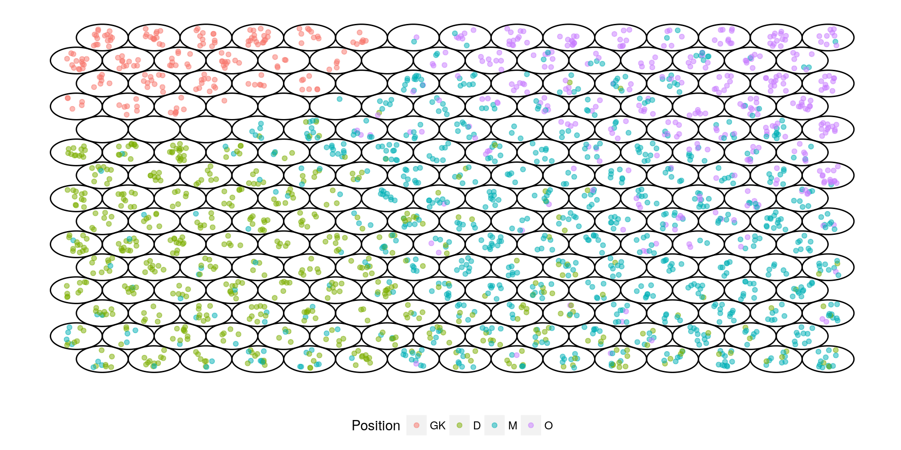

*This post was semi automatically converted from blogdown to Quarto and may contain errors. The original can be found in the [archive](http://archive.schochastics.net/post/soms-and-ggplot/).*

``` r
#used packages
library(tidyverse)  # for data wrangling
library(stringr)    # for string manipulations
library(kohonen)    # implements self organizing maps
library(ggforce)    # for additional ggplot features
```

I introduced self-organizing maps (SOM) in a [previous
post](http://blog.schochastics.net/post/dimensionality-reduction-methods/)
and since then I am using the `kohonen` package on a daily basis.
However, I prefer the ggplot style plotting, so I reimplemented the SOM
plots of the package with the `ggplot2` package. But don’t get me wrong,
the `kohonen` package does an amazing job in visualizing SOMs. I really
just prefer ggplot. Also, I needed some customized features. For
illustration purposes, I will use the FIFA 18 [player
data](http://blog.schochastics.net/post/dimensionality-reduction-methods/)
again. For the data preparation steps, refer to that post.

We will, however, only use a random sample of the 75,000 players, for
computational convenience.

``` r
r_sample <- sample(1:nrow(fifa_tbl),2000)
fifa_tbl <- fifa_tbl[r_sample,]
glimpse(fifa_tbl)
```

``` hljs
## Observations: 2,000
## Variables: 36
## $ Acceleration         <int> 52, 53, 30, 76, 46, 70, 47, 29, 45, 84, 7...
## $ Aggression           <int> 49, 79, 27, 62, 24, 75, 80, 76, 62, 63, 4...
## $ Agility              <int> 47, 58, 25, 77, 45, 63, 58, 51, 52, 70, 8...
## $ Balance              <int> 65, 50, 45, 80, 56, 51, 55, 63, 37, 70, 8...
## $ `Ball control`       <int> 31, 57, 16, 77, 18, 62, 64, 51, 57, 67, 6...
## $ Composure            <int> 44, 46, 32, 82, 23, 58, 68, 61, 48, 59, 6...
## $ Crossing             <int> 28, 45, 11, 76, 13, 46, 57, 60, 31, 74, 5...
## $ Curve                <int> 26, 32, 13, 75, 19, 46, 57, 68, 30, 51, 5...
## $ Dribbling            <int> 25, 45, 9, 77, 17, 58, 57, 39, 54, 77, 66...
## $ Finishing            <int> 20, 33, 9, 67, 20, 32, 47, 46, 68, 68, 57...
## $ `Free kick accuracy` <int> 23, 33, 12, 67, 13, 55, 64, 47, 24, 38, 4...
## $ `GK diving`          <int> 12, 9, 53, 14, 66, 13, 15, 12, 5, 13, 12,...
## $ `GK handling`        <int> 8, 10, 51, 8, 60, 5, 7, 11, 10, 12, 14, 1...
## $ `GK kicking`         <int> 12, 11, 54, 9, 61, 12, 9, 9, 6, 15, 10, 1...
## $ `GK positioning`     <int> 14, 16, 50, 13, 65, 12, 8, 6, 10, 5, 8, 1...
## $ `GK reflexes`        <int> 11, 6, 54, 15, 71, 14, 6, 7, 13, 7, 6, 1,...
## $ `Heading accuracy`   <int> 49, 68, 11, 48, 21, 52, 66, 73, 74, 53, 6...
## $ Interceptions        <int> 50, 67, 10, 60, 20, 69, 65, 74, 22, 67, 1...
## $ Jumping              <int> 73, 70, 57, 64, 62, 63, 72, 67, 70, 53, 6...
## $ `Long passing`       <int> 25, 53, 18, 68, 19, 66, 63, 64, 31, 52, 5...
## $ `Long shots`         <int> 19, 43, 9, 68, 19, 47, 69, 57, 57, 57, 62...
## $ Marking              <int> 47, 66, 9, 58, 15, 57, 60, 70, 21, 58, 38...
## $ Penalties            <int> 40, 48, 15, 70, 25, 48, 54, 47, 55, 57, 6...
## $ Positioning          <int> 26, 42, 5, 74, 14, 60, 59, 35, 59, 71, 58...
## $ Reactions            <int> 42, 66, 49, 77, 53, 58, 68, 66, 51, 64, 5...
## $ `Short passing`      <int> 31, 63, 18, 77, 29, 67, 67, 66, 45, 68, 6...
## $ `Shot power`         <int> 41, 50, 22, 76, 23, 49, 70, 65, 61, 63, 6...
## $ `Sliding tackle`     <int> 56, 68, 14, 61, 19, 64, 59, 64, 17, 56, 2...
## $ `Sprint speed`       <int> 54, 54, 26, 76, 48, 65, 43, 30, 64, 91, 7...
## $ Stamina              <int> 64, 66, 21, 75, 33, 77, 61, 64, 61, 84, 6...
## $ `Standing tackle`    <int> 61, 67, 12, 59, 17, 68, 63, 70, 20, 60, 3...
## $ Strength             <int> 55, 75, 52, 72, 70, 72, 73, 75, 83, 67, 5...
## $ Vision               <int> 34, 36, 34, 75, 13, 64, 58, 41, 43, 71, 5...
## $ Volleys              <int> 25, 30, 7, 76, 18, 48, 37, 32, 56, 46, 58...
## $ position             <fctr> CB, CB, GK, RB, GK, CM, CB, CB, ST, RB, ...
## $ position2            <fctr> D, D, GK, D, GK, M, D, D, O, D, O, D, GK...
```

# SOM data structure

We start by computing the SOM for the random sample.

``` r
fifa_som <- fifa_tbl %>%
  select(Acceleration:Volleys) %>%
  scale() %>%
  som(grid = somgrid(15, 15, "hexagonal","gaussian"), rlen = 800)
```

To use this output with ggplot now, we have to dig into the output
`fifa_som`.

``` r
glimpse(fifa_som)
```

``` hljs
## List of 13
##  $ data            :List of 1
##   ..$ : num [1:2000, 1:34] -0.905 -0.835 -2.457 0.788 -1.329 ...
##   .. ..- attr(*, "dimnames")=List of 2
##   .. ..- attr(*, "scaled:center")= Named num [1:34] 64.8 56.7 63.5 63.8 59.1 ...
##   .. .. ..- attr(*, "names")= chr [1:34] "Acceleration" "Aggression" "Agility" "Balance" ...
##   .. ..- attr(*, "scaled:scale")= Named num [1:34] 14.2 17.2 14.3 13.9 16.1 ...
##   .. .. ..- attr(*, "names")= chr [1:34] "Acceleration" "Aggression" "Agility" "Balance" ...
##  $ unit.classif    : num [1:2000] 137 47 196 75 183 68 17 31 224 7 ...
##  $ distances       : num [1:2000] 3.11 3.31 1.55 1.82 3.19 ...
##  $ grid            :List of 6
##   ..$ pts              : num [1:225, 1:2] 1.5 2.5 3.5 4.5 5.5 6.5 7.5 8.5 9.5 10.5 ...
##   .. ..- attr(*, "dimnames")=List of 2
##   ..$ xdim             : num 15
##   ..$ ydim             : num 15
##   ..$ topo             : chr "hexagonal"
##   ..$ neighbourhood.fct: Factor w/ 2 levels "bubble","gaussian": 2
##   ..$ toroidal         : logi FALSE
##   ..- attr(*, "class")= chr "somgrid"
##  $ codes           :List of 1
##   ..$ : num [1:225, 1:34] -0.6751 -0.7856 -0.1953 -0.0218 0.3022 ...
##   .. ..- attr(*, "dimnames")=List of 2
##  $ changes         : num [1:800, 1] 0.018 0.0181 0.0179 0.018 0.0181 ...
##  $ alpha           : num [1:2] 0.05 0.01
##  $ radius          : Named num [1:2] 8.89 0
##   ..- attr(*, "names")= chr [1:2] "66.66667%" ""
##  $ user.weights    : num 1
##  $ distance.weights: num 1
##  $ whatmap         : int 1
##  $ maxNA.fraction  : int 0
##  $ dist.fcts       : chr "sumofsquares"
##  - attr(*, "class")= chr "kohonen"
```

This might look a bit overwhelming on first glance so let’s take it step
by step. As a basic layer, we need the information of grid nodes. These
are stored `fifa_som[[4]]`.

``` r
som_grid <- fifa_som[[4]]$pts %>%
  as_tibble %>% 
  mutate(id=row_number())
som_grid
```

``` hljs
## # A tibble: 225 x 3
##        x     y    id
##    <dbl> <dbl> <int>
##  1  1.50 0.866     1
##  2  2.50 0.866     2
##  3  3.50 0.866     3
##  4  4.50 0.866     4
##  5  5.50 0.866     5
##  6  6.50 0.866     6
##  7  7.50 0.866     7
##  8  8.50 0.866     8
##  9  9.50 0.866     9
## 10 10.5  0.866    10
## # ... with 215 more rows
```

The information in which node a player ended up is stored in
`fifa_som[[2]]`. Its distance to the weight vector in `fifa_som[[3]]`.

``` r
som_pts <- tibble(id = fifa_som[[2]],
                  dist = fifa_som[[3]],
                  type = fifa_tbl$position2)
```

To get the coordinates for the players, we join `som_pts` and
`som_grid`.

``` r
som_pts <- som_pts %>% left_join(som_grid,by="id")
```

# Mapping plot

The code below produces the mapping plot with the `kohonen` package. If
you forgot what that was, take a peak
[here](http://blog.schochastics.net/post/dimensionality-reduction-methods/).

``` r
#GK=red,D=green,M=blue,O=purple
plot(fifa_som, type="mapping", pch=20,
     col = c("#F8766D","#7CAE00","#00B0B5","#C77CFF")[as.integer(fifa_tbl$position2)],
     shape = "round")
```


Lets start by ggplotting the basic “circle” layer. Unfortunately, there
is no easy way to draw circles with the basic `ggplot2`. Luckily there
is `ggforce`, a package with really nice extras for ggplot, including
also `geom_circle`.

``` r
p <- som_grid %>% 
  ggplot(aes(x0=x,y0=y))+
  geom_circle(aes(r=0.5))+
  theme(panel.background = element_blank(),
        axis.ticks = element_blank(),
        panel.grid = element_blank(),
        axis.text = element_blank(),
        axis.title = element_blank(),
        legend.position = "bottom")
p
```


There we go! Now we can continue putting the players in the right node.

``` r
p+geom_jitter(data=som_pts,aes(x,y,col=type),alpha=0.5)+
  scale_color_manual(values=c("#F8766D","#7CAE00","#00B0B5","#C77CFF"),name="Position")
```



Note that I used `geom_jitter` because otherwise all players would have
been mapped to the center of the grid point.

Except for the legend, the plot looks fairly like the standard plot. But
what if you want to assess the fraction of each type per grid node?
Basically, turning the grid nodes into pie chart. (Something, something
pie charts are awful). For this, we need to count the occurrences of
positions in each grid node. Then, we can use a `geom_arc_bar` layer to
plot the fractions.

``` r
pts <- som_pts %>% 
        group_by(id,x,y) %>% 
        count(type) %>% 
        ungroup() %>%
        dplyr::filter(!is.na(type))
    
    
p + 
  geom_arc_bar(data=pts,
               aes(x0 = x, y0 = y, r0 = 0, r = 0.5, amount = n, 
                   fill = type),
               stat = 'pie')+
  scale_fill_manual(values = c("#F8766D","#7CAE00","#00B0B5","#C77CFF"), 
                    name = "Position")
```


I think you can see more easily how homogeneous the grid nodes are with
this plot.

# Other SOM ggplots

The `kohonen` package contains many more visualizations, which can be
transferred to ggplot much in the same way as the mapping plot. Let’s
look at “dist.neighbours”, that is how close neighbouring grid points
are. For this, we need to first calculate the average distances.

``` r
ndist <- unit.distances(fifa_som$grid)
cddist <- as.matrix(object.distances(fifa_som, type = "codes"))
cddist[abs(ndist - 1) > .001] <- NA
neigh.dists <- colMeans(cddist, na.rm = TRUE)

som_grid <- som_grid %>% mutate(dist=neigh.dists)
```

This very much the same code as used in the package.

``` r
p <- som_grid %>% 
     ggplot(aes(x0=x,y0=y))+ggforce::geom_circle(aes(r=0.5,fill=dist))+
     scale_fill_gradient(low="white",high="gray25",name="Distance")+
     theme(panel.background = element_blank(),
           axis.ticks = element_blank(),
           panel.grid = element_blank(),
           axis.text = element_blank(),
           axis.title = element_blank(),
           legend.position = "bottom")
p
```


Below is the standard plot.

``` r
plot(fifa_som, type="dist.neighbours",shape = "round",palette.name=gray.colors)
```


Again, quite the same, except for the inverted color palette.

Thanks to ggplots layer system, we can combine this plot with the
mapping plot.

``` r
p+geom_jitter(data = som_pts,aes(x,y,col=type),alpha = 1)+
  scale_color_manual(values = c("#F8766D","#7CAE00","#00B0B5","#C77CFF"),name="Position")
```


As I said, there are some more plot features in the `kohonen`, but I
think you get the gist now on how to turn the base R plots into ggplot
and can built in your on features

