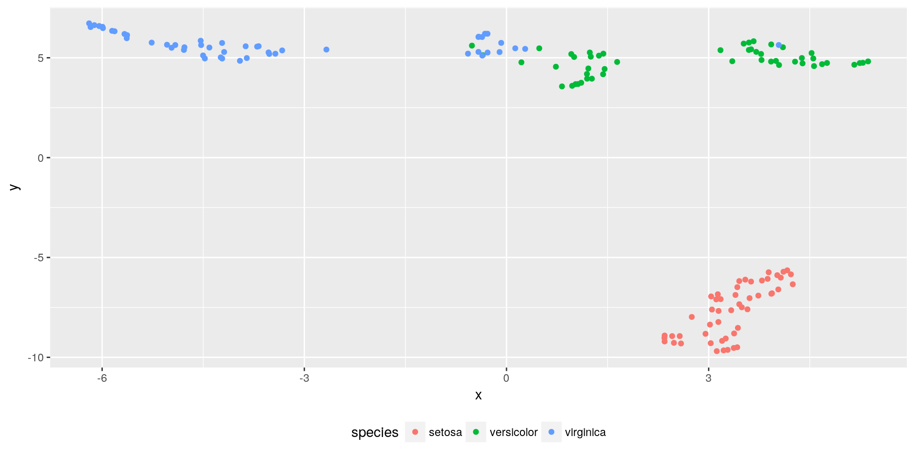
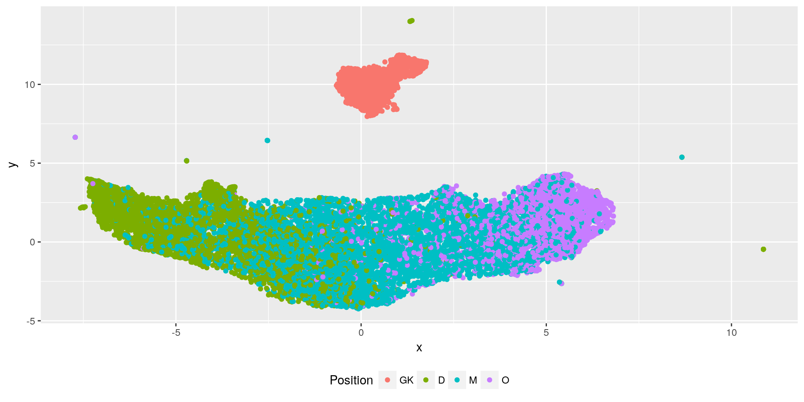

# Using UMAP in R with rPython

*This post was semi automatically converted from blogdown to Quarto and may contain errors. The original can be found in the [archive](http://archive.schochastics.net/post/using-umap-in-r-with-rpython/).*


I wrote about [dimensionality reduction
methods](http://blog.schochastics.net/post/dimensionality-reduction-methods/)
before and now, there seems to be a new rising star in that field,
namely the *Uniform Manifold Approximation and Projection*, short UMAP.
The paper can be found [here](https://arxiv.org/abs/1802.03426), but be
warned: It is really math-heavy. From the abstract:

> UMAP is constructed from a theoretical framework based in Riemannian
> geometry and algebraic topology. The result is a practical scalable
> algorithm that applies to real world data. The UMAP algorithm is
> competitive with t-SNE for visualization quality, and arguably
> preserves more of the global structure with superior run time
> performance.

This sounds promising, although the details are not so easy to
comprehend.

There is already an implementation for python from the authors on
[github](https://github.com/lmcinnes/umap) and I am pretty sure that
there will be an R package fairly soon. But for the time being, we can
use the Python version with the help of the `rPython` package.

``` r
#used packages
library(tidyverse)  # for data wrangling
```

# UMAP in R with rPython

To use the Python version of UMAP in R, you first need to install it
from [github](https://github.com/lmcinnes/umap). The following code
defines a function, which internally calls the `UMAP` Python
function[¹](#fn1).

``` r
#install.packages(rPython)
umap <- function(x,n_neighbors=10,min_dist=0.1,metric="euclidean"){
  x <- as.matrix(x)
  colnames(x) <- NULL
  rPython::python.exec( c( "def umap(data,n,mdist,metric):",
                  "\timport umap" ,
                  "\timport numpy",
                  "\tembedding = umap.UMAP(n_neighbors=n,min_dist=mdist,metric=metric).fit_transform(data)",
                  "\tres = embedding.tolist()",
                  "\treturn res"))

  res <- rPython::python.call( "umap", x,n_neighbors,min_dist,metric)
  do.call("rbind",res)
}
```

The parameters are set to what is recommended by the authors. There are
many different distance metrics implemented in the Python version that
can also be used in this R function. Check out the [Python
code](https://github.com/lmcinnes/umap/blob/master/umap/distances.py)
for options.

Below is a quick example using the infamous iris data.

``` r
data(iris)
res <- umap(iris[,1:4])
tibble(x = res[,1],y = res[,2],species = iris$Species) %>% 
  ggplot(aes(x = x,y = y,col = species))+
  geom_point()+
  theme(legend.position = "bottom")
```



In my [last
post](http://blog.schochastics.net/post/dimensionality-reduction-methods/)
on dimensionality reduction methods, I used FIFA 18 player data to
illustrate different methods. Of course we can also use this data with
UMAP.

``` r
fifa_umap <- umap(fifa_data)
```

Here is what the result looks like.

``` r
tibble(x = fifa_umap[,1], y = fifa_umap[,2], Position = fifa_tbl$position2) %>% 
  ggplot(aes(x = x,y = y, col = Position))+
  geom_point()+
  theme(legend.position = "bottom")
```



One of the authors said in a
[tweeet](https://twitter.com/leland_mcinnes/status/963390662652637184),
that inter-cluster distances are captured well by UMAP. For the FIFA
player data this seems to be the case. The sausage-like point cloud
transitions from defensive players to offensive players on the x axis.
Midfielders are nicely embedded in between. I am pretty sure, however,
that tweaking the parameters may yield even better results.

------------------------------------------------------------------------

1.  The function can also be found on github as a
    [gist](https://gist.github.com/schochastics/2f83532f04729321b06822fbaa98f3ab).[↩︎](#fnref1)

