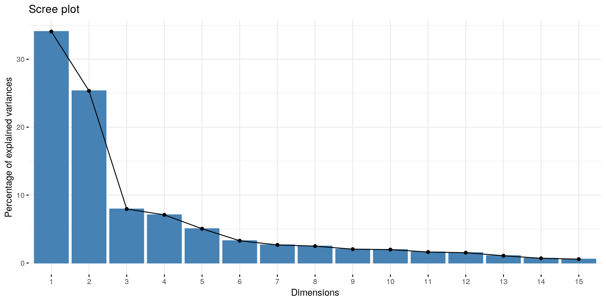
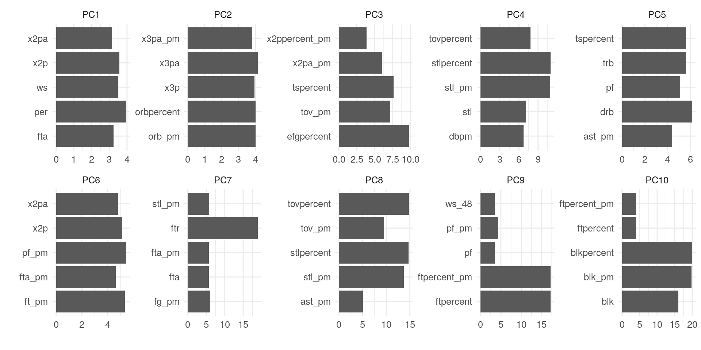
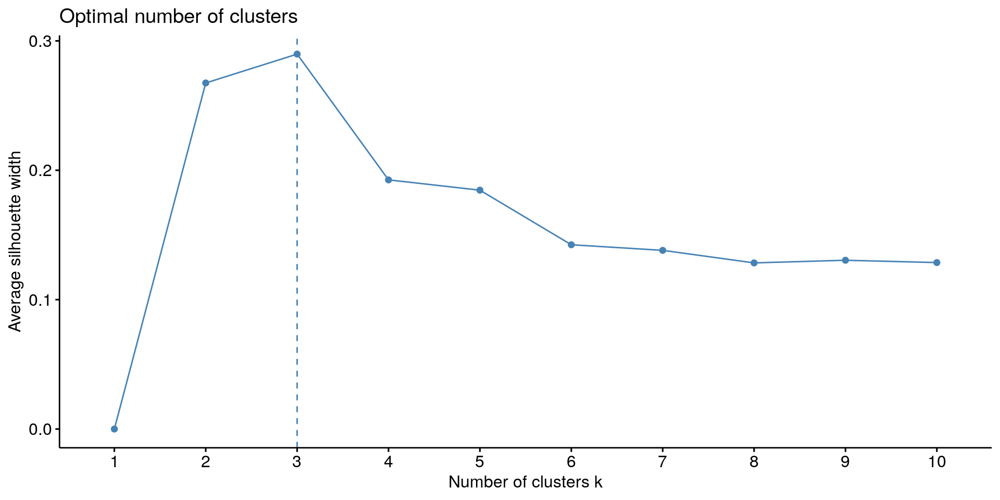
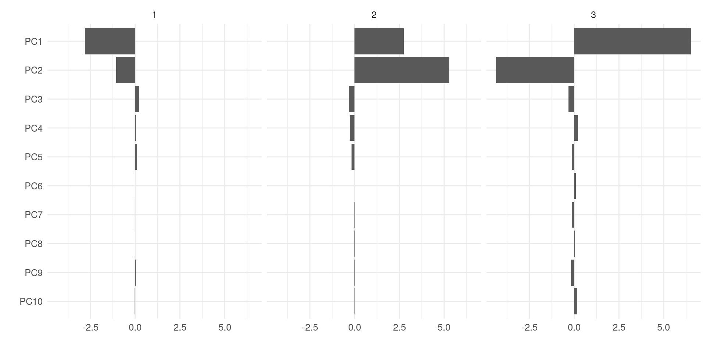

*This post was semi automatically converted from blogdown to Quarto and may contain errors. The original can be found in the [archive](http://archive.schochastics.net/post/analyzing-nba-player-data-ii-clustering/).*

This is the second post of my little series *Analyzing NBA player data*.
The [first
part](http://blog.schochastics.net/post/analyzing-nba-player-data-i-getting-data/)
was concerned with scraping and cleaning player statistics from any NBA
season. This post is dealing with gaining some inside in the player
stats. In particular, clustering players according to their stats to
produce a new set of player positions.

``` r
#used libraries
library(tidyverse) # for data wrangling
library(rvest)     # for web scraping
library(janitor)   # for data cleaning
library(factoextra)  # for pca and cluster visuals

theme_set(theme_minimal()+
            theme(legend.position = "bottom",
                  text=element_text(size = 12)))
```

# Building Player Stats Data

Using the function `scrape_stats()` developed in the previous post, we
start by building a data frame of player stats from the last two seasons
to have a big enough sample for our analysis. We can use the `map_dfr()`
function from the `purrr` package for this purpose. The function applies
the given function to all arguments and binds the result rowwise in a
data frame. It is essentially the same as
`do.call("rbind",lapply(2016:2017,scrape_stats))`

``` r
player_stats <- map_dfr(2016:2017,scrape_stats)
```

The next step will be to reduce the noise of the data by considering
only players that played more than 500 minutes in a season.

``` r
player_stats <- player_stats %>% 
  dplyr::filter(mp>=500)
```

This leaves us with 705 rows to analyze.

# Clustering Player Data or: Revolutionizing Player Positions

Yes that second title sounds rather pretentious. However, clustering has
been used before to define new set of positions which (could/should)
supersede the traditional point guard (PG), shooting guard (SG), small
forward (SF), power forward (PF), and center (C)
([1](https://fastbreakdata.com/classifying-the-modern-nba-player-with-machine-learning-539da03bb824),
[2](https://medium.com/hanman/the-evolution-of-nba-player-positions-using-unsupervised-clustering-to-uncover-functional-roles-a1d07089935c),
[3](https://danvatterott.com/blog/2016/02/21/grouping-nba-players/)).
There are even two contributions at the SLOAN Conference (a big sports
analytics conference) on that topic
([1](http://www.sloansportsconference.com/wp-content/uploads/2012/02/44-Lutz_cluster_analysis_NBA.pdf),
[2](http://www.sloansportsconference.com/content/the-13-nba-positions-using-topology-to-identify-the-different-types-of-players/)).
I will deal with the second one in the third part of this series.

The idea behind using clustering is to find sets of players that have a
similar skill set. As the sources from above all note, the traditional
five positions oversimplify the skill sets of NBA players and putting
players into one of the five positions does not seem to accurately
define a player’s specific skill set. Defining new positions by means of
similar skills may thus *revolutionize modern Basketball* (Well, at
least on a highly theoretical level).

To obtain our very own set of new positions, we will go through the
following steps:

-   Reduce the dimensionality of the data
-   Decide on number of clusters
-   Cluster the low-dimensional data

## Reduce Dimensionality

The first step is necessary to not get affected by [Curse of
Dimensionality](https://en.wikipedia.org/wiki/Curse_of_dimensionality).
While there are many possibilities to reduce the dimensionality, we will
here stick with a traditional principal component analysis (pca) using
`prcomp()` from the `stats` package.

``` r
pca_nba <- player_stats %>% 
  select(fg:vorp) %>% 
  as.matrix() %>% 
  prcomp(center = TRUE,scale = TRUE,retx = TRUE)

# plot the explained variance per PC  
fviz_eig(pca_nba,ncp = 15)
```



Now we need to decide on how many components to keep. This is a very
subjective matter and there does not seem to be a golden standard rule.
I decided on keeping 10 components which together account for roughly
90% of the variance in the data.

``` r
player_stats_ld <- pca_nba$x[,1:10]
```

Using the `get_pca_var()` function from `factoextra`, we can compute the
stats that contribute the most to our chosen components.

``` r
nba_var <- get_pca_var(pca_nba)
pcs <- nba_var$contrib[,1:10]
colnames(pcs) <- paste0("PC",1:10)

as_tibble(pcs,rownames = "stat") %>%
  gather(pc,contrib,PC1:PC10) %>%
  mutate(pc=factor(pc,levels=paste0("PC",1:10))) %>% 
  group_by(pc) %>% 
  top_n(5,contrib) %>% 
  ggplot(aes(x=stat,y=contrib))+
  geom_col()+
  coord_flip()+
  facet_wrap(~pc,scales = "free",ncol=5)+
  labs(x="",y="")
```



The first two components seem to be related to the scoring skills of
players (2P and 3P). Very clearly determined are also the last two
components, relating to free throws and blocks respectively.

In the next step we will decide on the number of clusters to perform a
kmeans clustering.

## Number of Clusters

Choosing the number of clusters is yet again a very subjective matter.
However, there are some
[guidlines](https://en.wikipedia.org/wiki/Determining_the_number_of_clusters_in_a_data_set)
which may help to settle for an appropriate number. The R package
`Nbclust` for instance implements 30 different indices to determine the
optimal number of clusters. So a brute-force approach would be to
calculate all 30 indices for a range of possible number of clusters and
then decide via majority vote.

While I was very inclined of doing this, I settled for a single measure,
the [silhouette](https://en.wikipedia.org/wiki/Silhouette_(clustering)).
The silhouette value describes how similar a data point is to its own
cluster compared to other clusters. It ranges from −1 to +1, where high
values indicate that data points are well matched to their own cluster
and poorly to other clusters.

To calculate the silhouette value for a range of possible clusters, we
use the `fviz_nbclust()` function from the `factoextra` package.

``` r
fviz_nbclust(player_stats_ld,kmeans,method = "silhouette")
```



So the silhouette value suggest that there are only 3 clusters of
players[¹](#fn1). Now this is kind of a bummer. Why? Well, as in the
other sources, I was hoping to find a larger set of positions than the
traditional ones. Not less!

Of course we could just ignore the suggestion of the silhouette value
and take any number greater than 5 to create our clustering. But we
would not really have a convincing argument for our choice.

## Clustering using kmeans

With the “optimal” number of clusters determined, we can call the
`kmeans()` function to compute the clustering.

``` r
player_clus <- kmeans(player_stats_ld,centers = 3)
```

The following code is used to visualizes the cluster centers

``` r
as_tibble(player_clus$centers) %>% 
  gather(component,value,PC1:PC10) %>% 
  mutate(clust = rep(1:3,10)) %>% 
  ggplot(aes(x=factor(component,levels = paste0("PC",10:1)),y=value))+
  geom_col()+
  coord_flip()+
  facet_wrap(~clust)+
  labs(x="",y="")
```



Interestingly enough, the first two components already seem to determine
the clusters quite well.

So what do we make out of these clusters? Hard to say, since I am also
not that big of an NBA expert. We certainly did not uncover some
revolutionary new set of positions, but only three seemingly boring
groups of players.

The result is absolutely not was I was hoping for when I started to
write the article. But maybe there is still some valuable lesson to
learn here. I tried some obscure things while writing to somehow obtain
a *revolutionary* set of new positions. I had to stop when I realized
that I was falling for the [Texas sharpshooter
fallacy](https://en.wikipedia.org/wiki/Texas_sharpshooter_fallacy) and
[Cherry Picking](https://en.wikipedia.org/wiki/Cherry_picking).

I hope the [third
part](http://blog.schochastics.net/post/analyzing-nba-player-data-iii-similarity-networks/)
of the series will turn out to be a bit more exciting. There, I am going
to look at similarity networks of players.

------------------------------------------------------------------------

1.  Of course I could not resist to use the brute force way. The
    majority vote there also clearly favored 3 as the optimal number of
    clusters.[↩](#fnref1)

