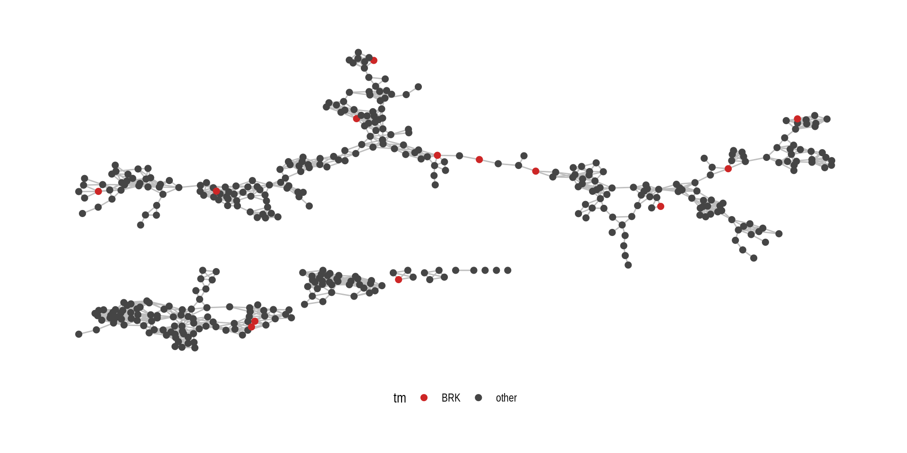

*This post was semi automatically converted from blogdown to Quarto and may contain errors. The original can be found in the [archive](http://archive.schochastics.net/post/analyzing-nba-player-data-iii-similarity-networks/).*

This is the last part of the mini series *Analysing NBA Player data*.
The [first
part](http://blog.schochastics.net/post/analyzing-nba-player-data-i-getting-data/)
was concerned with scraping and cleaning player statistics from any NBA
season. The [second
part](http://blog.schochastics.net/post/analyzing-nba-player-data-ii-clustering/)
showed how to use principal component analysis and k means clustering to
“revolutionize” player positions. Which kind of failed. Anyway, this
third part is now dealing with something a little more advanced, namely
similarity networks of players and what we can learn from them.

``` r
#used libraries
library(tidyverse) # for data wrangling
library(rvest)     # for web scraping
library(janitor)   # for data cleaning
library(igraph)    # for network data structures and tools
library(ggraph)    # for network visualization
```

# What is a similarity network?

If you think of networks, then it is usually individuals interacting in
some way. These relations are most commonly affiliated with positive
connotation (friendship, kinship, etc.) A network can, however, also
consist of positive (being friends) and negative (being enemies)
relationships. We then speak of a [signed
networks](https://en.wikipedia.org/wiki/Signed_graph). Analyzing signed
networks is a bit trickier than analyzing regular networks and involve a
different set of tools. An interesting application for signed networks
is Heider’s [structural balance
theory](https://en.wikipedia.org/wiki/Balance_theory). A third type of
networks are networks that neither have positive nor negative ties, but
where a connection between to nodes signifies some sort of similarity,
equality or indifference. I here refer to them as *similarity networks*
but as far as I know, this is not a standard term since there is little
research on such networks.

In this post, we will construct one example for a similarity network,
namely a similarity network of NBA players. Similarity is based on the
player stats and if two players are connected in the network, then they
can be considered to be of the same player type. I am not the first to
do this. There has been a
[talk](http://www.sloansportsconference.com/wp-content/uploads/2012/03/Alagappan-Muthu-EOSMarch2012PPT.pdf)
at the SLOAN Conference by [Muthu
Alagappan](https://en.wikipedia.org/wiki/Muthu_Alagappan) who seemed to
have done exactly this. I could unfortunately not find out how exactly
he constructed his networks, since he used proprietary software.
According to the
[abstract](http://www.sloansportsconference.com/content/the-13-nba-positions-using-topology-to-identify-the-different-types-of-players/),
though, it yields “revolutionary insight” and “it can add tremendous
value for coaches owners, general managers, and the everyday fan”.

# Constructing an NBA similarity network

Before we begin, we of course need a player stats dataset, which we
obtain with the `scrape_stats()` function developed in the first part.
We will use data from the last season and filter out players that played
less than 150 minutes.

``` r
player_stats <- scrape_stats(season = 2017) %>% 
  dplyr::filter(mp>=150)
```

According to the Wikipedia
[article](https://en.wikipedia.org/wiki/Muthu_Alagappan), Muthu used
some sort of [tpological data
analysis](https://en.wikipedia.org/wiki/Topological_data_analysis) to
derive his similarities between players. So we will do the same. We will
use UMAP, a relatively new method based on [Riemannian
geometry](https://en.wikipedia.org/wiki/Riemannian_geometry). There is
no R package for it yet, but I showed in a [recent
post](http://blog.schochastics.net/post/using-umap-in-r-with-rpython/)
how to use the python implementation in R. TL;DR:
[Install](https://github.com/lmcinnes/umap) the python version and use
`rPython` to create the following function.

``` r
umap <- function(x,n_neighbors=10,n_components=2,min_dist=0.1,metric="euclidean"){
  x <- as.matrix(x)
  colnames(x) <- NULL
  rPython::python.exec( c( "def umap(data,n,d,mdist,metric):",
                           "\timport umap" ,
                           "\timport numpy",
                           "\tembedding = umap.UMAP(n_neighbors=n,n_components=d,min_dist=mdist,metric=metric).fit_transform(data)",
                           "\tres = embedding.tolist()",
                           "\treturn res"))
  
  res <- rPython::python.call( "umap", x,n_neighbors,n_components,min_dist,metric)
  do.call("rbind",res)
}
```

I decided to map the 70 stats into a 10 dimensional space. This “new”
space supposedly preserves the intrinsic distance of the “old” space,
but reduces the noise of the original data so that the differences and
similarities of players become more evident.

``` r
umap_player <- player_stats %>% 
    select(fg:vorp) %>%
    as.matrix() %>% 
    scale() %>% 
    umap(n_components = 10)
```

Now that we have embedded the players in a lower dimensional space, we
calculate the distance among them based on this new space.

``` r
D <- dist(umap_player,diag = TRUE,upper = TRUE) %>% 
  as.matrix()
```

You can think of the distance as an “inverse similarity” The further two
players apart, the less similar they are. Since we are interested only
if players are similar or not, we need to decide on a threshold at which
players are considered to be similar. After a bit of experimenting, I
settled for 0.5 as a reasonable threshold. So pairs of players are
considered to be similar if their distance is below 0.5. So we turn the
distance matrix into a 0/1 matrix which is used to construct a graph
object.

``` r
A <- (D < 0.5) + 0
g <- graph_from_adjacency_matrix(A,"undirected",diag = F)
V(g)$name <- player_stats$player
```

``` r
ggraph(g, layout = "manual", node.positions = layout_igraph_v3(g))+
  geom_edge_link(colour = "grey")+
  geom_node_point(size = 2)+
  theme_graph()
```


The function `layout_igraph_v3()` is not part of `ggraph` but a not yet
available R package `visone3` which provides nicer layouts for networks.
There exists a complete [software tool](http://visone.info/) though
which can be used for free to visualize and analyze networks
(Disclaimer: I know the developers).

If you want to plot the network without the visone package, you can use
any of the layout algorithms of `igraph`.

``` r
ggraph(g, layout = "kk")+
  geom_edge_link(colour = "grey")+
  geom_node_point(size = 2)+
  theme_graph()
```


``` r
V(g)$Position <- player_stats$pos

ggraph(g, layout="manual", node.positions = layout_igraph_v3(g))+
  geom_edge_link(colour = "grey")+
  geom_node_point(aes(color = Position),size = 2)+
  theme_graph()+
  theme(legend.position = "bottom")
```


Interestingly, the positions of players seem to be a strong indicator
for similarity. Almost all centers are very similar, since they form a
component by themselves. You can also find small cohesive groups of
players with the same position within the biggest component.

Of course more interesting is to find where players with special skills
are located. Like the players with the highest scoring per 36 minutes.

``` r
V(g)$pts_pm <- player_stats$pts_pm

ggraph(g, layout="manual", node.positions=layout_igraph_v3(g))+
    geom_edge_link(colour = "grey")+
    geom_node_point(aes(color = pts_pm),size = 2)+
    scale_color_gradient(low="#104E8B", high="#CD2626")+
    theme_graph()+
    theme(legend.position="bottom")
```


Or the players with the most rebounds per 36 minutes.

``` r
V(g)$trb_pm <- player_stats$trb_pm

ggraph(g, layout="manual", node.positions=layout_igraph_v3(g))+
    geom_edge_link(colour = "grey")+
    geom_node_point(aes(color = trb_pm),size = 2)+
    scale_color_gradient(low="#104E8B", high="#CD2626")+
    theme_graph()+
    theme(legend.position="bottom")
```


Players with similar stats seem to neatly cluster together so that any
well connected group of players in the network describes a specific
player type.

We can use this networks now to argue about team performances. Take the
player position of last years NBA champions, the Golden State Warriors

``` r
V(g)$tm <- ifelse(player_stats$tm=="GSW","GSW","other")

ggraph(g, layout="manual", node.positions=layout_igraph_v3(g))+
    geom_edge_link(colour = "grey")+
    geom_node_point(aes(color = tm),size = 2)+
    scale_color_manual(values=c("GSW"="#CD2626","other"="gray27"))+
    theme_graph()+
    theme(legend.position="bottom")
```


and the worst team, the Brooklyn Nets.

``` r
V(g)$tm <- ifelse(player_stats$tm=="BRK","BRK","other")

ggraph(g, layout="manual", node.positions=layout_igraph_v3(g))+
    geom_edge_link(colour = "grey")+
    geom_node_point(aes(color = tm),size = 2)+
    scale_color_manual(values=c("BRK"="#CD2626","other"="gray27"))+
    theme_graph()+
    theme(legend.position="bottom")
```



Most of the Golden State players are embedded in different groups,
indicating that they have a very diverse set of players. The players of
the Brooklyn Nets on the other hand are closer together and do not fall
into specific groups. They seem to lack players with distinct and marked
skills, which may explain there performance.

# A shiny app to analyze NBA similarity networks

If you are interested in different NBA seasons, teams or stats, I have
built a little shiny applications, which allows you to explore
interactive similarity networks back to 1990. You can check the
locations of your favorite players and teams and customize the stats
that should be shown on the network. The code for the app can be found
on [github](https://github.com/schochastics/NBASimNet). To run the app
you need to install the package `visNetwork`, since the networks are
interactive. To run the app locally use
`shiny::runGitHub("schochastics/NBASimNet")`.

