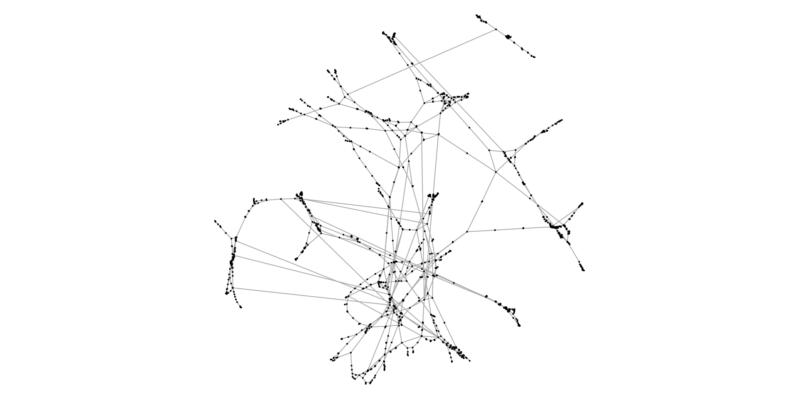
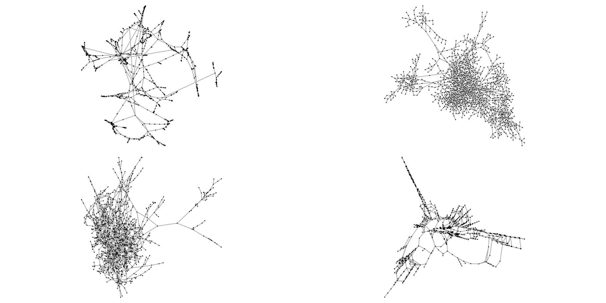
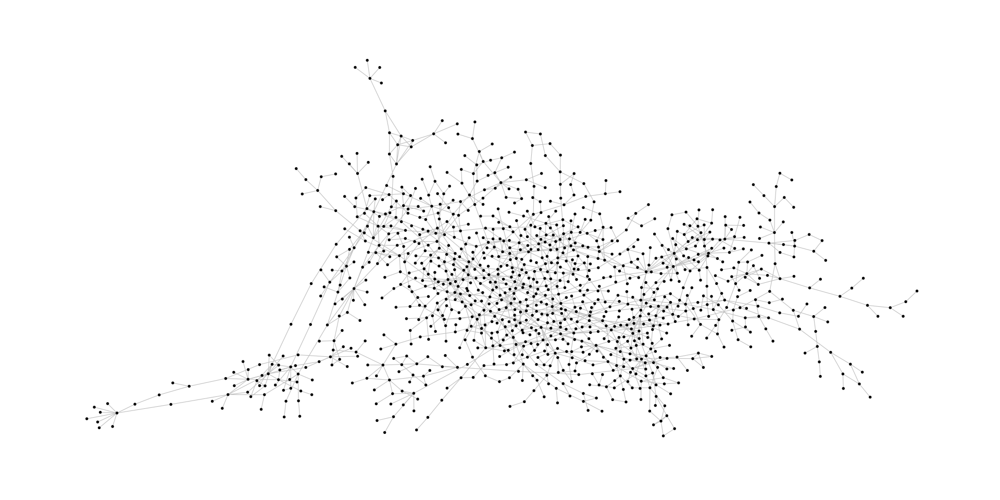
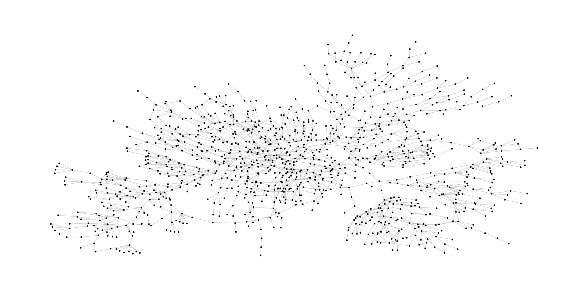
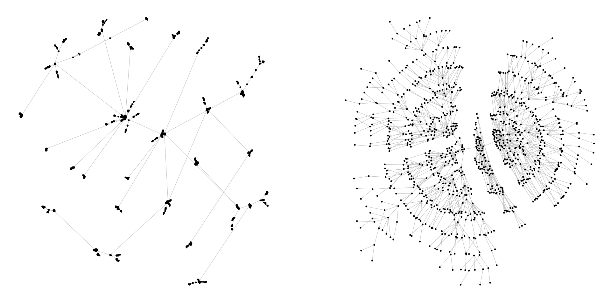
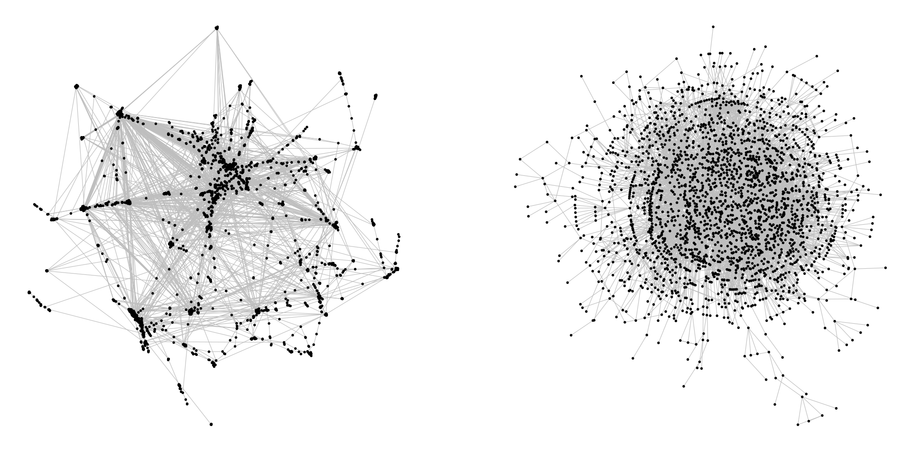

**The package `smglr` was renamed to `graphlayouts`**

*This post was semi automatically converted from blogdown to Quarto and may contain errors. The original can be found in the [archive](http://archive.schochastics.net/post/stress-based-graph-layouts/).*


I academically grew up among graph drawers, that is, computer scientists
and mathematicians interested in deriving two-dimensional depictions of
graphs. One may despicably call it pixel science, yet a lot of hard
theoretical work is put into producing pretty graph layouts. Although I
am not at all an expert in this field, I have learned a thing or two
about that subject. As such, I have always been surprised why one of the
(potentially) best algorithms is not implemented in R. This post is
about my humble try to change this.

*If you read this and say: Hey! there is already a package for that!
please do let me know.*

``` r
#used libraries
library(tidyverse) # for data wrangling
library(igraph)    # for network data structures and tools
library(ggraph)    # for prettier network visualizations
library(igraphdata)    # some network data 
library(patchwork) # combine ggplot objects 
```

# Graph layouts in `igraph`

The R package `igraph` comes with a lot of inbuilt layout algorithms.
Just type `layout_` in Rstudio and you will get overwhelmed by the
possibilities. As a minor side note: If you ever struggle with anything
in igraph, consult the excellent tutorial from [Katherine
Ognyanova](http://kateto.net/networks-r-igraph).

I usually have mixed feelings about using R to draw my networks and
mostly resort to dedicated software such as
[visone](https://visone.info/). Mostly, because I feel that the
algorithms in igraph tend to not be nice, even with the
`layout_nicely()` function.

Consider a typical benchmark graph for graph drawing, which can be
downloaded [here](http://networkrepository.com/power-1138-bus.php).

``` r
el <- read_delim("power-1138-bus.mtx",delim=" ",col_names = F)
g <- graph_from_data_frame(el,directed=F)
g <- igraph::simplify(g)
```

Let’s see what `igraph` thinks a nice layout looks like.

``` r
par(mar=c(0,0,0,0))
plot(g,layout=layout_nicely,vertex.size=0.5,vertex.label=NA)
```



I know, “beauty lies in the eyes of the beholder”, but I personally do
not think that this is particularly nice. Below, you see a collection of
layouts, produced by different algorithms.

``` r
par(mfrow=c(2,2),mar=c(0,0,0,0))

plot(g,layout=layout_with_drl,vertex.size=0.5,vertex.label=NA)
plot(g,layout=layout_with_lgl,vertex.size=0.5,vertex.label=NA)
plot(g,layout=layout_with_fr,vertex.size=0.5,vertex.label=NA)
plot(g,layout=layout_with_mds,vertex.size=0.5,vertex.label=NA)
```



Notice the big differences. Personally, I would prefer the
`layout_with_lgl` (top right). Below is a bigger version drawn with
`ggraph`.

``` r
ggraph(g,layout="lgl")+
  geom_edge_link(width=0.2,colour="grey")+
  geom_node_point(col="black",size=0.3)+
  theme_graph()
```



You will notice that this layout looks different than above. This is due
to the fact, that the algorithm underlying `layout_with_lgl` is
non-deterministic, meaning that it produces different pictures in
consecutive runs. In fact, most of the other layout algorithm have this
(annoying?) feature. More than once I have found myself layouting the
network over and over again until I was satisfied.

# Stress majorization

The first thing I learned from my graph drawing peers was to minimize
stress. Not necessarily in the sense of work (which doesn’t work anyway
while being a PhD student), but for graph layouting. *Stress
majorization* is actually an optimization strategy used in
multidimensional scaling where the goal is to minimize the so-called
stress function defined as σ(X)=∑i\<jwij(δij−dij)2,
$$\\sigma(X) = \\sum\\limits\_{i \< j}w\_{ij}(\\delta\_{ij} - d\_{ij})^{2},$$
*σ*(*X*) = ∑_(*i* \< *j*)*w*_(*i**j*)(*δ*_(*i**j*)−*d*_(*i**j*))²,
where wij≥0*w*_(*i**j*) ≥ 0*w*_(*i**j*) ≥ 0 is a weight between a pair
of points (i,j)(*i*,*j*)(*i*,*j*) , dij*d*_(*i**j*)*d*_(*i**j*) is the
geodesic distance between i*i**i* and j*j**j* and
δij*δ*_(*i**j*)*δ*_(*i**j*) is the euclidean distance of coordinates
Xi*X*_(*i*)*X*_(*i*) and Xj*X*_(*j*)*X*_(*j*). By minimizing stress, we
thus seek to find cartesian coordinates for each node so that the
euclidean distance is as close as possible to the geodesic distance. If
you are interested in more technical details, please see the original
contribution by [Gansner et
al.](https://graphviz.gitlab.io/_pages/Documentation/GKN04.pdf).

# Implementation with `Rcpp` and the `smglr` package

I implemented stress majorization with `Rcpp`. While the code is not
that involved, it still is a bit lengthy. I created a very rudimentary R
package containing the stress majorization graph layout algorithm, which
is available via github.

``` r
# devtools::install_github("schochastics/smglr")
library(smglr)
```

So what does our benchmark network look like using stress majorization?

``` r
l <- stress_majorization(g)

ggraph(g,layout="manual",node.positions=data.frame(x=l[,1],y=l[,2]))+
  geom_edge_link(width=0.2,colour="grey")+
  geom_node_point(col="black",size=0.3)+
  theme_graph()
```



In my opinion, this looks definitely better than any of the layouts
before.

# More examples

Here are two more examples to convince you of stress based layouts
(always the right one).

``` r
# preferential attachment
pa <- sample_pa(1000,1,1,directed = F)

ggraph(pa)+
  geom_edge_link(width=0.2,colour="grey")+
  geom_node_point(col="black",size=0.3)+
  theme_graph() -> p1


l <- stress_majorization(pa)
ggraph(pa,layout="manual",node.positions=data.frame(x=l[,1],y=l[,2]))+
  geom_edge_link(width=0.2,colour="grey")+
  geom_node_point(col="black",size=0.3)+
  theme_graph()-> p2

p1+p2
```



``` r
# yeast protein interactions from igraphdata (only biggest component)
data(yeast)
comps <- components(yeast)
bcomp <- which.max(comps$csize)
yeast <- induced_subgraph(yeast,comps$membership==bcomp)

ggraph(yeast)+
  geom_edge_link(width=0.2,colour="grey")+
  geom_node_point(col="black",size=0.3)+
  theme_graph() -> p1


l <- stress_majorization(yeast)
ggraph(yeast,layout="manual",node.positions=data.frame(x=l[,1],y=l[,2]))+
  geom_edge_link(width=0.2,colour="grey")+
  geom_node_point(col="black",size=0.3)+
  theme_graph()-> p2

p1+p2
```



# Caveats

Stress majorization produces nice layouts, is deterministic and easy to
implement. The downside is, that it is rather slow for large networks (I
also partially blame my implementation for that). But there is also a
way out of that problem. Former colleagues of mine published a [sparse
stress model](https://arxiv.org/pdf/1608.08909.pdf) which allows stress
based layouting for really large graphs. The java code can be found on
[github](https://github.com/MarkOrtmann/sparse-stress). Also, keep an
eye out for an R package called `visone3` which will, among other
things, also allow for stress based layouts.

