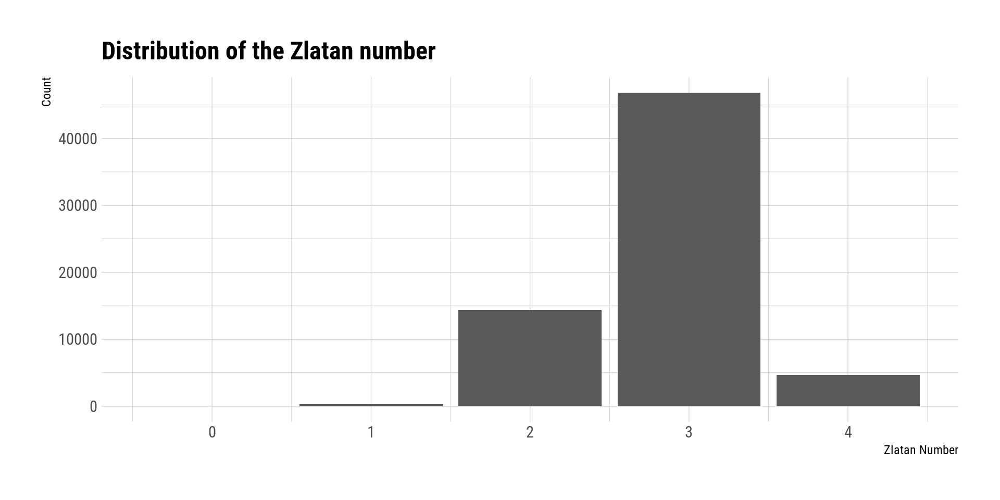

# Six Degrees of Zlatan Ibrahimovic

*This post was semi automatically converted from blogdown to Quarto and may contain errors. The original can be found in the [archive](http://archive.schochastics.net/post/six-degrees-of-zlatan-ibrahimovic/).*


This post is based on the [Six Degrees of Kevin
Bacon](https://en.wikipedia.org/wiki/Six_Degrees_of_Kevin_Bacon) which
itself is an adoption of the [Erdős
number](https://en.wikipedia.org/wiki/Erd%C5%91s_number) in math.
Readers familiar with the concepts can skip the following paragraph and
go directly to the calculation of the Zlatan number.

*I have done this before on my [old
blog](http://mildlyscientific.schochastics.net/2016/02/11/six-degrees-of-zlatan-ibrahimovic/),
but I felt like redoing the analysis.*

# What is an Erdős or Bacon number?

Paul Erdős wrote an incredible amount of scientific papers (around 1500)
with around 500 collaborators. Due to his prolific output, the Erdős
Number was created. An Erdős number describes a person’s degree of
separation from Erdős himself, based on their collaboration with him, or
with collaborators of Erdős. Erdős is the only one with an Erdős number
of zero, while his immediate collaborators have an Erdős number of one,
their collaborators have Erdős number at most two.

The concept of the Bacon number is basically the same. Similar to Erdős,
Kevin Bacon has quite a prolific screen career such that many actors can
be linked by co-occurrences to Kevin Bacon. Kevin Bacon is the only one
with a Bacon number of 0. Actors occurring in a movie with Bacon have a
Bacon number of 1 and so on.

The numbers can also be aggregated to form the [Erdős-Bacon
number](https://en.wikipedia.org/wiki/Erd%C5%91s%E2%80%93Bacon_number).
To obtain an Erdős-Bacon number, you either have to be an acting
scientist or an actor who wrote a scientific paper. According to
Wikipedia the smallest existing sum of both numbers is three[¹](#fn1).

The [Erdős-Bacon-Sabbath number](http://timeblimp.com/?page_id=195)
seems to be the craziest extension of this number game. Natalie Portman,
for example, has an Erdős-Bacon-Sabbath number of 11.

# The Zlatan Number

Zlatan’s career stats are impressive. He has played for most top tier
clubs in Europe. As such, who else than him would qualify as the Erdös
or Bacon of football?

I scraped all available squads from top tier clubs since 2001 from
[footballsquads](http://www.footballsquads.co.uk/)[²](#fn2). If you are
interested in the R code, I will gladly provide it.

The data we are working with looks as follows.

``` hljs
## Observations: 208,774
## Variables: 8
## $ unique_player <chr> "Martin Bernachia_10-03-77", "Ruben Cordoba_06-0...
## $ name          <chr> "Martin Bernachia", "Ruben Cordoba", "Silvio Dua...
## $ pos           <chr> "G", "D", "D", "D", "M", "D", "M", "M", "F", "M"...
## $ date_of_birth <chr> "10-03-77", "06-05-72", "08-06-78", "12-09-75", ...
## $ unique_club   <chr> "almagro_2004-2005_arg", "almagro_2004-2005_arg"...
## $ club          <chr> "almagro", "almagro", "almagro", "almagro", "alm...
## $ season        <chr> "2004-2005", "2004-2005", "2004-2005", "2004-200...
## $ country       <chr> "arg", "arg", "arg", "arg", "arg", "arg", "arg",...
```

The columns `unique_player` and `unique_club` were created to separate
players with the same name[³](#fn3) and distinguish between squads of
clubs for different seasons.

From this data frame, we create a bipartite graph. The set of nodes
contains all unique players and all unique clubs. A player and a club
are linked, if the player was in the squad in the given season.

``` r
nodes <- tibble(name=c(df$unique_player,df$unique_club),
                type=rep(c(T,F),each=nrow(df))) %>% distinct() 

#bipartite network
g <- graph_from_data_frame(select(df,unique_player,unique_club),
                           directed=F,vertices=nodes)

#bipartite projection on players
pl <- bipartite_projection(g,which="true",multiplicity = F)

#get biggest component of graph
comps <- components(pl)
pl <- induced_subgraph(pl,comps$membership==1)
```

The graph `pl` now contains only the unique players and two players are
connected, if they ever played at the same club. In order to compute the
Zlatan Number, we need to compute the (geodesic) distances in the graph.
Very briefly, if A is connected to B and B to C, but A not to C, then A
and C are at distance two of each other. The distance can be directly
translated into the Zlatan number. All players directly connected with
him have a Zlatan number of one. Players at distance two (thus Zlatan
number of two) have played with someone, who played with Zlatan, and so
on.

``` r
zlatan <- which(V(pl)$name=="Zlatan Ibrahimovic_03-10-81")
zlatan_number <- distances(pl,zlatan)
```

Let’s look at the distribution.

``` r
tibble(zlatan_no=c(unname(zlatan_number))) %>%
  ggplot(aes(x=zlatan_no))+geom_bar()+
  hrbrthemes::theme_ipsum_rc()+
  labs(x="Zlatan Number",y="Count",title="Distribution of the Zlatan number")
```



Needless to say, there is only one player with a Zlatan number of zero.
Noone is like Zlatan!


328 players had the honor to play with Zlatan for the same team. The
maximum observed Zlatan number is 4 for 4624 players. The vast majority
(46791) of players have a Zlatan number of 3. The mean Zlatan number is
2.84. So we might well call it the *Three Degrees of Zlatan*.

------------------------------------------------------------------------

1.  Mathematician [Daniel
    Kleitman](https://en.wikipedia.org/wiki/Daniel_Kleitman)[↩](#fnref1)

2.  “Source of Material is
    [http://www.footballsquads.com](http://www.footballsquads.com/).
    Material: © FootballSquads.com, 1999 - 2018, All Rights
    Reserved”[↩](#fnref2)

3.  I hope there are no to players with the same name AND
    birthday

