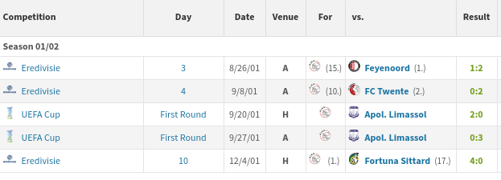

# Analyzing the Greatest Strikers in Football I: Getting Data

*This post was semi automatically converted from blogdown to Quarto and may contain errors. The original can be found in the [archive](http://archive.schochastics.net/post/analyzing-the-greatest-strikers-in-football-i-getting-data/).*


I do not always come up with new ideas for my blog, but rather get
inspired by the great work of others. In this case, it was a [reddit
post](https://www.reddit.com/r/soccer/comments/72qw7k/charting_world_footballs_greatest_goal_scorers_oc/)
by u/Cheapo_Sam, who charted world footballs greatest goal scorers in a
marvelous way. According to the post, the data was gathered manually
which I thought is too tedious (Ain’t nobody got time for that!). So I
decided to automatize this step.

*This post exclusively deals with acquisition and cleaning of the data.
The next
([one](http://blog.schochastics.net/post/analyzing-the-greatest-strikers-in-football-i-getting-data/(http://blog.schochastics.net/post/analyzing-the-greatest-strikers-in-football-ii-visualizing-data/))
or two) posts will handle the analysis.*

``` r
library(tidyverse)  # for data wrangling
library(rvest)      # for web scraping
library(lubridate)  # for date formats 
```

As a data source, I found
[transfermarkt.co.uk](https://www.transfermarkt.co.uk/zlatan-ibrahimovic/alletore/spieler/3455/saison//verein/0/liga/0/wettbewerb//pos/0/trainer_id/0/minute/0/torart/0/plus/1)
to be a good place. It has very detailed records of goals scored by
players, dating back to the 1960’s. As an example, we will get the data
of [Zlatan
Ibrahimovic](http://blog.schochastics.net/post/six-degrees-of-zlatan-ibrahimovic/).

``` r
url <- "https://www.transfermarkt.co.uk/zlatan-ibrahimovic/alletore/spieler/3455/saison//verein/0/liga/0/wettbewerb//pos/0/trainer_id/0/minute/0/torart/0/plus/1"

web <- read_html(url)
doc <- html_table(web, fill = TRUE)
```

The URL contains a very detailed table of all goals scored by Zlatan.
`read_html()` reads the html content of the page and `html_table()` puts
all html tables into a list of data frames. The `fill = TRUE` is
necessary, since there are some empty cells in columns. Note that there
are several tables on the page. The second one is what we want.

``` r
tab <- doc[[2]]
glimpse(tab)
```

``` hljs
## Observations: 444
## Variables: 18
## $ Competition     <chr> "Season 01/02", "", "", "", "", "", "", "", ""...
## $ Competition     <chr> "Season 01/02", "Eredivisie", "Eredivisie", "U...
## $ Day             <chr> "Season 01/02", "3", "4", "First Round", "Firs...
## $ Date            <chr> "Season 01/02", "8/26/01", "9/8/01", "9/20/01"...
## $ Venue           <chr> "Season 01/02", "A", "A", "H", "A", "H", "", "...
## $ For             <chr> "Season 01/02", "", "", "", "", "", "", "", ""...
## $ For             <chr> "Season 01/02", "(15.)", "(10.)", "", "", "(1....
## $ vs.             <chr> "Season 01/02", "", "", "", "", "", "", "", ""...
## $ vs.             <chr> "Season 01/02", "Feyenoord  (1.)", "FC Twente ...
## $ Result          <chr> "Season 01/02", "1:2", "0:2", "2:0", "0:3", "4...
## $ Pos.            <chr> "Season 01/02", "", "", "CF", "CF", "", "", ""...
## $ Minute          <chr> "Season 01/02", "64'", "19'", "4'", "64'", "68...
## $ `At this point` <chr> "Season 01/02", "0:1", "0:1", "1:0", "0:2", "3...
## $ `Type of goal`  <chr> "Season 01/02", "Tap-in", "", "", "Header", ""...
## $ Provider        <chr> "Season 01/02", "Hatem Trabelsi", "", "Nikolao...
## $ `NA`            <chr> "Season 01/02", NA, NA, NA, NA, NA, NA, NA, NA...
## $ `NA`            <chr> "Season 01/02", NA, NA, NA, NA, NA, NA, NA, NA...
## $ `NA`            <chr> "Season 01/02", NA, NA, NA, NA, NA, NA, NA, NA...
```

The table is rather ~~Messi~~ messy, so we need to do some serious
cleaning. We start by extracting the columns we want and give them
better names.

``` r
tab <- tab[,c(2,3,4,5,9,12,13,14,15)] 
names(tab) <- c("competition","day","date","venue",
                "against","minute","standing","type","provider")
glimpse(tab)
```

``` hljs
## Observations: 444
## Variables: 9
## $ competition <chr> "Season 01/02", "Eredivisie", "Eredivisie", "UEFA ...
## $ day         <chr> "Season 01/02", "3", "4", "First Round", "First Ro...
## $ date        <chr> "Season 01/02", "8/26/01", "9/8/01", "9/20/01", "9...
## $ venue       <chr> "Season 01/02", "A", "A", "H", "A", "H", "", "A", ...
## $ against     <chr> "Season 01/02", "Feyenoord  (1.)", "FC Twente  (2....
## $ minute      <chr> "Season 01/02", "64'", "19'", "4'", "64'", "68'", ...
## $ standing    <chr> "Season 01/02", "0:1", "0:1", "1:0", "0:2", "3:0",...
## $ type        <chr> "Season 01/02", "Tap-in", "", "", "Header", "", "T...
## $ provider    <chr> "Season 01/02", "Hatem Trabelsi", "", "Nikolaos Ma...
```

Next we deal with the actual data. Notice that the first row only
contains the entry “Season 01/02”. This row occurs at the beginning of
each season, so we need to delete these rows. The `against` columns
contains some additional information (the current position), which we do
not need. We remove these using a “simple” regex (if such a thing really
exists…). Finally, we turn the `minute` column into a numeric value.

``` r
tab <- tab[!grepl("Season",tab$venue),]
tab$against <- str_trim(str_remove_all(tab$against,"\\(.*\\)"))
tab$minute <- readr::parse_number(tab$minute)
glimpse(tab)
```

``` hljs
## Observations: 427
## Variables: 9
## $ competition <chr> "Eredivisie", "Eredivisie", "UEFA Cup", "UEFA Cup"...
## $ day         <chr> "3", "4", "First Round", "First Round", "10", "", ...
## $ date        <chr> "8/26/01", "9/8/01", "9/20/01", "9/27/01", "12/4/0...
## $ venue       <chr> "A", "A", "H", "A", "H", "", "A", "A", "A", "H", "...
## $ against     <chr> "Feyenoord", "FC Twente", "Apol. Limassol", "Apol....
## $ minute      <dbl> 64, 19, 4, 64, 68, 79, 68, 78, 95, 47, 11, 34, 58,...
## $ standing    <chr> "0:1", "0:1", "1:0", "0:2", "3:0", "4:0", "1:1", "...
## $ type        <chr> "Tap-in", "", "", "Header", "", "Tap-in", "", "", ...
## $ provider    <chr> "Hatem Trabelsi", "", "Nikolaos Machlas", "Wambert...
```

I just recently stumbled upon the `readr::parse_number()` function and
really like it. Note though that we lose some information.

``` r
readr::parse_number("90'+4")
```

``` hljs
## [1] 90
```

So, goals scored in stoppage time will count towards the 90th minute.

Yet another problem is that we are actually missing an important piece
of information in the data frame. The club Zlatan was scoring for. Look
at how the information is given on transfermarkt.



The club is only given as an image. `html_table()` only reads text, so
it misses that information and returns an empty string (see the `For`
column in the first code chunk). We need to get this information
independently. While we are at it, we also get the link to the club
crests.

``` r
club <- web %>%
    html_nodes(xpath = "//td/a/img") %>%
    html_attr("alt")
club <- club[seq(1,length(club),2)]

club_crest <- web %>%
  html_nodes(xpath = "//td/a/img") %>%
  html_attr("src")
club_crest <- club_crest[seq(1,length(club_crest),2)]
```

So what is happening here? `html_nodes()` looks for all table cells
(`td`) which have a link (`a`) and within the link an image (`img`). The
name of the club is stored as the `alt` attribute of the image, which we
grab with `html_attr()`. The problem is, that the `vs.` column above
also contains the same structure. Since the table is read rowwise, we
can skip every other entry in the club vector. The same principle can be
used for the crests, yet here we need the `src` attribute which points
to the image file.

You may have noticed some empty entries in several columns. We can’t do
anything about the missing entries in the `provider` and `type` column,
since this information is, in fact, missing. If you look at the actual
webpage, you notice that if the player scores two or more goals in a
game all information is omitted in that row. We can get that information
simply by copying it from the row above. We do the same with the club
(and crest) vector, though here we use the `append()` function which
basically duplicates the (i−1)(*i*−1)(*i*−1)th entry.

``` r
for(i in 1:nrow(tab)){
  if(tab$competition[i]==""){
    tab$competition[i]=tab$competition[i-1]
    tab$date[i]=tab$date[i-1]
    tab$day[i]=tab$day[i-1]
    tab$venue[i]=tab$venue[i-1]
    tab$against[i]=tab$against[i-1]
    club <- append(club,club[i-1],after = i-1)
    club_crest <- append(club_crest,club_crest[i-1],after = i-1)
  }
}
```

We can also delete the last row of the data frame because it only
contains the totals. Further, we can transform the `date` column to an
actual date and append the club and crest vector to the data.

``` r
tab <- tab[-nrow(tab),]
tab$date <- as.Date(tab$date,format = "%m/%d/%y")
tab$club <- club
tab$club_crest <- club_crest

idx <- (lubridate::year(tab$date)>2020)+0
tab$date <- tab$date-lubridate::years(idx*100)
```

You may wonder about the last two rows. This is a dirty hack to get
around the following issue.

``` r
as.Date("10/02/65",format = "%m/%d/%y")
```

``` hljs
## [1] "2065-10-02"
```

transfermarkt displays the year with two digits. So as soon as we get
the data from a player who was active before 1970, we run into this
problem ([relevant xkcd](https://xkcd.com/376/)).

We finish the data cleaning process by adding and tweaking some
variables. First, we create a column that has the current goal count,
which is just the row number. Second, the crest we saved is too tiny to
use. Luckily, by altering the link a bit, we get a bigger version.
Third, we turn the club variable into a factor, which is ordered by the
players career trajectory.

``` r
# add a goal count column
tab <- tab %>% mutate(goals=row_number())

# get bigger crests
tab$club_crest <- tab$club_crest %>% 
  str_remove("_.*") %>%
  paste0(".png") %>% 
  str_replace("tiny","head")

#convert club to factor
tab$club <- factor(tab$club,levels = unique(tab$club))
```

``` r
glimpse(tab)
```

``` hljs
## Observations: 426
## Variables: 12
## $ competition <chr> "Eredivisie", "Eredivisie", "UEFA Cup", "UEFA Cup"...
## $ day         <chr> "3", "4", "First Round", "First Round", "10", "10"...
## $ date        <date> 2001-08-26, 2001-09-08, 2001-09-20, 2001-09-27, 2...
## $ venue       <chr> "A", "A", "H", "A", "H", "H", "A", "A", "A", "H", ...
## $ against     <chr> "Feyenoord", "FC Twente", "Apol. Limassol", "Apol....
## $ minute      <dbl> 64, 19, 4, 64, 68, 79, 68, 78, 95, 47, 11, 34, 58,...
## $ standing    <chr> "0:1", "0:1", "1:0", "0:2", "3:0", "4:0", "1:1", "...
## $ type        <chr> "Tap-in", "", "", "Header", "", "Tap-in", "", "", ...
## $ provider    <chr> "Hatem Trabelsi", "", "Nikolaos Machlas", "Wambert...
## $ club        <fct> Ajax Amsterdam, Ajax Amsterdam, Ajax Amsterdam, Aj...
## $ club_crest  <chr> "https://tmssl.akamaized.net//images/wappen/head/6...
## $ goals       <int> 1, 2, 3, 4, 5, 6, 7, 8, 9, 10, 11, 12, 13, 14, 15,...
```

That’s it! We now have a clean data frame of all goals scored by Zlatan
Ibrahimovic with a lot of detailed information.

You can wrap all the steps above into a funtion to easily get the data
of other players. The skeleton is shown below.

``` r
get_goals <- function(player = "",id = ""){
  url <- paste0("https://www.transfermarkt.co.uk/",player,"/alletore/spieler/",id,"/saison//verein/0/liga/0/wettbewerb//pos/0/trainer_id/0/minute/0/torart/0/plus/1")
  web <- read_html(url)
  #extract and clean data
  return(tab)
}
```

All you need to do is navigate to the page of the player you want and
get the player name and id of the link. Lionel Messi, for example, would
be `player = "lionel-messi"` and `id = "28003"`.

You may also consider to grab some additional data. For instance, the
players birthday. The birthday is good to have when we want to calculate
the age of the player at any given goal scored.

``` r
birthdate <- html_node(web,".dataDaten .dataValue") %>% 
  html_text(birthdate) %>% 
  str_squish() %>% 
  as.Date(format="%b %d, %Y")
```

This is where you need some basic knowledge about css again. If you look
at the html code of the webpage, you will find the birthdate being
located in a `<div class="dataDaten>` and a `<span class="dataValue">`.
The `html_node()` in conjunction with `html_text()` allows us to extract
the birthday as plain text by navigating along these css classes. The
`str_squish()` eliminates all the excessive whitespace.

This allows us now to add yet another column to the data frame which
holds the exact age of Zlatan for each goal.

``` r
tab$age  <- time_length(difftime(tab$date,birthdate),"years")
```

In a similar manner, you can get the clear name of the player and a link
to his profile picture.

``` r
  player <- html_node(web,"h1") %>% html_text()
  portrait <- html_node(web,".dataBild img") %>% html_attr("src")
```

You can also put these three variables into the function and return
everything as a list. The complete code for the function `get_goals()`
is given at the bottom.

In the next post, we will use this data to explore the career goals of
(not only!) Zlatan and create some visualizations of the data.

# Code

``` r
get_goals <- function(player="zlatan-ibrahimovic",id="3455"){
  url <- paste0("https://www.transfermarkt.co.uk/",player,"/alletore/spieler/",id,"/saison//verein/0/liga/0/wettbewerb//pos/0/trainer_id/0/minute/0/torart/0/plus/1")
  web <- xml2::read_html(url)
  player <- rvest::html_text(rvest::html_node(web,"h1"))
  portrait <- rvest::html_attr(rvest::html_node(web,".dataBild img"),"src")
  birthdate <- rvest::html_node(web,".dataDaten .dataValue")
  birthdate <- stringr::str_squish(rvest::html_text(birthdate))
  birthdate <- as.Date(birthdate,format="%b %d, %Y")

  doc <- rvest::html_table(web,fill=TRUE)
  tab <- doc[[2]]
  tab <- tab[,c(2,3,4,5,9,12,13,14,15)]
  names(tab) <- c("competition","day","date","venue","against","minute","standing","type","provider")
  tab <- as.data.frame(tab)
  tab <- tab[!grepl("Season",tab$venue),]
  tab$against <- stringr::str_remove_all(tab$against,"\\(.*\\)")
  tab$against <- stringr::str_trim(tab$against)

  club <- web %>%
    rvest::html_nodes(xpath = "//td/a/img") %>%
    rvest::html_attr("alt")
  club <- club[seq(1,length(club),2)]

  club_crest <- web %>%
    rvest::html_nodes(xpath = "//td/a/img") %>%
    rvest::html_attr("src")
  club_crest <- club_crest[seq(1,length(club_crest),2)]

  for(i in 1:nrow(tab)){
    if(tab$competition[i]==""){
      tab$competition[i] <- tab$competition[i-1]
      tab$date[i] <- tab$date[i-1]
      tab$day[i] <- tab$day[i-1]
      tab$venue[i] <- tab$venue[i-1]
      tab$against[i] <- tab$against[i-1]
      club <- append(club,club[i-1],after = i-1)
      club_crest <- append(club_crest,club_crest[i-1],after = i-1)
    }
  }
  tab$minute <- readr::parse_number(tab$minute)
  tab <- tab[-nrow(tab),]
  tab$club <- club
  tab$club_crest <- club_crest
  tab$date <- as.Date(tab$date,format = "%m/%d/%y")
  idx <- (lubridate::year(tab$date)>2020)+0
  tab$date <- tab$date-lubridate::years(idx*100)
  tab <- tab[!is.na(tab$minute),]
  
  tab$age  <- lubridate::time_length(difftime(tab$date,birthdate),"years")
  tab <- tab %>% dplyr::mutate(goals=dplyr::row_number())

  tab$club_crest <- tab$club_crest %>% 
    stringr::str_remove("_.*") %>%
    paste0(".png") %>% 
    stringr::str_replace("tiny","head")

  tab$club <- factor(tab$club,levels = unique(tab$club))
  
  return(list(data=tab,name=player,birthday=birthdate,portrait=portrait))
}
```

