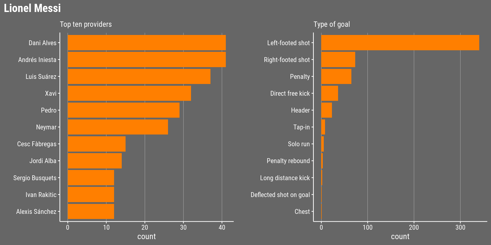

# Analyzing the Greatest Strikers in Football II: Visualizing Data

*This post was semi automatically converted from blogdown to Quarto and may contain errors. The original can be found in the [archive](http://archive.schochastics.net/post/analyzing-the-greatest-strikers-in-football-ii-visualizing-data/).*


This is the second part of *Analyzing the Greatest Strikers in
Football*. In the [first
part](http://blog.schochastics.net/post/analyzing-the-greatest-strikers-in-football-i-getting-data/),
we created the function `get_goals()` which allows us to conveniently
scrape detailed information of players career goals from
[transfermarkt.co.uk](https://www.transfermarkt.co.uk/). In this part,
we are going to explore the data.

``` r
library(tidyverse) # for data wrangling
library(lubridate) # for date formats
library(ggimage)   # adding images to ggplot
library(patchwork) # attaching ggplot objects
library(viridis)   # viridis color schemes
```

We start by getting the data of Zlatan with the `get_goals()` function.

``` r
zlatan_tbl <- get_goals(player = "zlatan-ibrahimovic", id = "3455")

glimpse(zlatan_tbl)
```

``` hljs
## List of 4
##  $ data    :'data.frame':    423 obs. of  13 variables:
##   ..$ competition: chr [1:423] "Eredivisie" "Eredivisie" "UEFA Cup" "UEFA Cup" ...
##   ..$ day        : chr [1:423] "3" "4" "First Round" "First Round" ...
##   ..$ date       : Date[1:423], format: "2001-08-26" ...
##   ..$ venue      : chr [1:423] "A" "A" "H" "A" ...
##   ..$ against    : chr [1:423] "Feyenoord  " "FC Twente  " "Apol. Limassol" "Apol. Limassol" ...
##   ..$ minute     : num [1:423] 64 19 4 64 68 79 68 78 95 47 ...
##   ..$ standing   : chr [1:423] "0:1" "0:1" "1:0" "0:2" ...
##   ..$ type       : chr [1:423] "Tap-in" "" "" "Header" ...
##   ..$ provider   : chr [1:423] "Hatem Trabelsi" "" "Nikolaos Machlas" "Wamberto" ...
##   ..$ club       : Factor w/ 8 levels "Ajax Amsterdam",..: 1 1 1 1 1 1 1 1 1 1 ...
##   ..$ club_crest : chr [1:423] "https://tmssl.akamaized.net//images/wappen/head/610.png" "https://tmssl.akamaized.net//images/wappen/head/610.png" "https://tmssl.akamaized.net//images/wappen/head/610.png" "https://tmssl.akamaized.net//images/wappen/head/610.png" ...
##   ..$ age        : num [1:423] 19.9 19.9 20 20 20.2 ...
##   ..$ goals      : int [1:423] 1 2 3 4 5 6 7 8 9 10 ...
##  $ name    : chr "Zlatan Ibrahimovic"
##  $ birthday: Date[1:1], format: "1981-10-03"
##  $ portrait: chr "https://tmssl.akamaized.net//images/portrait/header/3455-1521831775.jpg?lm=1521831871"
```

For comparisons, we also grab the data for Messi and CR7.

``` r
messi_tbl <- get_goals("lionel-messi","28003") 
cr7_tbl <- get_goals("cristiano-ronaldo","8198")
```

# Greating a ggplot theme

This is a totally optional step, but I like to use a customized ggplot
theme to make the plots more unique.

``` r
theme_goals <- function(base_family="Roboto Condensed",
                        ticks=TRUE,axis=TRUE,grid=""){
  ret <- theme_bw()+
    theme(panel.background = element_rect(fill="#666666",colour = "#666666"),
        plot.background = element_rect(fill="#666666",colour = "#666666"),
        panel.grid.minor = element_blank(),
        panel.border = element_rect(fill=NA,colour="#666666"),
        legend.background = element_rect(fill="#666666",colour = "#666666"),
        legend.box.background = element_rect(fill="#666666",colour = "#666666"),
        legend.key = element_rect(fill="#666666",colour = "#666666"),
        legend.text = element_text(family = base_family,colour="white",size=rel(1.1)),
        axis.text = element_text(colour="white",size=rel(0.9),family=base_family),
        axis.title = element_text(family = base_family,colour="white",size=rel(1.1)),
        legend.position = "bottom",
        plot.title = element_text(family = base_family,color="white",face = "bold",size=rel(1.5)),
        plot.subtitle = element_text(family = base_family,color="white"))
  if(ticks){
    ret <- ret + theme(axis.ticks = element_line(colour="white"))
  } else {
    ret <- ret + theme(axis.ticks = element_blank())
  }
  if(axis){
    ret <- ret + theme(axis.line = element_line(colour="white"))
  } else {
    ret <- ret + theme(axis.line = element_blank())
  }
  if(grid==""){
    ret <- ret + theme(panel.grid = element_blank())
  } else if(grid=="y"){
    ret <- ret + theme(panel.grid.major.x = element_blank(),
                       panel.grid.major.y = element_line(colour="white",size=0.1))
  } else if(grid=="x"){
    ret <- ret + theme(panel.grid.major.y = element_blank(),
                       panel.grid.major.x = element_line(colour="white",size=0.1))
  }
  ret
}
```

Let’s move on to the more interesting part.

# Goals over time and per club

``` r
# calculate position of crests
crest_pos <- zlatan_tbl$data %>% 
  group_by(club) %>%
  summarise(x = mean(age),
            y = mean(goals),
            crest = club_crest[1])

ggplot(zlatan_tbl$data,aes(x=age,y=goals,col=club))+
  geom_image(data=crest_pos,aes(x=x,y=y,image=crest),size=0.05,alpha=0.5)+
  geom_line()+
  scale_color_viridis_d(option = "viridis", name = "")+
  theme_goals(grid = "y")+
  labs(title=zlatan_tbl$name,
       subtitle=paste(nrow(zlatan_tbl$data),"goals between",
                min(zlatan_tbl$data$date),"and",max(zlatan_tbl$data$date))) -> p_date

p_date
```


Zlatan truly is a prolific player, having scored more than 400 goals for
8 different clubs. But his achievements in terms of goals scored fade
compared to Messi and CR7.


# Goals per minute and standing

Below we look at the number of goals scored per ingame minute, excluding
extra time.

``` r
zlatan_tbl$data$y <- floor(zlatan_tbl$data$minute/10)
zlatan_tbl$data$x <- zlatan_tbl$data$minute%%10
zlatan_tbl$data$y[zlatan_tbl$data$x==0] <- zlatan_tbl$data$y[zlatan_tbl$data$x==0]-1
zlatan_tbl$data$x[zlatan_tbl$data$x==0] <- 10
zlatan_tbl$data %>%
  dplyr::filter(minute<=90) %>%
  group_by(x,y,minute) %>%
  count() %>%
  ggplot(aes(x,y))+geom_tile(aes(fill=n),colour="#666666",size=1)+
  geom_text(aes(label=n))+
  scale_y_reverse(breaks=0:8,
                  labels=c("1'-10'","11'-20'","21'-30'","31'-40'","41'-50'","51'-60'",
                           "61'-70'","71'-80'","81'-90'"))+
  viridis::scale_fill_viridis(option = "D",name="",limits=c(0,15),na.value="#FF7F00")+
  theme_goals(ticks = F,axis = F,grid = "")+
  theme(axis.text.x = element_blank(),
        legend.position = "none")+
  coord_fixed()+
  labs(x="",y="",subtitle="Goals scored per ingame minute") -> p_min

p_min
```


The only ingame minute he has not scored yet is the 3rd and the
24th[¹](#fn1). Let’s see how he compares with Messi an CR7 in that
matter.


Messi seems to still miss a goal in the first minute. CR7 on the other
hand managed to score in every single minute of a game. He is, however,
not alone in this exclusive club. I found three more strikers
(Alessandro Del Piero, Gerd Müller and Raúl) who, according to
transfermarkt.co.uk, also scored in every minute of the game. The figure
below shows their break downs per minute, together with five more
strikers who come close to scoring in each minute.


*I have to shamefully admit that I forgot to check Luis Suárez and
Sergio Agüero in my initial analysis. Lo and behold, both have scored in
89 minutes!*


Next, we will look at the standing of the match a goal was scored. Note
that we have to adjust the standing for away games since it is given in
the “wrong” order. That is, we need to treat 0:1 as 1:0. This can be
done by reversing the string with `stringi::stri_reverse()`. Be careful
though! This only works for single digit standings.

``` r
stringi::stri_reverse("1:10")
```

``` hljs
## [1] "01:1"
```

``` r
zlatan_tbl$data %>% 
  mutate(standing_adj = ifelse(venue=="A",stringi::stri_reverse(standing),standing)) %>% 
  group_by(standing_adj) %>% 
  summarise(goals = n()) %>% 
  ggplot(aes(x = reorder(standing_adj,-goals),y = goals))+
  geom_col(fill="#FF7F00")+
  theme_goals(grid = "y")+
  labs(x = "standing after goal", y = "count") -> p_stand

p_stand
```


# Type of Goal and the Providers

The columns we haven’t looked at yet are the `type` and `provider`.

``` r
zlatan_tbl$data %>% 
  dplyr::filter(provider!="") %>% 
  group_by(provider) %>% 
  summarise(goals = n()) %>% 
  top_n(10,goals) %>% 
  ggplot(aes(x = reorder(provider,goals),y = goals))+
  geom_col(fill="#FF7F00")+
  scale_y_continuous(breaks=seq(0,12,3))+
  theme_goals(grid = "x")+
  labs(x = "", y = "count",subtitle="Top ten providers")+
  coord_flip() -> p_prov

zlatan_tbl$data %>% 
  dplyr::filter(type!="") %>% 
  group_by(type) %>% 
  summarise(goals = n()) %>% 
  ggplot(aes(x = reorder(type,goals),y = goals))+
  geom_col(fill="#FF7F00")+
  theme_goals(grid = "x")+
  labs(x = "", y = "count",subtitle="Type of goal")+
  coord_flip() -> p_type

p_prov + 
  p_type + 
  plot_layout(nrow = 1) + 
  plot_annotation(theme=theme(
    plot.background=element_rect(fill="#666666",colour="#666666"),
    plot.title = element_text(family = "Roboto Condensed",color="white",face = "bold",size=rel(1.5))),
    title=zlatan_tbl$name)
```


According to his transfermarkt
[profile](https://www.transfermarkt.co.uk/zlatan-ibrahimovic/profil/spieler/3455),
Zlatan is “both-footed”, but he seems to prefer the right foot for
scoring.

For comparison, here are the plots for Messi and CR7.


# Scorecard

You can neatly put all plots together to create an informative scorecard
for Zlatan.

``` r
p <- {p_date + p_stand + plot_layout(ncol = 2)}+
  {p_min + p_prov + p_type + plot_layout(ncol = 3)}+
  plot_layout(ncol = 1) + 
  plot_annotation(theme = theme(
    plot.background = element_rect(fill="#666666",colour="#666666")))
p
```


The code for the plots is kept as general as possible, so that it is
easy to produce them quickly for any other player found on
transfermarkt. Below are two more scorecards that were created in the
same way as for Zlatan.


------------------------------------------------------------------------

1.  according to
    [this](https://www.reddit.com/r/soccer/comments/6rug3f/players_who_have_scored_in_every_minute_of_a/)
    reddit post, Zlatan has in fact scored in every minute if one
    includes national team matches.[↩](#fnref1)

