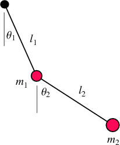
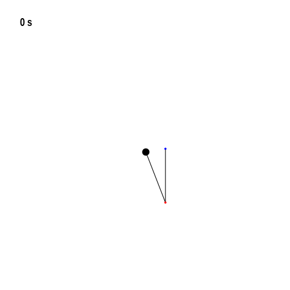
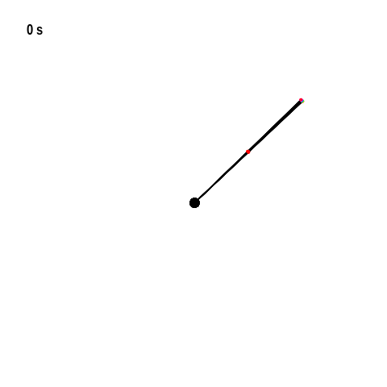

*This post was semi automatically converted from blogdown to Quarto and may contain errors. The original can be found in the [archive](http://archive.schochastics.net/post/beautiful-chaos-the-double-pendulum/).*

This post is dedicated to the beautiful chaos created by double
pendulums. I have seen a great variety of animated versions, implemented
with different tool but never in R. Thanks to the amazing package
`gganimate`, it is actually not that hard to produce them in R.



``` r
library(tidyverse)
library(gganimate)
```

I am not going to attempt to explain the math behind the double
pendulum. If you are interested in the details, check out a complete
walkthrough
[here](http://scienceworld.wolfram.com/physics/DoublePendulum.html). The
code presented here is a straightforward adaption from
[python](https://matplotlib.org/examples/animation/double_pendulum_animated.html).

First, we need to set up some basic constants and the starting
conditions.

``` r
# constants
G  <-  9.807  # acceleration due to gravity, in m/s^2
L1 <-  1.0    # length of pendulum 1 (m)
L2 <-  1.0    # length of pendulum 2 (m)
M1 <-  1.0    # mass of pendulum 1 (kg)
M2 <-  1.0    # mass of pendulum 2 (kg)

parms <- c(L1,L2,M1,M2,G)

# initial conditions
th1 <-  20.0  # initial angle theta of pendulum 1 (degree)
w1  <-  0.0   # initial angular velocity of pendulum 1 (degrees per second)
th2 <-  180.0 # initial angle theta of pendulum 2 (degree)
w2  <-  0.0   # initial angular velocity of pendulum 2 (degrees per second)

state <- c(th1, w1, th2, w2)*pi/180  #convert degree to radians
```

These are the parameters you need to change in order to produce
different pendulums. Just experiment a little!

The partial derivatives needed can be calculated with the following
function.

``` r
derivs <- function(state, t){
  L1 <- parms[1]
  L2 <- parms[2]
  M1 <- parms[3]
  M2 <- parms[4]
  G  <- parms[5]
  
  dydx    <-  rep(0,length(state))
  dydx[1] <-  state[2]
  
  del_ <-  state[3] - state[1]
  den1 <-  (M1 + M2)*L1 - M2*L1*cos(del_)*cos(del_)
  dydx[2]  <-  (M2*L1*state[2]*state[3]*sin(del_)*cos(del_) +
               M2*G*sin(state[3])*cos(del_) +
               M2*L2*state[4]*state[4]*sin(del_) -
               (M1 + M2)*G*sin(state[1]))/den1
  
  dydx[3] <-  state[4]
  
  den2 <-  (L2/L1)*den1
  dydx[4]  <-  (-M2*L2*state[4]*state[4]*sin(del_)*cos(del_) +
               (M1 + M2)*G*sin(state[1])*cos(del_) -
               (M1 + M2)*L1*state[2]*state[2]*sin(del_) -
               (M1 + M2)*G*sin(state[3]))/den2
  
  return(dydx)
}
```

This function needs to be integrated. Luckily, there is the `odeintr`
packages that does the job. The `start`, `duration` and `step_size`
parameters control the time for your pendulum. In the below example, I
choose to “swing” the pendulum for 30 seconds and the position is
recalculated every 0.1 seconds.

``` r
sol <- odeintr::integrate_sys(derivs,init = state,duration = 30,
                              start = 0,step_size = 0.1)
```

Now we just need to compute the x and y coordinates for both pendulums
from the angles θ*θ**θ* obtained from the integration.

``` r
x1 <-  L1*sin(sol[, 2])
y1 <-  -L1*cos(sol[, 2])
  
x2 <- L2*sin(sol[, 4]) + x1
y2 <- -L2*cos(sol[, 4]) + y1
  
df <- tibble(t=sol[,1],x1,y1,x2,y2,group=1)
```

The final data frame contains the exact position of the pendulums for
each time step. Animating the pendulums is straightforward with the
package `gganimate`.

``` r
ggplot(df)+
  geom_segment(aes(xend=x1,yend=y1),x=0,y=0)+
  geom_segment(aes(xend=x2,yend=y2,x=x1,y=y1))+
  geom_point(size=5,x=0,y=0)+
  geom_point(aes(x1,y1),col="red",size=M1)+
  geom_point(aes(x2,y2),col="blue",size=M2)+
  scale_y_continuous(limits=c(-2,2))+
  scale_x_continuous(limits=c(-2,2))+
  ggraph::theme_graph()+
  labs(title="{frame_time} s")+
  transition_time(t) -> p

pa <- animate(p,nframes=nrow(df),fps=20)
pa
```


We can also add some more details to the animation, like the trail of
the second pendulum to track its path. It turned out to be a bit more
tricky then expected though. The trail needs to be added via a secondary
data.frame so that it can be animated with the `transition_time()`. I
used the `lag()` function to compute the trail from the last five time
points.

``` r
tmp <- select(df,t,x2,y2)
trail <- tibble(x=c(sapply(1:5,function(x) lag(tmp$x2,x))),
       y=c(sapply(1:5,function(x) lag(tmp$y2,x))),
       t=rep(tmp$t,5)) %>% 
  dplyr::filter(!is.na(x))
```

I used the `shadow_mark()` function to keep the past trails.

``` r
ggplot(df)+
  geom_path(data=trail,aes(x,y),colour="blue",size=0.5)+
  geom_segment(aes(xend=x1,yend=y1),x=0,y=0)+
  geom_segment(aes(xend=x2,yend=y2,x=x1,y=y1))+
  geom_point(size=5,x=0,y=0)+
  geom_point(aes(x1,y1),col="red",size=M1)+
  geom_point(aes(x2,y2),col="blue",size=M2)+
  scale_y_continuous(limits=c(-2,2))+
  scale_x_continuous(limits=c(-2,2))+
  ggraph::theme_graph()+
  labs(title="{frame_time} s")+
  transition_time(t)+
  shadow_mark(colour="grey",size=0.1,exclude_layer = 2:6)-> p

pa <- animate(p,nframes=nrow(df),fps=20)
pa
```



That’s it. Now you can play around with the constants (`L1,L2,M1,M2,G`)
and the initial conditions (`th1,w1,th2,w2`) to create your own chaotic
pendulums.

Below is my personal favorite. 40 pendulums with nearly identical
starting conditions. Watch how quickly their paths diverge into pure
chaos.



