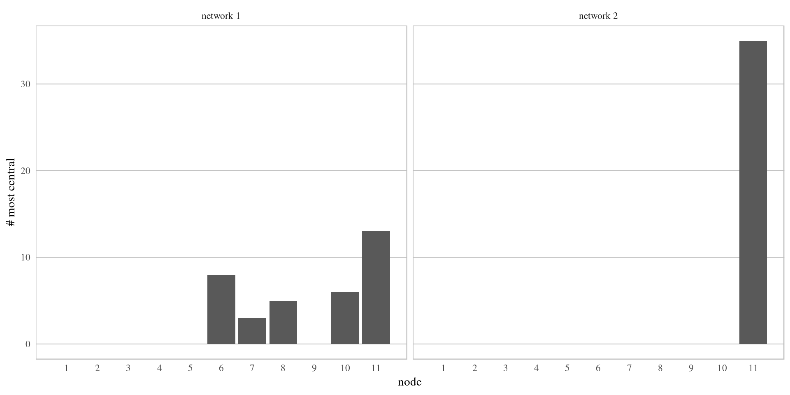
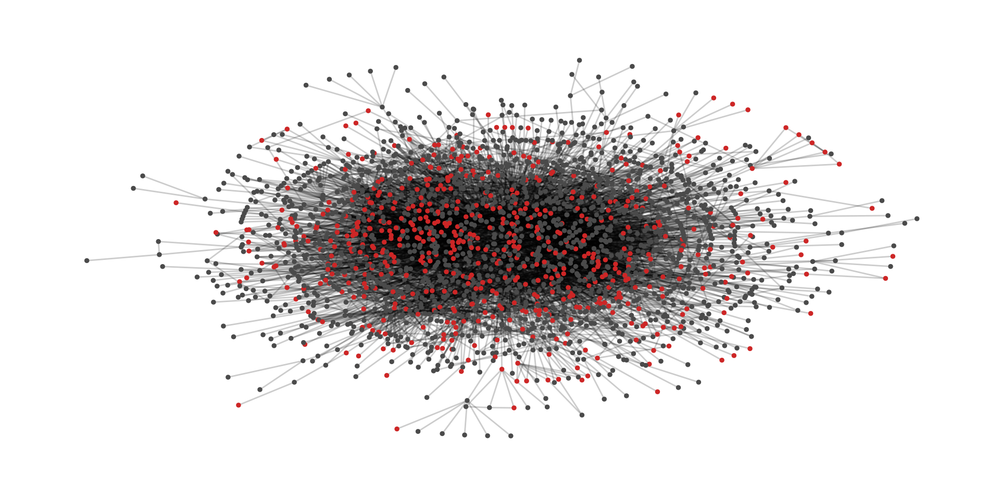
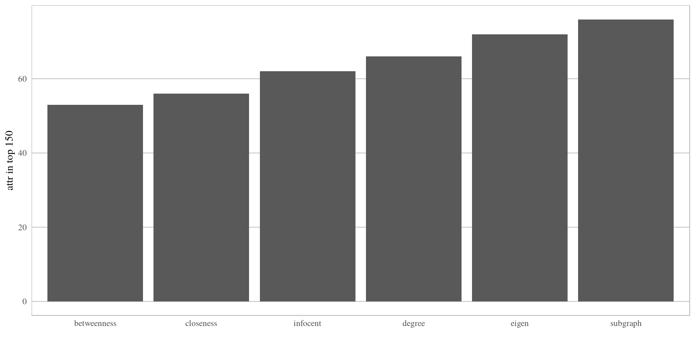

# Network Centrality in R: An Introduction

*This post was semi automatically converted from blogdown to Quarto and may contain errors. The original can be found in the [archive](http://archive.schochastics.net/post/network-centrality-in-r-introduction/).*


This is the first post of a series on the concept of “network
centrality” with applications in R and the package `netrankr`. There is
already a rudimentary
[tutorial](https://schochastics.github.io/netrankr/) for the package,
but I wanted to extend it to a broader tutorial for network centrality.
The main focus of the blog series will be the applications in R and
conceptual considerations will only play a minor role. An extended
version of the series will be made available as a
[bookdown](http://centrality.schochastics.net/) version (hopefully)
early next year.

``` r
library(igraph)
library(ggraph)
library(tidyverse)
library(netrankr)
```

# Introduction

Research involving networks has found its place in a lot of disciplines.
From the social sciences to the natural sciences, the buzz-phrase
“networks are everywhere”, is everywhere. One of the many tools to
analyze networks are measures of *centrality*. In a nutshell, a measure
of centrality is an index that assigns a numeric values to the nodes of
the network. The higher the value, the more central the node (A more
thorough introduction is given in the extended tutorial). Related ideas
can already be found in [Moreno’s
work](http://www.asgpp.org/docs/wss/wss.html) in the 1930s, but most
relevant ground work was done in the late 1940s to end 1970s. This
period includes the work of [Bavelas and
Leavit](http://www.analytictech.com/networks/commstruc.htm) on group
communication experiments and of course the seminal paper [“Centrality
in Social Networks: Conceptual
Clarification”](https://www.bebr.ufl.edu/sites/default/files/Centrality%20in%20Social%20Networks.pdf)
of Linton Freeman. If you work, or intend to work, with centrality and
haven’t read it, I urge you to do so. Freeman does not mince matters and
goes all-in on criticizing contemporary work of that time. He calls
existing indices “nearly impossible to interpret”, “hideously complex”,
“seriously flawed”, “unacceptable”, and “arbitrary and uninterpretable”.
His rant culminates in the following statement.

> The several measures are often only vaguely related to the intuitive
> ideas they purport to index, and many are so complex that it is
> difficult or impossible to discover what, if anything, they are
> measuring.

and he concludes:

> There is certainly no unanimity on exactly what centrality is or on
> its conceptual foundations, and there is very little agreement in the
> proper procedure for its measurement.

So, up to the 1970s, many different centrality indices have already been
proposed, which assessed different structural features of networks in
order to determine central nodes. But Freeman found this measures hardly
appropriate and criticized their overabundance. He argued that the vast
array of indices can be boiled down to three indices: degree,
betweenness and closeness. Everything else was just an awkward variant
of one of these measures. Note though, the indices already existed and
were not designed by him (well, betweenness kind of was;
[PDF](http://moreno.ss.uci.edu/23.pdf)). How was this work received? As
of November 2019, the paper has been cited over 14000 times. It is by
far the most the most influential work in the area of centrality. But
did it change how we handle centrality today? Not really. Consider, for
instance, the review paper of [Lü et
al.](https://arxiv.org/pdf/1607.01134) (or my [periodic
table](http://schochastics.net/sna/periodic.html) of indices.). The list
of existing centrality indices is huge and new centrality indices are
still crafted on a regular basis. Thus, it seems that Freeman’s “no
unanimity” statement is still relevant today. The ambiguities
surrounding centrality poses many challenges for empirical work. Some of
the reoccurring questions are:

-   Which index do I choose for my analysis?
-   Should I maybe design a new one?
-   How do I validate that the chosen index is appropriate?

While the answer to the second question is easy (**Don’t do it!**), the
others are a bit more tricky.

In this post, I will review existing R Package that are relevant for
centrality related analyses and illustrate why considering the above
mentioned questions is necessary.

# R packages for centrality

(*This section lists a great variety of different indices. If you are
interested in the technical details, consult the help of the function
and check out the references*)

There are several packages that implement centrality indices for R. Of
course, there are the big network and graph packages such as
`igraph`,`sna`, `qgraph`, and `tidygraph`, which are designed as general
purpose packages for network analysis. Hence, they also implement some
centrality indices.

`igraph` contains the following 10 indices:

-   degree (`degree()`)
-   weighted degree (`graph.strength()`)
-   betweenness (`betweenness()`)
-   closeness (`closeness()`)
-   eigenvector (`eigen_centrality()`)
-   alpha centrality (`alpha_centrality()`)
-   power centrality (`power_centrality()`)
-   PageRank (`page_rank()`)
-   eccentricity (`eccentricity()`)
-   hubs and authorities (`authority_score()` and `hub_score()`)
-   subgraph centrality (`subgraph_centrality()`)

In most cases, parameters can be adjusted to account for
directed/undirected and weighted/unweighted networks.

The `sna` package implements roughly the same indices together with:

-   flow betweenness (`flowbet()`)
-   load centrality (`loadcent()`)
-   Gil-Schmidt Power Index (`gilschmidt()`)
-   information centrality (`infocent()`)
-   stress centrality (`stresscent()`)

`qgraph` specializes on weighted networks. It has a generic function
`centrality_auto()` which returns, depending on the network, the
following indices:

-   degree
-   strength (weighted degree)
-   betweenness
-   closeness

The package also contains the function `centrality()`, which calculates
a non-linear combination of unweighted and weighted indices using a
tuning parameter α*α**α* (See [Opsahl et
al.](https://www.sciencedirect.com/science/article/pii/S0378873310000183)).

There are also some dedicated centrality packages, such as `centiserve`,
`CINNA`, `influenceR` and `keyplayer`. The biggest in terms of
implemented indices is currently `centiserve` with a total of 33
indices.

``` r
as.character(lsf.str("package:centiserve"))
```

``` hljs
##  [1] "averagedis"            "barycenter"           
##  [3] "bottleneck"            "centroid"             
##  [5] "closeness.currentflow" "closeness.freeman"    
##  [7] "closeness.latora"      "closeness.residual"   
##  [9] "closeness.vitality"    "clusterrank"          
## [11] "communibet"            "communitycent"        
## [13] "crossclique"           "decay"                
## [15] "diffusion.degree"      "dmnc"                 
## [17] "entropy"               "epc"                  
## [19] "geokpath"              "hubbell"              
## [21] "katzcent"              "laplacian"            
## [23] "leaderrank"            "leverage"             
## [25] "lincent"               "lobby"                
## [27] "markovcent"            "mnc"                  
## [29] "pairwisedis"           "radiality"            
## [31] "salsa"                 "semilocal"            
## [33] "topocoefficient"
```

The package is maintained by the team behind
[centiserver](http://www.centiserver.org/), the “comprehensive
centrality resource and server for centralities calculation”. The
website collects indices found in the literature. Currently (December
2018), it lists 235 different indices. That’s…a lot.

`CINNA` is a relatively new package (first CRAN submission in 2017). The
package description says “Functions for computing, comparing and
demonstrating top informative centrality measures within a network.”
Most of the indices in the package are imported from other package, such
as `centiserve`. In addition, there are:

-   Dangalchev closeness (`dangalchev_closeness_centrality()`)
-   group centrality (`group_centrality()`)
-   harmonic closeness (`harmonic_centrality()`)
-   local bridging centrality (`local_bridging_centrality()`)

The function `calculate_centralities()` can be used to calculate all
applicable indices to a network. The primary purpose of the package is
to facilitate the choice of indices by visual and statistical tools. If
you are interested in the details, see this
[tutorial](https://www.datacamp.com/community/tutorials/centrality-network-analysis-R)
and this
[vignette](https://cran.r-project.org/web/packages/CINNA/vignettes/CINNA.html).

`influenceR` and `keyplayer` are comparably small packages which
implement only a small number of indices.

*(For now, I deliberately leave out my package `netrankr`. While it
implements a great variety of indices, it is not its primary purpose to
provide a set of predefined measures. We will come to that in the next
part.)*

You really have the agony of choice if you look at this exhaustive list
of possibilities.

# A small example

Let us start with a fairly simple example. Consider the following two
small networks.

``` r
#data can be found here: https://github.com/schochastics/centrality_tutorial
g1 <- readRDS("example_1.rds")
g2 <- readRDS("example_2.rds")
```


Now, without any empirical context, we want to determine the most
central node in both networks. I wrote a small function (code at the end
of this post), which calculates 35 of the above mentioned indices. We
blindly apply them to both networks and see what happens.

``` r
res1 <- all_indices(g1)
res2 <- all_indices(g2)
```

The chart below shows a breakdown for how many indices return a specific
node as the most central one.



In network 1, five different nodes are considered to be “the most
central node” by different indices. In network 2, on the other hand, all
35 indices agree on node eleven as the most central one. The take away
message from network 1 is clearly that choice matters. Depending on
which index we choose, we can obtain very different results. This is
hardly surprising. Why else would there be so many different indices?
Five different centers are, however, a lot for such a tiny network.
Network 2 paints a completely different picture. All indices agree upon
the most central node. Even better (or worse?), they all induce the same
ranking. We can check that with the function `compare_ranks()` in
`netrankr` by counting the wrongly ordered (discordant) pairs of nodes
for pairs of indices x*x**x* and y*y**y*. That is, x*x**x* ranks a node
i*i**i* before j*j**j* but y*y**y* ranks j*j**j* before i*i**i*.

(*The function is unfortunately not properly vectorised yet, so we need
to resort to some for looping*)

``` r
discordant <- rep(1,35*34)
k <- 0
for(i in 1:(ncol(res2)-1)){
  for(j in (i=1):ncol(res2)){
    k <- k+1
    discordant[k] <- compare_ranks(res2[,i],res2[,j])$discordant
  }
}
any(discordant>0)
```

``` hljs
## [1] FALSE
```

So, the indices not only agree upon the most central node, but also on
the rest of the ranking!

You may be wondering, why we are only looking at the ranking and not the
actual values. Effectively, the values themselves don’t have any
meaning. There is no such thing as a “unit of centrality”, if we look at
it from a measurement perspective. For instance, we can’t say that a
node is “twice as between” as another if its betweenness value is twice
as high. Centrality should thus not be considered to be on an interval
scale, but rather an ordinal one. This might seem like a restriction at
first, but we will see later on that it facilitates many theoretical
examinations.

The two networks illustrate the big problem of choice. We have “only”
tried 35 different indices, so we actually can’t make any conclusive
statements about central nodes. After all, 35 indices can in the best
case produce 35 completely different rankings. But theoretically, there
are 11!=11!=11!= 39,916,800 possibilities to rank the nodes of the
network without allowing ties, which indices actually do. So, what if we
missed hundreds of thousands of potential indices that would rank, say,
node nine on top for network 1? What if those 35 indices are exactly the
ones that rank node eleven on top for network 2, but no other index does
that?

In the next example, we add some (made up) empirical context to
illustrate the problem of how to validate the appropriateness of chosen
indices.

# An almost realistic example

Centrality indices are commonly used as an explanatory variable for some
observed phenomenon or node attribute in a network. Let’s say we have
the following abstract research question. Given a network where each
node is equipped with a binary attribute, which could signify the
presence or absence of some property. Can a centrality index “explain”
the presence of this attribute?

``` r
#data can be found here: https://github.com/schochastics/centrality_tutorial
g3 <- readRDS("example_3.rds")
```



Instead of 35 indices, we here focus on the more common indices.

``` r
cent <- tibble(nodes=1:vcount(g3),attr=V(g3)$attr)
cent$degree <- igraph::degree(g3)
cent$betweenness <- igraph::betweenness(g3)
cent$closeness <- igraph::closeness(g3)
cent$eigen <- igraph::eigen_centrality(g3)$vector
cent$subgraph <- igraph::subgraph_centrality(g3)
cent$infocent <- sna::infocent(get.adjacency(g3,sparse=F))

glimpse(cent)
```

``` hljs
## Observations: 2,224
## Variables: 8
## $ nodes       <int> 1, 2, 3, 4, 5, 6, 7, 8, 9, 10, 11, 12, 13, 14, 15,...
## $ attr        <int> 0, 0, 0, 0, 1, 0, 1, 0, 0, 0, 0, 0, 0, 0, 0, 0, 0,...
## $ degree      <dbl> 1, 1, 1, 3, 1, 5, 3, 2, 10, 5, 3, 3, 1, 11, 15, 5,...
## $ betweenness <dbl> 0.0000, 0.0000, 0.0000, 112.0519, 0.0000, 3181.837...
## $ closeness   <dbl> 9.448224e-05, 9.559316e-05, 7.303535e-05, 1.089562...
## $ eigen       <dbl> 9.356028e-03, 6.160046e-03, 5.509022e-05, 1.107902...
## $ subgraph    <dbl> 830.570056, 364.526673, 1.632701, 2814.242127, 1.8...
## $ infocent    <dbl> 0.5634474, 0.5843892, 0.3409455, 1.0096304, 0.4697...
```

If we postulate that one of the indices is somehow related with the
attribute, then we should see that nodes with the attribute should tend
to be ranked on top of the induced ranking. The below bar chart shows
the number of nodes having the attribute that are ranked in the top 150
for each index.

``` r
cent %>% 
  gather(cent,value,degree:infocent) %>% 
  group_by(cent) %>% 
  top_n(150,value) %>% 
  dplyr::summarise(top=sum(attr)) %>% 
  ggplot(aes(reorder(cent,top),y=top))+
  geom_col()+
  ggthemes::theme_tufte(ticks = F)+
  theme(panel.background = element_rect(fill=NA,colour="grey"),
        panel.grid.major.y = element_line(colour = "grey"))+
  labs(y="attr in top 150",x="")
```



According to this crude evaluation, subgraph centrality is best in
“explaining” the node attribute. But how conclusive is this now? Note
that we did not specify any real hypothesis so basically any index could
be a valid choice. Instead of trying out one of the other mentioned ones
though, we now try to design a new index which hopefully gives us an
even better “fit”. After some wild math, we may end up with something
like this:

c(u)=ccoef(u)⎡⎣∑v∈N(u)∞∑k=0(A\[u\])2kvv(2k)!⎤⎦
$$c(u) = ccoef(u)\\left\\lbrack {\\sum\\limits\_{v \\in N(u)}\\sum\\limits\_{k = 0}^{\\infty}\\frac{(A^{\\lbrack u\\rbrack})\_{vv}^{2k}}{(2k)!}} \\right\\rbrack$$
$$
c(u)= ccoef(u) \\left\[\\sum\\limits\_{v \\in N(u)} \\sum\\limits\_{k=0}^{\\infty} \\frac{(A^{\[u\]})\_{vv}^{2k}}{(2k)!} \\right\]
$$
Ok, so what is happening here?
ccoef(u)*c**c**o**e**f*(*u*)*c**c**o**e**f*(*u*) is the clustering
coefficient of the node u*u**u*
(`igraph::transitivity(g,type="local")`). The first sum is over all
neighbors v*v**v* of u*u**u*. The second sum is used to sum up all
closed walks of even length weighted by the inverse factorial of the
length.

We can directly invent a second one, based on the walks of odd length.
c(u)=ccoef(u)⎡⎣∑v∈N(u)∞∑k=0(A\[u\])2k+1vv(2k+1)!⎤⎦
$$c(u) = ccoef(u)\\left\\lbrack {\\sum\\limits\_{v \\in N(u)}\\sum\\limits\_{k = 0}^{\\infty}\\frac{(A^{\\lbrack u\\rbrack})\_{vv}^{2k + 1}}{(2k + 1)!}} \\right\\rbrack$$
$$
c(u)= ccoef(u) \\left\[\\sum\\limits\_{v \\in N(u)} \\sum\\limits\_{k=0}^{\\infty} \\frac{(A^{\[u\]})\_{vv}^{2k+1}}{(2k+1)!} \\right\]
$$
Mathematically fascinating, yet both indices defy any rational meaning.

Both indices have not yet been considered in the literature (please do
not write a paper about them!). However, they are not entirely new. I
already used them as an illustration in my PhD thesis
([PDF](http://kops.uni-konstanz.de/bitstream/handle/123456789/34821/Schoch_0-347789.pdf?sequence=3&isAllowed=y)).
The indices are implemented in `netrankr` as the *hyperbolic index*.

``` r
cent$hyp_eve <- hyperbolic_index(g3,type = "even")
cent$hyp_odd <- hyperbolic_index(g3,type = "odd")
```

How do they compare to the other indices?


Both indices are far superior. Around 66% of the top 150 nodes are
equipped with the attribute, compared to 50% for subgraph centrality.

A better evaluation may be to treat the problem as a binary
classification problem and calculate the area under the ROC curve as a
performance estimate.

``` r
cent %>% 
  gather(cent,value,degree:hyp_odd) %>% 
  select(-c(nodes)) %>% 
  group_by(cent) %>% 
  yardstick::roc_auc(factor(attr),value) %>% 
  arrange(-`.estimate`) %>% 
  knitr::kable()
```

| cent        | .metric | .estimator | .estimate |
|:------------|:--------|:-----------|----------:|
| hyp_odd     | roc_auc | binary     | 0.6944020 |
| hyp_eve     | roc_auc | binary     | 0.6925552 |
| degree      | roc_auc | binary     | 0.6571969 |
| infocent    | roc_auc | binary     | 0.6510916 |
| subgraph    | roc_auc | binary     | 0.6407756 |
| eigen       | roc_auc | binary     | 0.6316241 |
| closeness   | roc_auc | binary     | 0.6137547 |
| betweenness | roc_auc | binary     | 0.6046209 |

Again, the hyperbolic indices overall perform much better than the other
traditional indices.

Obviously, this is a very contrived example, yet it emphasizes some
important points. First, it is relatively easy to design an index that
gives you the results you intend to get and hence justify the importance
of the index. Second, you can never be sure, though, that you found “the
best” index for the task. There may well be some even more obscure index
that gives you better results. Third, if you do not find a fitting
index, you can not be sure that there does not exist one after all.

# Summary

This post was intended to highlight some of the problems that you may
encounter when using centrality indices and how hard it is to navigate
the index landscape, keeping up with all the newly designed ones.

One is therefore all to often tempted to go down the data-minning road.
That is, take a handfull of indices, check what works best and come up
with a post-hoc explanation as to why the choice was reasonable. Note,
though, that this approach is not universally bad, or wrong. It mainly
depends on what you your intentions are. You simply want to have a sort
of predictive model? Go wild on the indices and maximize! The `CINNA`
package offers some excellent tools for that.

However, if you are working in a theory-heavy area, then this approach
is not for you. “Trial-and-Error” approaches are hardly appropriate to
test a (causal) theory. But how can we properly test a hypothesis with
measures of centrality, when obviously

> there is very little agreement in the proper procedure for its
> measurement.

The upcoming posts will discuss a different approach to centrality,
which may help in translating a theoretical construct into a measure of
centrality.

# Additional R Code

``` r
all_indices <- function(g){
  res <- matrix(0,vcount(g),35)
  res[,1] <- igraph::degree(g)
  res[,2] <- igraph::betweenness(g)
  res[,3] <- igraph::closeness(g)
  res[,4] <- igraph::eigen_centrality(g)$vector
  res[,5] <- 1/igraph::eccentricity(g)
  res[,6] <- igraph::subgraph_centrality(g)
  
  A <- get.adjacency(g,sparse=F)
  res[,7] <- sna::flowbet(A)
  res[,8] <- sna::loadcent(A)
  res[,9] <- sna::gilschmidt(A)
  res[,10] <- sna::infocent(A)
  res[,11] <- sna::stresscent(A)
  
  res[,12] <- 1/centiserve::averagedis(g)
  res[,13] <- centiserve::barycenter(g)
  res[,14] <- centiserve::closeness.currentflow(g)
  res[,15] <- centiserve::closeness.latora(g)
  res[,16] <- centiserve::closeness.residual(g)
  res[,17] <- centiserve::communibet(g)
  res[,18] <- centiserve::crossclique(g)
  res[,19] <- centiserve::decay(g)
  res[,20] <- centiserve::diffusion.degree(g)     
  res[,21] <- 1/centiserve::entropy(g)
  res[,22] <- centiserve::geokpath(g)
  res[,23] <- centiserve::katzcent(g)             
  res[,24] <- centiserve::laplacian(g)
  res[,25] <- centiserve::leverage(g)             
  res[,26] <- centiserve::lincent(g)
  res[,27] <- centiserve::lobby(g)
  res[,28] <- centiserve::markovcent(g)           
  res[,29] <- centiserve::mnc(g)
  res[,30] <- centiserve::radiality(g)            
  res[,31] <- centiserve::semilocal(g)
  res[,32] <- 1/centiserve::topocoefficient(g) 

  res[,33] <- CINNA::dangalchev_closeness_centrality(g)
  res[,34] <- CINNA::harmonic_centrality(g)
  res[,35] <- 1/CINNA::local_bridging_centrality(g)
  apply(res,2,function(x) round(x,8))
}
```

