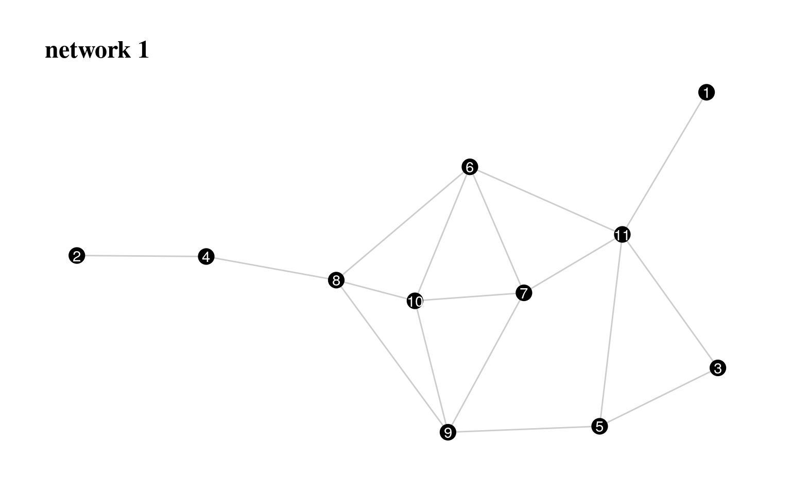
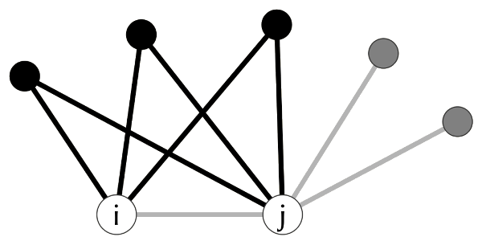
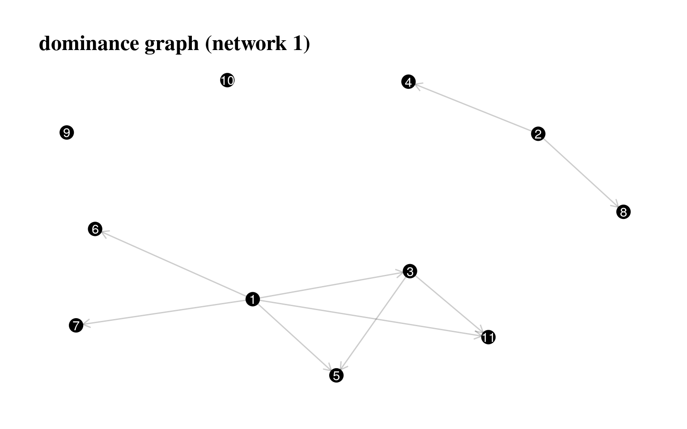
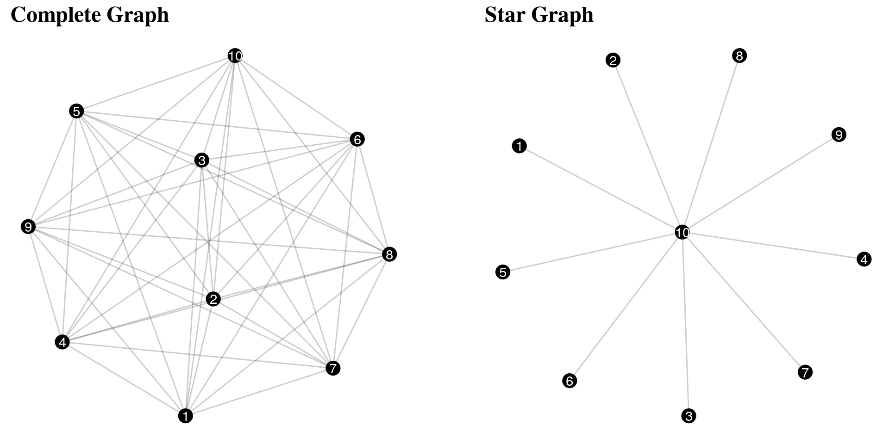

# Network Centrality in R: Neighborhood Inclusion

*This post was semi automatically converted from blogdown to Quarto and may contain errors. The original can be found in the [archive](http://archive.schochastics.net/post/network-centrality-in-r-neighborhood-inclusion/).*


This is the second post of a series on the concept of “network
centrality” with applications in R and the package `netrankr`. The
[first
part](http://blog.schochastics.net/post/network-centrality-in-r-introduction/)
briefly introduced the concept itself, relevant R package, and some
reoccurring issues for applications. This post will discuss some
theoretical foundations and common properties of indices, specifically
the *neighborhood-inclusion preorder* and what we can learn from them.

``` r
library(igraph)
library(ggraph)
library(tidyverse)
library(netrankr)
```

# Introduction

When looking at the vast amount of indices, it may be reasonable to ask
if there is any natural limit for what can be considered a centrality
index. Concretely, are there any theoretical properties that an index
has to have in order to be called a centrality index? There exist
several axiomatic systems for centrality, which define some desirable
properties that a proper index should have. While these systems are able
to shed some light on specific groups of indices, they are in most cases
not comprehensive. That is, it is often possible to construct
counterexamples for most indices such that they do not fulfill the
properties. Instead of the rather normative axiomatic approach, we
explore a more descriptive approach. We will address the following
questions:

-   Are there any properties that are shared by all (or almost all)
    indices?
-   If so, can they be exploited for a different kind of centrality
    analysis?

# Neighborhood-inclusion

In the first post, we examined the following two small examples.

``` r
#data can be found here: https://github.com/schochastics/centrality_tutorial
g1 <- readRDS("example_1.rds")
g2 <- readRDS("example_2.rds")
```



It turned out that for network 1, 35 indices gave very different results
and for network 2 they all coincided. In the following, we discuss why
this is the case.

It turns out that there actually is a very intuitive structural property
that underlies many centrality indices. If a node has exactly the same
neighbors as another and potentially some more, it will never be less
central, independent of the choice of index. Formally,
N(i)⊆N\[j\]⟹c(i)≤c(j)
*N*(*i*) ⊆ *N*\[*j*\] ⇒ *c*(*i*) ≤ *c*(*j*)
*N*(*i*) ⊆ *N*\[*j*\] ⟹ *c*(*i*) ≤ *c*(*j*)
for centrality indices c*c**c*. This property is called
*neighborhood-inclusion*. (*I will spare the technical details at this
point, but if you are interested in the math, please contact me.*)

An illustration is given below.
 Node i*i**i* and j*j**j* have
three common neighbors (the black nodes), but j*j**j* has two additional
neighbors (the grey nodes), hence i*i**i*’s neighborhood is included in
the neighborhood of j*j**j*. Note that the inclusion is actually defined
for the closed neighborhood
(N\[j\]=N(j)∪{j}*N*\[*j*\] = *N*(*j*) ∪ {*j*}*N*\[*j*\] = *N*(*j*) ∪ {*j*}).
This is due to some mathematical peculiarities when i*i**i* and j*j**j*
are connected. Neighborhood-inclusion defines a partial ranking of the
nodes. That is, some node pairs will not be comparable, because neither
N(i)⊆N\[j\]*N*(*i*) ⊆ *N*\[*j*\]*N*(*i*) ⊆ *N*\[*j*\] nor
N(j)⊆N\[i\]*N*(*j*) ⊆ *N*\[*i*\]*N*(*j*) ⊆ *N*\[*i*\] will hold. If the
neighborhood of a node i*i**i* is properly contained in the neighborhood
of j*j**j*, then we will say that i*i**i* is *dominated* by j*j**j*.

We can calculate all pairs of neighborhood-inclusion with the function
`neighborhood_inclusion()` in the `netrankr` package.

``` r
P1 <- neighborhood_inclusion(g1)
P2 <- neighborhood_inclusion(g2)
```

An entry P\[i,j\]*P*\[*i*, *j*\]*P*\[*i*,*j*\] is one if
N(i)⊆N\[j\]*N*(*i*) ⊆ *N*\[*j*\]*N*(*i*) ⊆ *N*\[*j*\] and zero
otherwise. With the function `comparable_pairs()`, we can check the
fraction of comparable pairs. Let us start with the first network.

``` r
comparable_pairs(P1)
```

``` hljs
## [1] 0.1636364
```

Only 16% of pairs are comparable with neighborhood-inclusion. For a
better understanding of the dominance relations, we can also visualize
them as a graph.

``` r
d1 <- dominance_graph(P1)
```

 An edge (i,j)(*i*,*j*)(*i*,*j*) is
present, if P\[i,j\]=1*P*\[*i*, *j*\] = 1*P*\[*i*,*j*\] = 1 and thus
i*i**i* is dominated by j*j**j*. Centrality indices will always put
these comparable pairs in the same order. To check this, we use the
`all_indices()` function from the last post again.

``` r
res <- all_indices(g1)
```

Let us focus on the triple 1,3,51, 3, 51, 3, 5.

``` r
P1[c(1,3,5),c(1,3,5)] #(compare also with the dominance graph)
```

``` hljs
##      [,1] [,2] [,3]
## [1,]    0    1    1
## [2,]    0    0    1
## [3,]    0    0    0
```

So, indices should rank them as 1≤3≤51 ≤ 3 ≤ 51 ≤ 3 ≤ 5.

``` r
ranks135 <- apply(res[c(1,3,5),],2,rank)
rownames(ranks135) <- c(1,3,5)
ranks135
```

``` hljs
##   [,1] [,2] [,3] [,4] [,5] [,6] [,7] [,8] [,9] [,10] [,11] [,12] [,13]
## 1    1  1.5    1    1  1.5    1    1  1.5    1     1   1.5     1     1
## 3    2  1.5    2    2  1.5    2    2  1.5    2     2   1.5     2     2
## 5    3  3.0    3    3  3.0    3    3  3.0    3     3   3.0     3     3
##   [,14] [,15] [,16] [,17] [,18] [,19] [,20] [,21] [,22] [,23] [,24] [,25]
## 1     1     1     1     1     1     1     1     2   1.5     1     1     1
## 3     2     2     2     2     2     2     2     2   1.5     2     2     2
## 5     3     3     3     3     3     3     3     2   3.0     3     3     3
##   [,26] [,27] [,28] [,29] [,30] [,31] [,32] [,33] [,34] [,35]
## 1     1     1     1   1.0     1     1     1     1     1     1
## 3     2     2     2   2.5     2     2     2     2     2     2
## 5     3     3     3   2.5     3     3     3     3     3     3
```

All 35 indices indeed produce a ranking that is in accordance with what
we postulated. (Ties are allowed in the ranking since we require “≤≤≤”
and not “\<\<\<” ).

The `is_preserved()` function can be used to check if all dominance
relations are preserved in the index induced rankings.

``` r
apply(res,2, function(x) is_preserved(P1,x))
```

``` hljs
##  [1] TRUE TRUE TRUE TRUE TRUE TRUE TRUE TRUE TRUE TRUE TRUE TRUE TRUE TRUE
## [15] TRUE TRUE TRUE TRUE TRUE TRUE TRUE TRUE TRUE TRUE TRUE TRUE TRUE TRUE
## [29] TRUE TRUE TRUE TRUE TRUE TRUE TRUE
```

For the other 84% of pairs that are not comparable by
neighborhood-inclusion, indices are “at liberty” to rank nodes
differently. Take the triple 6,7,86, 7, 86, 7, 8 as an example.

``` r
P1[6:8,6:8] #(compare also with the dominance graph)
```

``` hljs
##      [,1] [,2] [,3]
## [1,]    0    0    0
## [2,]    0    0    0
## [3,]    0    0    0
```

``` r
ranks678 <- apply(res[6:8,],2,rank)
rownames(ranks678) <- 6:8
# unique rankings of 6,7,8
ranks678[,!duplicated(t(ranks678))]
```

``` hljs
##   [,1] [,2] [,3] [,4] [,5] [,6] [,7] [,8]
## 6    2    2    3    2  2.5  2.5  1.5    3
## 7    2    1    1    3  1.0  2.5  1.5    2
## 8    2    3    2    1  2.5  1.0  3.0    1
```

The 35 indices produce 8 distinct rankings of 6,7,86, 7, 86, 7, 8. This
means that whenever a pair of nodes i*i**i* and j*j**j* are not
comparable with neighborhood-inclusion, it is (theoretically) possible
to construct an index for each of the three possible rankings
(i\<j*i* \< *j**i* \< *j*, j\<i*j* \< *i**j* \< *i*,
i∼j*i* ∼ *j**i* ∼ *j*)

Moving on to the second network.

``` r
comparable_pairs(P2)
```

``` hljs
## [1] 1
```

So all pairs are comparable by neighborhood-inclusion. Hence, all
indices will induce the same ranking (up to some potential tied ranks,
but no discordant pairs), as we already observed in the previous post.

# Threshold graphs and correlation among indices

The second example network is part of the class of *threshold graphs*.
One of their defining features is that the partial ranking induced by
neighborhood-inclusion is in fact a ranking. A random threshold graph
can be created with the `threshold_graph()` function. The function takes
two parameters, one for the number of nodes, and one (approximately) for
the density. The class includes some well known graphs, such as the two
below.

``` r
tg1 <- threshold_graph(n=10,p=1)
tg2 <- threshold_graph(n=10,p=0)
```



We know from the previous section that centrality indices will always
produce the same ranking on these graphs. This allows us to reason about
another topic that is frequently investigated: correlations among
indices. Correlations are often attributed to the definitions of
indices. Take closeness and betweenness. On first glance, they measure
very different things: Being close to all nodes and being “in between”
all nodes. Hence, we would expect them to be only weakly correlated. But
threshold graphs give us a reason to believe, that correlations are not
entirely dependent on the definitions but rather on structural features
of the network. ([This
article](https://www.sciencedirect.com/science/article/pii/S0378873316303690)
gives more details and references on that topic. Let me know if you
can’t access it).

As an illustration, we compare betweenness and closeness on a threshold
graph and a threshold graph with added noise from a random graph.

``` r
#threshold graph
tg3 <- threshold_graph(100,0.2)
#noise graph
gnp <- sample_gnp(100,0.01)
A1 <- get.adjacency(tg3,sparse=F)
A2 <- get.adjacency(gnp,sparse=F)

#construct a noise threshold graph
tg3_noise <- graph_from_adjacency_matrix(xor(A1,A2))

#calculate discordant pairs for betweenness and closeness in both networks
disc1 <- compare_ranks(betweenness(tg3),closeness(tg3))$discordant
disc2 <- compare_ranks(betweenness(tg3_noise),closeness(tg3_noise))$discordant
c(disc1,disc2)
```

``` hljs
## [1]   0 719
```

On the threshold graph we do not observe any discordant pairs for the
two indices. However, the little noise we added to the threshold graph
was enough to introduce 719 pairs of nodes that are now ranked
differently. In general, we can say that

*The closer a network is to be a threshold graph, the higher we expect
the correlation of any pair of centrality indices to be, independent of
their definition.*

But how to define *being close* to a threshold graph? One obvious choice
is to use the function `comparable_pairs()`. The more pairs are
comparable, the less possibilities for indices to rank the nodes
differently. Hence, we are close to a unique ranking obtained for
threshold graphs. A second option is to use an appropriate distance
measure for graphs. `netrankr` implements the so called *majorization
gap* which operates on the degree sequences of graphs. In its essence,
it returns the number of edges that need to be rewired, in order to turn
an arbitrary graph into a threshold graph.

``` r
mg1 <- majorization_gap(tg3)
mg2 <- majorization_gap(tg3_noise)
c(mg1,mg2)
```

``` hljs
## [1] 0.0000000 0.1235452
```

The result is given as a fraction of the total number of edges. So 12%
of edges need to be rewired in the noisy graph to turn it into a
threshold graph. To get the raw count, set `norm=FALSE`.

``` r
majorization_gap(tg3_noise,norm = FALSE)
```

``` hljs
## [1] 276
```

# Summary

Neighborhood-inclusion seems to be a property that underlies many
centrality indices. If a node i*i**i* is dominated by another node
j*j**j*, then (almost) any index will rank j*j**j* higher than i*i**i*.
I am not going to make the bold statement of saying that **all**
centrality indices have this property, although all commonly used and
traditional indices have this property. However, it is easy to come up
with an index that doesn’t preserve the partial ranking (Coincidentally,
the two hyperbolic indices from the first post don’t preserve it. Thank
god!). But if we accept the preservation of neighborhood-inclusion to be
a defining property of centrality indices, then we are able to a) derive
more theoretical results about centrality (see correlation section) b)
distinguish proper indices from invalid ones (see hyperbolic indices)
and c) think about new ways of assessing centrality, that do not
necessarily rely on indices.

Point c) will be partially addressed in the next post and in more detail
in subsequent ones.  
The main focus for the next post is on how to extend
neighborhood-inclusion to other forms of dominance. Additionally, we
will see how to deconstruct indices into a series of building blocks,
which allows for a deeper understanding on what indices actually
“measure”.

