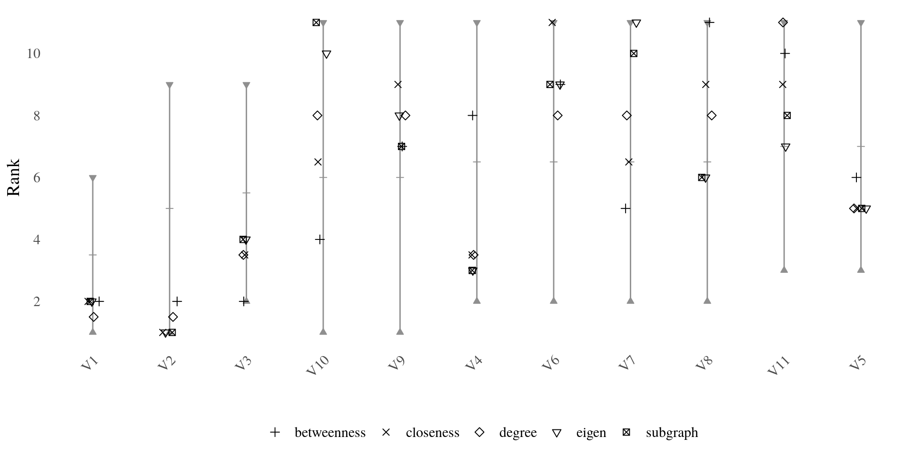
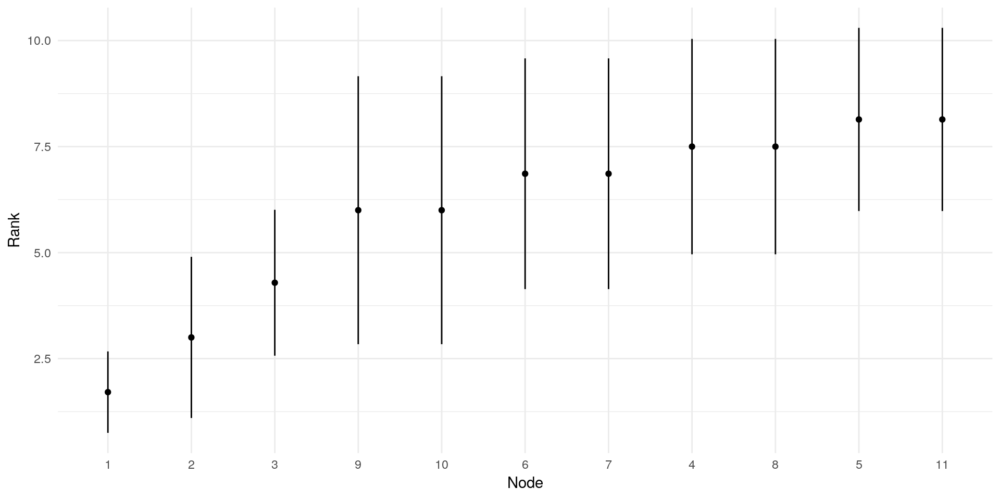

# Network Centrality in R: New ways of measuring Centrality

*This post was semi automatically converted from blogdown to Quarto and may contain errors. The original can be found in the [archive](http://archive.schochastics.net/post/network-centrality-in-r-new-ways-of-measuring-centrality/).*


This is the third post of a series on the concept of “network
centrality” with applications in R and the package `netrankr`. The last
part introduced the concept of neighborhood-inclusion and its
implications for centrality. In this post, we extend the concept to a
broader class of dominance relations by deconstructing indices into a
series of building blocks and introduce new ways of evaluating
centrality.

``` r
library(igraph)
library(ggraph)
library(tidyverse)
library(netrankr)
```

# Introduction

Neighborhood-inclusion seems to underlie many different centrality
indices and as such serves (or better: could serve) as a defining
property of a centrality index. That is:

> An index is a measure of centrality if and only if it preserves the
> partial ranking induced by neighborhood-inclusion

While this gives as a theoretical basis for centrality, it comes with a
bit of problem. Namely, that we do not expect many comparable pairs in
(large) real-world networks. Take the third example network from the
first post.

``` r
g3 <- readRDS("example_3.rds")
P <- neighborhood_inclusion(g3)
comparable_pairs(P)
```

``` hljs
## [1] 0.00600532
```

Only 0.6% of pairs are comparable. This means that centrality indices
are at liberty to rank 99.4% of pairs in any order. So,
neighborhood-inclusion may not be very restrictive in large networks.
This is much like with *structural equivalence*. It is a very intuitive
concept for equivalences in networks (having exactly the same
neighbors), however we do not expect many equivalent pairs in large
networks. This does not render the concept useless, but requires some
relaxations.

In the following, we introduce dominance relations, which incrementally
extend the partial ranking of neighborhood-inclusion and thus tighten
the partial ranking that indices preserve. We start by illustrating how
indices can be decomposed into a series of building blocks.

# Deconstructing Indices

Centrality indices assess structural importance based on a great variety
of different graph theoretic notions, like shortest paths (closeness) or
walks (subgraph centrality). Implicitly, though, they all follow a
simple recipe:

-   derive an indirect relation
-   aggregate the indirect relations

As mentioned above, indirect relation are commonly derived via graph
trajectories such as paths and walks, for instance to compute distances.
The aggregation is usually a simple summation of all relations of a
node, but others are possible too (e.g. maxmax max  as in eccentricity).
In its most generic form, we can thus write a centrality index as
c(i)=∑jτ(x)ij
$$c(i) = \\sum\\limits\_{j}\\tau(x)\_{ij}$$
*c*(*i*) = ∑_(*j*)*τ*(*x*)_(*i**j*)
where x*x**x* are the observed relations (basically the adjacency
matrix) and τ*τ**τ* a generic transformation function. Replacing τ*τ**τ*
with id*i**d**i**d*, we obtain degree centrality and setting
τ=dist*τ* = *d**i**s**t**τ* = *d**i**s**t*, we obtain closeness. A
suitable function τ*τ**τ* can be defined for all centrality indices,
such that any index can basically be seen as degree in an appropriately
transformed network.

The package `netrankr` provides a set of 24 different indirect relations
that can be used to construct indices. A few common examples are given
below.

``` r
#closeness 
g %>% 
  indirect_relations(type='dist_sp') %>% 
  aggregate_positions(type='invsum')
  
#betweenness
g %>% 
  indirect_relations(type='depend_sp') %>% 
  aggregate_positions(type='sum')
  
#eigenvector
g %>% 
  indirect_relations(type='walks',FUN=walks_limit_prop) %>% 
  aggregate_positions(type='sum')

#subgraph 
g %>% 
  indirect_relations(type='walks',FUN=walks_exp) %>% 
  aggregate_positions(type='self')
```

(Consult the help for `indirect_relations()` to see all options) Note
that we make use of the `%>%` operator. This should appeal to the recipe
idea from above: `network %>% indirect_relation %>% aggregation`. The
package also includes a handy RStudio addin, which can be used to build
the pipelines more easily.


Defining indices in this way is certainly more cumbersome than using,
say, `betweennes(g)`. However, it allows us to intervene at any step and
*do something else*.

# Extended Dominance Relations

To illustrate the “something else”, we look at our small example network
again.

``` r
g1 <- readRDS("example_1.rds")
```


Following the recipe, you have decided, that the *relations of interest*
for your analysis are the distances between nodes. The problem is,
aggregating them into an index can still be done in various ways. Three
distance based centrality examples are shown below.

``` r
#classic closeness
c_C <- g1 %>% 
  indirect_relations(type="dist_sp") %>% 
  aggregate_positions(type="invsum")

#harmonic closeness
c_HC <- g1 %>% 
  indirect_relations(type="dist_sp",FUN=dist_inv) %>% 
  aggregate_positions(type="sum")

#residual-type closeness
c_RC <- g1 %>% 
  indirect_relations(type="dist_sp",FUN=dist_2pow) %>% 
  aggregate_positions(type="sum")
```

Any of the above indices starts with the derivation of distances, but
then proceeds with a different form of aggregation:
cC(i)=1∑dist(i,j),cHC(i)=∑1dist(i,j),cRC(i)=∑2−dist(i,j)
$$c\_{C}(i) = \\frac{1}{\\sum dist(i,j)},\\quad c\_{HC}(i) = \\sum\\frac{1}{dist(i,j)},\\quad c\_{RC}(i) = \\sum 2^{- dist(i,j)}$$
$$
c_C(i)=\\frac{1}{\\sum dist(i,j)},\\quad c\_{HC}(i)=\\sum\\frac{1}{dist(i,j)}, \\quad c\_{RC}(i)=\\sum 2^{-dist(i,j)}
$$
Possibilities are virtually endless for aggregating distances into an
index. From the previous part, we know that any of these indices
preserve neighborhood-inclusion. Once we have settled for a relation, as
in this case, we can extend the partial ranking using the following
considerations: If a dist(i,k)*d**i**s**t*(*i*,*k*)*d**i**s**t*(*i*,*k*)
is larger than dist(j,k)*d**i**s**t*(*j*,*k*)*d**i**s**t*(*j*,*k*) for
all nodes k*k**k*, then no matter how we aggregate the relations (as
long as it is monotonic), i*i**i* will always be less central then
j*j**j*. With a bit more formalism: dist(i,k)≥dist(j,k) for
all k⟹cx(i)≤cx(j)
*d**i**s**t*(*i*,*k*) ≥ *d**i**s**t*(*j*,*k*) for all *k* ⇒ *c*_(*x*)(*i*) ≤ *c*_(*x*)(*j*)
*d**i**s**t*(*i*,*k*) ≥ *d**i**s**t*(*j*,*k*) for all *k* ⟹ *c*_(*x*)(*i*) ≤ *c*_(*x*)(*j*)
where cx*c*_(*x*)*c*_(*x*) is an arbitrary centrality index based on
distances. This actually defines a new dominance relation among nodes.
In fact, we can go a step further. It does not really matter in which
order we aggregate the distances, the result will always be the same.
Hence, we can permute all relations of a single node without affecting
the result. A convenient choice of permutation is simply to reorder all
relations in descending order. Afterwards, we can compute the dominance
relations as above. (More formal details on these dominance relations
can be found in [this
article](https://journals.sagepub.com/doi/abs/10.1177/2059799116630650).)

We can compute this new dominance relation using the function
`positional_dominance()`. The `benefit` parameter is set to `FALSE`
since large distances are not beneficial for a node to have. Setting
`map=TRUE` invokes the above mentioned reordering. For comparison, we
also compute neighborhood-inclusion again.

``` r
P <- neighborhood_inclusion(g1)
D <- g1 %>% 
  indirect_relations(type="dist_sp") %>% 
  positional_dominance(benefit=FALSE,map=TRUE)

c("neighborhood-inclusion"=comparable_pairs(P),"distance dominance"=comparable_pairs(D))
```

``` hljs
## neighborhood-inclusion     distance dominance 
##              0.1636364              0.8727273
```

By fixing our relation of interest to distances and allowing reordering
of relations, we went from only 16% of comparable pairs to 87%! Hence,
no matter what index based on distance we use, results will always be
very similar. As a sanity check, we can verify that all distance based
indices from above preserve the dominance relations.

``` r
c("classic"=is_preserved(D,c_C),"harmonic"=is_preserved(D,c_HC),"residual"=is_preserved(D,c_RC))
```

``` hljs
##  classic harmonic residual 
##     TRUE     TRUE     TRUE
```

# Partial Centrality

By now, we should have understood that there are various kinds of
partial rankings in networks, which form the basis of centrality.
Indices extend these partial rankings into **one** possible ranking,
but, as we will see later, there might be hundreds of thousands of
possible rankings. And hence, hundreds of thousands of indices that
produce these rankings. Instead of inventing hundreds of thousands of
indices, why not just study the partial rankings? Or why not be
extremely bold, and try to analyse **all** possible rankings at once?

In this section, we consider the former question, by introducing *rank
intervals*. A rank interval of a node is the set of ranks a node can
have in any ranking that extends a given partial ranking. Let us
consider two extreme cases. A node that is neither dominated nor
dominates any other node can potentially have any rank. So its rank
interval is \[1,n\]\[1, *n*\]\[1,*n*\]. (We use the convention, that
n*n**n* is the top rank and 111 the lowest possible rank). On the other
hand, if a node dominates all other nodes, it can only be ranked on the
top. So its rank interval is just a point.

`netrankr` includes the function `rank_intervals()` which returns the
rank intervals for all nodes in the network. A visual representation of
the intervals can be obtained with the `plot_rank_intervals()` function,
as done below for the first example network and neighborhood-inclusion
as partial ranking input. We also included an optional `data.frame`
containing centrality scores of five indices.

``` r
cent_scores <- data.frame(
   degree=degree(g1),
   betweenness=betweenness(g1),
   closeness=closeness(g1),
   eigen=eigen_centrality(g1)$vector,
   subgraph=subgraph.centrality(g1))

plot_rank_intervals(P,cent.df = cent_scores,ties.method = "average")
```

 The rank intervals are
extremely big for this network. Node 10, for instance can take any
possible rank. The most constraint interval is that of node 1,
containing 6 possible ranks. The rank intervals can be interpreted as a
sort of confidence interval for centrality. The larger the interval, the
less explanatory power a single index may have Again, consider Node 10.
It is the most central node according to subgraph centrality, but ranks
very low in betweenness.

We have learned that we can extend neighborhood-inclusion by choosing a
relation of interest as basis for our analysis. For the example network,
we considered distances. The below figure shows the resulting rank
intervals.

``` r
cent_scores <- data.frame(
   classic=c_C,
   harmonic=c_HC,
   residual=c_RC)

plot_rank_intervals(D,cent.df = cent_scores)
```

 Notice how much smaller they
got. The intervals of node 1 and 2 even collapse into a single point.
They will thus always be ranked at the bottom in any distance based
centrality ranking.

Rank intervals are a convenient choice to assess the possibilities of
rankings in a network. It is important to understand, though, that the
ranks in each interval do not occur with uniform probability. A rank
interval \[6,7\]\[6, 7\]\[6,7\] does not mean that the node is ranked
6th in 50% of all possible rankings. We address the *rank probabilities*
in the next section.

# Probabilistic Centrality

A node ranking can be defined as a mapping rk:V→{1,…,n},
*r**k* : *V* → {1, …, *n*},
*r**k* : *V* → {1, …, *n*},
where we use the convention that u*u**u* is the top ranked node if
rk(u)=n*r**k*(*u*) = *n**r**k*(*u*) = *n* and the bottom ranked one if
rk(u)=1*r**k*(*u*) = 1*r**k*(*u*) = 1. The set of all possible rankings
can then be characterized as R(≤)={rk:V→{1,…,n}:u≤v⟹rk(u)≤rk(v)}.
ℛ(≤) = {*r**k* : *V* → {1, …, *n*} : *u* ≤ *v* ⇒ *r**k*(*u*) ≤ *r**k*(*v*)}.
ℛ(≤) = {*r**k* : *V* → {1, …, *n*} : *u* ≤ *v* ⟹ *r**k*(*u*) ≤ *r**k*(*v*)}.
This set contains all rankings that could be obtained for centrality
indices that preserve the partial ranking of a dominance relation “≤≤≤”.

Once R(≤)ℛ(≤)ℛ(≤) is calculated, it can be used for a probabilistic
assessment of centrality, analyzing all possible rankings at once.
Examples include *relative rank probabilities* (How likely is it, that a
node u*u**u* is more central than another node v*v**v*?) or *expected
ranks* (How central do we expect a node u*u**u* to be).

`netrankr` includes the function `exact_rank_prob()`, which helps to
answer the above posted questions. We stick with our small example
network and apply the function to both, neighborhood-inclusion and
dominance based on distances.

``` r
probNI <- exact_rank_prob(P) 
probD  <- exact_rank_prob(D)
```

The function returns a large list of different outputs, which we discuss
in the following. The number of possible rankings is stored in
`lin.ext`.

``` r
c("neighborhood-inclusion"=probNI$lin.ext,"distances"=probD$lin.ext)
```

``` hljs
## neighborhood-inclusion              distances 
##                 739200                     20
```

So, for this tiny network, there are still more than 700,000
possibilities to rank the nodes differently. If we restrict ourselves to
distances, we end up with only 20.

The rank probabilities (for example how likely is it that node u*u**u*
is ranked on top?) are stored in the matrix `rank.prob`. We here focus
on the probability to be the most central node.

``` r
top_rank <- ncol(probNI$rank.prob)
probNI$rank.prob[,11]
```

``` hljs
##         V1         V2         V3         V4         V5         V6 
## 0.00000000 0.00000000 0.00000000 0.13636364 0.16363636 0.10909091 
##         V7         V8         V9        V10        V11 
## 0.10909091 0.13636364 0.09090909 0.09090909 0.16363636
```

Node 5 and 11 have the highest probability to be the most central node.
You can think of the probabilities as follows: If we would apply
thousands of indices to the network, in 16% of the cases will node 5 be
the most central node.

Relative rank probabilities (How likely is it that u*u**u* is less
central than v*v**v*?) are stored in the matrix `relative.rank`.

``` r
round(probNI$relative.rank,2)
```

``` hljs
##       V1   V2   V3   V4   V5   V6   V7   V8   V9  V10  V11
## V1  0.00 0.67 1.00 0.95 1.00 1.00 1.00 0.95 0.86 0.86 1.00
## V2  0.33 0.00 0.67 1.00 0.92 0.83 0.83 1.00 0.75 0.75 0.92
## V3  0.00 0.33 0.00 0.80 1.00 0.75 0.75 0.80 0.64 0.64 1.00
## V4  0.05 0.00 0.20 0.00 0.56 0.44 0.44 0.50 0.38 0.38 0.56
## V5  0.00 0.08 0.00 0.44 0.00 0.38 0.38 0.44 0.32 0.32 0.50
## V6  0.00 0.17 0.25 0.56 0.62 0.00 0.50 0.56 0.43 0.43 0.62
## V7  0.00 0.17 0.25 0.56 0.62 0.50 0.00 0.56 0.43 0.43 0.62
## V8  0.05 0.00 0.20 0.50 0.56 0.44 0.44 0.00 0.38 0.38 0.56
## V9  0.14 0.25 0.36 0.62 0.68 0.57 0.57 0.62 0.00 0.50 0.68
## V10 0.14 0.25 0.36 0.62 0.68 0.57 0.57 0.62 0.50 0.00 0.68
## V11 0.00 0.08 0.00 0.44 0.50 0.37 0.37 0.44 0.32 0.32 0.00
```

For example, the probability that node 2 is less central than node 1 is
0.330.330.33. The closer a probability to 0.50.50.5 (see node 11 and 5),
the less reason exists to put either node on top of the other.

The last return values of interest are the expected ranks and the
standard deviation in `expected.rank` and `rank.spread`. The expected
ranks can be seen as a sort of baseline ranking. Applying hundreds of
random indices, this is the ranking we could expect to get on average.

``` r
exp_rk <- round(probNI$expected.rank,2)
sd_rk <- round(probNI$rank.spread,2)
tibble(nodes=1:11,expected=exp_rk,sd=sd_rk) %>% 
  ggplot(aes(x=reorder(nodes,expected)))+
  geom_segment(aes(y=expected-sd,yend=expected+sd,xend=reorder(nodes,expected)))+
  geom_point(aes(y=expected))+
  theme_minimal()+
  labs(y="Rank",x="Node")
```

 The standard deviations are quite large
for neighborhood-inclusion, which was to be expected from the big rank
intervals. The below figure shows the expected ranks for the distance
based dominance.

``` r
exp_rk <- round(probD$expected.rank,2)
sd_rk <- round(probD$rank.spread,2)
tibble(nodes=1:11,expected=exp_rk,sd=sd_rk) %>% 
  ggplot(aes(x=reorder(nodes,expected)))+
  geom_segment(aes(y=expected-sd,yend=expected+sd,xend=reorder(nodes,expected)))+
  geom_point(aes(y=expected))+
  theme_minimal()+
  labs(y="Rank",x="Node")
```


As a word of warning: The problem of finding all possible rankings for a
partial ranking is computationally a hard problem. So it is advisable to
use `exact_rank_prob()` only for small networks. Some benchmark results
and approximation methods for larger networks can be found
[here](https://schochastics.github.io/netrankr/articles/benchmarks.html).

# Summary

After this post, it is time to take stock of what we have done so far.
To date, putting it bluntly, network centrality is nothing more than the
application of indices to a network:

 The only degree of freedom is the choice
of index and it is hard to justify choices without resorting to
data-driven reasoning, as in “We used betweenness because it worked
best”.

The introduced neighborhood-inclusion and more specific dominance
concepts allow for additional ways of analyzing centrality in networks,
described in this superficial diagram.


Any centrality analysis starts with identifying the *relation of
interest*, which replaces the choice of index. The relation of interest
is usually some graph-theoretic property (e.g. distances) that we assume
to be indicative for centrality. The relations of a node to all others
is called its *position*. The aggregation of the relations leads to the
definition of indices, hence the usual centrality concept. However,
positions can also be compared via *positional dominance*, the dominance
relation introduced in this post, leading to partial centrality rankings
and the option to calculate probabilistic centrality rankings.

So far, we have mostly been toying around with small contrived networks.
The final post will illustrate the introduced methodology by means of a
more realistic application example.

