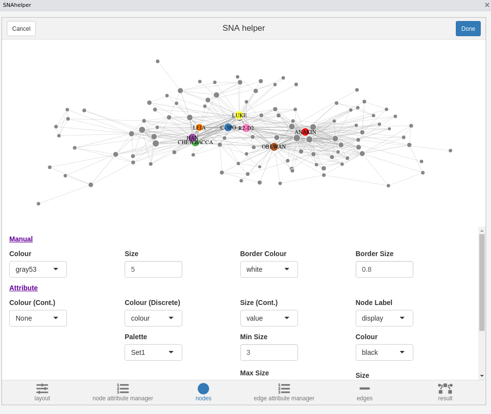
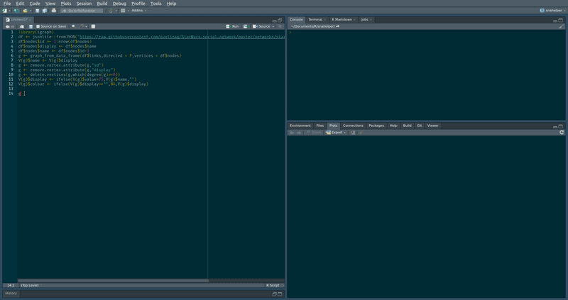
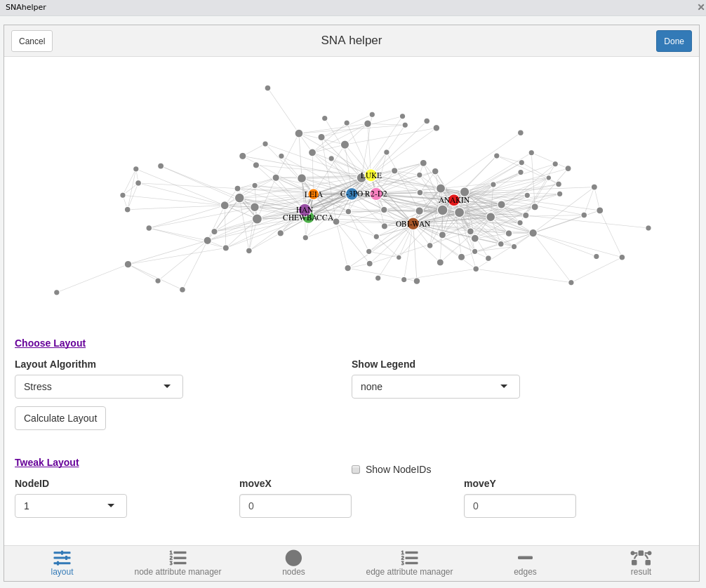
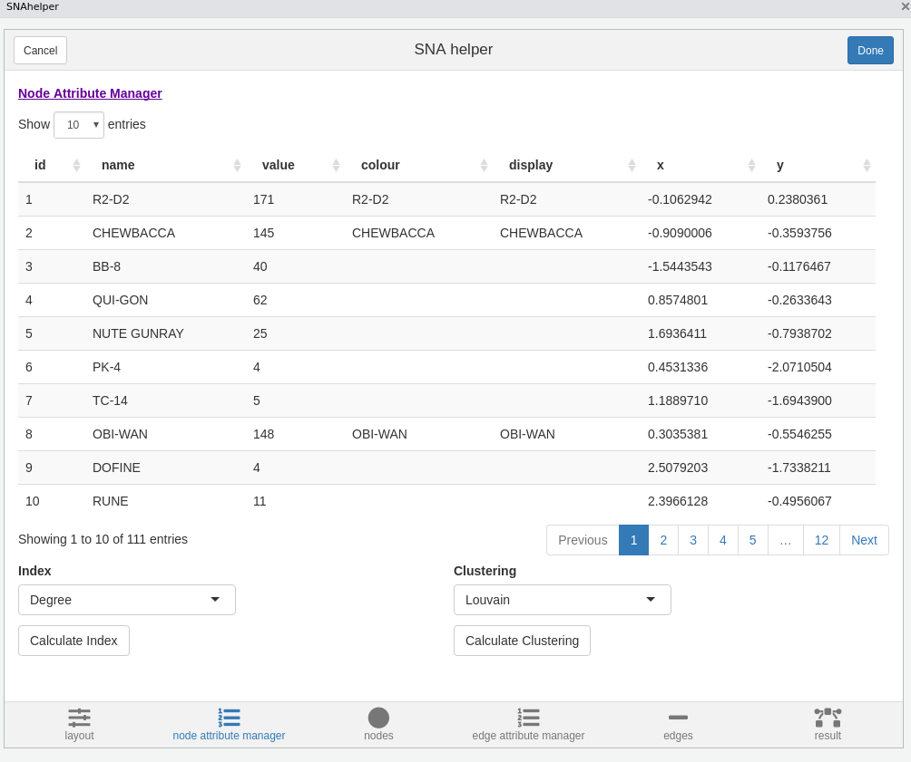
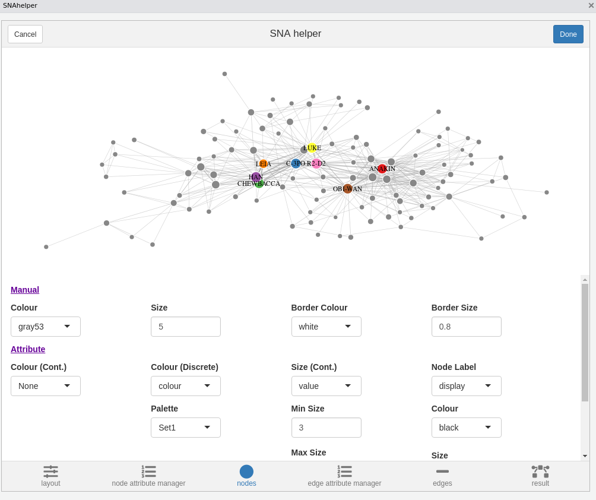
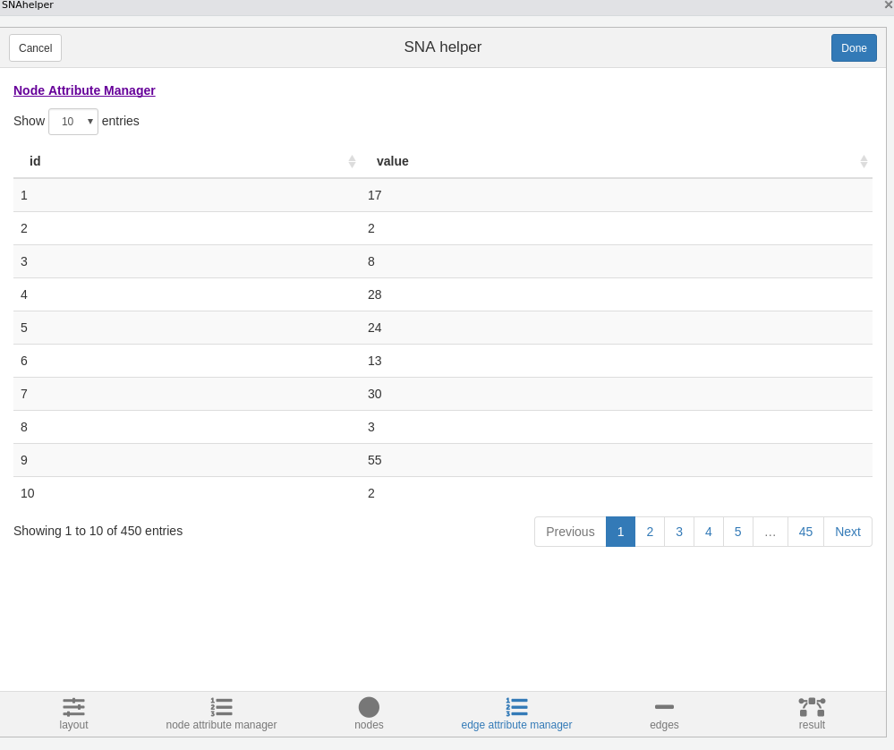
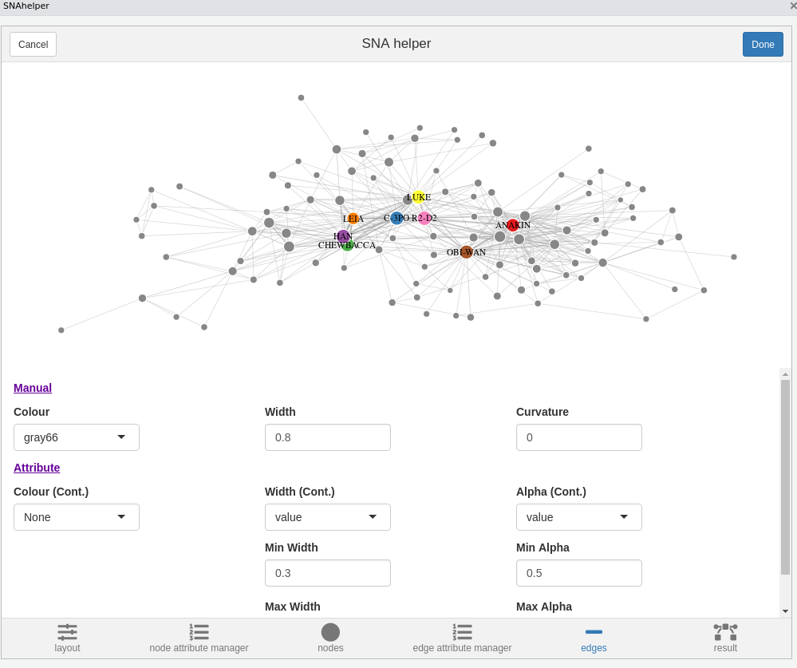
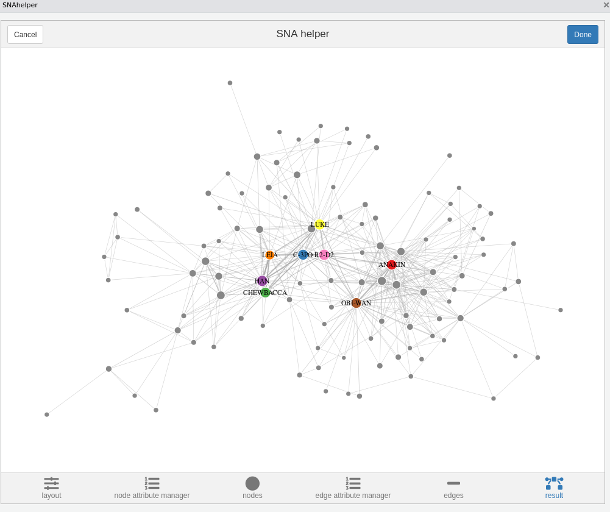

*This post was semi automatically converted from blogdown to Quarto and may contain errors. The original can be found in the [archive](http://archive.schochastics.net/post/an-rstudio-addin-for-network-analysis-and-visualization/).*

**The package `smglr` was renamed to `graphlayouts`**

The `ggraph` package provides a ggplot-like grammar for plotting graphs
and as such you can produce very neat network visualizations. But as
with ggplot, it takes a while to get used to the grammar. There are
already a few amazing Rstudio Addins that assist you with ggplot (for
example [ggplotAssist](https://github.com/cardiomoon/ggplotAssist) and
[ggThemeAssist](https://cran.r-project.org/web/packages/ggThemeAssist/index.html)),
but there has not been any equivalent tools for `ggraph`. Till now. This
post introduces `snahelper`, an Rstudio Addin which provides a tiny GUI
for visualizing and analysing networks.



# Installation and Usage

You can install the developer version with:

``` r
#install.packages(devtools)
devtools::install_github("schochastics/snahelper")
```

In order to work properly, the Package also needs the `smglr` Package,
which adds a new layout algorithm.

``` r
devtools::install_github("schochastics/smglr")
```

In order to use the Addin, simply highlight a network in your script and
select `snahelper` from the Addin dropdown menu.



# Interface

The GUI has the following components:

-   Create and tweak a layout for your network
-   Check and add note attributes
-   Create the node styles
-   Review edge attributes
-   Create the edge styles
-   Review Result
-   Get the Code

Let’s go through them step-by-step.

## Layout

The layout tab allows you to choose from all implemented algorithms in
`igraph` and the stress based layout from `smglr`, which is the default
and recommended choice. See this [blog
post](http://blog.schochastics.net/post/stress-based-graph-layouts/) for
an explanation. In the tweak section you can move individual nodes
around. The implementation is still very crude, so don’t expect miracles
from that. The layout is saved as node attributes x and y.



## Node Attribute Manager

The Node Attribute Manager shows all existing node attributes in a
sortable table. In addition, you can calculate some new ones (centrality
and clustering).  
*NOTE*: the centrality indices only work for undirected and unweighted
networks so far.



## Nodes

This is where you can style your nodes. You can either do it manually,
by choosing a color/size for all nodes together, or based on an
attribute.



## Edge Attribute Manager

So far, the Edge Attribute Manager only shows existing edge attributes.
Future releases may include the possibility to calculate new ones.



## Edges

You can style your edges here. `snahelper` automatically detects if your
network is directed and adds arrows if the network is directed. The
other options are similar to the nodes tab. The curvature option allows
you to bend edges. I highly suggest, that you only bend your edges if
there are two edges running between the same set of nodes to make them
visible. If you do not have reciprocal edges, then just leave it at 0.



## Result

The result tab shows the network in its full size. If you are satisfied
with the results, hit the Done button and the R code to produce the plot
is automatically inserted in your script.



# Additional Features

So far I only incorporated what I consider the bare minimum to produce a
good visualization of a network. Mostly because I did not want to
overload the GUI. If you are missing something essential, open an
[issue](https://github.com/schochastics/snahelper/issues) and I will try
to add the feature.

