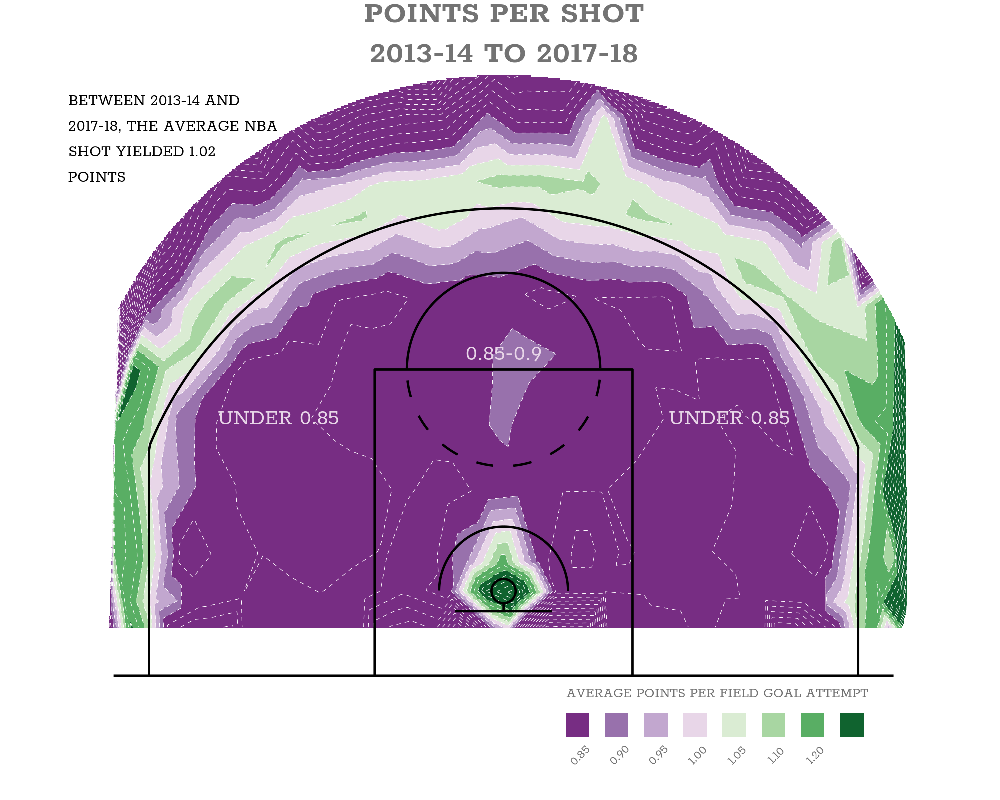
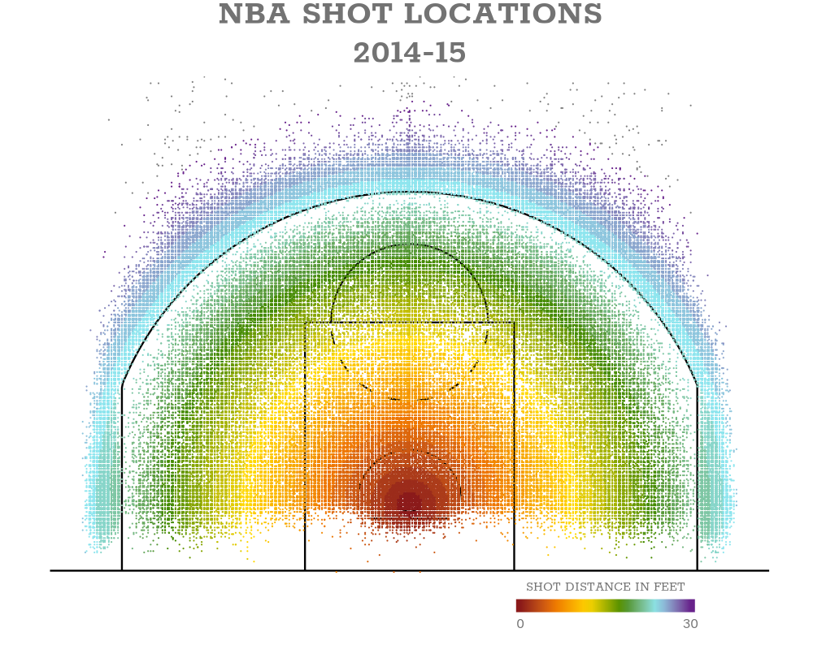
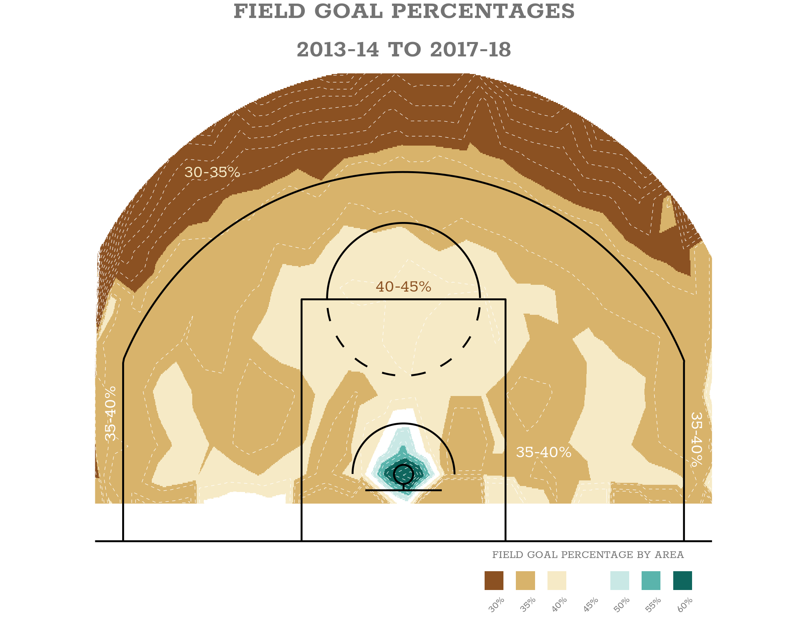

*This post was semi automatically converted from blogdown to Quarto and may contain errors. The original can be found in the [archive](http://archive.schochastics.net/post/mapping-nba-shot-locations/).*

I recently came across the article [“How Mapping Shots In The NBA
Changed It
Forever”](https://fivethirtyeight.com/features/how-mapping-shots-in-the-nba-changed-it-forever/)
and although I am not a big basketball fan, I was impressed by the
visualizations. I actually bought the book “Sprawlball” by [Kirk
Goldsberry](https://twitter.com/kirkgoldsberry?lang=en) afterwards,
where this was taken from. I can only recommend it, even if you are not
a huge basketball fan since it contains a lot of inspirational dataviz
material.

In this post, I am going to try to replicate the first three
visualizations of the linked article, which turned out to be harder than
expected! Additionally, I will use the `rayshader` package to turn one
of the figures into a nice 3D plot.



``` r
library(tidyverse)
library(showtext)
library(hexbin)
```

# Data

When I decided to do this replication, I was pretty sure that it is
doomed to failure since I will not get the right data (precise shot
locations). Turns out, stats.nba.com has an incredible rich (but
undocumented) API. I will not go into detail on how I got all the
relevant data, but if you want to get it yourself, check out
toddwschneider’s R package `ballr`, specifically
[this](https://github.com/toddwschneider/ballr/blob/master/players_data.R)
function.

I took several hours, but at the end I managed to put together a dataset
of all shots in the NBA between 2006 and 2019. In the following, we will
only need 2013-2018 though.

# Scatterplot of shot locations

The first figure in the article is the easiest to reproduce, since it is
a simple scatterplot. The only thing that took a bit of time was to find
a suitable font. In the end, I settled with Rokkitt from Google, which
can be loaded via the `showtext` package as follows.

``` r
font_add_google("Rokkitt", "rokkitt")
showtext_auto()
```

A second issue was to get the court in the background. The `ballr`
package luckily has a `plot_court` function which I tweaked slightly for
my purposes.

``` r
col_scheme <- c("firebrick4","darkorange2","gold1",
                "chartreuse4","cadetblue2","darkorchid4")

p <- plot_court()+
  geom_point(data = scatter_shots,
             aes(loc_x,loc_y,col = shot_distance),size = 0.1)+
  scale_color_gradientn(colours = col_scheme,breaks = c(0,30),limits = c(0,30),
                        name = "SHOT DISTANCE IN FEET")+
  guides(colour = guide_colourbar(barwidth = 11, barheight = 0.8,ticks = F,
                                  title.position = "top",title.hjust = 0.5))+
  labs(title = "NBA SHOT LOCATIONS\n2014-15")+
  theme(plot.title = element_text(hjust=0.5,size = 32,colour="grey45",
                                  family="rokkitt",face = "bold"),
        legend.position = "bottom",legend.justification = c(0.88,0),
        legend.text = element_text(size=14,colour = "grey45",family = "rokkitt"),
        legend.title = element_text(size=13,colour = "grey45",family = "rokkitt"),
        legend.box.margin = margin(c(-50,0,3,0)),
        plot.margin = margin(3,3,3,3, unit = "pt"))

ggsave("shots2014-15.png",plot = p ,width = 10, height = 8, dpi = 100)
```



Looks pretty close to the original. Although it was quite
straightforward to reproduce this figure, I still learned two things:
How to tweak a colourbar legend with `guide_colourbar` and how to use
the legend.justification argument of `theme`.

# Field goal percentages

Reproducing the second figure of the article is way more involved than
the first (at least it was for me). The figure has a lot of very smooth
areas and I would assume that it is more of an illustration than an
accurate depiction of the data (which is of course totally fine in this
context!). I tried out several things, and in the end I settled for a
combination of “hexbin aggregation” and interpolating the data on a
regular grid.

The first step was to aggregate shots in roughly the same location into
cells and calculate the field goal percentages for each cell. I did so
using the `hexbin` function of the package with the same name.

``` r
tbl <- vroom::vroom(c("shots2013-14.csv","shots2014-15.csv","shots2015-16.csv",
                      "shots2016-17.csv","shots2017-18.csv")) %>% 
  select(loc_x,loc_y,shot_made_numeric,shot_value,shot_distance)

bns <- 20 
hb <- hexbin(x = tbl$loc_x,y = tbl$loc_y,xbins = bns,IDs = TRUE)

shot_perc <- tbl %>% 
  mutate(hex = hb@cID) %>% 
  group_by(hex) %>% 
  dplyr::summarise(perc = sum(shot_made_numeric)/n())
shot_perc <- left_join(shot_perc,tibble(hex = hb@cell,x = hb@xcm,y = hb@ycm),by = "hex")
```

I played around with the number of bins and found that 20 seemed to be a
good trade-off. Afterwards, I created a regular grid with 1000 points
per dimension and interpolated the shot percentages with the `interp`
function from the `akima` package.

``` r
npts <- 1000
xyz_interp <- akima::interp(x = shot_perc$x,y = shot_perc$y,
                            z = shot_perc$perc,nx = npts,ny = npts,linear = T)

shot_perc_plot <- tibble(x = rep(xyz_interp[[1]],npts),
                         y = rep(xyz_interp[[2]],each=npts),
                         z = c(xyz_interp[[3]])) %>% 
  dplyr::filter(!is.na(z) & y >= -2) %>% 
  mutate(z=if_else(y < 0 & z <= 0.35,0.36,z)) %>% 
  mutate(z=if_else(y < 0 & z >= 0.45 & x > 5,0.45,z)) %>% 
  mutate(zfill=case_when(z <= 0.35~0.35,
                     z <= 0.4~0.40,
                     z <= 0.45~0.45,
                     z <= 0.50~0.50,
                     z <= 0.55~0.55,
                     z <= 0.60~0.6,
                     TRUE~0.65)) %>% 
  mutate(zfill = as.factor(zfill)) %>% 
  dplyr::filter(sqrt(x^2+(y-hoop_center_y)^2)<=27)  
```

`shot_perc_plot` now contains (interpolated) field goal percentages on a
regular grid for the whole court. Visualizing this is now relatively
straightforward with a combination of `geom_tile`, `geom_contour` and
some annotation sugar.

``` r
p <- ggplot(shot_perc_plot)+
  geom_tile(aes(x,y,fill=zfill))+
  geom_contour(aes(x,y,z=z),
               binwidth = 0.03,col="white",size=0.2,linetype="dashed")+
  geom_path(data = court_points,
            aes(x = x, y = y-5, group = desc),
            color = "black",size=0.8
  ) +
  geom_hline(yintercept = -5,size=0.8)+
  annotate("text",x = 0,y = 15,size = 12,
           label = "40-45%",colour = "#8b5122",family = "rokkitt")+
  annotate("text",x = -15,y = 24,size = 12,
           label = "30-35%",colour = "#f6eac6",family = "rokkitt")+
  annotate("text",x = -23,y = 5,size = 12,
           label = "35-40%",colour = "white",family = "rokkitt",angle = 90)+
  annotate("text",x = 23,y = 3,size = 12,
           label = "35-40%",colour = "white",family = "rokkitt",angle = 270)+
  annotate("text",x = 11,y = 2,size = 12,
           label = "35-40%",colour = "white",family = "rokkitt")+
  scale_fill_manual(values = c("#8b5122", "#d8b36b", "#f6eac6", 
                               "#FFFFFF", "#c9e8e5", "#5ab4ac", "#0f665e"),
                    name="FIELD GOAL PERCENTAGE BY AREA",
                    labels=c("30%","35%","40%","45%","50%","55%","60%"))+
  guides(fill = guide_legend(nrow = 1,title.position = "top",title.hjust = 0.5,
                             label.position = "bottom"))+
  coord_fixed(ylim = c(-5,30),xlim=c(-22,22))+
  labs(title="FIELD GOAL PERCENTAGES\n2013-14 TO 2017-18")+
  theme_minimal(base_size = 22) +
  theme(plot.title = element_text(hjust = 0.5,size = 48,colour = "grey45",
                                  family = "rokkitt",face = "bold",lineheight = 0.6),
        legend.position = "bottom",legend.justification = c(0.98,0),
        legend.text = element_text(size = 20,colour = "grey45",
                                   family = "rokkitt",angle = 45,hjust = 0.5),
        legend.title = element_text(size = 22,colour = "grey45",family = "rokkitt"),
        legend.box.margin = margin(c(-50,0,3,0)),
        plot.margin = margin(3,3,3,3, unit = "pt"),
        plot.background = element_rect(fill = "white", color = "white"),
        panel.background = element_rect(fill = "white", color = "white"),
        panel.grid = element_blank(),
        panel.border = element_blank(),
        axis.text = element_blank(),
        axis.title = element_blank(),
        axis.ticks = element_blank())

ggsave("fgp2013-18.png",plot = p ,width = 10, height = 8, dpi = 200)
```



The result is not as smooth as the original but the overall picture is
very close to it.

# Points per shot

The third figure in the article is pretty much the same as the second.
Just with different data. So we can use the same
aggregation/interpolation strategy as before.

``` r
bns <- 20 
hb <- hexbin(x = tbl$loc_x,y = tbl$loc_y,xbins = bns,IDs = TRUE)
shot_pts <- tbl %>% 
  mutate(hex = hb@cID) %>% 
  group_by(hex) %>% 
  dplyr::summarise(pts = sum(shot_made_numeric*shot_value)/n())

shot_pts <- left_join(shot_pts,tibble(hex = hb@cell,x = hb@xcm,y = hb@ycm),by="hex")

npts <- 1000
xyz_interp <- akima::interp(x = shot_pts$x,y = shot_pts$y,
                            z = shot_pts$pts,nx = npts,ny = npts,linear = T)

shot_pts_plot <- tibble(x = rep(xyz_interp[[1]],npts),
                         y = rep(xyz_interp[[2]],each=npts),
                         z = c(xyz_interp[[3]])) %>% 
  dplyr::filter(!is.na(z) & y>= -2) %>% 
  mutate(z=if_else(y<1 & z>=0.85 & (between(x,5,20) | between(x,-20,-5)),0.85,z)) %>%
  mutate(zfill=case_when(z<=0.85~0.85,
                         z<=0.90~0.90,
                         z<=0.95~0.95,
                         z<=1.00~1.00,
                         z<=1.05~1.05,
                         z<=1.10~1.1,
                         z<=1.2~1.2,
                         TRUE~1.25)) %>% 
  mutate(zfill=as.factor(zfill)) %>% 
  dplyr::filter(sqrt(x^2+(y-hoop_center_y)^2)<=27)
```

If you look closely at the third figure, you will realize that there is
a strong cut between the two and three point area. So technically, we
should have treated the two areas separately and combine the results in
the end. However, I did not manage to do this in a satisfying way, so I
stuck with treating both areas together, which will of course change the
figure slightly.

``` r
p <- ggplot(shot_pts_plot)+
  geom_tile(aes(x,y,fill=zfill))+
  geom_contour(aes(x,y,z=z),binwidth = 0.05,col="white",size=0.2,linetype="dashed")+
  geom_path(data = court_points,
            aes(x = x, y = y-5, group = desc),
            color = "black",size=0.8
  ) +
  geom_hline(yintercept = -5,size=0.8)+
  annotate("text",x=-14,y=11,size=12,
           label="UNDER 0.85",colour="#e8d6e8",family="rokkitt")+
  annotate("text",x=14,y=11,size=12,
           label="UNDER 0.85",colour="#e8d6e8",family="rokkitt")+
  annotate("text",x=0,y=15,size=12,
           label="0.85-0.9",colour="#e8d6e8",family="rokkitt")+
  annotate("text",x=-27,y=31,size=9,
           label="BETWEEN 2013-14 AND\n2017-18, THE AVERAGE NBA\nSHOT YIELDED 1.02\nPOINTS",
           hjust=0,vjust=1,family="rokkitt",lineheight = 0.6)+
  scale_fill_manual(values=c("#772d83","#9871ac","#c2a7cf","#e8d6e8",
                             "#daecd3","#a8d6a2","#59ae64","#10632f"),
                    name="AVERAGE POINTS PER FIELD GOAL ATTEMPT",
                    labels=c("0.85","0.90","0.95","1.00","1.05","1.10","1.20",""))+
  guides(fill = guide_legend(nrow = 1,title.position = "top",title.hjust = 0.5,
                             label.position = "bottom"))+
  coord_fixed(ylim = c(-5,30),xlim=c(-22,22),clip="off")+
  labs(title="POINTS PER SHOT\n2013-14 TO 2017-18")+
  theme_minimal(base_size = 22) +
  theme(plot.title = element_text(hjust=0.5,size = 48,colour="grey45",
                                  family="rokkitt",face = "bold",lineheight = 0.5),
        legend.position = "bottom",legend.justification = c(0.98,0),
        legend.text = element_text(size=20,colour="grey45",
                                   family="rokkitt",angle = 45,hjust=0.5),
        legend.title = element_text(size=22,colour="grey45",family="rokkitt"),
        legend.box.margin=margin(c(-50,0,3,0)),
        plot.margin = margin(3,3,3,3, unit = "pt"),
        plot.background = element_rect(fill = "white", color = "white"),
        panel.background = element_rect(fill = "white", color = "white"),
        panel.grid = element_blank(),
        panel.border = element_blank(),
        axis.text = element_blank(),
        axis.title = element_blank(),
        axis.ticks = element_blank())

ggsave("pps2013-18.png",plot = p ,width = 10, height = 8, dpi = 200)
```


Again, the result is not as smooth as the original. Especially the
boundary of the two and three point area looks different. Overall
though, I think the figure captures the essential result of the
original.

# 3D plot of points per shot

Recently, I learned about the awesome `rayshader` package by
[tylermorganwall](https://twitter.com/tylermorganwall?lang=en).
Especially the relatively new feature of turning any ggplot object into
a 3D plot is fascinating! The below code turns the points per shot
figure into a 3D object and produces a short video that navigates the
plot.

``` r
plot_gg(p, width = 5, height = 5, multicore = TRUE, scale = 250, 
        zoom = 0.7, theta = 10, phi = 30, windowsize = c(800, 800))

phivec <- 20 + 70 * 1/(1 + exp(seq(-5, 10, length.out = 180)))
phivecfull <- c(phivec, rev(phivec))
thetavec <- 90 * sin(seq(0,359,length.out = 360) * pi/180) #+270
zoomvec <- 0.5 + 0.5 * 1/(1 + exp(seq(-5, 10, length.out = 180)))
zoomvecfull <- c(zoomvec, rev(zoomvec))

for(i in 1:360) {
  render_camera(theta = thetavec[i],phi = phivecfull[i],zoom = zoomvecfull[i])
  render_snapshot(paste0("anim/frame", i, ".png"))
}

#Run this command in the command line using ffmpeg to stitch together a video:
#ffmpeg -framerate 60 -i frame%d.png -vcodec libx264 raymovie.mp4

#And run this command to convert the video to post to the web:
#ffmpeg -i raymovie.mp4 -pix_fmt yuv420p -profile:v baseline -level 3 -vf scale=-2:-2 rayweb.mp4
```

This is the result:

