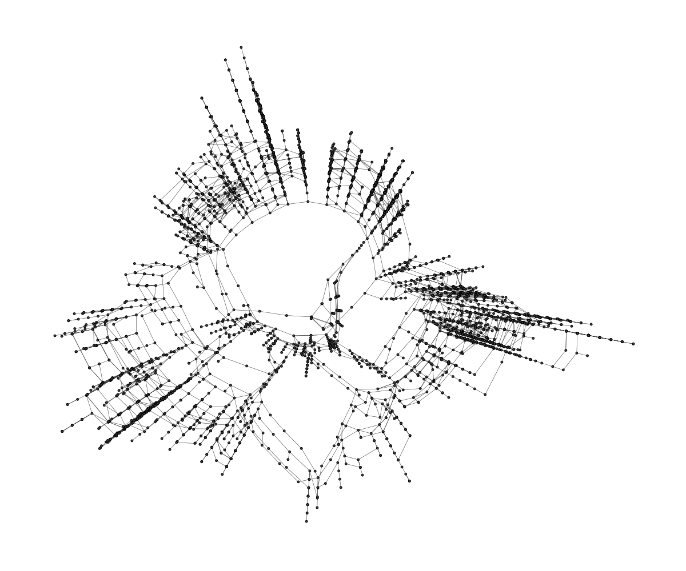
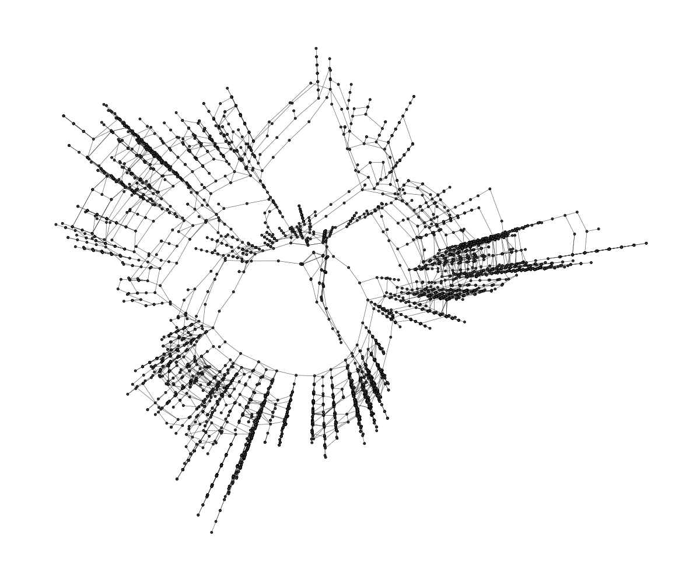
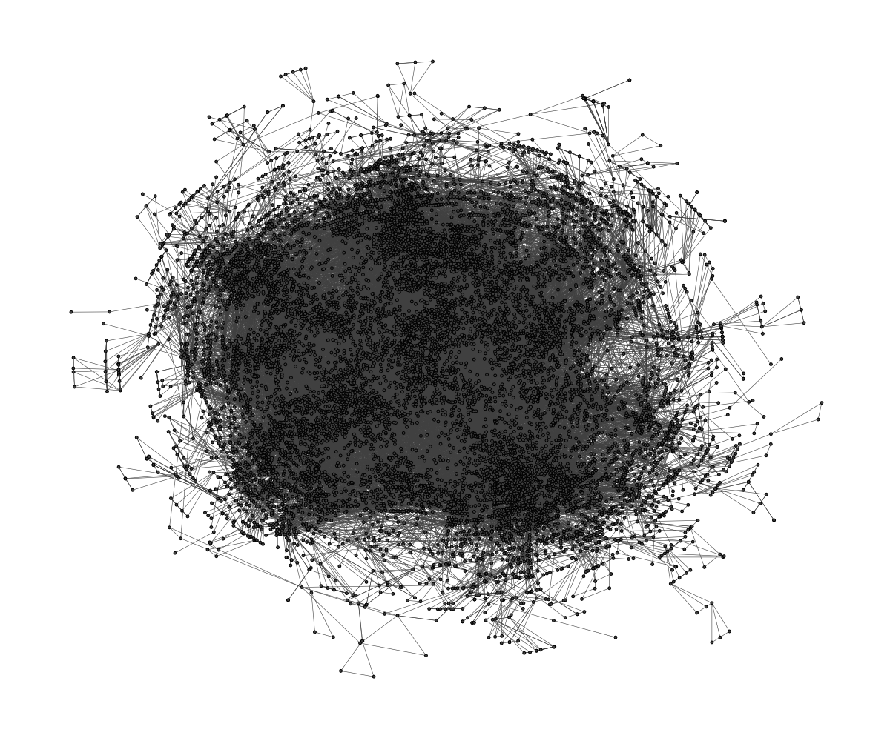
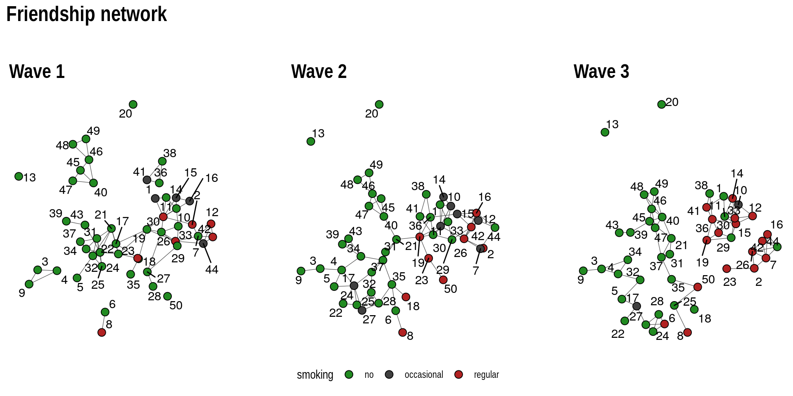

*This post was semi automatically converted from blogdown to Quarto and may contain errors. The original can be found in the [archive](http://archive.schochastics.net/post/graphlouts-v0-5-0/).*

A new version of
[graphlayouts](https://cran.r-project.org/web/packages/graphlayouts/index.html)
is now available on CRAN. This major update introduces several new
layout algorithms and adds additional support for weighted networks.
Here is a breakdown of all changes:

-   **BREAKING CHANGE**: removed `qgraph()`. Now part of `ggraph`.
-   **POSSIBLE BREAKING CHANGE**: `layout_with_focus()` now also returns
    the distance to the focus node
-   changed filenames (doesn’t have any effect on functionality)
-   added `layout_as_dynamic()` for longitudinal network data
-   removed `gbp` and `scales` dependency and moved `oaqc` to suggest
-   edge weights are now supported in `layout_with_stress()` and
    `layout_with_focus()`
-   added `layout_with_pmds()` (Pivot MDS for large graphs)
-   added `layout_with_sparse_stress()` (“stress for large graphs”)


All layout algorithms will be fully supported by the new version of
`ggraph`.  
An updated tutorial for `ggraph` and `graphlayouts` can be found
[here](http://mr.schochastics.net/netVizR.html).

``` r
library(igraph)
library(ggraph)
library(graphlayouts)
library(patchwork)
```

# Large networks

Two layout algorithms for large graphs were added in this version.
`layout_with_pmds()` is similar to `layout_with_mds()` from `igraph`,
but performs the MDS only on a small set of pivots to reduce computation
time. Below is an example using the US PowerGrid network (4941 nodes and
6594 edges). The runtime for the full MDS calculation was 114s.



Pivot MDS with 50 pivots computes a comparable layout in under 1 second.

``` r
# US PowerGrid network obtained from https://sparse.tamu.edu/
ggraph(power,layout = "pmds", pivots = 50)+
  geom_edge_link0(edge_colour = "grey66")+
  geom_node_point(size = 3)+
  theme_graph()
```



`layout_with_sparse_stress()` is built with a similar logic as pivot
MDS. Instead of calculating the full stress model, only a small set of
pivots is used.

``` r
# collaboration network (preprints in condensed matter archive) 
# obtained from https://sparse.tamu.edu/
ggraph(power,layout = "sparse_stress", pivots = 50)+
  geom_edge_link0(edge_colour = "grey66")+
  geom_node_point(size = 3)+
  theme_graph()
```



For the above network with \~12000 nodes and \~70000 edges, the
algorithm ran 22s (The full stress model did not terminate within 10m).

The [graphlayouts
wiki](https://github.com/schochastics/graphlayouts/wiki) includes
several additional examples and a runtime comparison with other existing
layout algorithms.

# Dynamic networks

One algorithm was added to calculate layouts for longitudinal network
data. The function `layout_as_dynamic()` is not yet supported by
`ggraph`.

The algorithm starts by computing a reference layout based on the
aggregated network of all networks. Afterwards, a layout is calculated
for each network separately which is then combined with the reference
layout in a linear combination. The parameter `alpha` controls the
influence of the reference layout. For alpha=1, only the reference
layout is used and all graphs have the same layout. For alpha=0, the
stress layout of each individual graph is used. Values in-between
interpolate between the two layouts.

Below is an example that shows how to use the function together with
`ggraph` and `patchwork` to produce a series of network snapshots of
longitudinal data.

``` r
# 3 Waves of 50 girls from 'Teenage Friends and Lifestyle Study' data 
# https://www.stats.ox.ac.uk/~snijders/siena/
gList
```

``` hljs
## [[1]]
## IGRAPH 428bab0 UN-- 50 74 -- 
## + attr: name (v/c), smoking (v/c)
## + edges from 428bab0 (vertex names):
##  [1] V1 --V11 V1 --V14 V2 --V7  V2 --V11 V3 --V4  V3 --V9  V4 --V9 
##  [8] V5 --V32 V6 --V8  V7 --V12 V7 --V26 V7 --V42 V7 --V44 V10--V11
## [15] V10--V14 V10--V15 V10--V33 V11--V14 V11--V15 V11--V16 V11--V19
## [22] V11--V30 V12--V42 V12--V44 V15--V16 V17--V18 V17--V19 V17--V21
## [29] V17--V22 V17--V24 V18--V19 V18--V35 V19--V24 V19--V26 V19--V30
## [36] V21--V22 V21--V24 V21--V31 V21--V32 V22--V24 V22--V25 V22--V31
## [43] V22--V34 V22--V43 V23--V24 V25--V31 V25--V32 V26--V29 V26--V30
## [50] V26--V44 V27--V28 V27--V29 V27--V30 V29--V30 V29--V33 V30--V33
## + ... omitted several edges
## 
## [[2]]
## IGRAPH 3643b29 UN-- 50 81 -- 
## + attr: name (v/c), smoking (v/c)
## + edges from 3643b29 (vertex names):
##  [1] V1 --V10 V1 --V11 V1 --V14 V1 --V33 V2 --V26 V3 --V4  V3 --V9 
##  [8] V4 --V5  V4 --V17 V4 --V34 V5 --V17 V6 --V8  V6 --V35 V7 --V26
## [15] V7 --V44 V10--V11 V10--V14 V10--V33 V11--V14 V11--V19 V11--V26
## [22] V11--V30 V12--V15 V12--V26 V12--V42 V12--V44 V15--V16 V15--V36
## [29] V15--V42 V16--V26 V16--V42 V16--V44 V17--V22 V17--V24 V17--V27
## [36] V17--V32 V18--V35 V19--V21 V19--V23 V19--V30 V19--V36 V19--V41
## [43] V21--V31 V21--V37 V21--V40 V22--V24 V23--V50 V24--V25 V24--V28
## [50] V25--V27 V25--V28 V25--V32 V26--V42 V27--V28 V28--V35 V29--V30
## + ... omitted several edges
## 
## [[3]]
## IGRAPH 8ee4ccd UN-- 50 77 -- 
## + attr: name (v/c), smoking (v/c)
## + edges from 8ee4ccd (vertex names):
##  [1] V1 --V10 V1 --V11 V1 --V14 V1 --V41 V2 --V7  V2 --V23 V2 --V26
##  [8] V3 --V4  V3 --V9  V3 --V34 V4 --V32 V4 --V34 V5 --V17 V5 --V32
## [15] V6 --V24 V6 --V27 V6 --V28 V7 --V16 V7 --V26 V7 --V42 V7 --V44
## [22] V8 --V25 V10--V11 V10--V12 V10--V14 V10--V33 V11--V14 V11--V15
## [29] V11--V33 V12--V15 V12--V33 V14--V33 V15--V29 V15--V33 V15--V36
## [36] V16--V26 V16--V42 V16--V44 V17--V22 V17--V27 V19--V29 V19--V30
## [43] V19--V36 V21--V31 V21--V37 V21--V40 V21--V45 V24--V27 V24--V28
## [50] V25--V50 V26--V44 V27--V28 V29--V30 V29--V33 V30--V33 V30--V36
## + ... omitted several edges
```

``` r
xy <- layout_as_dynamic(gList,alpha = 0.2)

pList <- vector("list",length(gList))
for(i in 1:length(gList)){
  pList[[i]] <- ggraph(gList[[i]],layout="manual",x = xy[[i]][,1],y = xy[[i]][,2])+
    geom_edge_link0(edge_width = 0.2,edge_colour = "grey25")+
    geom_node_point(shape=21,aes(fill=smoking),size = 3)+
    geom_node_text(aes(label = 1:50),repel = T)+
    scale_fill_manual(values=c("forestgreen","grey25","firebrick"),
                      guide = ifelse(i!=2,FALSE,"legend"))+
    theme_graph()+
    theme(legend.position = "bottom")+
    labs(title = paste0("Wave ",i))
}

Reduce("+",pList)+
  plot_annotation(title="Friendship network",
                  theme = theme(title = element_text(family="Arial Narrow",
                                                     face = "bold",size = 16)))
```



If you want to play around with this function, there are some small data
sets available from the Siena [data
repository](https://www.stats.ox.ac.uk/~snijders/siena/).

