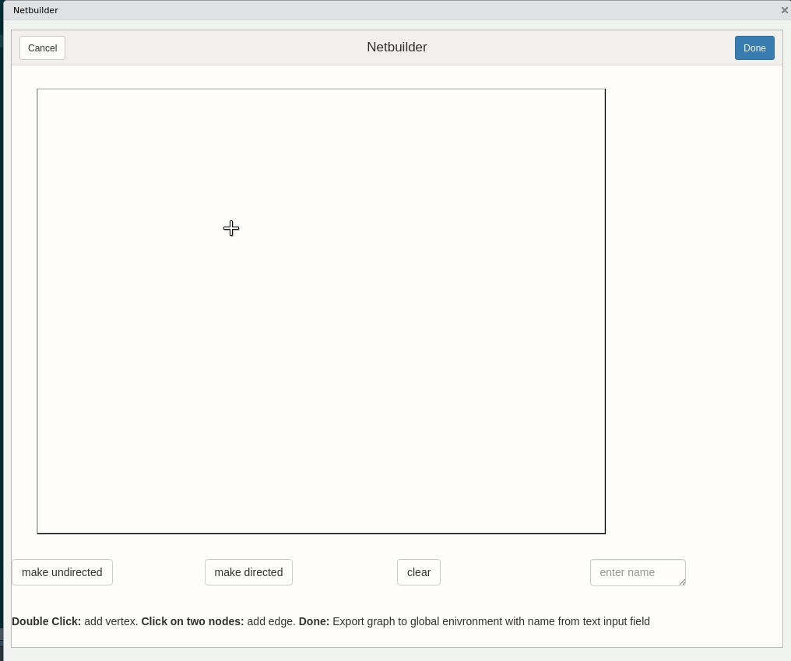

# New RStudio addins for network analysis

*This post was semi automatically converted from blogdown to Quarto and may contain errors. The original can be found in the [archive](http://archive.schochastics.net/post/new-rstudio-addins-for-network-analysis/).*

A new version of the
[snahelper](https://cran.r-project.org/web/packages/snahelper/index.html)
package is now available on CRAN. If you do not now the package: So far,
it included one RStudio addin that provided a GUI to analyze and
visualize networks. Check out the [introductory
post](http://blog.schochastics.net/post/an-rstudio-addin-for-network-analysis-and-visualization/)
for more details.

This major update includes two more addins that further facilitate the
work with network data in R.

**The package requires the newest versions of `ggraph` (2.0.0) and
`graphlayouts` (0.5.0).** Changes include:

-   added `Netbuilder()` addin
-   added `Netreader()` addin
-   edge geom is chosen automatically between `geom_edge_link0()` and
    `geom_edge_parallel0()`
-   discrete edge colors are now supported
-   added support for `layout_with_focus()` and
    `layout_with_centrality()`

The version number was incremented to 1.0.0 and I consider this to be
the final major release of the package. All further updates will, most
likely, only contain bug fixes.

# New addins

Two addins were added in this version, the `Netbuilder()` and the
`Netreader()`. Both can be used by selecting them from the Addins
dropdown menu in RStudio.

## Netbuilder

The purpose of `Netbuilder()` is to quickly create small networks via
point and click. This might not be a tremendously useful addin, but
testing new methods sometimes require to run code on small networks and
creating them by writing down, for instance, the adjacency matrix can
get very cumbersome.

The commands for the addin are:

-   **Double click**: add vertex
-   **Single click on two vertices**: add edge
-   **Single click on one vertex and free space**: add vertex and edge
    to new vertex.

Once finished, the network is exported as an `igraph` object to the
global environment with the specified variable name.

A quick demo is shown below. 

## Netreader

After several workshops on “SNA with R”, I noticed that one of the big
first hurdles is to get network data into R. Many new users that come
from other software tools are used to clicking an open button and
loading the data. This is not as simple in R. It may get even more
complicated if network data needs to be combined with attribute data.
The `Netreader()` addin is meant to facilitate the import of network
data that is stored in plain text files (csv, tsv, etc.), mimicking
(kind of) what users are used to from other software.

The addin consists of two main tabs, one for network data and one for
attribute data. The user specifies the file and file format (can be
inferred from the file preview window) and the addin automatically
combines the network and attributes to an `igraph` object.

The last tab shows the R code to produce the network with the chosen
data without using the addin. This should help new users to understand
the import process, so that they may not need the addin anymore in the
future.

Once finished, the network is exported as an `igraph` object to the
global environment with the specified variable name.

**Disclaimer**: I tested the addin with a lot of different files, but it
is hard to prepare for all peculiarities that may arise. If you are
having problems using the addin with your data, please write an
[issue](https://github.com/schochastics/snahelper/issues) on github.

# New features

The main addin `snahelper()` also got some new features. New layouts
that are supported are `layout_with_focus()` and
`layout_with_centrality()`.

The addin now automatically chooses the appropriate edge geom. If
multiple edges are present, it uses `geom_edge_parallel0()`. Otherwise
`geom_edge_link0()`. This replaces the former general solution using
`geom_edge_fan()`.

Finally, it is now also possible to use discrete edge variables as edge
colors.

