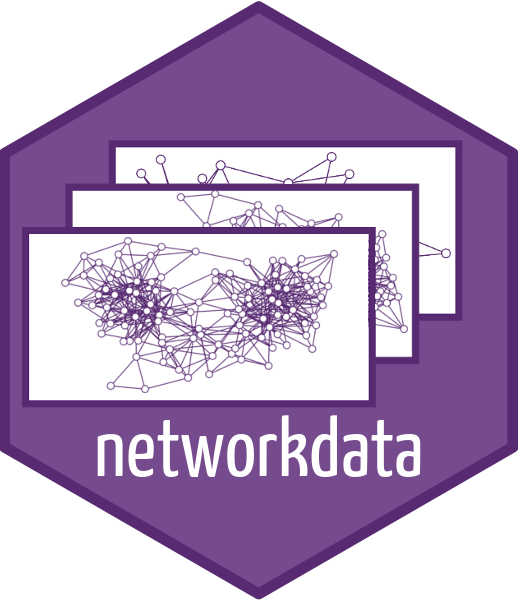

# A large repository of networkdata

*This post was semi automatically converted from blogdown to Quarto and may contain errors. The original can be found in the [archive](http://archive.schochastics.net/post/a-large-repository-of-networkdata/).*


There are many network repositories out there that offer a large variety
of amazing free data. (See the [awesome network analysis
list](https://github.com/briatte/awesome-network-analysis) on github for
an overview.) The problem is, that network data can come in many
formats. Either in plain text as edgelist or adjacency matrix, or in a
dedicated network file format from which there are many
(paj,dl,gexf,graphml,net,gml,…). The package `igraph` has an import
function for these formats (`read_graph()`) but I have found it to be
unreliable at times.

The `networkdata` package collates datasets from many different sources
and makes the networks readily available in R. The data is very diverse,
ranging from traditional social networks to animal, covert, and movie
networks. In total, the package includes 979 datasets containing 2135
networks. As such, I hope this package to be a good resource for
teaching, workshops and for research if example data is needed. You can
only get so far with the Karate network.



``` r
library(igraph)
library(networkdata)
```

# Install

Due to the nature of the package (only data, no functions), it will not
go to CRAN at any point. However, the package is available via drat (If
you are looking for stable builds of the package). With drat, you can
install and upgrade non-CRAN packages directly from R using the standard
`install.packages()` and `update.packages()` functions.

``` r
# install.packages("drat")
drat::addRepo("schochastics")
install.packages("networkdata")
```

To save on line of code in the future, you can add
`drat::addRepo("schochastics")` to your `.Rprofile`.

The developer version is available via github.

``` r
remotes::install_github("schochastics/networkdata")
```

The required space for the package is \~22MB, given that it includes a
lot of data.

# Overview

So far, the package includes datsets from the following repositories:

-   Freeman’s datasets from <http://moreno.ss.uci.edu/data> including
    most of the classical (small) datasets in social network analysis.
-   The movie networks from
    <https://dataverse.harvard.edu/dataset.xhtml?persistentId=doi:10.7910/DVN/T4HBA3>
    includes interactions among characters in 773 movies which were
    automatically parsed from scripts.
-   Covert networks from
    <https://sites.google.com/site/ucinetsoftware/datasets/covert-networks>.
    Around 50 datasets of networks with different criminal activities
    (drugs, terrorism, etc.). This dataset was originally compiled by
    the [Mitchell Centre for
    SNA](https://www.socialsciences.manchester.ac.uk/mitchell-centre/research/covert-networks/).
-   Animal networks from <https://bansallab.github.io/asnr/>. A large
    collection of networks with different interactions (dominance,
    grooming, etc.) in groups of different species.
-   Shakespeare’s plays networks build with data from
    <https://github.com/mallaham/Shakespeare-Plays>. Similar to the
    movie dataset. Includes scene co-appearances of characters in 36
    plays of Shakespeare.
-   Some networks from <http://konect.uni-koblenz.de/>. Konect is a
    large repository of network data. Only a view small datasets are
    included from there.
-   Tennis networks compiled from <https://github.com/JeffSackmann>
    (please give credit to him if you use this data). Includes all
    matches between 1968 and 2019 (both WTA and ATP) as yearly networks.
    The networks are directed, pointing from loser to winner with the
    surface (hard, grass, etc) as edge attribute.
-   Some random datasets I had lying around (e.g. the “Grey’s Anatomy”
    hook-up network)

All networks are in `igraph` format. If you are used to work with the
`network` format (as in `sna` and `ergm`), you can use the [intergraph
package](https://cran.rstudio.com/web/packages/intergraph/index.html) to
easily switch between `igraph` and `network`.

A list of all datasets can be obtained with

``` r
data(package = "networkdata")
```

Alternatively, use the function `show_networks()` to get a list of
datasets with desired properties.

``` r
head(show_networks(type = "directed"),n = 10)
```

``` hljs
##         variable_name      network_name is_collection no_of_networks
## 38             ants_1            ants_1         FALSE              1
## 39             ants_2            ants_2         FALSE              1
## 42                atp               atp          TRUE             52
## 45             bkfrac            bkfrac         FALSE              1
## 47             bkoffc            bkoffc         FALSE              1
## 49             bktecc            bktecc         FALSE              1
## 50               bott              bott         FALSE              1
## 55           cent_lit          cent_lit         FALSE              1
## 106 dnc_temporalGraph dnc_temporalGraph         FALSE              1
## 109     eies_messages     eies_messages         FALSE              1
##         nodes     edges is_directed is_weighted is_bipartite has_vattr
## 38    16.0000   200.000        TRUE       FALSE        FALSE     FALSE
## 39    13.0000   361.000        TRUE       FALSE        FALSE     FALSE
## 42   499.3462  3164.404        TRUE        TRUE        FALSE      TRUE
## 45    58.0000  3306.000        TRUE        TRUE        FALSE     FALSE
## 47    40.0000  1558.000        TRUE        TRUE        FALSE     FALSE
## 49    34.0000  1122.000        TRUE        TRUE        FALSE     FALSE
## 50    11.0000   256.000        TRUE        TRUE        FALSE      TRUE
## 55   129.0000   613.000        TRUE       FALSE        FALSE     FALSE
## 106 1891.0000 37421.000        TRUE       FALSE        FALSE     FALSE
## 109   32.0000   460.000        TRUE        TRUE        FALSE      TRUE
```

If you use any of the included datasets, please make sure to cite the
appropriate orginal source, which can be found in the help file for each
network.

