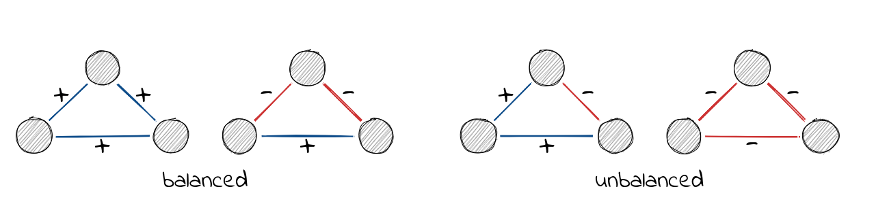

# A package for analysing signed networks

*This post was semi automatically converted from blogdown to Quarto and may contain errors. The original can be found in the [archive](http://archive.schochastics.net/post/a-package-for-analysing-signed-networks/).*


This post introduces the R package `signnet`, available on
[CRAN](https://cran.r-project.org/package=signnet), which implements
several methods to analyze signed networks.

Signed networks include two types of relations, positive and negative
ones (say friends and enemies). They are fundamentally different from
traditional networks and require a very different set of tools to
analyse them. This post covers everything from data structures to
methods and should give a comprehensive overview of what is possible to
do with the package.


``` r
# install.packages("signnet")
library(igraph)
library(signnet)
```

# Data structures

The foundation of `signnet` is provided by `igraph`. All functions in
the package assume that an igraph object is a signed network if it has
an edge attribute “sign” with values 1 (positive) or -1 (negative).

``` r
g <- graph.full(5,directed = FALSE,loops = FALSE)
E(g)$sign <- sample(c(-1,1), ecount(g), replace = TRUE)
g
```

``` hljs
## IGRAPH 6a43e14 U--- 5 10 -- Full graph
## + attr: name (g/c), loops (g/l), sign (e/n)
## + edges from 6a43e14:
##  [1] 1--2 1--3 1--4 1--5 2--3 2--4 2--5 3--4 3--5 4--5
```

All methods (should) throw an error if the sign attribute is missing or
contains other values than -1 and 1.

Matrices associated with a signed network follow the `igraph` naming
scheme. The signed adjacency matrix can be obtained with
`as_adj_signed()`.

``` r
as_adj_signed(g)
```

``` hljs
##      [,1] [,2] [,3] [,4] [,5]
## [1,]    0    1    1   -1   -1
## [2,]    1    0    1    1   -1
## [3,]    1    1    0   -1   -1
## [4,]   -1    1   -1    0    1
## [5,]   -1   -1   -1    1    0
```

The signed Laplacian matrix is obtained by `laplacian_matrix_signed()`.

``` r
laplacian_matrix_signed(g)
```

``` hljs
##      [,1] [,2] [,3] [,4] [,5]
## [1,]    4   -1   -1    1    1
## [2,]   -1    4   -1   -1    1
## [3,]   -1   -1    4    1    1
## [4,]    1   -1    1    4   -1
## [5,]    1    1    1   -1    4
```

# Included datasets

The package includes two well known datasets.

The “tribes” dataset is a signed social network of tribes of the
Gahuku–Gama alliance structure of the Eastern Central Highlands of New
Guinea. The network contains sixteen tribes connected by friendship
(“rova”) and enmity (“hina”).

The “cowList” dataset contains a list of 52 signed networks of
inter-state relations over time (1946-1999). Two countries are connected
by a positive tie if they form an alliance or have a peace treaty. A
negative tie exists between countries who are at war or in other kinds
of conflicts. The dataset is derived from the [correlates of
war](https://correlatesofwar.org/).

# Structural Balance

The principles underlying structural balance are based on a theory in
social psychology dating back to the work of Heider in the 1940s, which
was generalized and extended to graphs by Cartwright and Harary in the
1950s. In its simplest form, it is defined via triangles. A triangle is
balanced if all ties are positive (“the friend of a friend is a friend”)
or only one tie is positive (“the enemy of my enemy is my friend”). The
remaining configurations are said to be unbalanced.



A network is balanced if i.a., it can be partitioned into two vertex
subsets, such that intra-group edges are all positive and inter-group
edges are all negative.

A (random) balanced network can be obtained with the function
`sample_islands_signed()` which is pretty much the same as
`sample_islands()` from the `igraph` package, except that inter-group
edges are negative ties.

``` r
g <- sample_islands_signed(islands.n = 2,islands.size = 10,
                           islands.pin = 0.8,n.inter = 5)
```

Increasing `islands.n` leads to “clusterable” networks as defined by
Davis.

The function `ggsigned()` can be used to get a rudimentary visualization
of signed networks. Note that this requires the package `ggraph` to be
installed.

``` r
ggsigned(g)
```


A balanced network only contains balanced triangles. This can be
verified with `count_signed_triangles()`.

``` r
count_signed_triangles(g)
```

``` hljs
## +++ ++- +-- --- 
## 137   0   4   0
```

Note the absence of `++-` and `---` triangles.

To list all triangles use `signed_triangles()`.

``` r
head(signed_triangles(g))
```

``` hljs
##      V1 V2 V3 P
## [1,] 85  6 77 1
## [2,] 85 36 80 1
## [3,] 85 78 64 1
## [4,] 43 37 48 3
## [5,] 43 42 70 3
## [6,] 43 39 60 3
```

The column P indicated the number of positive ties in the triangle. A
value of 3 indicates that the triangle is “+++”.

# Balancedness measures

Determining if a network is balanced or not is easy, but measuring a
degree of balancedness (i.e. how close is a network to be balanced?) is
not. The package, so far, implements three methods to calculate balance
scores. All are defined such that a value of one indicates perfect
balance and zero perfect unbalance. Though for intermediate networks,
results may vary significantly. Check the paper by Samin Aref (and his
other work) for more details.

``` r
balance_score(g, method = "triangles")
```

``` hljs
## [1] 1
```

``` r
balance_score(g, method = "walk")
```

``` hljs
## [1] 1
```

``` r
balance_score(g, method = "frustration")
```

``` hljs
## [1] 1
```

“triangles” returns the fraction of balanced triangles.

“walk” is based on eigenvalues of the signed and underlying unsigned
network. Check the paper by Estrada for details.

“frustration” assumes that the network can be partitioned into two
groups, where intra group edges are positive and inter group edges are
negative. The index is defined as the sum of intra group negative and
inter group positive edges. Note that the problem is NP complete and
only an upper bound is returned (based on simulated annealing). Exact
methods can be found in the work of Aref.

There disagreement for non-balanced networks can be seen with the
included “tribes” dataset.

``` r
data("tribes")
balance_score(tribes, method = "triangles")
```

``` hljs
## [1] 0.8676471
```

``` r
balance_score(tribes, method = "walk")
```

``` hljs
## [1] 0.3575761
```

``` r
balance_score(tribes, method = "frustration")
```

``` hljs
## [1] 0.7586207
```

# Blockmodeling

In signed blockmodeling, the goal is to determine `k` blocks of nodes
such that all intra-block edges are positive and inter-block edges are
negative. In the example below, we construct a network with a perfect
block structure with `sample_islands_signed()`. The network consists of
10 blocks with 10 vertices each, where each block has a density of 1 (of
positive edges). The function `signed_blockmodel()` is used to construct
the blockmodel. The parameter `k` is the number of desired blocks.
`alpha` is a trade-off parameter. The function minimizes
f(C)=αN+(1−α)P*f*(*C*) = *α**N* + (1−*α*)*P**f*(*C*) = *α**N* + (1−*α*)*P*,
where N*N**N* is the total number of negative ties within blocks,P*P**P*
be the total number of positive ties between blocks and C*C**C* a
blockmodel assignment.

``` r
g <- sample_islands_signed(10,10,1,20)
clu <- signed_blockmodel(g,k = 10,alpha = 0.5)
```

The function returns a list with two entries. The block membership of
nodes and the value of f(C)*f*(*C*)*f*(*C*).

``` r
table(clu$membership)
```

``` hljs
## 
##  1  2  3  4  5  6  7  8  9 10 
## 10 10 10 10 10 10 10 10 10 10
```

``` r
clu$criterion
```

``` hljs
## [1] 0
```

The function `ggblock()` can be used to plot the outcome of the
blockmodel (`ggplot2` is required).

``` r
ggblock(g,clu$membership,show_blocks = TRUE)
```


If the parameter `annealing` is set to TRUE, simulated annealing is used
in the optimization step. This generally leads to better results but
longer runtimes.

``` r
data("tribes")
set.seed(44) #for reproducibility

signed_blockmodel(tribes,k = 3,alpha=0.5,annealing = TRUE)
```

``` hljs
## $membership
##  [1] 1 1 3 3 2 3 3 3 2 2 3 3 2 2 1 1
## 
## $criterion
## [1] 2
```

``` r
signed_blockmodel(tribes,k = 3,alpha=0.5,annealing = FALSE)
```

``` hljs
## $membership
##  [1] 1 1 2 3 2 2 2 2 3 3 2 2 3 3 1 1
## 
## $criterion
## [1] 5
```

# Generalized Blockmodeling

The function `signed_blockmodel()` is only able to provide a blockmodel
where the diagonal blocks are positive and off-diagonal blocks are
negative. The function `signed_blockmodel_general()` can be used to
specify different block structures. In the below example, we construct a
network that contains three blocks. Two have positive and one has
negative intra-group ties. The inter-group edges are negative between
group one and two, and one and three. Between group two and three, all
edges are positive.

``` r
g1 <- g2 <- g3 <- graph.full(5)

V(g1)$name <- as.character(1:5)
V(g2)$name <- as.character(6:10)
V(g3)$name <- as.character(11:15)

g <- Reduce("%u%",list(g1,g2,g3))
E(g)$sign <- 1
E(g)$sign[1:10] <- -1
g <- add.edges(g,c(rbind(1:5,6:10)),attr = list(sign=-1))
g <- add.edges(g,c(rbind(1:5,11:15)),attr = list(sign=-1))
g <- add.edges(g,c(rbind(11:15,6:10)),attr = list(sign=1))
```

The parameter `blockmat` is used to specify the desired block structure.

``` r
set.seed(424) #for reproducibility
blockmat <- matrix(c(1,-1,-1,-1,1,1,-1,1,-1),3,3,byrow = TRUE)
blockmat
```

``` hljs
##      [,1] [,2] [,3]
## [1,]    1   -1   -1
## [2,]   -1    1    1
## [3,]   -1    1   -1
```

``` r
general <- signed_blockmodel_general(g,blockmat,alpha = 0.5)
traditional <- signed_blockmodel(g,k = 3,alpha = 0.5,annealing = TRUE)

c(general$criterion,traditional$criterion)
```

``` hljs
## [1] 0 6
```


# Centrality indices

There exist dozens of indices for networks with positive ties, but for
signed networks they are rather scarce. The package implements three
indices so far. Versions of degree and eigenvector centrality, and PN
centrality by Everett & Borgatti.

Degree centrality can be calculated in four different ways with
`degree_signed()`, specified by the `type` parameter:

-   `type="pos"` count only positive neighbors
-   `type="neg"` count only negative neighbors
-   `type="ratio"` positive neighbors/(positive neighbors+negative
    neighbors)
-   `type="net"` positive neighbors-negative neighbors

The `mode` parameter can be used to get “in” and “out” versions for
directed networks.

The PN index is very similar to Katz status and Hubbell’s measure for
networks with only positive ties. The technical details can be found in
the paper by Everett & Borgatti.

Eigenvector centrality is defined as the eigenvector associated with the
dominant eigenvalue of the signed adjacency matrix.

The below example illustrates all indices with a network where signed
degree can not distinguish vertices.

``` r
A <- matrix(c(0,  1,  0,  1,  0,  0,  0, -1, -1,  0,  
               1,  0,  1, -1,  1, -1, -1,  0,  0,  0,  
               0,  1,  0,  1, -1,  0,  0,  0, -1,  0,  
               1, -1,  1,  0,  1, -1, -1,  0,  0,  0,  
               0,  1, -1,  1,  0,  1,  0, -1,  0, -1,  
               0, -1,  0, -1,  1,  0,  1,  0,  1, -1,  
               0, -1,  0, -1,  0,  1,  0,  1, -1,  1,  
              -1,  0,  0,  0, -1,  0,  1,  0,  1,  0,  
              -1,  0, -1,  0,  0,  1, -1,  1,  0,  1,  
               0,  0,  0,  0, -1, -1,  1,  0,  1,  0),10,10)

g <- graph_from_adjacency_matrix(A,"undirected",weighted = "sign")
ggsigned(g)
```


``` r
degree_signed(g,type="ratio")
```

``` hljs
##  [1] 0.5 0.5 0.5 0.5 0.5 0.5 0.5 0.5 0.5 0.5
```

``` r
eigen_centrality_signed(g)
```

``` hljs
##  [1] -0.62214960  1.00000000 -0.74518850  1.00000000 -0.89990041
##  [6]  0.64289592  0.35828159 -0.37471921 -0.28087411 -0.07834568
```

``` r
pn_index(g)
```

``` hljs
##  [1] 0.9009747 0.8613482 0.9076997 0.8613482 0.8410658 0.8496558 0.8617321
##  [8] 0.9015909 0.8509848 0.9072930
```

Note that PN centrality and eigenvector centrality differ significantly
for this network.

``` r
cor(eigen_centrality_signed(g),pn_index(g),method = "kendall")
```

``` hljs
## [1] -0.2
```

## A note on eigenvector centrality

The adjacency matrix of a signed network may not have a dominant
eigenvalue. This means it is not clear which eigenvector should be used.
In addition it is possible for the adjacency matrix to have repeated
eigenvalues and hence multiple linearly independent eigenvectors. In
this case certain centralities can be arbitrarily assigned. The
`eigen_centrality_signed()` function returns an error if this is the
case.

``` r
A <- matrix(c( 0,  1,  1, -1,  0,  0, -1,  0,  0, 
               1,  0,  1,  0, -1,  0,  0, -1,  0, 
               1,  1,  0,  0,  0, -1,  0,  0, -1, 
              -1,  0,  0,  0,  1,  1, -1,  0,  0, 
               0, -1,  0,  1,  0,  1,  0, -1,  0, 
               0,  0, -1,  1,  1,  0,  0,  0, -1, 
              -1,  0,  0, -1,  0,  0,  0,  1,  1, 
               0, -1,  0,  0, -1,  0,  1,  0,  1, 
               0,  0, -1,  0,  0, -1,  1,  1,  0), 9, 9)

round(eigen(A)$values,6)
```

``` hljs
## [1]  3  3  0  0  0  0  0 -3 -3
```

``` r
g <- graph_from_adjacency_matrix(A,"undirected",weighted = "sign")
eigen_centrality_signed(g)
```

``` hljs
## Error in eigen_centrality_signed(g): no dominant eigenvalue exists
```

# Signed two-mode networks

## Blockmodeling

Most research for signed two-mode networks concerns the use of
blockmodeling. The package does not include any functionality for
blockmodeling signed two-mode networks yet. This will be included in a
future version.

## Projections

A common analytic tool for two-mode networks is to project the network
onto on relevant mode. This is easily done using the adjacency matrix
A*A**A*. AAT*A**A*^(*T*)*A**A*^(*T*) yields the row projection and
ATA*A*^(*T*)*A**A*^(*T*)*A* the column projection. The resulting
networks will thus be weighted. Several methods exist to turn a weighted
projection into an unweighted network where only the most significant
edges are included. A number of these methods are implemented in the
[backbone](https://cran.r-project.org/package=backbone) package.

Projecting signed networks, however, is not as straightforward. Consider
the following simple example.

``` r
el <- matrix(c(1,"a",1,"b",1,"c",2,"a",2,"b"),ncol = 2,byrow = TRUE)
g <- graph_from_edgelist(el,directed = FALSE)
E(g)$sign <- c(1,1,-1,1,-1)
V(g)$type <- c(FALSE,TRUE,TRUE,TRUE,FALSE)
```

*(An igraph two-mode network requires a logical vertex attribute type)*


If we use the regular projection rules we obtain

``` r
A <- as_incidence_signed(g)
R <- A%*%t(A)
C <- t(A)%*%A
R
```

``` hljs
##   1 2
## 1 3 0
## 2 0 2
```

``` r
C
```

``` hljs
##    a  b  c
## a  2  0 -1
## b  0  2 -1
## c -1 -1  1
```

The row projection suggests that there is no relation between 1 and 2,
when in fact there is a negative path (via b) and a positive path (via
a) between them. The same holds for the column projection and the nodes
a and b.

The paper of Schoch introduces two projection methods that circumvent
this “nullification”. The package implements the *duplication* approach
since it plays well with existing binarization tools. The first step is
to turn the signed two-mode network into an unsigned one. This is done
by duplicating all vertices of the primary mode (i.e. the one to project
on). For example, vertex a turns into two vertices “a-pos” and “a-neg”.
The vertices of the secondary mode connect to these new vertices
depending on the sign of edge. For instance, 1 has a positive edge to a
and thus 1 connects to a-pos.


This can be done for the whole network with the function
`as_unsigned_2mode()` by specifying the primary mode (either TRUE or
FALSE).

``` r
gu <- as_unsigned_2mode(g,primary = TRUE)
gu
```

``` hljs
## IGRAPH 0c1ac62 UN-B 8 5 -- 
## + attr: name (v/c), type (v/l)
## + edges from 0c1ac62 (vertex names):
## [1] a-pos--1 b-pos--1 c-neg--1 a-pos--2 b-neg--2
```

Now, any binarization toll (e.g. from the `backbone` package) can be
applied since the network is an unsigned two-mode network. For
illustration, we include all edges with a weight greater one (the
“universal” approach) since it can be done without the `backbone`
package.

``` r
pu <- bipartite_projection(gu,which = "true")
pu <- delete_edge_attr(pu,"weight")
pu
```

``` hljs
## IGRAPH f4bf1d9 UN-- 6 4 -- 
## + attr: name (v/c)
## + edges from f4bf1d9 (vertex names):
## [1] a-pos--b-pos a-pos--c-neg a-pos--b-neg b-pos--c-neg
```

After binarization, the network is turned back to an unsigned network
using a *contraction rule*. The contraction rule works as follows:

If there is an edge (a-pos,b-pos) or (a-neg,b-neg) in the projection
then there is a positive edge (a,b) in the signed projection.

If there is an edge (a-pos,b-neg) or (a-neg,b-pos) in the projection
then there is a negative edge (a,b) in the signed projection.

If there is an edge (a-pos,b-pos) **and** (a-neg,b-pos) (or, e.g.,
(a-neg,b-neg) **and** (a-pos,b-neg)) in the projection then there is an
*ambivalent edge* (a,b) in the signed projection.

This is done with the function `as_signed_proj()`.

``` r
ps <- as_signed_proj(pu)
as_data_frame(ps,"edges")
```

``` hljs
##   from to type
## 1    a  b    A
## 2    a  c    N
## 3    b  c    N
```


The projection of a signed two-mode network thus may contain three types
of edges (positive (“P”), negative (“N”) or ambivalent (“A”)). The
concept of ambivalent ties comes from work by Abelson & Rosenberg and
Cartwright & Harary.

More technical details can be found in the original paper by Schoch.

## Representing networks with ambivalent ties

Ambivalent ties add a new level of complexity for analytic tasks
(especially involving matrices) since it is not clear which value to
assign to them. Intuitively they should be “somewhere” between a
positive and a negative tie but zero is already taken for the null tie.

We can construct a kind of adjacency matrix with the character values,
but we can’t really work with characters analytically.

``` r
as_adj(ps,type = "both", attr = "type", sparse = FALSE)
```

``` hljs
##   a   b   c  
## a ""  "A" "N"
## b "A" ""  "N"
## c "N" "N" ""
```

This is where complex matrices come in. Instead of thinking about edge
values being only in one dimension, we can add a second one for negative
ties. That is, a positive tie would be coded as (1,0)(1,0)(1,0) and a
negative one as (0,1)(0,1)(0,1). It is much easier in this case to
include ambivalent ties by assigning (0.5,0.5)(0.5,0.5)(0.5,0.5) to
them.

Tuples like these can also be written as a complex number, i.e.
(1,0)(1,0)(1,0) turns into 1+0i1 + 0*i*1 + 0*i*, (0,1)(0,1)(0,1) into
0+1i0 + 1*i*0 + 1*i*, and (0.5,0.5)(0.5,0.5)(0.5,0.5) into
0.5+0.5i0.5 + 0.5*i*0.5 + 0.5*i*. Complex numbers may be scary to some,
but they have a kind of intuitive interpretation here. The real part is
the positive value of an edge and the imaginary part is the negative
part. So we could actually also have something like
0.3+0.7i0.3 + 0.7*i*0.3 + 0.7*i* which is an edge that is 30% positive
and 70% negative. For now, though, the three values from above suffice.

The function `as_adj_complex()` can be used to return the complex
adjacency matrix of a signed network with ambivalent ties.

``` r
as_adj_complex(ps,attr = "type")
```

``` hljs
##          a        b    c
## a 0.0+0.0i 0.5+0.5i 0+1i
## b 0.5-0.5i 0.0+0.0i 0+1i
## c 0.0-1.0i 0.0-1.0i 0+0i
```

When there is a complex adjacency matrix, then there is also a complex
Laplacian matrix. This matrix can be obtained with
`laplacian_matrix_complex()`.

``` r
laplacian_matrix_complex(ps, attr = "type")
```

``` hljs
##                a              b    c
## a  1.707107+0.0i -0.500000-0.5i 0-1i
## b -0.500000+0.5i  1.707107+0.0i 0-1i
## c  0.000000+1.0i  0.000000+1.0i 2+0i
```

# Functions supporting ambivalent ties

So far, only the triangle routines support networks with ambivalent
ties.

``` r
g <- graph.full(5)
E(g)$type <- c(rep("P",3),rep("N",3),rep("A",4))

count_complex_triangles(g,attr = "type")
```

``` hljs
## PPP PPN PNN NNN PPA PNA NNA PAA NAA AAA 
##   0   2   0   0   1   3   1   0   2   1
```

# References

Abelson, Robert P., and Milton J. Rosenberg. 1958. “Symbolic
Psycho-Logic: A Model of Attitudinal Cognition.” Behavioral Science 3
(1): 1–13.

Aref, Samin, and Mark C. Wilson. 2018. “Measuring Partial Balance in
Signed Networks.” Journal of Complex Networks 6 (4): 566–95.

Bonacich, Phillip, and Paulette Lloyd. 2004. “Calculating Status with
Negative Relations.” Social Networks 26 (4): 331–38.

Cartwright, Dorwin, and Frank Harary. 1956. “Structural Balance: A
Generalization of Heider’s Theory.” Psychological Review 63 (5): 277.

Cartwright, Dorwin, and Frank Harary. 1970. “Ambivalence and
Indifference in Generalizations of Structural Balance.” Behavioral
Science 15 (6).

Davis, James A. 1967. “Clustering and Structural Balance in Graphs.”
Human Relations 20 (2): 181–87.

Doreian, Patrick, and Andrej Mrvar. 1996. “A Partitioning Approach to
Structural Balance.” Social Networks 18 (2): 149–68.

Doreian, Patrick, and Andrej Mrvar. 2009. “Partitioning Signed Social
Networks.” Social Networks 31 (1): 1–11.

Doreian, Patrick, Paulette Lloyd, and Andrej Mrvar. 2013. “Partitioning
Large Signed Two-Mode Networks: Problems and Prospects.” Social
Networks, Special Issue on Advances in Two-mode Social Networks, 35 (2):
178–203.

Doreian, Patrick, and Andrej Mrvar. 2015. “Structural Balance and Signed
International Relations.” Journal of Social Structure 16: 1.

Estrada, Ernesto. 2019. “Rethinking Structural Balance in Signed Social
Networks.” Discrete Applied Mathematics

Everett, Martin G., and Stephen P. Borgatti. 2014. “Networks Containing
Negative Ties.” Social Networks 38: 111–20.

Heider, Fritz. 1946. “Attitudes and Cognitive Organization.” The Journal
of Psychology 21 (1): 107–12.

Schoch, David. 2020. “Projecting Signed Two-Mode Networks” Mathematical
Sociology, forthcoming

