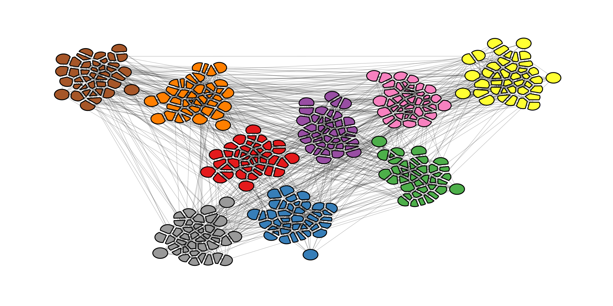

# ggraph tricks for common problems

*This post was semi automatically converted from blogdown to Quarto and may contain errors. The original can be found in the [archive](http://archive.schochastics.net/post/ggraph-tricks-for-common-problems/).*


In this post I am going to share some bits of code for some common
problems that I encountered with {{ggraph}}. By problems, I do not mean
problems in the package. Rather, I mean the things you want to do, that
require going a little beyond the standard use cases.

Some of my proposed solutions may seem a little “hacky” and there may
well be more simple and elegant ways of achieving the same goal. Please
do share them in the comments!

Besides pure {{ggraph}} snippets, I’ll also highlight some other
packages that play well with it (e.g. {{ggforce}} and {scatterpie}}).

``` r
library(tidyverse)
library(igraph)
library(ggraph)
library(graphlayouts)
library(ggforce)
library(scatterpie)
```

# Arrow heads and node size

> “How can I achieve that my directed edges stop at the node border,
> independent from the node size?”

This one has given me headaches for the longest time. No matter what I
tried, I always ended up with something like the below plot.

``` r
# create a random network
set.seed(1071)
g <- sample_pa(30, 1)
V(g)$degree <- degree(g, mode = "in")

ggraph(g, "stress") +
  geom_edge_link(
    aes(end_cap = circle(node2.degree + 2, "pt")),
    edge_colour = "black",
    arrow = arrow(
      angle = 10,
      length = unit(0.15, "inches"),
      ends = "last",
      type = "closed"
    )
  ) +
  geom_node_point(aes(size = degree), col = "grey66", show.legend = FALSE) +
  scale_size(range = c(3, 11)) +
  theme_graph()
```


The overlap can be avoided by using the `I()` function from base R,
which treats the entries of a vector “as is”. So we know that if a node
has degree 5, it will be mapped to a circle with radius (or diameter?)
“5pt”. Since this means, that you have no control over the scaling, you
need to do that beforehand.

``` r
# this function is borrowed from the ambient package
normalise <- function (x, from = range(x), to = c(0, 1)) {
  x <- (x - from[1])/(from[2] - from[1])
  if (!identical(to, c(0, 1))) {
    x <- x * (to[2] - to[1]) + to[1]
  }
  x
}

# map to the range you want
V(g)$degree <- normalise(V(g)$degree, to = c(3, 11))

ggraph(g, "stress") +
  geom_edge_link(
    aes(end_cap = circle(node2.degree + 2, "pt")),
    edge_colour = "grey25",
    arrow = arrow(
      angle = 10,
      length = unit(0.15, "inches"),
      ends = "last",
      type = "closed"
    )
  ) +
  geom_node_point(aes(size = I(degree)), col = "grey66") +
  theme_graph()
```


I would not be surprised though if there is an even easier fix for this
problem…

# low opacity nodes

> “How can I lower the opacity of nodes without making edges visible
> underneath?”

One of the rules I try to follow is that edges should not be visible on
top of nodes. Usually that is easy to achieve by drawing the edges
before the nodes. But if you want to lower the opacity of nodes, they do
become visible again.

``` r
g <- sample_gnp(20, 0.5)
V(g)$degree <- degree(g)

ggraph(g, "stress") +
  geom_edge_link(edge_colour = "grey66") +
  geom_node_point(
    size = 8,
    aes(alpha = degree),
    col = "red",
    show.legend = FALSE
  ) +
  theme_graph()
```


The solution is rather simple. Just add a node layer with the same
aesthetics below with `alpha=1` (default) and `color="white"` (or the
background color of the plot).

``` r
ggraph(g, "stress") +
  geom_edge_link(edge_colour = "grey66") +
  geom_node_point(size = 8, col = "white") +
  geom_node_point(
    aes(alpha = degree),
    size = 8,
    col = "red",
    show.legend = FALSE
  ) +
  theme_graph()
```


of course you could also use `start_cap` and `end_cap` here, but you may
have to fiddle again as in the last example.

# use the ggforce

The {{ggforce}} package works pretty nicely with {{ggraph}}. You can,
for instance, use the `geom_mark_*()` functions to highlight clusters.

``` r
set.seed(665)

#create network with a group structure
g <- sample_islands(9, 40, 0.4, 15)
g <- igraph::simplify(g)
V(g)$grp <- as.character(rep(1:9, each = 40))

bb <- layout_as_backbone(g, keep = 0.4)
E(g)$col <- F
E(g)$col[bb$backbone] <- T
```

``` r
ggraph(g,
       layout = "manual",
       x = bb$xy[, 1],
       y = bb$xy[, 2]) +
  geom_edge_link0(aes(col = col), width = 0.2) +
  geom_node_point(aes(fill = grp), shape = 21, size = 3) +
  geom_mark_hull(
    aes(x, y, group = grp, fill = grp),
    concavity = 4,
    expand = unit(2, "mm"),
    alpha = 0.25
  ) +
  scale_color_brewer(palette = "Set1") +
  scale_fill_brewer(palette = "Set1") +
  scale_edge_color_manual(values = c(rgb(0, 0, 0, 0.3), rgb(0, 0, 0, 1))) +
  theme_graph()+
  theme(legend.position = "none")
```


Of course you can also add a label to your clusters.

``` r
ggraph(g,
       layout = "manual",
       x = bb$xy[, 1],
       y = bb$xy[, 2]) +
  geom_edge_link0(aes(col = col), width = 0.2) +
  geom_node_point(aes(fill = grp), shape = 21, size = 3) +
  geom_mark_hull(
    aes(x, y, group = grp, fill = grp, label=grp),
    concavity = 4,
    expand = unit(2, "mm"),
    alpha = 0.25
  ) +
  scale_color_brewer(palette = "Set1") +
  scale_fill_brewer(palette = "Set1") +
  scale_edge_color_manual(values = c(rgb(0, 0, 0, 0.3), rgb(0, 0, 0, 1))) +
  theme_graph()+
  theme(legend.position = "none")
```


If you want to avoid node overlaps, you can use `geom_node_voronoi()`.
So this is actually already implemented in {{ggraph}}, but originates
from `geom_voronoi_tile()`.

``` r
ggraph(g,
       layout = "manual",
       x = bb$xy[, 1],
       y = bb$xy[, 2]) +
  geom_edge_link0(aes(filter = !col, col = col), width = 0.2) +
  geom_node_voronoi(
    aes(x, y, fill = grp),
    max.radius = 0.4,
    expand = unit(-0.5, 'mm'),
    colour = 'black'
  ) +
  scale_color_brewer(palette = "Set1") +
  scale_fill_brewer(palette = "Set1") +
  scale_edge_color_manual(values = c(rgb(0, 0, 0, 0.3), rgb(0, 0, 0, 1))) +
  theme(
    legend.position = "none",
    panel.grid = element_blank(),
    axis.ticks = element_blank(),
    axis.text = element_blank()
  ) +
  theme_graph() +
  theme(legend.position = "none")
```



# new node shapes with scatterpie

> How can I make my nodes into a pie chart?

I have seen this pop up on twitter from time to time. Disregarding the
whole discussion on the usefulness of pie chart, a solution to this is
to use the {{scatterpie}} package.

``` r
set.seed(1439)
# create a random graph with three random attributes
g <- sample_pa(20, 1)
V(g)$A <- abs(rnorm(20, sd = 1))
V(g)$B <- abs(rnorm(20, sd = 2))
V(g)$C <- abs(rnorm(20, sd = 3))

#precompute the layout
xy <- layout_with_stress(g)
V(g)$x <- xy[, 1]
V(g)$y <- xy[, 2]

ggraph(g, "manual", x = V(g)$x, y = V(g)$y) +
  geom_edge_link0() +
  geom_scatterpie(
    cols = c("A", "B", "C"),
    data = as_data_frame(g, "vertices"),
    colour = NA,
    pie_scale = 2
  ) +
  coord_fixed() +
  theme_graph() +
  theme(legend.position = "bottom")
```


This could be useful in many ways. One use-case that comes to mind is
for reduced cluster graphs. That is a new network is created from a
given clustering, where each node represents a cluster. The pie chart
can then show the composition of the nodes within the cluster.

``` r
#create network with a group structure
g <- sample_islands(9, 40, 0.4, 15)
g <- igraph::simplify(g)
V(g)$grp <- as.character(rep(1:9, each = 40))

# create a random categorical variable
V(g)$cat <- sample(c("A", "B", "C"), vcount(g), replace = T)

# contract the network based on the groups
g_clu <- contract(g, V(g)$grp, vertex.attr.comb = "concat")
E(g_clu)$weight <- 1
g_clu <- simplify(g_clu, edge.attr.comb = "sum")

# calculate the number of occurrences of each attribute in each cluster
V(g_clu)$A <- sapply(V(g_clu)$cat, function(x)
  sum(x == "A"))
V(g_clu)$B <- sapply(V(g_clu)$cat, function(x)
  sum(x == "B"))
V(g_clu)$C <- sapply(V(g_clu)$cat, function(x)
  sum(x == "C"))

# precompute layout
xy <- layout_with_stress(g_clu)
V(g_clu)$x <- xy[, 1]
V(g_clu)$y <- xy[, 2]

ggraph(g_clu, "manual", x = V(g_clu)$x, y = V(g_clu)$y) +
  geom_edge_link0() +
  geom_scatterpie(
    cols = c("A", "B", "C"),
    data = as_data_frame(g_clu, "vertices"),
    colour = "white",
    pie_scale = 3
  ) +
  scale_fill_manual(values = c("goldenrod", "black", "darkorchid2")) +
  coord_fixed() +
  theme_graph() +
  theme(legend.position = "bottom")
```


> Can I do something else besides pie charts?

If you do not like pie charts (who does these days?), you can also
create bar charts, but this takes a bit more effort (the following is
adapted from
[stackoverflow](https://stackoverflow.com/questions/36063043/how-to-plot-barchart-onto-ggplot2-map)).

``` r
#create data frames for nodes (wide and long)
nodes_wide <- igraph::as_data_frame(g_clu, "vertices")

nodes_long <- nodes_wide %>% select(A:C) %>%
  mutate(id = 1:nrow(nodes_wide)) %>%
  gather("attr", "value", A:C)

# create the bar charts
bar_list <- lapply(1:vcount(g_clu), function(i) {
  gt_plot <- ggplotGrob(
    ggplot(nodes_long[nodes_long$id == i, ]) +
      geom_col(
        aes(factor(id), value, group = id, fill = attr),
        position = 'dodge2',
        color = NA
      ) +
      scale_fill_manual(values = c("goldenrod", "black", "darkorchid2")) +
      labs(x = NULL, y = NULL) +
      coord_cartesian(expand = FALSE) +
      theme(
        legend.position = "none",
        panel.background = element_rect(fill = "white", colour = NA),
        line = element_blank(),
        text = element_blank()
      )
  )
  panel_coords <- gt_plot$layout[gt_plot$layout$name == "panel", ]
  gt_plot[panel_coords$t:panel_coords$b, panel_coords$l:panel_coords$r]
})

# convert to custom annotation
annot_list <- lapply(1:vcount(g_clu), function(i) {
  xmin <- nodes_wide$x[i] - 0.07
  xmax <- nodes_wide$x[i] + 0.07
  ymin <- nodes_wide$y[i] - 0.07
  ymax <- nodes_wide$y[i] + 0.07
  annotation_custom(
    bar_list[[i]],
    xmin = xmin,
    xmax = xmax,
    ymin = ymin,
    ymax = ymax
  )
})

# create basic network
p <- ggraph(g_clu, "manual", x = V(g_clu)$x, y = V(g_clu)$y) +
  geom_edge_link0() +
  theme_graph()+
  coord_fixed()

# put everything together
Reduce("+", annot_list, p)
```


This hack can be used with all kinds of geoms. Here is another example
with `geom_waffle()` from the {{waffle}} package.


