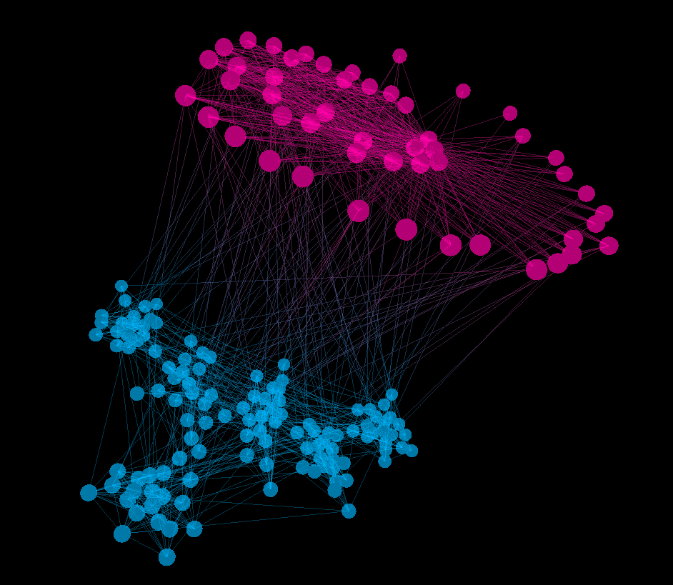
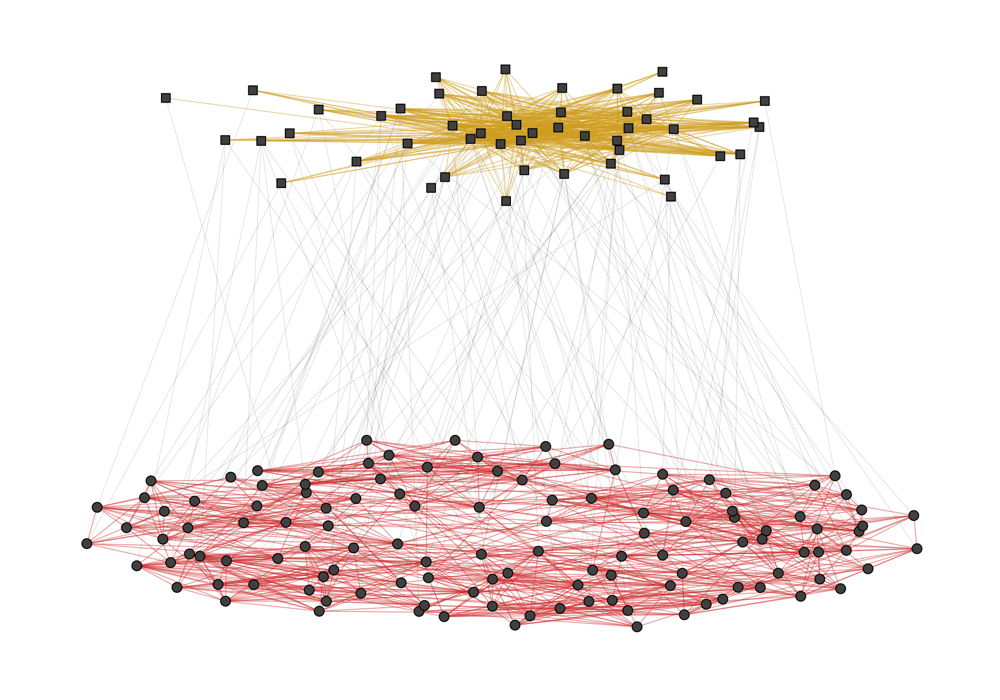
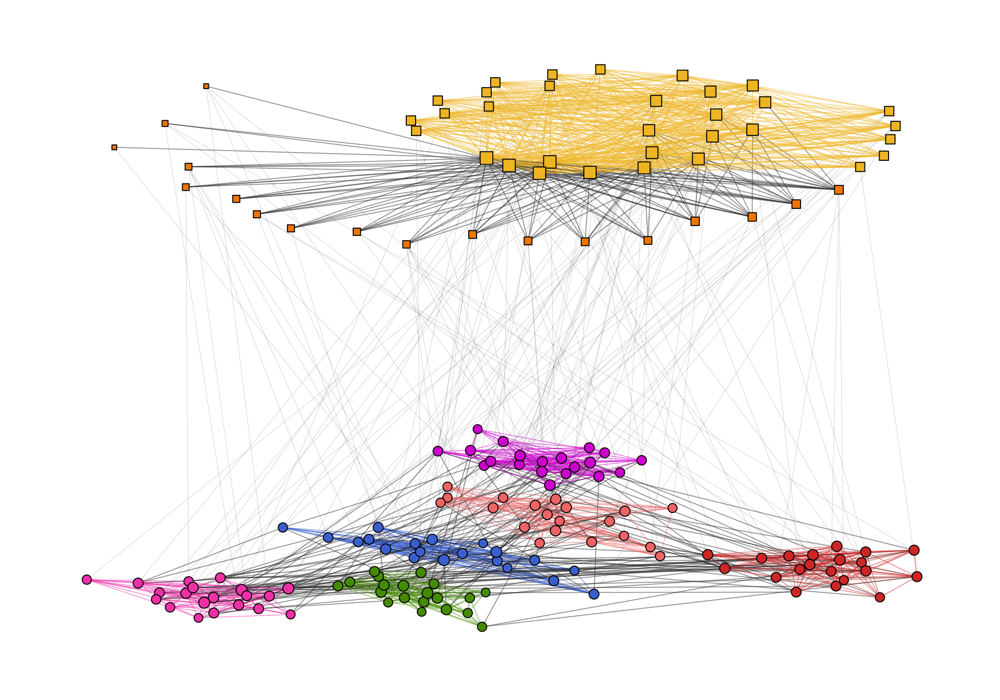
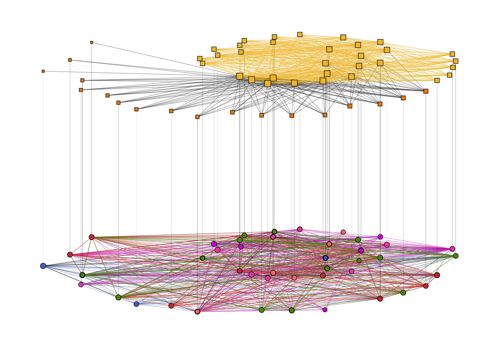

*This post was semi automatically converted from blogdown to Quarto and may contain errors. The original can be found in the [archive](http://archive.schochastics.net/post/visualizing-multilevel-networks-with-graphlayouts/).*

This post introduces `layout_as_multilevel()`, a new function in the
{{graphlayouts}} package. As the name suggests, this function can be use
to visualize multilevel networks.

A multilevel network consists of two (or more) levels with different
node sets and intra-level ties. For instance, one level could be
scientists and their collaborative ties and the second level are labs
and ties among them, and inter-level edges are the affiliations of
scientists and labs.



The {{graphlayouts}} package contains an artificial multilevel network
(igraph format) which will be used throughout this post.

``` r
data("multilvl_ex", package = "graphlayouts")
```

The package assumes that a multilevel network has a vertex attribute
called `lvl` which holds the level information (1 or 2).

``` r
library(igraph)
library(graphlayouts) 
library(ggraph)
library(threejs)
```

The underlying algorithm of `layout_as_multilevel()` has three different
versions, which can be used to emphasize different structural features
of a multilevel network.

Independent of which option is chosen, the algorithm internally produces
a 3D layout, where each level is positioned on a different y-plane. The
3D layout is then mapped to 2D with an [isometric
projection](https://en.wikipedia.org/wiki/Isometric_projection). The
parameters `alpha` and `beta` control the perspective of the projection.
The default values seem to work for many instances, but may not always
be optimal. As a rough guideline: `beta` rotates the plot around the y
axis (in 3D) and `alpha` moves the POV up or down.

## Complete layout

A layout for the complete network can be computed via
`layout_as_multilevel()` setting `type = "all"`. Internally, the
algorithm produces a constrained 3D stress layout (each level on a
different y plane) which is then projected to 2D. This layout ignores
potential differences in each level and optimizes only the overall
layout.

``` r
xy <- layout_as_multilevel(multilvl_ex,type = "all", alpha = 25, beta = 45)
```

To visualize the network with {{ggraph}}, you may want to draw the edges
for each level (and inter level edges) with a different edge geom. This
gives you more flexibility to control aesthetics and can easily be
achieved with a filter.

``` r
ggraph(multilvl_ex, "manual", x = xy[, 1], y = xy[, 2]) +
  geom_edge_link0(
    aes(filter = (node1.lvl == 1 & node2.lvl == 1)),
    edge_colour = "firebrick3",
    alpha = 0.5,
    edge_width = 0.3
  ) +
  geom_edge_link0(
    aes(filter = (node1.lvl != node2.lvl)),
    alpha = 0.3,
    edge_width = 0.1,
    edge_colour = "black"
  ) +
  geom_edge_link0(
    aes(filter = (node1.lvl == 2 &
                    node2.lvl == 2)),
    edge_colour = "goldenrod3",
    edge_width = 0.3,
    alpha = 0.5
  ) +
  geom_node_point(aes(shape = as.factor(lvl)), fill = "grey25", size = 3) +
  scale_shape_manual(values = c(21, 22)) +
  theme_graph() +
  coord_cartesian(clip = "off", expand = TRUE) +
  theme(legend.position = "none")
```



## Separate layouts for both levels

In many instances, there may be different structural properties inherent
to the levels of the network. In that case, two layout functions can be
passed to `layout_as_multilevel()` to deal with these differences. In
our artificial network, level 1 has a hidden group structure and level 2
has a core-periphery structure.

To use this layout option, set `type = "separate"` and specify two
layout functions with `FUN1` and `FUN2`. You can change internal
parameters of these layout functions with named lists in the `params1`
and `params2` argument. Note that this version optimizes inter-level
edges only minimally. The emphasis is on the intra-level structures.

``` r
xy <- layout_as_multilevel(multilvl_ex,type = "separate",
                           FUN1 = layout_as_backbone,
                           FUN2 = layout_with_stress,
                           alpha = 25, beta = 45)
```

Again, try to include an edge geom for each level.

``` r
cols2 <- c("#3A5FCD", "#CD00CD", "#EE30A7", "#EE6363", 
           "#CD2626", "#458B00", "#EEB422", "#EE7600")

ggraph(multilvl_ex, "manual", x = xy[, 1], y = xy[, 2]) +
  geom_edge_link0(aes(
    filter = (node1.lvl == 1 & node2.lvl == 1),
    edge_colour = col
  ),
  alpha = 0.5, edge_width = 0.3) +
  geom_edge_link0(
    aes(filter = (node1.lvl != node2.lvl)),
    alpha = 0.3,
    edge_width = 0.1,
    edge_colour = "black"
  ) +
  geom_edge_link0(aes(
    filter = (node1.lvl == 2 & node2.lvl == 2),
    edge_colour = col
  ),
  edge_width = 0.3, alpha = 0.5) +
  geom_node_point(aes(
    fill = as.factor(grp),
    shape = as.factor(lvl),
    size = nsize
  )) +
  scale_shape_manual(values = c(21, 22)) +
  scale_size_continuous(range = c(1.5, 4.5)) +
  scale_fill_manual(values = cols2) +
  scale_edge_color_manual(values = cols2, na.value = "grey12") +
  scale_edge_alpha_manual(values = c(0.1, 0.7)) +
  theme_graph() +
  coord_cartesian(clip = "off", expand = TRUE) +
  theme(legend.position = "none")
```



## Fix only one level

This layout can be used to emphasize one intra-level structure. The
layout of the second level is calculated in a way that optimizes
inter-level edge placement. Set `type = "fix1"` and specify `FUN1` and
possibly `params1` to fix level 1 or set `type = "fix2"` and specify
`FUN2` and possibly `params2` to fix level 2.

``` r
xy <- layout_as_multilevel(multilvl_ex,type = "fix2",
                           FUN2 = layout_with_stress,
                           alpha = 25, beta = 45)

ggraph(multilvl_ex, "manual", x = xy[, 1], y = xy[, 2]) +
  geom_edge_link0(aes(
    filter = (node1.lvl == 1 & node2.lvl == 1),
    edge_colour = col
  ),
  alpha = 0.5, edge_width = 0.3) +
  geom_edge_link0(
    aes(filter = (node1.lvl != node2.lvl)),
    alpha = 0.3,
    edge_width = 0.1,
    edge_colour = "black"
  ) +
  geom_edge_link0(aes(
    filter = (node1.lvl == 2 & node2.lvl == 2),
    edge_colour = col
  ),
  edge_width = 0.3, alpha = 0.5) +
  geom_node_point(aes(
    fill = as.factor(grp),
    shape = as.factor(lvl),
    size = nsize
  )) +
  scale_shape_manual(values = c(21, 22)) +
  scale_size_continuous(range = c(1.5, 4.5)) +
  scale_fill_manual(values = cols2) +
  scale_edge_color_manual(values = cols2, na.value = "grey12") +
  scale_edge_alpha_manual(values = c(0.1, 0.7)) +
  theme_graph() +
  coord_cartesian(clip = "off", expand = TRUE) +
  theme(legend.position = "none")
```



# 3D with threejs

Instead of the default 2D projection, `layout_as_multilevel()` can also
return the 3D layout by setting `project2d = FALSE`. The 3D layout can
then be used with e.g. {{threejs}} to produce an interactive 3D
visualization.

``` r
xyz <- layout_as_multilevel(multilvl_ex,type = "separate",
                           FUN1 = layout_as_backbone,
                           FUN2 = layout_with_stress,
                           project2D = FALSE)
multilvl_ex$layout <- xyz
V(multilvl_ex)$color <- c("#00BFFF", "#FF69B4")[V(multilvl_ex)$lvl]
V(multilvl_ex)$vertex.label <- V(multilvl_ex)$name
    
graphjs(multilvl_ex, bg="black", vertex.shape="sphere")
```

