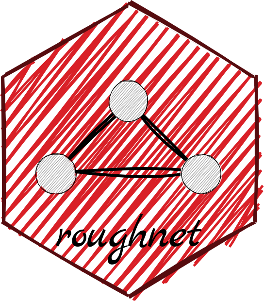
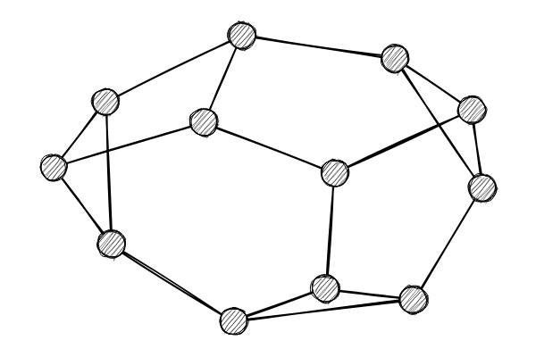
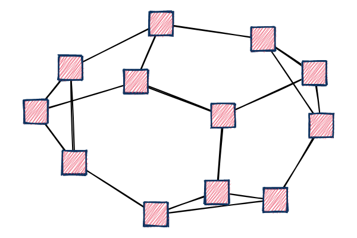
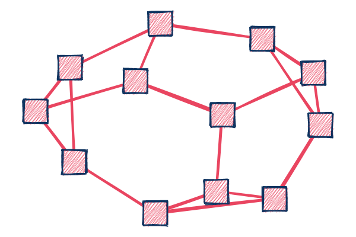
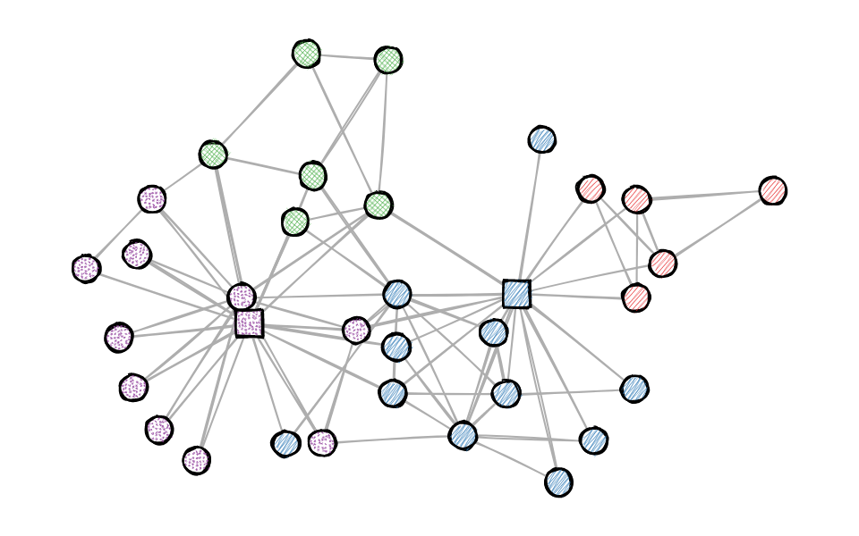
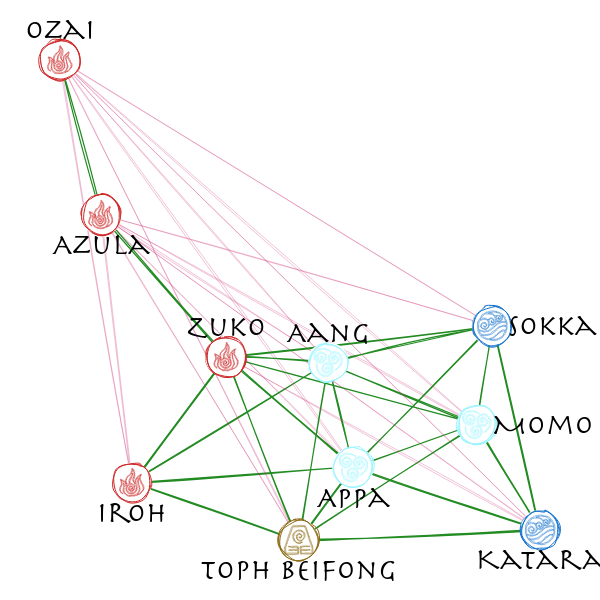

# Sketchy, Hand-drawn-like Networks in R

*This post was semi automatically converted from blogdown to Quarto and may contain errors. The original can be found in the [archive](http://archive.schochastics.net/post/sketchy-hand-drawn-like-networks-in-r/).*




This post introduces the R package `rougnet`, which wraps the java
script library [rough.js](https://roughjs.com/) to draw sketchy,
hand-drawn-like networks. From all my network packages, this is probably
the most useless but most fun one I developed.

The package is so far only available on github, but it already has a
fitting [pkgdown page](http://roughnet.schochastics.net/).

``` r
#install.packages("remotes")
remotes::install_github("schochastics/roughnet")
```

The package only works with {{igraph}} objects.

``` r
library(igraph)
library(roughnet)
```

The only real function of the package is `roughnet()` which draws an
igraph object as a sketchy network. Without specifying any aesthetics,
the function uses default shapes and colours.

``` r
g <- make_graph("Frucht")
roughnet(g,width = 600,height = 400)
```



The function recognizes the following vertex attributes to customize the
visualization:

-   **x** x-coordinate of vertex
-   **y** y-coordinate of vertex
-   **shape** one of “circle”, “rectangle”, (novelty shapes: “heart”,
    “air”, “earth”, “fire”, “water”)
-   **fill** vertex fill color
-   **color** vertex stroke color
-   **stroke** stroke size
-   **fillstyle** one of “hachure”, “solid”, “zigzag”, “cross-hatch”,
    “dots”, “dashed”, “zigzag-line”
-   **size** vertex size
-   **label** vertex label
-   **pos** position of vertex label (c)enter, (n)orth, (e)ast, (s)outh,
    (w)est

``` r
V(g)$shape  <- "rectangle"
V(g)$fill   <- "#e94560"
V(g)$color  <- "#0f3460"
V(g)$stroke <- 2
V(g)$fillstyle <- "zigzag"
V(g)$size <- 40

roughnet(g,width = 600,height = 400)
```



For edges there are only two supported attributes:

-   **color** color of edge
-   **width** width of edge

``` r
E(g)$color <- "#e94560"
E(g)$width <- 2

roughnet(g,width = 600,height = 400)
```



Below is a more “realistic” example using the infamous karate network.

``` r
g <- make_graph("Zachary")
clu <- membership(cluster_louvain(g))
V(g)$shape <- "circle"
V(g)$shape[c(1,34)] <- "rectangle"
V(g)$fill <- c("#E41A1C", "#377EB8", "#4DAF4A", "#984EA3")[clu]
V(g)$fillstyle <- c("hachure", "zigzag", "cross-hatch", "dots")[clu]
V(g)$color <- "black"
V(g)$size <- 30
V(g)$stroke <- 2
E(g)$color <- "#AEAEAE"
roughnet(g,width = 960,height = 600)
```



# Node labels and fonts

Node labels can also be placed, but unfortunately it is a bit more
tedious if you do not simply want to put them in the center (when, say
using some novelty node shapes.)

In the example below, we use the Allies/Enemies relations in “Avatar:
The Last Airbender”, available in the
[signnet](http://signnet.schochastics.net/) package to illustrate all
features of roughnet, including node labels.

By default, node labels are placed in the center of the node, but can be
placed (n)orth, (e)ast, (s)outh, or (w)est of the node.

``` r
# install.packages(c("signnet","graphlayouts"))
library(signnet)
library(graphlayouts)
library(dplyr)

data("avatar") # Allies/Enemies relations in Avatar: The Last Airbender

main <- induced_subgraph(avatar,which(V(avatar)$main)) #only use the main characters

#calculate layout
w <- ifelse(E(main)$sign==1,3,1)
xy <- layout_with_stress(main,weights = 1/w)

V(main)$x <- xy[,1]
V(main)$y <- xy[,2]

V(main)$fill <- case_when(V(main)$affiliation=="earth kingdom"~"#8B6914",
                          V(main)$affiliation=="fire nation"~"#CD2626",
                          V(main)$affiliation=="water tribe"~"white",
                          V(main)$affiliation=="air nomad"~"#98F5FF",
                       TRUE~"grey"
)

V(main)$color <- case_when(V(main)$affiliation=="earth kingdom"~"#8B6914",
                          V(main)$affiliation=="fire nation"~"#CD2626",
                          V(main)$affiliation=="water tribe"~"#1874CD",
                          V(main)$affiliation=="air nomad"~"#98F5FF",
                          TRUE~"grey"
)

V(main)$shape <- case_when(V(main)$affiliation=="earth kingdom"~"earth",
                           V(main)$affiliation=="fire nation"~"fire",
                           V(main)$affiliation=="water tribe"~"water",
                           V(main)$affiliation=="air nomad"~"air",
                           TRUE~"circle"
)


E(main)$width <- ifelse(E(main)$sign==1,1.2,0.3)
E(main)$color <- ifelse(E(main)$sign==1,"#228B22","#CD3278")
V(main)$label <- V(main)$name

# position labels in the (c)enter of the vertex 
# or (n)orth, (e)ast, (s)outh, or (w)est of it 
V(main)$pos <- c("n","s","s","s","s","e","n","e","s","n") 

roughnet(main, width = 600, height = 600, font = "30px Herculanum")
```



# Save plots

Plots can be saved with the function `save_roughnet()` , which needs
{{pagedown}} to be installed.

