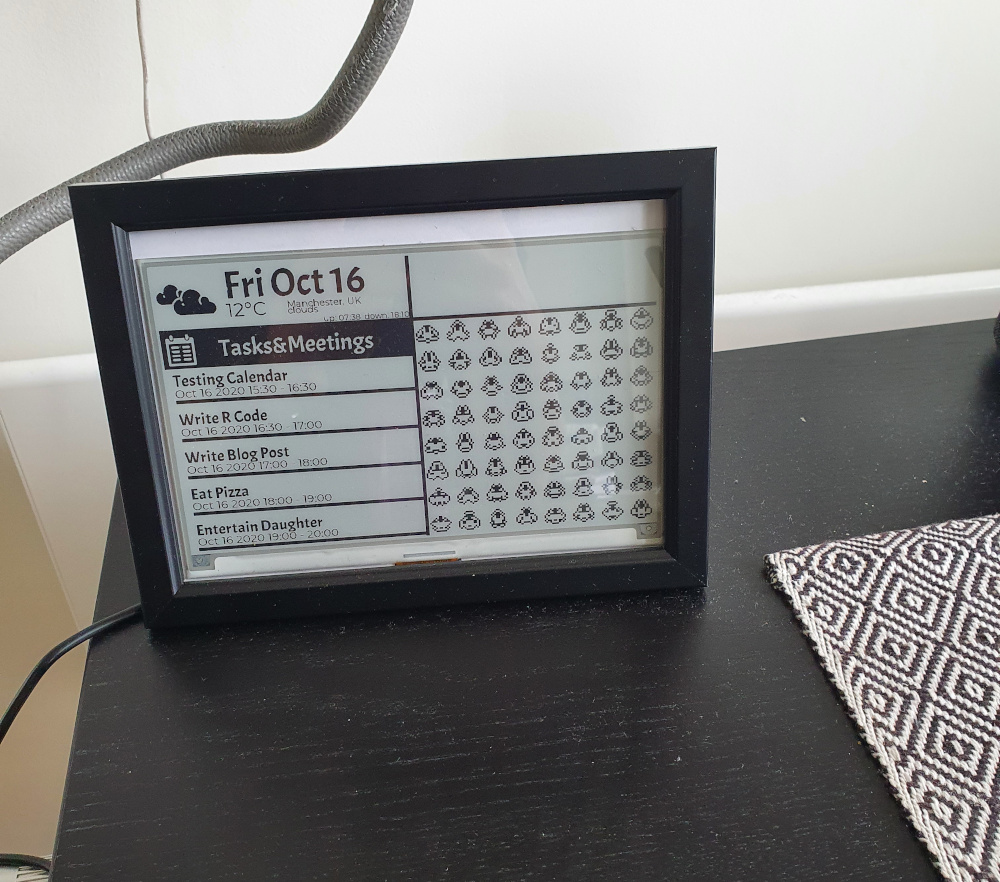
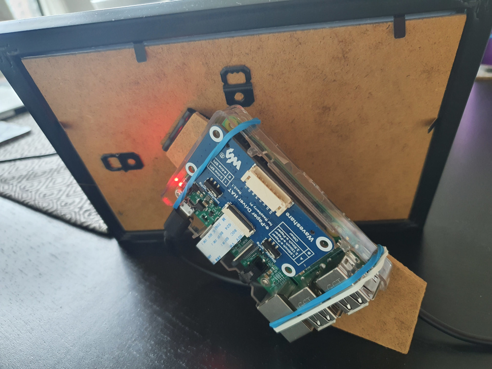
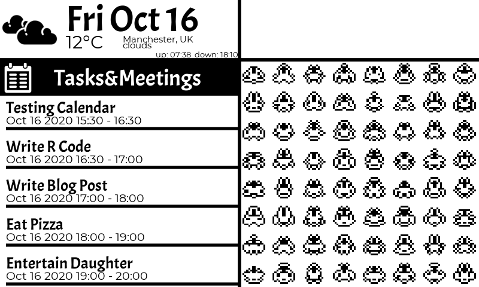

*This post was semi automatically converted from blogdown to Quarto and may contain errors. The original can be found in the [archive](http://archive.schochastics.net/post/raspberry-pi-e-paper-dashboard-with-r/).*

For once, this is not a post on an R package for network analysis or
random R code.  
This post is about a DIY adventure of mine with a little R code on the
side.

I have always been intrigued by the Raspberry Pi, but never really
engaged with it since I lack the practical skills (like soldering) for
most projects you can find on the internet. Until I found [this
build](https://code.mendhak.com/raspberrypi-epaper-dashboard/) of a
Raspberry Pi dashboard, where very little handy skills are needed. So I
set out to build one myself and it turned out quite nice.



This is what you need to build such a dashboard yourself:

-   Raspberry Pi 3 B+ (Raspberry Pi 4 certainly works too)
-   [Waveshare 7.5 Inch E-Paper
    Display](https://www.amazon.co.uk/gp/product/B075R4QY3L/ref=ppx_yo_dt_b_asin_title_o05_s01?ie=UTF8&psc=1)
-   [7x5-inch Picture Photo
    Frame](https://www.amazon.co.uk/gp/product/B00DAB7DLK/ref=ppx_yo_dt_b_asin_title_o01_s00?ie=UTF8&psc=1)

E-Paper displays are kind of awesome since they can display an image
without using any electricity (once it is loaded). This [YouTube
video](https://www.youtube.com/watch?v=kAmnU5Y96MA&t) does a very good
job in explaining the technicalities. The downside of the screen is the
resolution (800x480, which is still quite high for an E-Paper display!)
and the long refresh time (\~2-3 seconds for this model but can go up to
15-20 seconds for colored output). So whatever you display on the
screen, it better not be something that changes every few seconds (mine
changes every 10 minutes).

In the rest of this post, I’ll walk through all the steps necessary to
set up the display to be used with R code.

# The handy stuff

Simply fit the display into the frame and connect it to the Raspberry
Pi. That’s pretty much it.  
Here is the back view of the frame. 

(yes, I used rubber bands to attach the Raspberry Pi to the frame…)

# Setting up the Pi

-   Get Raspberry Pi OS Lite
    ([Link](https://www.raspberrypi.org/downloads/raspberry-pi-os/))
-   Follow the installation guide
    ([Link](https://www.raspberrypi.org/documentation/installation/installing-images/README.md))

# Installing R on the Raspberry Pi

Installing R on the Raspberry Pi turned out to be trickier than I
thought. I was only able to install version 3.6 from the package
sources, but I wanted to have version 4.0.2. I tried following the
guides posted
[here](https://www.charlesbordet.com/en/how-to-upgrade-to-R-4-0-0-on-debian/#starting-point)
and [here](https://cran.r-project.org/bin/linux/debian/) but always ran
into the problem that the package `r-base-core` was not available for
4.0.

I ended up compiling R from source, which was surprisingly simple. I
loosely followed the guide posted
[here](https://community.rstudio.com/t/setting-up-your-own-shiny-server-rstudio-server-on-a-raspberry-pi-3b/18982):

``` bash
wget https://cran.rstudio.com/src/base/R-4/R-4.0.2.tar.gz
tar zxvf R-4.0.2.tar.gz
# uncomment first line in /etc/apt/source.list
sudo apt-get build-dep r-base 
./configure --prefix=/opt/R/4.0.2 --enable-R-shlib --with-blas --with-lapack
```

If you run into the error:  
`configure: error: PCRE2 library and headers are required, or use --with-pcre1 and PCRE >= 8.32 with UTF-8 support`  
do

``` bash
sudo apt-get install libpcre2-dev
```

``` bash
sudo make
sudo make install

sudo ln -s /opt/R/4.0.2/bin/R /usr/local/bin/R
sudo ln -s /opt/R/4.0.2/bin/Rscript /usr/local/bin/Rscript
```

and that’s already it. You should now have R ready to run on your
Raspberry Pi. Since we are operating on a headless Raspberry Pi, there
is no point in trying to install RStudio. I found, however, [Nvim
R](https://github.com/jalvesaq/Nvim-R) to be an awesome headless
substitute (if you are happy using vi, that is).

# Setting up the E-Paper display

I simply followed the guide posted on the [waveshare
wiki](https://www.waveshare.com/wiki/7.5inch_e-Paper_HAT).

## Enable SPI

`sudo raspi-config` and then choose Interfacing Options -\> SPI -\> Yes.

## Install BCM2835 libraries

Check what the newest version is. At the time of writing, it was `1.68`.

``` bash
wget http://www.airspayce.com/mikem/bcm2835/bcm2835-1.68.tar.gz
tar zxvf bcm2835-1.68.tar.gz 
cd bcm2835-1.68/
sudo ./configure
sudo make
sudo make check
sudo make install
```

## Install wiringPi

``` bash
sudo apt-get install wiringpi
```

If you are on a Raspberry Pi 4, you’ll need to update it

``` bash
wget https://project-downloads.drogon.net/wiringpi-latest.deb
sudo dpkg -i wiringpi-latest.deb
```

# Communicating with the display from R

The Raspberry Pi can easily communicate with the display via some C or
python library. Luckily, both can be integrated in R. I opted for
python, due to the amazing R package `reticulate` which makes the
communication between R and python a breeze. I’d be interested, though
to package the C library as an R package (eventually).

``` bash
#python3
sudo apt-get update
sudo apt-get install python3-pip
sudo apt-get install python3-pil
sudo apt-get install python3-numpy
sudo pip3 install Raspberry Pi.GPIO
sudo pip3 install spidev
```

You’ll also need `git` to download some additional code.

``` bash
sudo apt-get install git -y
```

Then, clone the repository of waveshare that includes the needed
libraries.

``` bash
sudo git clone https://github.com/waveshare/e-Paper
```

The library we will need is in the folder
`RaspberryPi&JetsonNano/python/lib`.

## python code for communication

The python code below is used to send the bitmap file
`screen-output.bmp` to the display.

``` python
#!/usr/bin/python
# -*- coding:utf-8 -*-
import sys
import os
import time
libdir="/home/pi/e-Paper/RaspberryPi&JetsonNano/python/lib"
if os.path.exists(libdir):
    sys.path.append(libdir)

from waveshare_epd import epd7in5_V2
from PIL import Image,ImageDraw,ImageFont

try:
    epd = epd7in5_V2.EPD()
    epd.init()
    Himage = Image.open("screen-output.bmp")
    epd.display(epd.getbuffer(Himage))
    epd.sleep()
except KeyboardInterrupt:    
    epd7in5.epdconfig.module_exit()
    exit()
```

Note that I am not a python expert so this code may well be awful (but
it works). The code bellow shows how to call this script (`display.py`)
from within R.

``` r
library(reticulate)

use_python("/usr/bin/python3")
py_run_file("display.py")
```

# Build the dashboard in R

Now that we can communicate with the display from python and know how to
use python from within R, we can think about what we want to display on
the dashboard and how we implement it. Remember, all we have is 800x480
pixels in black and white. Apart from this constrained though, you are
free to put whatever you want on the display. I opted for a standard
weather, calendar, and date setup, together with some randomly generated
pixel art spaceships (my R implementation of a
[pixel-sprite-generator](https://github.com/zfedoran/pixel-sprite-generator)).
The plotting is done entirely with `ggplot2`.

To reproduce my dashboard setup, simply clone the repository

``` r
git clone https://github.com/schochastics/e-Paper-dashboard.git
```

To use the code, you need to get an API key from openweathermap.org and
set up the `gcalendr` package with your google calendar. The rest should
work out of the box (except that it won’t. feel free to ask questions in
the comments or on [twitter](https://www.twitter.com/schochastics).

Of course you do not have to follow my build. The following code snippet
should be sufficient to build your own dashboard from scratch.

``` r
library(reticulate)
#load additional libraries, such as e.g. ggplot2
use_python("/usr/bin/python3")

#build your plot object

ggsave("raw-output.bmp",p,width=5,height=3,dpi = 160)
system("convert -colors 2 +dither -type Bilevel -monochrome raw-output.bmp screen-output.bmp")
py_run_file("display.py")
```

The parameters set in `ggsave()` makes sure that the output is a 800x480
bmp file and the line thereafter converts the plot to a true black and
white image (which speeds up the rendering on the display). For the
second line to work you need to install `imagemagick`.

``` bash
sudo apt-get install imagemagick
```

Here is an example dashboard with my code from github.



