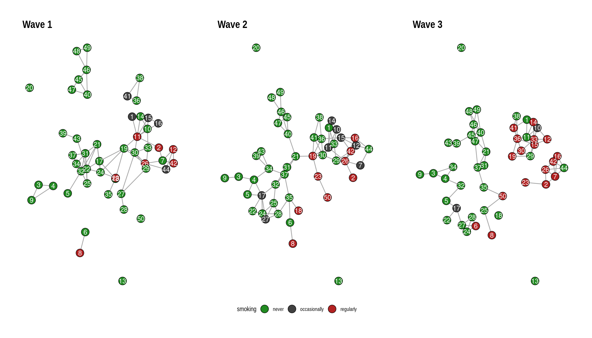

# Animating Network Evolutions with gganimate

*This post was semi automatically converted from blogdown to Quarto and may contain errors. The original can be found in the [archive](http://archive.schochastics.net/post/animating-network-evolutions-with-gganimate/).*


People regularly ask me if it is possible to animate a network evolution
with {{ggraph}} and {{gganimate}}. Unfortunately this is not yet
possible. But fear not! There is a way to still get it done with some
hacking around the ggraph package. In this post, I will walk through
this hack but hope that it will eventually become obsolete.

``` r
library(ggraph)
library(igraph)
library(gganimate)
library(graphlayouts)
library(patchwork)
```

To illustrate the code, we will be using the *50 actor excerpt from the
Teenage Friends and Lifestyle Study* from the [RSiena data
repository](https://www.stats.ox.ac.uk/~snijders/siena/siena_datasets.htm).

``` r
s50
```

``` hljs
## [[1]]
## IGRAPH dd2aeb6 UN-- 50 74 -- 
## + attr: name (v/c), smoke (v/n)
## + edges from dd2aeb6 (vertex names):
##  [1] V1 --V11 V1 --V14 V2 --V7  V2 --V11 V3 --V4  V3 --V9  V4 --V9  V5 --V32
##  [9] V6 --V8  V7 --V12 V7 --V26 V7 --V42 V7 --V44 V10--V11 V10--V14 V10--V15
## [17] V10--V33 V11--V14 V11--V15 V11--V16 V11--V19 V11--V30 V12--V42 V12--V44
## [25] V15--V16 V17--V18 V17--V19 V17--V21 V17--V22 V17--V24 V18--V19 V18--V35
## [33] V19--V24 V19--V26 V19--V30 V21--V22 V21--V24 V21--V31 V21--V32 V22--V24
## [41] V22--V25 V22--V31 V22--V34 V22--V43 V23--V24 V25--V31 V25--V32 V26--V29
## [49] V26--V30 V26--V44 V27--V28 V27--V29 V27--V30 V29--V30 V29--V33 V30--V33
## [57] V31--V32 V31--V34 V31--V37 V32--V37 V34--V37 V36--V38 V36--V41 V38--V41
## + ... omitted several edges
## 
## [[2]]
## IGRAPH 6e28c77 UN-- 50 81 -- 
## + attr: name (v/c), smoke (v/n)
## + edges from 6e28c77 (vertex names):
##  [1] V1 --V10 V1 --V11 V1 --V14 V1 --V33 V2 --V26 V3 --V4  V3 --V9  V4 --V5 
##  [9] V4 --V17 V4 --V34 V5 --V17 V6 --V8  V6 --V35 V7 --V26 V7 --V44 V10--V11
## [17] V10--V14 V10--V33 V11--V14 V11--V19 V11--V26 V11--V30 V12--V15 V12--V26
## [25] V12--V42 V12--V44 V15--V16 V15--V36 V15--V42 V16--V26 V16--V42 V16--V44
## [33] V17--V22 V17--V24 V17--V27 V17--V32 V18--V35 V19--V21 V19--V23 V19--V30
## [41] V19--V36 V19--V41 V21--V31 V21--V37 V21--V40 V22--V24 V23--V50 V24--V25
## [49] V24--V28 V25--V27 V25--V28 V25--V32 V26--V42 V27--V28 V28--V35 V29--V30
## [57] V29--V33 V29--V42 V30--V33 V30--V36 V30--V41 V31--V32 V31--V37 V32--V37
## + ... omitted several edges
## 
## [[3]]
## IGRAPH 9285b7f UN-- 50 77 -- 
## + attr: name (v/c), smoke (v/n)
## + edges from 9285b7f (vertex names):
##  [1] V1 --V10 V1 --V11 V1 --V14 V1 --V41 V2 --V7  V2 --V23 V2 --V26 V3 --V4 
##  [9] V3 --V9  V3 --V34 V4 --V32 V4 --V34 V5 --V17 V5 --V32 V6 --V24 V6 --V27
## [17] V6 --V28 V7 --V16 V7 --V26 V7 --V42 V7 --V44 V8 --V25 V10--V11 V10--V12
## [25] V10--V14 V10--V33 V11--V14 V11--V15 V11--V33 V12--V15 V12--V33 V14--V33
## [33] V15--V29 V15--V33 V15--V36 V16--V26 V16--V42 V16--V44 V17--V22 V17--V27
## [41] V19--V29 V19--V30 V19--V36 V21--V31 V21--V37 V21--V40 V21--V45 V24--V27
## [49] V24--V28 V25--V50 V26--V44 V27--V28 V29--V30 V29--V33 V30--V33 V30--V36
## [57] V31--V37 V35--V37 V35--V50 V36--V38 V36--V41 V37--V47 V38--V41 V39--V43
## + ... omitted several edges
```

The dataset consists of three networks with 50 actors each and a vertex
attribute for the smoking behaviour of students. As a first step, we
need to create a layout for all three networks. You can basically use
any type of layout for each network, but I’d recommend
`layout_as_dynamic()` from my very own package {{graphlayouts}}. The
algorithm calculates a reference layout which is a layout of the union
of all networks and individual layouts based on stress minimization and
combines those in a linear combination which is controlled by the
`alpha` parameter. For `alpha=1`, only the reference layout is used and
all graphs have the same layout. For `alpha=0`, the stress layout of
each individual graph is used. Values in-between interpolate between the
two layouts.

``` r
xy <- layout_as_dynamic(s50, alpha = 0.2)
```

Now you could use {{ggraph}} and {{patchwork}} to produce a static plot
with all networks side-by-side.

``` r
pList <- vector("list", length(s50))

for (i in 1:length(s50)) {
  pList[[i]] <- ggraph(s50[[i]], layout = "manual", x = xy[[i]][, 1], y = xy[[i]][, 2]) +
    geom_edge_link0(edge_width = 0.6, edge_colour = "grey66") +
    geom_node_point(shape = 21, aes(fill = as.factor(smoke)), size = 6) +
    geom_node_text(label = 1:50, repel = FALSE, color = "white", size = 4) +
    scale_fill_manual(
      values = c("forestgreen", "grey25", "firebrick"),
      guide = ifelse(i != 2, "none", "legend"),
      name = "smoking",
      labels = c("never", "occasionally", "regularly")
    ) +
    theme_graph() +
    theme(legend.position = "bottom") +
    labs(title = paste0("Wave ", i))
}

Reduce("+", pList)
```



This is nice and all but of course we want to animate the changes. This
is where we say goodbye to {{ggraph}} and hello to {{ggplot2}}. First,
we create a list of data frames for all nodes and add the layout to it.

``` r
nodes_lst <- lapply(1:length(s50), function(i) {
  cbind(igraph::as_data_frame(s50[[i]], "vertices"),
    x = xy[[i]][, 1], y = xy[[i]][, 2], frame = i
  )
})
```

This was the easy part, because all nodes are present in all time frames
so there is not much to do. Edges will be a lot trickier.

``` r
edges_lst <- lapply(1:length(s50), function(i) cbind(igraph::as_data_frame(s50[[i]], "edges"), frame = i))

edges_lst <- lapply(1:length(s50), function(i) {
  edges_lst[[i]]$x <- nodes_lst[[i]]$x[match(edges_lst[[i]]$from, nodes_lst[[i]]$name)]
  edges_lst[[i]]$y <- nodes_lst[[i]]$y[match(edges_lst[[i]]$from, nodes_lst[[i]]$name)]
  edges_lst[[i]]$xend <- nodes_lst[[i]]$x[match(edges_lst[[i]]$to, nodes_lst[[i]]$name)]
  edges_lst[[i]]$yend <- nodes_lst[[i]]$y[match(edges_lst[[i]]$to, nodes_lst[[i]]$name)]
  edges_lst[[i]]$id <- paste0(edges_lst[[i]]$from, "-", edges_lst[[i]]$to)
  edges_lst[[i]]$status <- TRUE
  edges_lst[[i]]
})

head(edges_lst[[1]])
```

``` hljs
##   from  to frame        x         y     xend      yend     id status
## 1   V1 V11     1  1.32792  0.252519  1.68503 -0.730153 V1-V11   TRUE
## 2   V1 V14     1  1.32792  0.252519  1.91657  0.262864 V1-V14   TRUE
## 3   V2  V7     1  3.20622 -1.264155  3.47495 -1.895885  V2-V7   TRUE
## 4   V2 V11     1  3.20622 -1.264155  1.68503 -0.730153 V2-V11   TRUE
## 5   V3  V4     1 -5.24340 -3.084044 -4.21626 -3.138588  V3-V4   TRUE
## 6   V3  V9     1 -5.24340 -3.084044 -5.73630 -3.832184  V3-V9   TRUE
```

We have expanded the edge data frame in a way that also includes the
coordinates of the endpoints from the layout that we calculated earlier.

Now we create a helper matrix which includes all edges that are present
in any of the networks

``` r
all_edges <- do.call("rbind", lapply(s50, get.edgelist))
all_edges <- all_edges[!duplicated(all_edges), ]
all_edges <- cbind(all_edges, paste0(all_edges[, 1], "-", all_edges[, 2]))
```

This is used to impute the edges into all networks. So any edge that is
not present in time frame two and three gets added to time frame one.
But to keep track of these, we set there status to `FALSE`.

``` r
edges_lst <- lapply(1:length(s50), function(i) {
  idx <- which(!all_edges[, 3] %in% edges_lst[[i]]$id)
  if (length(idx != 0)) {
    tmp <- data.frame(from = all_edges[idx, 1], to = all_edges[idx, 2], id = all_edges[idx, 3])
    tmp$x <- nodes_lst[[i]]$x[match(tmp$from, nodes_lst[[i]]$name)]
    tmp$y <- nodes_lst[[i]]$y[match(tmp$from, nodes_lst[[i]]$name)]
    tmp$xend <- nodes_lst[[i]]$x[match(tmp$to, nodes_lst[[i]]$name)]
    tmp$yend <- nodes_lst[[i]]$y[match(tmp$to, nodes_lst[[i]]$name)]
    tmp$frame <- i
    tmp$status <- FALSE
    edges_lst[[i]] <- rbind(edges_lst[[i]], tmp)
  }
  edges_lst[[i]]
})
```

Why are we doing this? After a lot of experimenting, I came to the
conclusion that it is always best to draw all edges, but use zero
opacity if `status=FALSE`. In that way, one gets a smoother transition
for edges that (dis)appear. There are probably other workarounds, but
this one worked best for me.

In the last step, we create a data frame out of the lists

``` r
edges_df <- do.call("rbind", edges_lst)
nodes_df <- do.call("rbind", nodes_lst)

head(edges_df)
```

``` hljs
##   from  to frame        x         y     xend      yend     id status
## 1   V1 V11     1  1.32792  0.252519  1.68503 -0.730153 V1-V11   TRUE
## 2   V1 V14     1  1.32792  0.252519  1.91657  0.262864 V1-V14   TRUE
## 3   V2  V7     1  3.20622 -1.264155  3.47495 -1.895885  V2-V7   TRUE
## 4   V2 V11     1  3.20622 -1.264155  1.68503 -0.730153 V2-V11   TRUE
## 5   V3  V4     1 -5.24340 -3.084044 -4.21626 -3.138588  V3-V4   TRUE
## 6   V3  V9     1 -5.24340 -3.084044 -5.73630 -3.832184  V3-V9   TRUE
```

``` r
head(nodes_df)
```

``` hljs
##    name smoke        x         y frame
## V1   V1     2  1.32792  0.252519     1
## V2   V2     3  3.20622 -1.264155     1
## V3   V3     1 -5.24340 -3.084044     1
## V4   V4     1 -4.21626 -3.138588     1
## V5   V5     1 -3.19538 -3.498896     1
## V6   V6     1 -1.96224 -5.393470     1
```

And thats it in terms of data wrangling. All that is left is to
plot/animate the data

``` r
ggplot() +
  geom_segment(
    data = edges_df,
    aes(x = x, xend = xend, y = y, yend = yend, group = id, alpha = status), 
    show.legend = FALSE
  ) +
  geom_point(
    data = nodes_df, aes(x, y, group = name, fill = as.factor(smoke)),
    shape = 21, size = 4, show.legend = FALSE
  ) +
  scale_fill_manual(values = c("forestgreen", "grey25", "firebrick")) +
  scale_alpha_manual(values = c(0, 1)) +
  ease_aes("quadratic-in-out") +
  transition_states(frame, state_length = 0.5, wrap = FALSE) +
  labs(title = "Wave {closest_state}") +
  theme_void()
```


And thats it. there are probably a million ways to improve the code/ the
animation but this is one “quick” way of animating network evolution
looking like it was made with {{ggraph}}.

