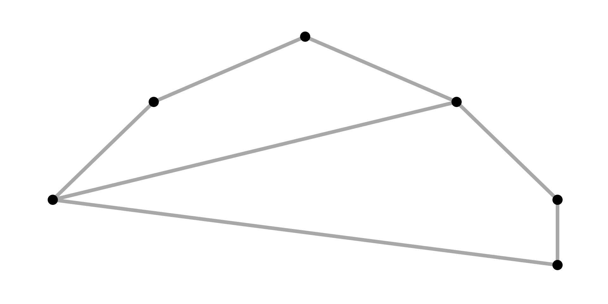
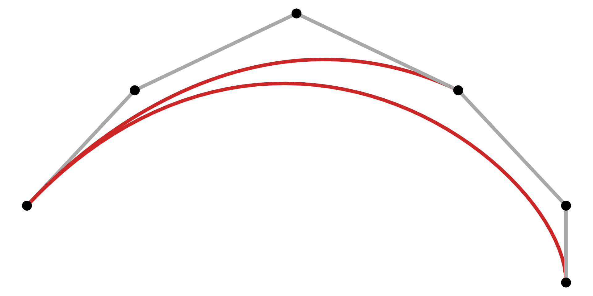
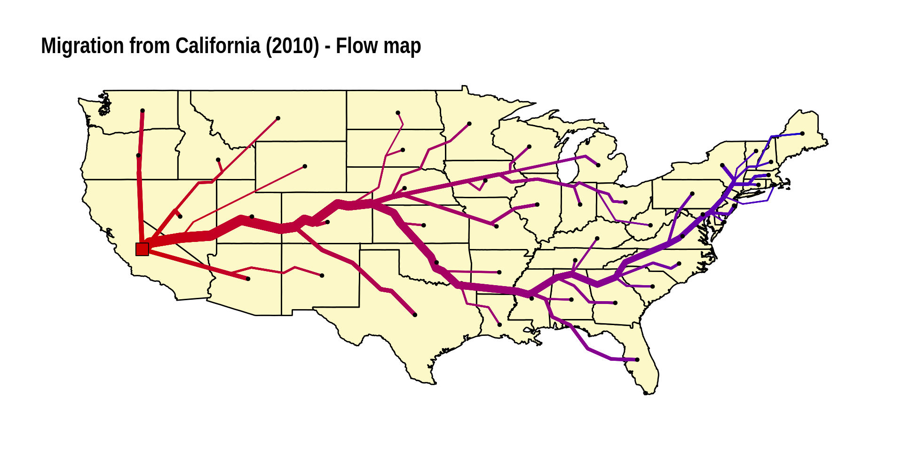
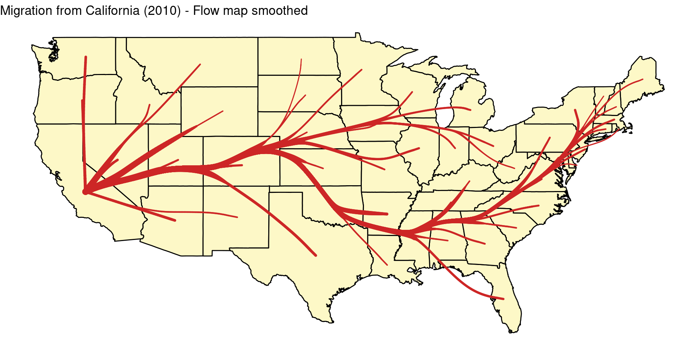

*This post was semi automatically converted from blogdown to Quarto and may contain errors. The original can be found in the [archive](http://archive.schochastics.net/post/smooth-flow-maps-and-a-new-edge-bundling-algorithm/).*

This post introduces new features of `edgebundle`, an R package that
implements several edge bundling/flow and metro map algorithms.


In this post, I will introduce edge-path bundling
([paper](https://arxiv.org/abs/2108.05467)) and smooth flow maps. Given
that edge bundling is mostly used on maps, I will also give a brief
example on how to convert the output of any edge bundling function to an
`sf` linestring object.

The package is available on CRAN.

``` r
install.packages("edgebundle")
```

The developer version can be installed with

``` r
# install.packages("remotes")
remotes::install_github("schochastics/edgebundle")
```

``` r
library(edgebundle)
library(igraph)
library(ggplot2)
library(ggraph)
```

# Edge-path bundling

General edge bundling techniques cluster edges with similar properties,
such as similarity in direction or proximity, to reduce visual clutter.
Resulting clusters can produce ambiguous connections that do not exist
in the data. Edge-path bundling is a very new bundling technique which
simplifies edge clutter and reduces ambiguities compared to previous
bundling methods. Edge-Path bundling takes a layout as input and
clusters each edge along a weighted, shortest path to limit the
deviation from a straight line. A very simple example is shown below.

``` r
g <- graph_from_edgelist(matrix(c(1, 2, 1, 6, 1, 4, 2, 3, 3, 4, 4, 5, 5, 6),
  ncol = 2, byrow = TRUE
), FALSE)
xy <- cbind(c(0, 10, 25, 40, 50, 50), c(0, 15, 25, 15, 0, -10))

# non-bundled drawing
ggraph(g, "manual", x = xy[, 1], y = xy[, 2]) +
  geom_edge_link0(edge_colour = "grey66", edge_width = 2) +
  geom_node_point(size = 5) +
  theme_graph()
```



``` r
# bundled drawing
res <- edge_bundle_path(g, xy, max_distortion = 2, weight_fac = 2, segments = 50)
ggplot() +
  geom_path(
    data = res, aes(x, y, group = group, col = as.factor(group)),
    size = 2, show.legend = FALSE
  ) +
  geom_point(data = as.data.frame(xy), aes(V1, V2), size = 5) +
  scale_color_manual(values = c("grey66", "firebrick3", "firebrick3", rep("grey66", 4))) +
  theme_void()
```



The parameters `max_distortion` and `weight_fac` control what types of
edges are being bundled. The default value for `weight_fac` seems very
universal but I noticed that the recommended default 2 for
`max_distortion` is not adequate for my implementation. I got the best
results with values between 12 and 20 (I guess I have a “times ten”
error somewhere). `segments` controls how many dots on each line are
placed. 50 seems to be a sensible default.

Personally, I really like this new algorithm. Not based on any objective
metric but I think the resulting visualizations are quite pleasing.
Below is the standard benchmark with the us_flight dataset.

``` r
g <- us_flights
xy <- cbind(V(g)$longitude, V(g)$latitude)
verts <- data.frame(x = V(g)$longitude, y = V(g)$latitude)

pbundle <- edge_bundle_path(g, xy, max_distortion = 12, weight_fac = 2, segments = 50)

states <- map_data("state")

ggplot() +
  geom_polygon(data = states, aes(long, lat, group = group), 
               col = "white", size = 0.1, fill = NA) +
  geom_path(data = pbundle, aes(x, y, group = group), 
            col = "#9d0191", size = 0.05) +
  geom_path(data = pbundle, aes(x, y, group = group), 
            col = "white", size = 0.005) +
  geom_point(data = verts, aes(x, y), 
             col = "#9d0191", size = 0.25) +
  geom_point(data = verts, aes(x, y), 
             col = "white", size = 0.25, alpha = 0.5) +
  geom_point(data = verts[verts$name != "", ], aes(x, y), 
             col = "white", size = 3, alpha = 1) +
  labs(title = "Edge-Path Bundling") +
  ggraph::theme_graph(background = "black") +
  theme(plot.title = element_text(color = "white"))
```


# Convert edge-bundlings to sf objects

Edge bundlings are most commonly used for drawing networks on maps. It
my thus be helpful to transform the result of an edge bundling to an sf
object, so that the result can be easily visualized on projected maps.
The code below gives a minimal example on how to achieve this,
converting the result above into linestrings.

``` r
library(sf)
library(dplyr)
pbundle_sf <- pbundle %>% 
  st_as_sf(coords = c("x", "y"), agr = "constant") %>%
  group_by(group) %>%
  summarise(do_union = FALSE) %>% 
  st_cast("LINESTRING")

st_crs(pbundle_sf) <- "+proj=longlat +datum=WGS84 +no_defs +ellps=WGS84 +towgs84=0,0,0"

pbundle_sf
```

``` hljs
## Simple feature collection with 7 features and 1 field
## Geometry type: LINESTRING
## Dimension:     XY
## Bounding box:  xmin: 0 ymin: -10 xmax: 50 ymax: 25
## CRS:           +proj=longlat +datum=WGS84 +no_defs +ellps=WGS84 +towgs84=0,0,0
## # A tibble: 7 × 2
##   group                                                                 geometry
## * <dbl>                                                         <LINESTRING [°]>
## 1     1 (0 0, 0.204082 0.306122, 0.408163 0.612245, 0.612245 0.918367, 0.816327…
## 2     2 (0 0, 1.04081 1.50854, 2.12072 2.96814, 3.23717 4.37207, 4.38763 5.7141…
## 3     3 (0 0, 0.61845 0.911992, 1.24914 1.81073, 1.89181 2.69543, 2.54622 3.565…
## 4     4 (10 15, 10.3061 15.2041, 10.6122 15.4082, 10.9184 15.6122, 11.2245 15.8…
## 5     5 (25 25, 25.3061 24.7959, 25.6122 24.5918, 25.9184 24.3878, 26.2245 24.1…
## 6     6 (40 15, 40.2041 14.6939, 40.4082 14.3878, 40.6122 14.0816, 40.8163 13.7…
## 7     7 (50 0, 50 -0.204082, 50 -0.408163, 50 -0.612245, 50 -0.816327, 50 -1.02…
```

# Smooth flow maps

The newly added function `tnss_smooth()` allows for a smoother
appearance of flow maps. The figure below shows the standard way of
plotting flow maps without smoothing.

``` r
root <- 4
xy <- cbind(state.center$x, state.center$y)[!state.name %in% c("Alaska", "Hawaii"), ]
xy_dummy <- tnss_dummies(xy, 4)
gtree <- tnss_tree(cali2010, xy, xy_dummy, root = 4, gamma = 0.9, order = "near")

ggraph(gtree, "manual", x = V(gtree)$x, y = V(gtree)$y) +
  geom_polygon(data = us, aes(long, lat, group = group), fill = "#FDF8C7", col = "black") +
  geom_edge_link(aes(width = flow, col = sqrt((xy[root, 1] - ..x..)^2 + (xy[root, 2] - ..y..)^2)),
    lineend = "round", show.legend = FALSE
  ) +
  scale_edge_width(range = c(0.5, 4), trans = "sqrt") +
  scale_edge_color_gradient(low = "#cc0000", high = "#0000cc") +
  geom_node_point(aes(filter = tnss == "leaf"), size = 1) +
  geom_node_point(aes(filter = (name == "California")), size = 5, shape = 22, fill = "#cc0000") +
  theme_graph() +
  labs(title = "Migration from California (2010) - Flow map")
```



When the data is being smoothed, unfortunately also the standard way of
plotting the flow map changes.

``` r
smooth_df <- tnss_smooth(gtree, bw = 5, n = 20)

ggplot() +
  geom_polygon(data = us, aes(long, lat, group = group), fill = "#FDF8C7", col = "black") +
  geom_path(
    data = smooth_df, aes(x, y, group = destination, size = flow),
    lineend = "round", col = "firebrick3", alpha = 1
  ) +
  theme_void() +
  scale_size(range = c(0.5, 3), guide = "none") +
  labs(title = "Migration from California (2010) - Flow map smoothed")
```



The output of `tnss_smooth()`, however, has now the same structure as
the result of all edgebundling functions, so that it is also straight
forward to transform the smoothed flow map into an sf linestring.

