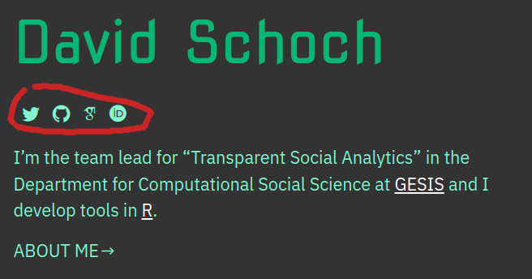

# Academicons: my first quarto extension

*This post was semi automatically converted from blogdown to Quarto and may contain errors. The original can be found in the [archive](http://archive.schochastics.net/post/academicons-my-first-quarto-extension/).*


I have been following the development of [quarto](https://quarto.org/)
for a while now and I am pretty excited about it. Not only its features
but also its rich and detailed documentation will make me transition
from Rmarkdown to Quarto in the long run. While moving my [personal
webpage](https://mr.schochastics.net/), I realized though that I am
still missing some features. Quarto is still in its early stages so it
is no surprise that some features from Rmarkdown do not yet exist in
quarto.

A few days ago, however, I noticed that a very exciting feature was
added. [Custom extensions](https://quarto.org/docs/extensions/).

> Quarto Extensions are a powerful way to modify or extend the behavior
> of Quarto, and can be created and distributed by anyone

Extensions can be shortcodes, filters and, formats. All for different
purposes and all very well explained in the docs. Note that extensions
are, at the time of writing, a new feature of Quarto. Make sure to
install at least v1.0.15 if you want to use them.

## Adding social media accounts to my web page

When I transitioned my personal page to Quarto, I was missing an easy
way to add my social media accounts using
[fontawesome](https://fontawesome.com/) icons. I was using the [Hugo
Apéro](https://hugo-apero-docs.netlify.app/) theme for blogdown before,
and there it was just a matter of adding the usernames in the yaml
header. As far as I understood, this is not possible with Quarto (yet).

So at that time, I kind of hacked my way to what I wanted using some
simple lua scripts.

``` r
function twitter(handle)
  local output = '<a href="https://twitter.com/' .. pandoc.utils.stringify(handle) .. '"><i class="bi bi-twitter" ></i></a>'
  return pandoc.RawBlock('html', output)
end

function github(handle)
  local output = '<a href="https://github.com/' .. pandoc.utils.stringify(handle) .. '"><i class="bi bi-github" ></i></a>'
  return pandoc.RawBlock('html', output)
end

function scholar(handle)
  local output = '<a href="https://scholar.google.de/citations?user=' .. pandoc.utils.stringify(handle) .. '&hl=en"><i class="ai ai-google-scholar" ></i></a>'
  return pandoc.RawBlock('html', output)
end

function orcid(handle)
  local output = '<a href="https://orcid.org/' .. pandoc.utils.stringify(handle) .. '"><i class="ai ai-orcid" ></i></a>'
  return pandoc.RawBlock('html', output)
end
```

The lua script defines
[shortcodes](http://blog.schochastics.net/post/academicons-my-first-quarto-extension/icon%20https://quarto.org/docs/extensions/shortcodes.html)
that can be used like this

``` hljs




```

and here is what it looks like on my page.



You can find the full code of my page on
[github](https://github.com/schochastics/quarto-schochastics).

## The academicons extension

Quarto extensions are a great way to easily add shortcodes to your
quarto projects without the need of adding lua scripts to the yaml
header. To add fontawesome icon support you install the
[extension](https://github.com/quarto-ext/fontawesome) in your project

``` hljs
quarto install extension quarto-ext/fontawesome
```

and then you can use any kind of free icon via the shortcode
``.

A similar library to fontawesome (but much smaller) are
[academicons](https://jpswalsh.github.io/academicons/), which provide
support for, well, academic icons. Since the library is very similar to
fontawesome, it was quite straightforward to build a quarto extension
that gives a shortcode to use the icons. To install it in your project
just do

``` hljs
quarto install extension schochastics/academicons
```

and to embed an icon, you can use the `{}` shortcode. All
available icons can be found here:

<https://jpswalsh.github.io/academicons/>

Here is the source code for a minimal example:
[example.qmd](https://github.com/schochastics/academicons/blob/main/example.qmd)  
This is the output of example.qmd for
[HTML](https://schochastics.github.io/academicons/).

[
Twitter](https://twitter.com/share?text=Academicons%3a%20my%20first%20quarto%20extension&url=http%3a%2f%2fblog.schochastics.net%2fpost%2facademicons-my-first-quarto-extension%2f)
[
Facebook](https://www.facebook.com/sharer/sharer.php?u=http%3a%2f%2fblog.schochastics.net%2fpost%2facademicons-my-first-quarto-extension%2f)
[
Google+](https://plus.google.com/share?url=http%3a%2f%2fblog.schochastics.net%2fpost%2facademicons-my-first-quarto-extension%2f)
[
LinkedIn](https://www.linkedin.com/shareArticle?mini=true&title=Academicons%3a%20my%20first%20quarto%20extension&url=http%3a%2f%2fblog.schochastics.net%2fpost%2facademicons-my-first-quarto-extension%2f&summary=)

Please enable JavaScript to view the [comments powered by
Disqus.](https://disqus.com/?ref_noscript)

# [schochastics](http://blog.schochastics.net/ "schochastics")

[](#)

© 2023 / Powered by [Hugo](https://gohugo.io/)

[Ghostwriter theme](https://github.com/roryg/ghostwriter) By
[JollyGoodThemes](http://jollygoodthemes.com/) /
[Ported](https://github.com/jbub/ghostwriter) to Hugo By
[jbub](https://github.com/jbub)
