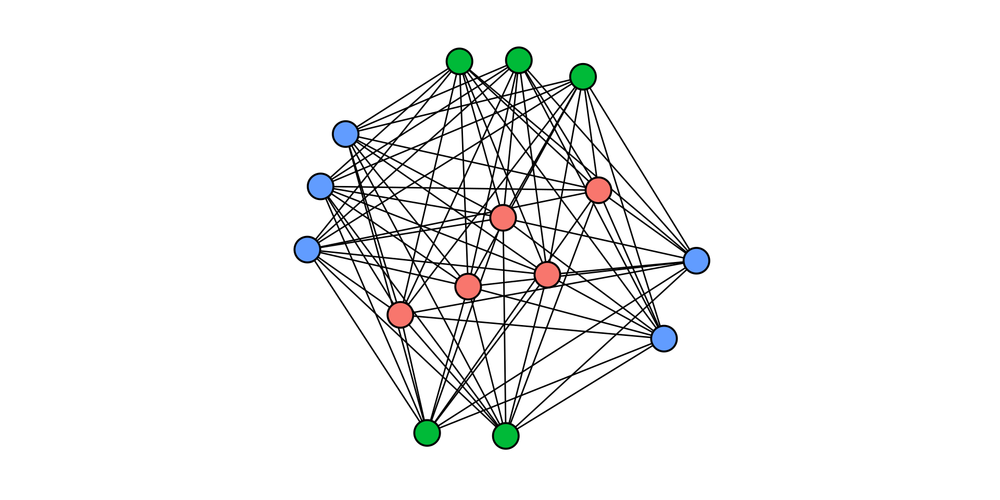
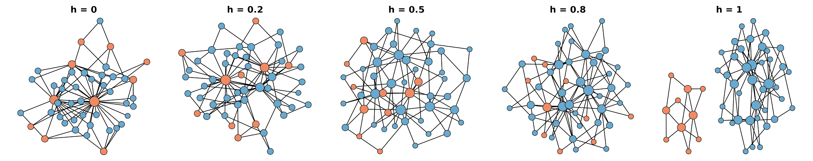
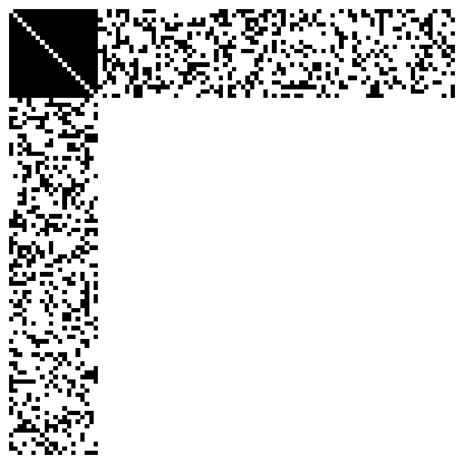

*This post was semi automatically converted from blogdown to Quarto and may contain errors. The original can be found in the [archive](http://archive.schochastics.net/post/extending-network-analysis-in-r-with-netutils/).*


During the last 5 years, I have accumulated various scripts with
(personal) convenience functions for network analysis and I also
implemented new methods from time to time which I could not find in any
other package in R. The package `netUtils` gathers all these functions
and makes them available for anyone who may also needs to apply
“non-standard” network analytic tools. In this post, I will briefly
highlight some of the most prominent functions of the package. All
available functions are listed in the
[README](https://github.com/schochastics/netUtils) on github.

``` r
# developer version
remotes::install_github("schochastics/netUtils")

install.packages("netUtils")
```

# Random graph generators

The package includes three new random graph generators:

-   `graph_kpartite()` creates a random k-partite network.
-   `sample_coreseq()` creates a random graph with given coreness
    sequence.
-   `sample_pa_homophilic()` creates a preferential attachment graph
    with two groups of nodes.
-   `split_graph()` sample graph with perfect core-periphery structure

`graph_kpartite()` can be used to construct a complete k-partite graph.
A k-partite graph is a graph with k groups of nodes where no two nodes
within the same group are connected but are connected to all other nodes
in other groups.

The example below shows a 3-partite graph where each group consists of 5
nodes.

``` r
g <- graph_kpartite(n = 15, grp = c(5,5,5))
```



The function `sample_coreseq()` is conceptually very similar to the
function `sample_degseq()` in {{igraph}}. Instead of sampling networks
with the same degree sequence, `sample_coreseq()` samples network which
have the same k-core decomposition

``` r
g1 <- sample_gnp(40,0.1)
kcore1 <- sort(coreness(g1))
g2 <- sample_coreseq(kcore1)
kcore2 <- sort(coreness(g2))
all(kcore1==kcore2)
```

``` hljs
## [1] TRUE
```

`sample_pa_homophilic()` creates a preferential attachment graph with
two groups of nodes. The parameter `h_ab` is used to adjust the
probability that an edge between groups occurs. A network is maximally
heterophilic if `h_ab=1`, that is there only exist edges between groups,
and maximally homophilic if `h_ab=0`, that is there only exist edges
within groups.

``` r
# maximally heterophilic network
sample_pa_homophilic(n = 50, m = 2,minority_fraction = 0.2,h_ab = 1)
# maximally homophilic network
sample_pa_homophilic(n = 50, m = 2,minority_fraction = 0.2,h_ab = 0)
```

The figure below shows some examples for varying degrees of homophily.



The function `split_graph()` can be used to create graphs with a perfect
core-periphery structure. This means that there are two groups of nodes:
One forms a clique (the core: all nodes are pairwise connected) and the
other group is only connected to nodes in the core (the periphery: all
nodes are pairise disconnected)

In the below example, we create a split graph with 100 nodes and core
size 2o (100\*0.2)

``` r
sg <- split_graph(n = 100,p = 0.3,core = 0.2)
```

The figure below shows the typical pattern of the adjacency matrix of a
split graph.



# Analytic functions

The most important analytic functions are

-   `triad_census_attr()` which calculates the triad census with vertex
    attributes.
-   `core_periphery()` which fits a discrete core periphery model.

``` r
set.seed(112)
g <- sample_gnp(20,p = 0.3,directed = TRUE)
# add a vertex attribute
V(g)$type <- rep(1:2,each = 10)
triad_census_attr(g,"type")
```

``` hljs
##  T003-111  T003-112  T003-122  T003-222  T012-111  T012-121  T012-112  T012-122 
##         8        33        28         7        32        40        31        19 
##  T012-211  T012-221  T012-212  T012-222 T021D-111 T021D-211 T021D-112 T021D-212 
##        27        41        25        26         9        19        19        21 
## T021D-122 T021D-222  T102-111  T102-112  T102-122  T102-211  T102-212  T102-222 
##         7        10        11        18        16         5        19        10 
## T021C-111 T021C-211 T021C-121 T021C-221 T021C-112 T021C-212 T021C-122 T021C-222 
##        17        23        29        17        19         7        24        10 
## T111U-111 T111U-121 T111U-112 T111U-122 T111U-211 T111U-221 T111U-212 T111U-222 
##         9        16         7        21         5        13        10         6 
## T021U-111 T021U-112 T021U-122 T021U-211 T021U-212 T021U-222 T030T-111 T030T-121 
##        11        19        13         3        14         7        11        11 
## T030T-112 T030T-122 T030T-211 T030T-221 T030T-212 T030T-222 T120U-111 T120U-112 
##        11        13        10        14         8         5         1         8 
## T120U-122 T120U-211 T120U-212 T120U-222 T111D-111 T111D-121 T111D-112 T111D-122 
##         6         0         4         4         4        12         8        13 
## T111D-211 T111D-221 T111D-212 T111D-222  T201-111  T201-112  T201-121  T201-122 
##        14        20        10        15         0         5         3         5 
##  T201-221  T201-222 T030C-111 T030C-112 T030C-122 T030C-222 T120C-111 T120C-121 
##         3         3         2        12        14         3         3         8 
## T120C-211 T120C-221 T120C-112 T120C-122 T120C-212 T120C-222 T120D-111 T120D-112 
##         7         5         5         7         7         6         0         9 
## T120D-211 T120D-212 T120D-122 T120D-222  T210-111  T210-121  T210-211  T210-221 
##         1         9         4         1         2         8         3         5 
##  T210-112  T210-122  T210-212  T210-222  T300-111  T300-112  T300-122  T300-222 
##         1         3         5         5         0         1         0         2
```

The output is a named vector where the names are of the form Txxx-abc,
where xxx corresponds to the standard triad census notation and “abc”
are the attributes of the involved nodes.

The function `core_periphery()` fits a standard discrete core-periphery
model to the data

``` r
#graph with perfect core-periphery structure
core_graph <- split_graph(n = 100, p = 0.3, core = 0.2)
core_periphery(core_graph)
```

``` hljs
## $vec
##   [1] 1 1 1 1 1 1 1 1 1 1 1 1 1 1 1 1 1 1 1 1 0 0 0 0 0 0 0 0 0 0 0 0 0 0 0 0 0
##  [38] 0 0 0 0 0 0 0 0 0 0 0 0 0 0 0 0 0 0 0 0 0 0 0 0 0 0 0 0 0 0 0 0 0 0 0 0 0
##  [75] 0 0 0 0 0 0 0 0 0 0 0 0 0 0 0 0 0 0 0 0 0 0 0 0 0 0
## 
## $corr
## [1] 1
```

``` r
# random graphs have a very weak core-periphery structure 
rgraph <- sample_gnp(n = 100,p = 0.2)
core_periphery(rgraph)
```

``` hljs
## $vec
##   [1] 1 0 1 0 1 0 0 0 1 0 1 1 1 0 1 0 1 1 0 1 1 1 0 1 1 1 0 0 1 0 1 0 1 0 0 0 0
##  [38] 1 0 1 0 1 0 1 1 1 1 1 1 0 0 1 0 0 1 0 1 0 0 0 1 1 1 1 0 1 0 1 0 1 0 0 1 0
##  [75] 1 0 1 0 0 1 1 1 0 0 1 1 0 0 1 1 0 0 1 0 0 0 0 1 0 0
## 
## $corr
## [1] 0.162141
```

More advanced core-periphery models are planned for a future release.

# A new print method

I also extended `str` to work with igraph objects for an alternative way
of printing igraph objects using additional information.

``` r
library(networkdata)
data("greys")
str(greys)
```

``` hljs
## -----------------------------------------------------------
## UNNAMED NETWORK (undirected, unweighted, one-mode network)
## -----------------------------------------------------------
## Nodes: 54, Edges: 57, Density: 0.0398, Components: 4, Isolates: 0
## -Vertex Attributes:
##  name(c): Addison Montgomery, Adele Webber, Teddy Altman, Amelia ...
##  sex(c): F, F, F, F, F, F, M, F, M, M, F, M, M, M, F, M, F, F, M, F, M, ...
##  race(c): White, Black, White, White, White, White, Black, Black, Black, ...
##  birthyear(n): 1967, 1949, 1969, 1981, 1976, 1975, 1981, 1969, 1972, ...
##  position(c): Attending, Non-Staff, Attending, Attending, Attending, ...
##  season(n): 1, 2, 6, 7, 5, 3, 6, 1, 6, 7, 8, 3, 2, 1, 1, 2, 1, 2, 1, 1, ...
##  sign(c): Libra, Leo, Pisces, Libra, Leo, Gemini, Leo, Virgo, Aquarius, ...
## ---
## -Edges (first 10): 
##  Arizona Robbins->Leah Murphy Alex Karev->Leah Murphy Arizona
## Robbins->Lauren Boswell Arizona Robbins->Callie Torres Erica
## Hahn->Callie Torres Alex Karev->Callie Torres Mark Sloan->Callie Torres
## George O'Malley->Callie Torres Izzie Stevens->George O'Malley Meredith
## Grey->George O'Malley
```

[
Twitter](https://twitter.com/share?text=Extending%20network%20analysis%20in%20R%20with%20netUtils&url=http%3a%2f%2fblog.schochastics.net%2fpost%2fextending-network-analysis-in-r-with-netutils%2f)
[
Facebook](https://www.facebook.com/sharer/sharer.php?u=http%3a%2f%2fblog.schochastics.net%2fpost%2fextending-network-analysis-in-r-with-netutils%2f)
[
Google+](https://plus.google.com/share?url=http%3a%2f%2fblog.schochastics.net%2fpost%2fextending-network-analysis-in-r-with-netutils%2f)
[
LinkedIn](https://www.linkedin.com/shareArticle?mini=true&title=Extending%20network%20analysis%20in%20R%20with%20netUtils&url=http%3a%2f%2fblog.schochastics.net%2fpost%2fextending-network-analysis-in-r-with-netutils%2f&summary=)

Please enable JavaScript to view the [comments powered by
Disqus.](https://disqus.com/?ref_noscript)

# [schochastics](http://blog.schochastics.net/ "schochastics")

[](#)

© 2023 / Powered by [Hugo](https://gohugo.io/)

[Ghostwriter theme](https://github.com/roryg/ghostwriter) By
[JollyGoodThemes](http://jollygoodthemes.com/) /
[Ported](https://github.com/jbub/ghostwriter) to Hugo By
[jbub](https://github.com/jbub)
