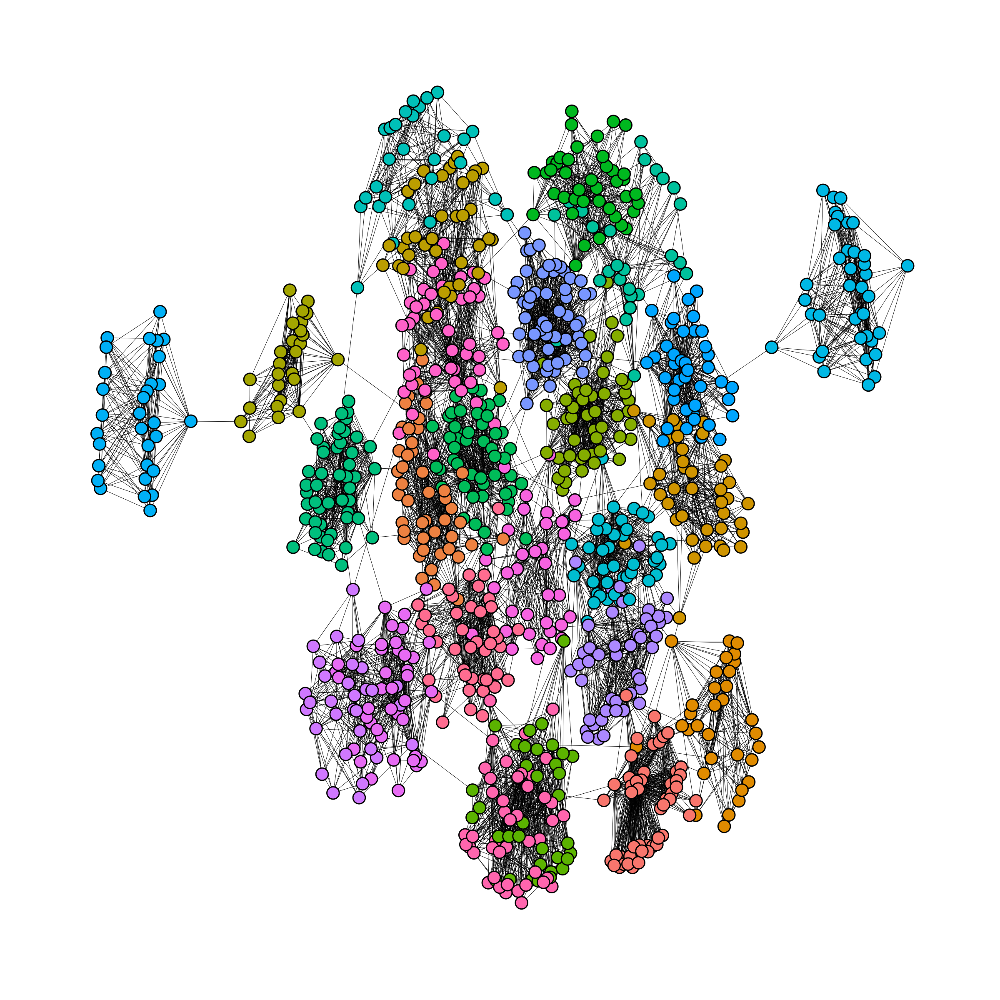

# Fast creation of LFR Benchmark graphs in R

*This post was semi automatically converted from blogdown to Quarto and may contain errors. The original can be found in the [archive](http://archive.schochastics.net/post/fast-creation-of-lfr-benchmark-graphs-in-r/).*


[Almost a year
ago](http://blog.schochastics.net/post/extending-network-analysis-in-r-with-netutils/),
I introduced my most recent network related R packages
[`netUtils`](https://github.com/schochastics/netUtils). The package is
meant as a catch-all package where I gather network analytic methods
that haven’t yet been implemented in R and may not deserve there own
package. Between its initial release and today, I add the infamous
[LFR-Benchmark](https://arxiv.org/abs/0805.4770) graphs to the package.
The LFR (Lancichinetti-Fortunato-Radicchi) Benchmark is a widely used
graph model for studying community structure. It generates graphs with
known community assignments, allowing researchers to evaluate the
performance of community detection algorithms. The model has a large set
of parameters which allow to create very diverse but realistic graphs
which pose tougher challenges for clustering algorithms as other models.

I implemented the algorithm in plain R and it was horribly slow. I did
find an [implementation in
C++](https://github.com/synwalk/synwalk-analysis/tree/master/lfr_generator)
in October 2022 but it took me another 8 months to finally sit down and
integrate the code into the package. To obtain the sped up version you
need to have `netUtils` with version greater than 0.8.1 (The upgraded
package 0.8.2 was submitted to CRAN on 2023-6-2028).

The code below was running for minutes in base R but now, we can get an
instantiation of an LFR graph in a blink of an eye.

``` r
g <- sample_lfr(n = 1000,average_degree = 15, max_degree = 50, 
                min_community = 20, max_community = 50,mu = 0.01)
```



Happy clustering!

