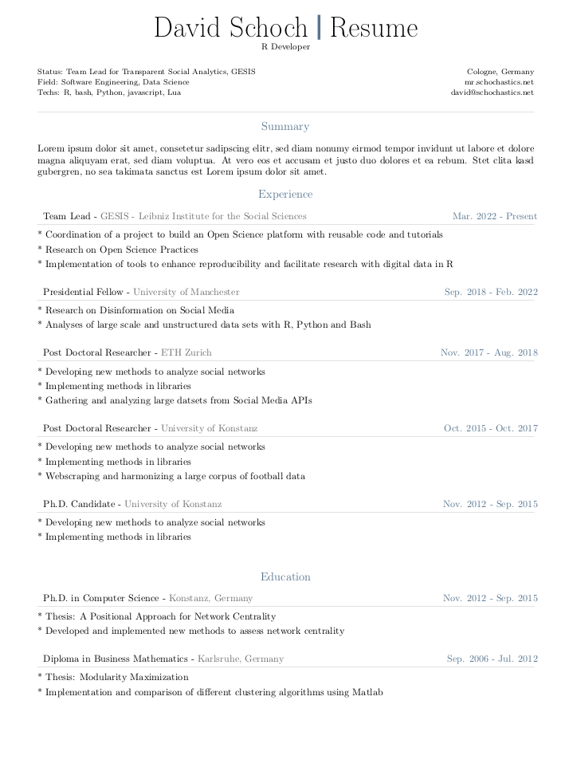
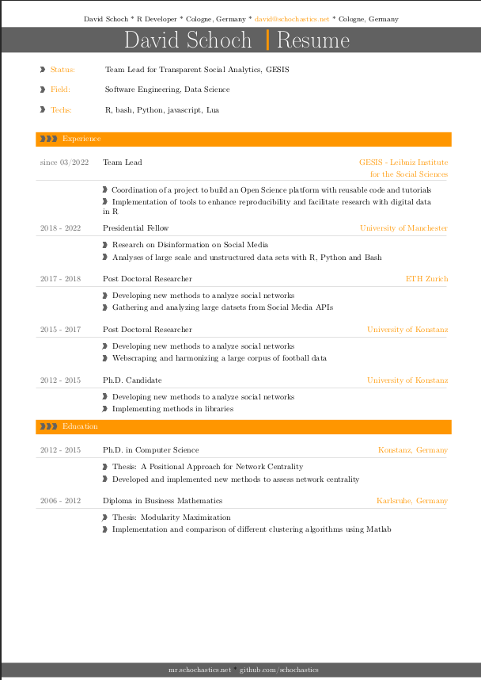
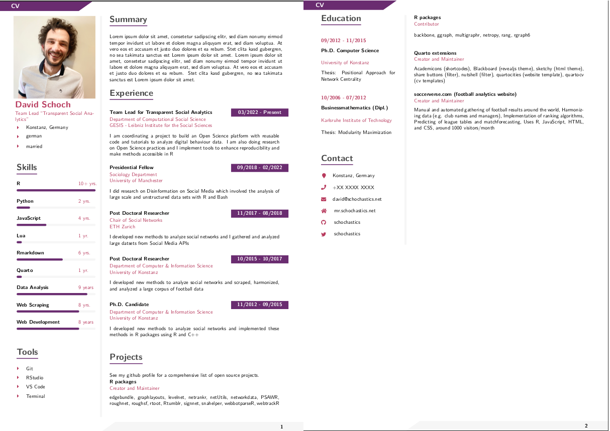

*This post was semi automatically converted from blogdown to Quarto and may contain errors. The original can be found in the [archive](http://archive.schochastics.net/post/create-a-cv-with-quarto/).*

In this post, I will introduce a few extensions for
[Quarto](https://quarto.org/) to create nicely looking CVs. Disclaimer:
the underlying templates where not created by me but where adopted from
these [LaTeX templates for CVs and
resumes](https://github.com/jankapunkt/latexcv) and this [modern Latex
CV](https://github.com/philipempl/modern-latex-cv).

Creating the templates was quite straightforward (I wish I had time to
write a detailed post about that…). I took the original tex files,
renamed them to
[`template.tex`](https://quarto.org/docs/journals/templates.html#latex-partials)
and replaced a lot of the hardcoded information with placeholders for
the yaml header. If you are keen on learning how to create such a
template compare the template.tex file with the original latex files and
the the yaml header in `template.qmd`.

Since every quarto template needs to live in its own repository, I also
created an overview repository which gathers all templates in one place.
In total, I have implemented four templates (so far).

## classic-cv

  
[repository link](https://github.com/schochastics/classic-cv)

``` bash
quarto use template schochastics/classic-cv
```

## modern-cv

  
[repository link](https://github.com/schochastics/modern-cv)

``` bash
quarto use template schochastics/modern-cv
```

## modern2-cv

  
[repository link](https://github.com/schochastics/modern2-cv)

``` bash
quarto use template schochastics/modern2-cv
```

## sidebar-cv

  
[repository link](https://github.com/schochastics/sidebar-cv)

``` bash
quarto use template schochastics/sidebar-cv
```

