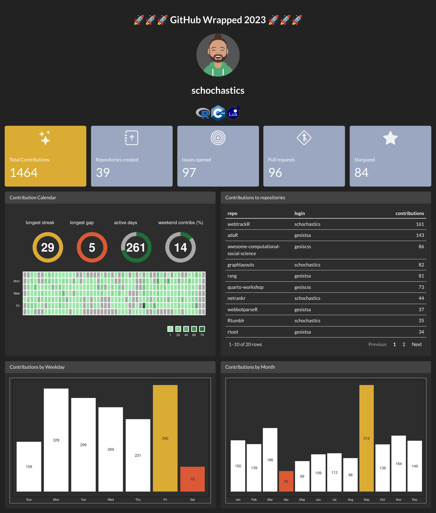

*This post was semi automatically converted from blogdown to Quarto and may contain errors. The original can be found in the [archive](http://archive.schochastics.net/post/using-a-quarto-dashboard-for-github-wrapped/).*

[Dashboards](https://quarto.org/docs/dashboards/) are coming to Quarto
in version 1.4. I already gave them a spin for a simple [parking
dashboard](https://github.com/schochastics/kn_parking) but felt like
they deserve some bigger attention. Given its the time of year where
many platforms offer a personal “recap”,  
like [spotify](https://www.spotify.com/de/wrapped/) or
[twitch](https://link.twitch.tv/AnnualRecap), I decided to implement a
version of “GitHub wrapped”. Obviously, this also already
[exists](https://www.githubwrapped.io/), but I wanted to give it try
myself.



## A journey from REST to GraphQL

Along the way, I actually learned a lot about
[GraphQL](https://graphql.org/) since GitHub does actually also have a
[GraphQL API](https://docs.github.com/en/graphql). GraphQL is similar to
REST but unlike REST, which typically requires loading from multiple
URLs to gather different pieces of data, GraphQL allows a client to make
a single request to fetch the required information. This flexibility is
one of its key advantages. Clients can specify their data requirements,
which reduces over-fetching or under-fetching issues common in REST
APIs. Additionally, GraphQL APIs are organized in terms of types and
fields, not endpoints, allowing for more structured and powerful
queries.

In contrast, REST uses predefined and stateless operations. REST APIs
work with resources (like users, posts, etc.), each identified by URLs.
Each resource can be manipulated using HTTP methods such as GET, POST,
PUT, DELETE. REST APIs are known for their simplicity and statelessness,
with each call containing all the information needed to understand and
process the request. However, this can lead to over-fetching of data, as
the data returned from a REST API endpoint is fixed and not customizable
by the client.

In R, the Github REST API can be called via the `gh` package, and the
GraphQL API with `ghql`. A call to the REST API is quite straightforward
when you know which endpoint you need. The following call is a good
example of a simple REST API call that overfetches a lot of data (all we
actually want is the last repository I starred )

``` r
star <- gh::gh("/users/schochastics/starred", .limit = 1)
star
```

``` hljs
## [
##   {
##     "id": 68328745,
##     "node_id": "MDEwOlJlcG9zaXRvcnk2ODMyODc0NQ==",
##     "name": "ghql",
##     "full_name": "ropensci/ghql",
##     "private": false,
##     "owner": {
##       "login": "ropensci",
##       "id": 1200269,
##       "node_id": "MDEyOk9yZ2FuaXphdGlvbjEyMDAyNjk=",
##       "avatar_url": "https://avatars.githubusercontent.com/u/1200269?v=4",
##       "gravatar_id": "",
##       "url": "https://api.github.com/users/ropensci",
##       "html_url": "https://github.com/ropensci",
##       "followers_url": "https://api.github.com/users/ropensci/followers",
##       "following_url": "https://api.github.com/users/ropensci/following{/other_user}",
##       "gists_url": "https://api.github.com/users/ropensci/gists{/gist_id}",
##       "starred_url": "https://api.github.com/users/ropensci/starred{/owner}{/repo}",
##       "subscriptions_url": "https://api.github.com/users/ropensci/subscriptions",
##       "organizations_url": "https://api.github.com/users/ropensci/orgs",
##       "repos_url": "https://api.github.com/users/ropensci/repos",
##       "events_url": "https://api.github.com/users/ropensci/events{/privacy}",
##       "received_events_url": "https://api.github.com/users/ropensci/received_events",
##       "type": "Organization",
##       "site_admin": false
##     },
##     "html_url": "https://github.com/ropensci/ghql",
##     "description": "GraphQL R client",
##     "fork": false,
##     "url": "https://api.github.com/repos/ropensci/ghql",
##     "forks_url": "https://api.github.com/repos/ropensci/ghql/forks",
##     "keys_url": "https://api.github.com/repos/ropensci/ghql/keys{/key_id}",
##     "collaborators_url": "https://api.github.com/repos/ropensci/ghql/collaborators{/collaborator}",
##     "teams_url": "https://api.github.com/repos/ropensci/ghql/teams",
##     "hooks_url": "https://api.github.com/repos/ropensci/ghql/hooks",
##     "issue_events_url": "https://api.github.com/repos/ropensci/ghql/issues/events{/number}",
##     "events_url": "https://api.github.com/repos/ropensci/ghql/events",
##     "assignees_url": "https://api.github.com/repos/ropensci/ghql/assignees{/user}",
##     "branches_url": "https://api.github.com/repos/ropensci/ghql/branches{/branch}",
##     "tags_url": "https://api.github.com/repos/ropensci/ghql/tags",
##     "blobs_url": "https://api.github.com/repos/ropensci/ghql/git/blobs{/sha}",
##     "git_tags_url": "https://api.github.com/repos/ropensci/ghql/git/tags{/sha}",
##     "git_refs_url": "https://api.github.com/repos/ropensci/ghql/git/refs{/sha}",
##     "trees_url": "https://api.github.com/repos/ropensci/ghql/git/trees{/sha}",
##     "statuses_url": "https://api.github.com/repos/ropensci/ghql/statuses/{sha}",
##     "languages_url": "https://api.github.com/repos/ropensci/ghql/languages",
##     "stargazers_url": "https://api.github.com/repos/ropensci/ghql/stargazers",
##     "contributors_url": "https://api.github.com/repos/ropensci/ghql/contributors",
##     "subscribers_url": "https://api.github.com/repos/ropensci/ghql/subscribers",
##     "subscription_url": "https://api.github.com/repos/ropensci/ghql/subscription",
##     "commits_url": "https://api.github.com/repos/ropensci/ghql/commits{/sha}",
##     "git_commits_url": "https://api.github.com/repos/ropensci/ghql/git/commits{/sha}",
##     "comments_url": "https://api.github.com/repos/ropensci/ghql/comments{/number}",
##     "issue_comment_url": "https://api.github.com/repos/ropensci/ghql/issues/comments{/number}",
##     "contents_url": "https://api.github.com/repos/ropensci/ghql/contents/{+path}",
##     "compare_url": "https://api.github.com/repos/ropensci/ghql/compare/{base}...{head}",
##     "merges_url": "https://api.github.com/repos/ropensci/ghql/merges",
##     "archive_url": "https://api.github.com/repos/ropensci/ghql/{archive_format}{/ref}",
##     "downloads_url": "https://api.github.com/repos/ropensci/ghql/downloads",
##     "issues_url": "https://api.github.com/repos/ropensci/ghql/issues{/number}",
##     "pulls_url": "https://api.github.com/repos/ropensci/ghql/pulls{/number}",
##     "milestones_url": "https://api.github.com/repos/ropensci/ghql/milestones{/number}",
##     "notifications_url": "https://api.github.com/repos/ropensci/ghql/notifications{?since,all,participating}",
##     "labels_url": "https://api.github.com/repos/ropensci/ghql/labels{/name}",
##     "releases_url": "https://api.github.com/repos/ropensci/ghql/releases{/id}",
##     "deployments_url": "https://api.github.com/repos/ropensci/ghql/deployments",
##     "created_at": "2016-09-15T20:27:02Z",
##     "updated_at": "2023-12-17T16:19:30Z",
##     "pushed_at": "2023-01-03T09:08:34Z",
##     "git_url": "git://github.com/ropensci/ghql.git",
##     "ssh_url": "git@github.com:ropensci/ghql.git",
##     "clone_url": "https://github.com/ropensci/ghql.git",
##     "svn_url": "https://github.com/ropensci/ghql",
##     "homepage": "https://docs.ropensci.org/ghql",
##     "size": 148,
##     "stargazers_count": 140,
##     "watchers_count": 140,
##     "language": "R",
##     "has_issues": true,
##     "has_projects": false,
##     "has_downloads": true,
##     "has_wiki": false,
##     "has_pages": false,
##     "has_discussions": true,
##     "forks_count": 15,
##     "mirror_url": {},
##     "archived": false,
##     "disabled": false,
##     "open_issues_count": 3,
##     "license": {
##       "key": "other",
##       "name": "Other",
##       "spdx_id": "NOASSERTION",
##       "url": {},
##       "node_id": "MDc6TGljZW5zZTA="
##     },
##     "allow_forking": true,
##     "is_template": false,
##     "web_commit_signoff_required": false,
##     "topics": [
##       "graphql",
##       "graphql-api",
##       "graphql-client",
##       "r",
##       "r-package",
##       "rstats"
##     ],
##     "visibility": "public",
##     "forks": 15,
##     "open_issues": 3,
##     "watchers": 140,
##     "default_branch": "master",
##     "permissions": {
##       "admin": false,
##       "maintain": false,
##       "push": false,
##       "triage": false,
##       "pull": true
##     }
##   }
## ]
```

The API call returns a lot of extra information that we did not require.
All we needed was

``` r
star[[1]]$full_name
```

``` hljs
## [1] "ropensci/ghql"
```

While GraphQL avoids the overfetching, querying the API is quite a lot
more involved.

``` r
token <- Sys.getenv("GITHUB_TOKEN")
con <- GraphqlClient$new(
    url = "https://api.github.com/graphql",
    headers = list(Authorization = paste0("Bearer ", token))
)

variables <- list(
    userid = params$userid
)

con$load_schema()
qry <- Query$new()
qry$query(
    "mydata", ' query getContrib($userid: String!){
  user(login:$userid){
    avatarUrl
    login
    contributionsCollection(
    from: "2023-01-01T00:00:00.000Z"
    to: "2024-01-01T00:00:00.000Z") {
    totalCommitContributions
    totalIssueContributions
    totalRepositoryContributions
    totalRepositoriesWithContributedCommits
    totalPullRequestContributions
    totalPullRequestReviewContributions
    contributionCalendar {
        totalContributions
        weeks {
            contributionDays {
              contributionCount
              date
            }
        }
    }
    commitContributionsByRepository {
        contributions {
            totalCount
        }
        repository {
            name
            owner {
                login
            }
            isPrivate
            languages(first: 5, orderBy: {field: SIZE, direction: DESC}) {
                edges {
                    size
                    node {
                        color
                        name
                        id
                    }
                }
            }
        }
    }
}
  }
}'
)
x <- con$exec(qry$queries$mydata, variables)
res <- jsonlite::fromJSON(x)
```

This is far more complicated than querying a simple http endpoint. But
it does only get exactly the data we want for the dashboard from our
GitHub profile.

## The dashboard

The final dashboard can be found in [this
repository](https://github.com/schochastics/github_wrapped). To
personalize it, do the following:

1.  Create a [Github token](https://github.com/settings/tokens) (needs
    read:user access)
2.  add it to `.Renviron` as GITHUB_TOKEN
3.  Install a version of Quarto that allows to create dashboards
    (\>1.4.0)
4.  In `index.qmd`, change the `userid` parameter to your GitHub
    username.
5.  `quarto render`

If you are missing a logo of a programming language at appears as one of
your most used, add a svg version to `img/logos`. I got mine from
Wikipedia.

Happy GitHub Wrapping!

